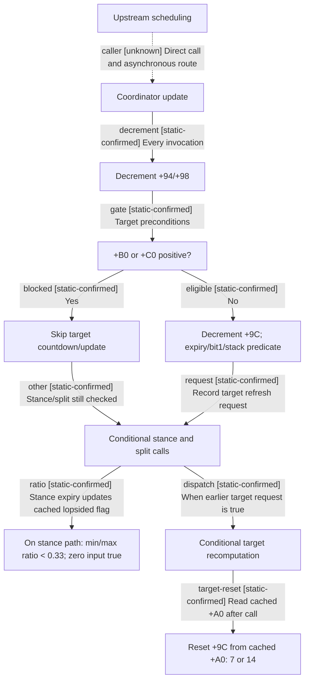

# Research plan: war-film-targets-20260923

GENERATED from the supplied research plan; no native semantics are inferred.

Question: Which coordinator deadlines trigger stance, split/merge and target recomputation, and how do lopsided power and invalidation change the schedule?



| Edge | Declared status | Evidence IDs | Open question |
|---|---|---|---|
| caller | unknown |  | Complete scheduler cadence and task consumer remain untraced. |
| decrement | static-confirmed | instructions, source-contract |  |
| gate | static-confirmed | instructions, source-contract |  |
| blocked | static-confirmed | instructions, source-contract |  |
| eligible | static-confirmed | instructions, source-contract |  |
| other | static-confirmed | instructions, source-contract |  |
| request | static-confirmed | instructions, source-contract |  |
| ratio | static-confirmed | instructions, source-contract |  |
| dispatch | static-confirmed | instructions, source-contract |  |
| target-reset | static-confirmed | instructions, source-contract |  |

| Observation design | Value |
|---|---|
| mode | offline-only |
| actor_kind | ai |
| owner_scope | CAIWarCoordinator for one participant in one war |
| identity_kind | none |
| identity_lifetime | Offline PDATA/RVA identity only; runtime generation IDs not yet sampled |
| producer_trigger | unknown |
| producer | RVA 0x18550D0 invocation decrements countdowns; target path additionally gated by +B0/+C0 |
| caller | Direct call at 0x18878F1; parallel task dispatch consumer not yet traced |
| consumer | Stance selection, stack split/merge and target assignment update |
| cache_lifetime | +94=stance30, +98=split14, +9C=target7/14; +A0 refreshed on stance path |
| expected_signal | Exact define-slot loads, deadline comparisons, update calls and reset writes in one control-flow slice |
| zero_sample_meaning | No offline reference is not proof that virtual or event-driven updates do not exist |
| stop_condition | Stop slice expansion when deadline semantics are supported or unresolved indirect caller requires a distinct observation seam |
| runtime_window_ref | None |

| Evidence ID | Declared layer | File | SHA-256 | Supports |
|---|---|---|---|---|
| instructions | exact-build | war-film-target-countdowns-evidence-20260923.json | 0e33174ae67609c76157fe6254b4318d584c9add07fe63877649d6618106c070 | Actual define registration slots and exact countdown/strict comparison instructions. |
| source-contract | source-contract | ../war-film-target-countdowns-2026-09-23.md | fca56cf2bf7aaebcadc9b3edc7453ba07118de20360ab23f8828f643a3b8b7fa | Manual reading of pinned branches: countdown mapping, eligibility, early refresh, reset and strict lopsided comparison; unresolved scheduling remains explicit. |

Check result (file integrity and declarations only):

```json
{
  "schema": "xar.native-research-plan-check.v1",
  "result": "plan-consistent",
  "proof_layer": "record-structure-and-file-integrity",
  "semantic_correctness_verified": false,
  "live_execution_performed": false,
  "observation_plan_issues": [
    "offline-only plan does not define a live observation window",
    "the real producer trigger must be located before live sampling"
  ],
  "declared_edges_by_status": {
    "counter-policy": 0,
    "inference": 0,
    "live-confirmed": 0,
    "static-confirmed": 9,
    "unknown": 1
  },
  "enumerated_native_edges": 10,
  "declared_cases_by_status": {
    "pending": 0,
    "observed": 0,
    "not-applicable": 0
  },
  "checked_evidence_files": 2,
  "limitations": [
    "Evidence layers and conclusions are author declarations; hashes bind bytes, not their truth.",
    "Counts cover this enumerated graph only, not all CK3 branches.",
    "A consistent observation plan is not authorization to run or manipulate CK3."
  ],
  "plan_sha256": "3d02b4025b536afc72c3e3c8401da1160c2089960e8175d295c8c0f05aee4666"
}
```
