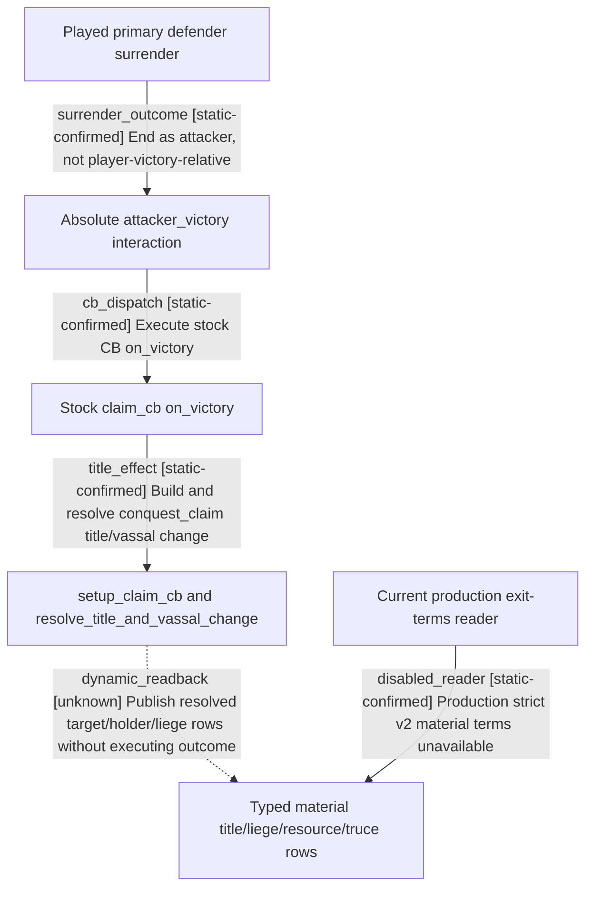

# Research plan: war-r0118-defender-surrender-terms

GENERATED from the supplied research plan; no native semantics are inferred.

Question: For a played primary defender in stock claim_cb, which attacker_victory material terms are actually readable before surrender?



| Edge | Declared status | Evidence IDs | Open question |
|---|---|---|---|
| surrender_outcome | static-confirmed | stock_war_interaction |  |
| cb_dispatch | static-confirmed | stock_war_interaction, stock_claim_cb |  |
| title_effect | static-confirmed | stock_claim_cb |  |
| dynamic_readback | unknown | stock_claim_cb, current_bridge | Identify safe read-only setup_claim_cb / resolve_title_and_vassal_change producer ABI; old broad loaded-effect preview crashed twice at RVA 0x334C668 |
| disabled_reader | static-confirmed | current_bridge |  |

| Observation design | Value |
|---|---|
| mode | offline-only |
| actor_kind | human |
| owner_scope | played primary defender of full-generation WarID 251658364, stock claim_cb only |
| identity_kind | generation-id |
| identity_lifetime | WarID, primary leaders, claimant, target titles, and active CB must be rebound after cold restore; this plan makes no live binding |
| producer_trigger | not-applicable |
| producer | exact-build 00_war.txt end_war=attacker dispatches 00_claim.txt on_victory; dynamic title/vassal/resource producer ABI is unproven |
| caller | offline source review and existing production ReadWarTerminationTerms; no live native call in this work package |
| consumer | future defender-surrender opportunity-cost selector, currently blocked on material terms |
| cache_lifetime | no game cache sampled; source bytes fixed to CK3 1.19.0.6 and repository commit |
| expected_signal | absolute outcome, scripted material branches, and precise typed read-only material gap |
| zero_sample_meaning | no live sample does not imply actual holder, vassal, resource delta, truce, or prisoner values are zero |
| stop_condition | one exact-build source/production-contract review; stop before CK3 launch, action, or disabled loaded-effect preview |
| runtime_window_ref | None |

| Evidence ID | Declared layer | File | SHA-256 | Supports |
|---|---|---|---|---|
| stock_war_interaction | source-contract | Z:/ck3_mod_rewrite_process_assets/ck3-frozen-1.19.0.6-steam23530548-20260922/game/game/common/character_interactions/00_war.txt | 5c99b8f14893929a9bc2dbb5b258cdd2d4233d5805091952209413de876ee09f | lines 458-459 bind attacker-victory interaction; line 644 ends war as attacker |
| stock_claim_cb | source-contract | Z:/ck3_mod_rewrite_process_assets/ck3-frozen-1.19.0.6-steam23530548-20260922/game/game/common/casus_belli_types/00_claim.txt | d9aa37bdc45f81b4f6185b2697a3ebd09404084ea0d3cf77bbe3c1d2c962e8b1 | lines 375-594 define on_victory title/vassal resolution, fame, truce, legitimacy, and conditional effects |
| current_bridge | source-contract | ../../../ck3_autonomous_player/native_bridge/src/ck3_11906.cpp | be50aa158a2523015aa30169061451379099d9deaf55cb0fd0d315f8837c6e72 | ReadWarTerminationTerms gives static claim disposition; production ReadWarTerminationExitTerms hard-disabled; offline fixture attacker-only |

Check result (file integrity and declarations only):

```json
{
  "schema": "xar.native-research-plan-check.v1",
  "result": "plan-consistent",
  "proof_layer": "record-structure-and-file-integrity",
  "semantic_correctness_verified": false,
  "live_execution_performed": false,
  "observation_plan_issues": [
    "offline-only plan does not define a live observation window",
    "the real producer trigger must be located before live sampling"
  ],
  "declared_edges_by_status": {
    "counter-policy": 0,
    "inference": 0,
    "live-confirmed": 0,
    "static-confirmed": 4,
    "unknown": 1
  },
  "enumerated_native_edges": 5,
  "declared_cases_by_status": {
    "pending": 1,
    "observed": 0,
    "not-applicable": 0
  },
  "checked_evidence_files": 3,
  "limitations": [
    "Evidence layers and conclusions are author declarations; hashes bind bytes, not their truth.",
    "Counts cover this enumerated graph only, not all CK3 branches.",
    "A consistent observation plan is not authorization to run or manipulate CK3."
  ],
  "plan_sha256": "e130165958936a9aa65888cb35c92d98510026762319685ae7aea063ae971902"
}
```
