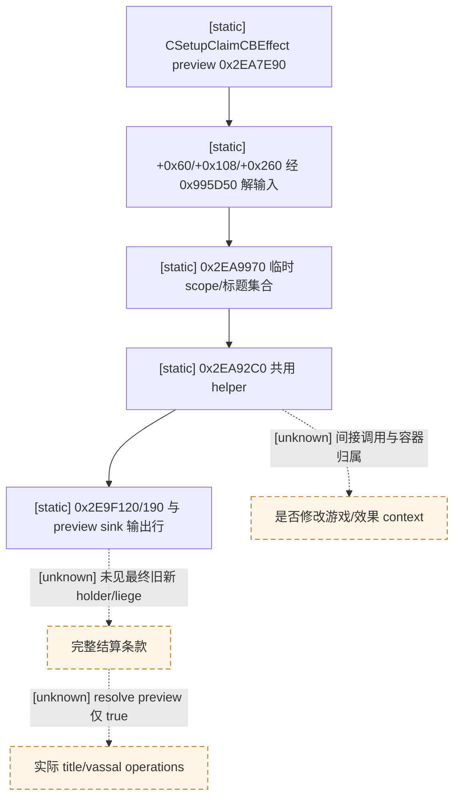

# R0118 `setup_claim_cb` preview：只读与物质条款边界

状态：**offline research / no private observer**。仅反汇编冻结 CK3 `1.19.0.6-steam23530548` 的小片段；EXE SHA-256 `2D00FF3101EF70B566F2FCBAE292F09263199C80E9DC8F139B82D7D96F83DB86`。没有启动 CK3、调用 effect、改动 save/driver 或读取在途 R0134 状态。原 WarID251658364 的 R0118 RED 保持。

## 已定位的输入与输出

既有 [RTTI/vtable 冻结结果](../../../ck3_autonomous_player/native_bridge/research/defender_surrender_title_preview_1_19_0_6_abi.json) 将 `CSetupClaimCBEffect<0>` 的 preview slot `+0xB8` 绑定到 RVA `0x2EA7E90`，execute slot `+0xB0` 为 `0x2EA8200`。两条入口都在各自起始处经 `0x995D50` 解析 effect 对象 `+0x60`、`+0x108`、`+0x260` 的三个输入，要求得到的对象 `+0x10` 虚方法 `+0x8` 成功；随后均调用 `0x2EA9970` 形成临时 scope/标题集合，并调用共享 helper `0x2EA92C0`。`0x2EA92C0` 读取原生 title/character 资料，也在本地容器中组装条目；其 `0x2EA93FF/0x2EA97ED/0x2EA98E1` 调用 `0x2EAC060`，后者在 `0x2EAC0CF–0x2EAC139` 写其传入容器的条目与数量。容器归属需沿调用帧逐分支核对，不能把这些写入默认判为纯本地或游戏状态。

preview 在 `0x2EA7F56 → 0x2EA9970`、`0x2EA7FFC → 0x2EA92C0` 后，使用 `0x2E9F2C0` 接触传入 effect context 的 `+0x18`，并经 `0x2E9F120`、`0x2E9F190` 和 `r8` preview sink 的虚方法 `+0x8` 输出展示行；末尾 `0x2EA81D5` 将 `dil` 转为 bool 返回。execute 共用上述两个 helper，但在 `0x2EA83AC–0x2EA83E0` 的条件分支还从全局对象 `+0xA0` 取 `+0xA3D0` context 并调用 `0x2786720`；preview 局部没有这个直接调用。preview 主函数的直接调用列表没有已知 `+0xD280` queue 写入函数 `0x27CD320`、`0x27CD6A0`、`0x27CD510` 或下游 `0x24CC9A0`，但其共享 helper 和虚调用的传递副作用**未被排除**，故“未见直接写队列”不是“可安全实机调用”的证明。

## 对原 WarID 的适用性与下一入口

原版 `claim_cb.on_victory`（冻结 `00_claim.txt` SHA-256 `D9AA37BDC45F81B4F6185B2697A3EBD09404084EA0D3CF77BBE3C1D2C962E8B1`）按顺序执行 `create_title_and_vassal_change(type=conquest_claim)`、`setup_claim_cb`、`resolve_title_and_vassal_change`，另有条件性 `change_liege`、legitimacy、influence、fame、truce、hook 和其他战争后效。`CResolveTitleAndVassalChangeEffect.preview` RVA `0x7E9220` 是 `B0 01 C3`，不生成 final operations。即使 `setup_claim_cb.preview` 的所有分支最终证成不改变游戏，也只能说明它自身的展示计算；当前既无完整旧新 title holder/liege 输出，也没有这些后续资源效果的同帧 delta。R0124 旧 WarID 的 `query-war-termination-options` #1536 已明确 `terms_observable=false`，不能拿可提交性代替物质判定。

**下一个最小离线检查**：从 `0x2EA92C0` 中传入 `0x2EAC060` 的容器反向确认所有分支的所有权和生存期，再查 preview sink `+0x8` 的具体产物 schema；若它仍只承载展示行，应转查 `conquest_claim` 的实际 operation 生产者是否有单独非变更计算接口。还须逐项确定 `change_liege` 与资源效果的可读输入/结果。任何一步未闭合均保留 `typed unavailable`，不调用旧 broad loaded-effect preview，也不施工 bridge/MCP 或自动投降。
