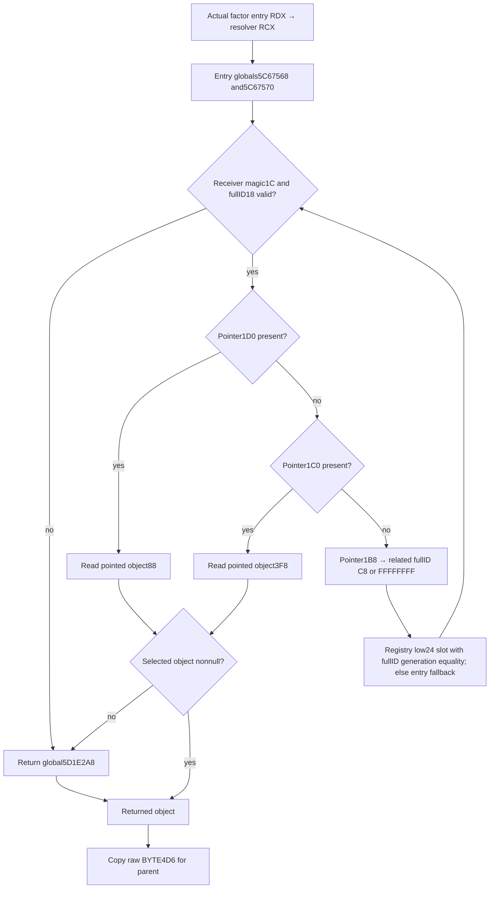

# Actual receiver → returned object → raw BYTE4D6 (1.20.0.4)

The reached caller is `2B9CBD7`, inside the actual604B `2B9CBA0` factor function. It moves the factor's entry RDX receiver into RCX, calls `28C2DF0`, and at `2B9CBDC` compares BYTE `[RAX+4D6]` with5. A different byte selects the parent's literal signedQ64 `100000`; byte5 demands the separately owned `B17C70/C86670` input. This page does not assign a tax, government-category or other business meaning to that raw byte.

Source is the held exact237B interval `[28C2DF0,28C2EDD)`, ending `RET28C2EDC`. Its cache SHA is `0beebeed2dc8bacfc24c83baf45e7446a3732401e280e177f978c2f9c257a42d`; it was reused, with0 new executable/pdata bytes. The exact image pin remains `98702F88A547CDE2EAF29A85F93B85F68EE4CF8148336A4F7AFAEB75319DD518` / Steam25734779 / CK3 1.20.0.4. Neither an old build delta nor the older256B packet's neighboring19B establishes this function.

The actual data tree is:

`MOV28C2DF4/28C2DFB` load globals `5C67568/5C67570` once before the loop. `CMP28C2E02` requires `0x43686172`; `CMP28C2E12` rejects fullID `FFFFFFFF`. `1D0+88` is selected before `1C0+3F8`. When both contexts are null, `1B8+C8` supplies the related fullID, or a null1B8 supplies `FFFFFFFF`. The registry slot index is low24, its capacity is DWORD2C, slots are at20 with16-byte stride and pointer8. A candidate must have the same fullID at18, after which the native loop rechecks its magic and contexts. Missing registry, out-of-range, null candidate or generation mismatch selects the entry fallback receiver.

The context result's null branch calls a diagnostic at `28C2ECC`, then returns global `5D1E2A8`; invalid receiver branches return that same global without the diagnostic. The candidate code copies the return data and never executes that diagnostic or any getter. A failed copy or null returned object remains unavailable, never a guessed byte or parent unit factor.

`BindReturnedSelector28C2DF012004` admits only the existing exact4 version/SHA pair. `ResolveReturnedObject28C2DF012004(bindings, actual_receiver, frame_key)` returns the original receiver/frame attribution, nonnull `returned_object`, source readiness and traversed data steps without reading consumer-specific object members. This supplies the actual `24CEF10` caller's object input for its separate `+40` bit35 read. `ResolveReturnedSelector28C2DF012004` delegates to that object resolver, then copies the factor consumer's raw `selector_byte_4d6`; its source readiness still requires that byte. The caller owns the paused-frame read boundary and passes the existing `CampaignRootFrameV1::snapshot_revision`. The03/05 composition can supply `ConstructionOwnerFactorBinding12004{input_receiver, returned_object, frame_key, source_ready}` and pass the already copied byte to `EvaluateNullDetailFactor12004`, without a second byte read.

This closes the memory-only selector dependency. It does not supply modifier4E, construction completion, positive useful income, Game evidence or M4 credit. New no-main cases belong to the03/10 combined check; previous GREEN results are not validation for this candidate.
