# Robert 1066 ordinary seed: exact-build input ledger

Status (2026-09-23): static-ready only for the Robert-specific target binding. No Robert `ordinary_campaign_succession` / `xar_off` paired checkpoint or production date has been observed. The existing Murchad seed and PRV008 preview retain their own evidence and bytes.

Frozen CK3 1.19.0.6-steam23530548 EXE SHA-256 `2D00FF3101EF70B566F2FCBAE292F09263199C80E9DC8F139B82D7D96F83DB86`. Stock `game/common/bookmarks/bookmarks/00_bookmarks.txt` SHA-256 `820C8F3F5A99CF1141A21A34F0661A7300E5D12938BB3EA7EA07A84A0D3BEB14`; `game/gui/frontend_bookmarks.gui` SHA-256 `C853B48F42A5A3B84208B2FC570C02F5FCB5DA217133553C6A5B70B7F8F0F267`.

The stock `bm_1066_rags_to_riches` bookmark starts on `1066.9.15` (`date_raw=53144328`). Its Robert the Fox entry is `bookmark_rags_to_riches_duke_robert`, `d_apulia`, `feudal_government` (stock lines 1663–1674). `history_id=1128` identifies the source definition; it is never a dynamic UI index or an asserted live player ID. The former Murchad target uses `bookmark_rags_to_riches_petty_king_murchad`, `d_munster`, also feudal (lines 1491–1500).

The native private bookmark producer already supports a build-time `XAR_CK3_FEUDAL_1066_TARGET_ROBERT_V1=ON` target. Its source-key scan finds exactly one current element, reads final native government, and passes that element to the original selected-character setter; the typed StartGame action uses the stock Bookmarks button. For Robert, the controlled runner must explicitly request Robert's key and match the producer's current `candidate_keys[supported_1066_candidate_index]` before **any** typed selection. The independent next model must still identify the same key and selected index. The first stable paused map must match the bookmark date and player; a later application-main pump must precede the public same-revision campaign-root query. Root must confirm the same player, feudal government and `xar_off` rule; only then may the initial save/driver pair be materialized. There is no gameplay date advance in this seed stage.

```mermaid
flowchart LR
  A[Official MCP NewGame] --> B[Bookmarks]
  B --> C[Private exact-build model: 1066 bookmark, Robert key, feudal]
  C --> D[Typed original selected-character setter]
  D --> E[Independent selected model]
  E --> F[Typed stock StartGame once]
  F --> G[Stable paused map and later main pump]
  G --> H[Public campaign-root: same player/date, feudal, xar_off]
  H --> I[Ordinary no-pact save + driver checkpoint]
  I -. Formal auto-run and cold restore still require live evidence .-> J[Robert campaign]
```

The stage uses a fresh prepared `ordinary_campaign_succession` / `xar_off` state under a non-C drive. A Murchad save cannot be renamed, rebound or edited into a Robert start. The run must pin source commit, Robert-target DLL full SHA, injector SHA, frozen EXE SHA, stock bookmark/GUI SHA, prepared environment/profile digest, mod load order (`mod/xar_autoplayer.mod` only), selected key and model frame, typed action receipts, public root, checkpoint save/driver SHA, and allocated run ID. An unconfirmed selection or StartGame stops as RED without retry.

Reusable Murchad evidence covers the generic NewGame → Bookmarks route, exact-build model/typed StartGame mechanism, public root contract and ordinary seed binding. It does not establish Robert's selected key, initial actor, paired checkpoint, first-day lifestyle choice, campaign outcomes or any Robert time-span credit. Historical fixed Robert visual/OCR openings remain visual regression evidence, not this production seed.
