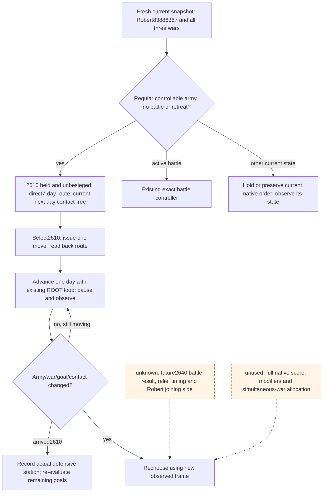

# Robert defensive target choice after the populist refusal

2026-10-03. **Select goal2610 for Army83886367**, then observe one game day at a time. This is a `static-ready` external counterpolicy using ROOT-acquired `production-live primitive` inputs. No move, battle outcome or war victory was executed by this researcher. The [current native target tree](army-target-triage-1.20.0.3.md) and pinned `.3` callchains were already written before this recipe; no research tests were repeated.

The exact installed build is CK3 **1.20.0.3 / Steam25652598**, EXE SHA-256 `94b55397abb687a3dcd436805a5d885e6be90fa6c693feb44a9e3bbeeade02a6`. Actor29829, episode`native-29829-2bc2d599f7f9`, paused DateRaw53236608. Movement inputs are native11/public2/connection6. The later battle transition is native16/public2 at the same date. These are separately bound saved observations, not one fabricated native revision.

## Actual input ledger

| Choice/input | ROOT observed facts | Meaning for this step |
|---|---|---|
| Player83886367 | Regular, controllable, no combat/retreat, idle@2614;2334 current soldiers,2461 maximum | A move order can be considered. No win inference uses those counts. |
| Goal2610 / War16777231 | Defender vs30097, score−39; held/unoccupied, no active siege, fort3/garrison400 | This is a defensive station target, **not recovery or a new siege**. Total−39 does not identify a recoverable occupation. |
| Route2610 | `[2610]`; arrival53236776, **7 days** after53236608 | One direct edge; first current movement choice. |
| Goal2640 / Wars129 and50331736 | Defender vs32750 and70766, scores0; held/unoccupied, active hostile Siege318767158 by50331920; progress44.133%, walls breached, besieging_strength0, days_leftnull | A threatened friendly goal, but completion time remains unobserved. No ETA is inferred from work alone. |
| Route2640 |2618→2617→2632→2613→8752→2628→2626→2627→2633→2634→2640; arrival53238744, **89 days** | Current move cannot provide immediate relief; new information will arrive before contact. |
| Current hostile scope |473,474,16777683,50331920,67109295,83886484,251658381 | The pre-refusal four-hostile scope is obsolete. Both horizons include all seven. |
| Horizon result | Both routes observable; current53236608→53236632 is contact-free with conflicts`[]` | This observes **one day**, not all7/89 days. Use the existing daily movement loop. |
| Actual Combat1577058305@2640 | maneuver/day0, no winner, not finalized; attackers`[251658381,473,474]`, defenders`[50331920,83886484]`; Robert absent | The two hostile coalitions are already fighting. Follow actual lifecycle, without claiming who wins or how Robert would join. |
| Hypothetical battle v2 | Robert→2640 entry2634 vs three populist stacks; fixed precontact/no reinforcements; input-readytrue, Monte-Carlo-readyfalse | Does not model the actual enemy battle or every hostile present at future arrival. Mountains, width, counters and absent player commander are observed inputs, not a win probability. |

The route raw dates use24 raw units per day. Incoming67109295 currently reaches2640 after203 days on its frozen route; it is114 days behind Robert's hypothetical89-day arrival. That is a route observation, not a promise that either route remains unchanged.

## Minimal own-policy rule

Current native defender source explicitly allows camping at a wargoal without starting combat or siege. Its goal priority500 supports including2610 as a real objective. Native relief's exclusive local bonus190 does not by itself override ETA, enemy contact or other unknown score modifiers. This recipe **does not pretend that the native AI would choose2610**.

For this observed frame, choose the shortest held defensive goal that produces a useful station and has a current observable contact-free next day. That is2610. Defer2640 relief because the current journey takes89 days and the ongoing battle can change the available relief action before arrival. Holding2614 gives up the available direct goal move; use hold only if the current army state or next-day contact no longer permits that choice. This rule accepts the remaining risk to2640 and promises no positive war score.

## ROOT action and verification recipe

1. Refresh the current snapshot and use its public revision with `ck3_execute_step(step="move-army-83886367-to-2610", expected_revision=LATEST_PUBLIC_REVISION)`.
2. Read back the player's route/target/state. A command ACK is not actual movement credit.
3. Run ROOT's existing bounded one-day advancement, pause, and read player position, full route, current armies, objective occupation and siege state. The existing contact horizon supplies the next day's observation. Do not resubmit the same move while the current valid route persists.
4. Rechoose when the war/goal/army phase or current contact changes. On physical arrival2610, record stationing and the three actual scores. This does not prove recapture, siege victory, battle victory or war completion.

## Unused native inputs, quality gaps and replacement entries

This temporary shortest-goal rule does not reproduce native power aggregation, all support/geography/current-target modifiers, the candidate fact cache or allocation across simultaneous wars. Current extension entries are target refresh`0x1A04F40→0x1A05200`, candidate expansion`0x1A06080`, score pass`0x1A070F0`, and final path/admission`0x1A09450`; selected stack fields are`+0x60/+0x78/+0x74`. None is needed to start this concrete move.

The relief gap is operational: native `days_left` is null while the observed besieger is fighting, and hypothetical v2 omits actual contact joining/reinforcement and outcome transitions. When2640 becomes actionable, use fresh route, actual-contact scope and battle lifecycle first. Only a still-required missing siege timing field justifies extending the existing Episode03/ReadObjectiveProvince daily-work entry. An unavailable Monte Carlo output is not a universal prohibition on a combat action. Supply and commander are not used here to assert a battle or long march; use the existing supply query and minimum commander observation before a materially longer route or fight.

The exact source paths, identities, hashes, next-query triggers, unused-input ledger and command data are in [the recipe](research/robert-defensive-target-recipe-12003.json). ROOT owns execution, integration, progress reports and Git. No new provider, SDK flag or test is required for the selected move.

## 2026-10-03: later Root movement result

The earlier candidate/recommendation frame above is retained. Root subsequently completed the paused order to2610 and independent target/route readback; see the [dated actual synthesis](robert-post-refusal-military-actual-2026-10-03.md) and [movement postconditions](war-movement-1.20.0.3-readiness-2026-10-03.md). Current province remains2614, with target2610/route`[2610]`, moving; no day or arrival is credited. The first actual one-day slice remains pending. This dated result supersedes earlier pending Root-order wording while preserving each author's zero-action fact.
