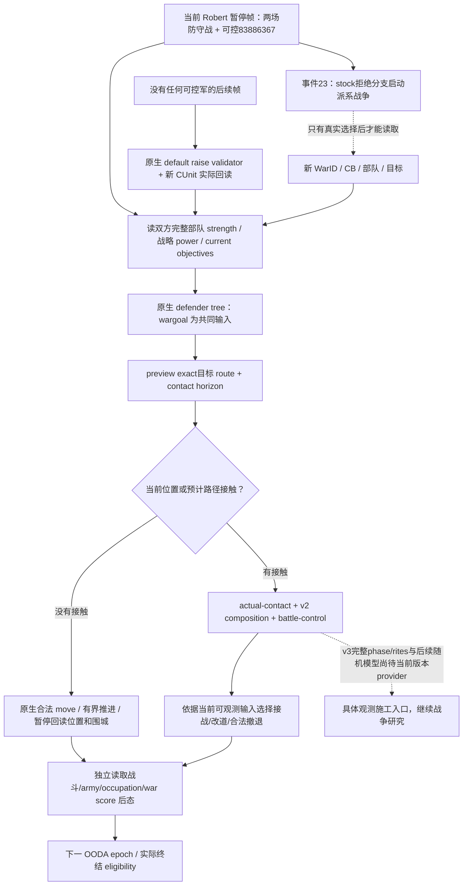

# Robert：1.20.0.3 战争授权后的实际施工入口

2026-10-03，项目所有者撤销所有非战约束，并要求继续战争与战斗研究。旧交接的 `--nonwar-only`、战争研究暂停和 `WAR_CASH/PREWAR` OFF 不再构成政策；具体 native producer 是否已经实现、exact-build 是否闭合、当前 native 命令是否合法仍按实际字段判断。本文不改变 Robert 唯一入口、原 campaign/episode、最小化不抢焦点和 native AI 研究优先。

冻结 CK3 **1.20.0.3 / Steam build 25652598**，EXE SHA-256 `94B55397ABB687A3DCD436805A5D885E6BE90FA6C693FEB44A9E3BBEEADE02A6`。最初的 v34 actual runtime 是 source/native `5b2030b09041dbfcea11104e15d155a3b9aac1d6`、PID119724；后续 v35 实测见本文末尾。开发树的后续源码与实际 DLL 分开记账。本包只消费已保存文件并生成后续 query 配置，没有 SDK、窗口、游戏动作或新增日期。

## 当前帧先处理真实战场

已保存 `actual-paused-v34-01/013-ck3_take_snapshot.json` 在 raw53236608、actor29829、episode `native-29829-2bc2d599f7f9` 发布 **两场已存在的主防守战争**，不是零战争开局。

| WarID | 对手 | 玩家战分 | 目标 TitleID / ProvinceID | 当前事实 |
| --- | --- | --- | --- | --- |
| 16777231 | 30097 | −39 | 2128 / 2610 | 2610 未占领、fort3、garrison400；敌军50331920与83886484在2640围城，67109295从3078向2640移动。 |
| 129 | 32750 | 0 | 2115 / 2640 | 2640未占领、fort7、garrison1350、besieging1664；Siege318767158当前work275.836/625，敌军16777683在4573集结。 |

Robert 已有可控 **CUnit83886367**，在 Province2614，regular、非战斗/撤退、route `complete_empty`。公开 soldiers 为合法未发布值 `null`；直接 `ck3_query_army_strengths` 是下一项数值读取，不能以 null 判定没有军队。默认集结 action step 仅在 active wars 非空且不存在可控玩家军队时展开，因此该帧的第一步不能机械地再集结。

事件23仍为 `faction_demand.1001`：接受 native2/API3，拒绝 native3/API4；拒绝由 stock `faction_start_war(title=target_title2115)` 发起。已绑定 FullFaction33554465/leader70766 与普通割让集合，并不等于新的 WarID 已产生。安装版 faction 定义指定 `casus_belli=populist_war`；新战争 actual WarID、loaded CB、目标与部队必须在真实选择后读回。现有主防守战与随后可能产生的派系战不能混为同一场。

## 当前 native 能力与最低运行配置

`ck3_12003_adapter.cpp:40–46` 用 .3 精确 hash 和已冻结 `core-comparison.json` 复用逐项审阅的 .2 bindings；不能把历史 1.19 RVAs 套入当前 EXE。v34 的实际 hello 已发布下列核心能力，无需增加 WAR_CASH/PREWAR flags。

| 输入/动作 | 当前现成入口 | 边界 |
| --- | --- | --- |
| 当前战争、目标/占领/fort/garrison/siege、军队位置和完整 route | `ck3_take_snapshot`、`ck3_get_war_state` | 当前 Robert actual 已发布；CB key不在当前公开 war row。 |
| 战争对手战略军力 | `ck3_query_war_entry_assessments(target_character_ids=[actual opponent], expected_revision=R)` | 单目标；对手须属于当前 declarable 或 active-war scope；原生 power 不是胜率。 |
| 已集结部队人数/最大人数/base power | `ck3_query_army_strengths(army_ids=[actual full CUnitIDs], expected_revision=R)` | 读取 player/active-war participants 范围；不能把参与不同战争的部队任意合成一个 contact side。 |
| 预览行军、路线接触时序 | `ck3_execute_step` 的 `preview-move-army-<unit>-to-<province>` / `query-route-contact-horizon-v1-…` | 预览 path不单独给完整 ETA；用 route-contact 查询。 |
| 实际接战、战斗状态与结束、增援分配 | `ck3_query_actual_contact_scope`、battle-control/transition/terminal/reinforcement v1 | 实际 query 成功和字段完整度另记；不能由注册工具推成当前战斗已经发生。 |
| 逐团、地形和 commander 的假设接战输入 | `ck3_query_combat_simulation_inputs`（native v2） | attacker entry 必须是真实相邻入口；阵营属于显式假设，不代替 actual-contact side。 |
| 集结、行军、合军、分军、解散 | named raise/move/disband；`ck3_execute_step` split/merge literal | 合军是 `merge-armies-<destination>-with-<source>`，不是反向；当前 native validator 决定提交是否合法。 |
| 普通围城、强攻启停、占领回读 | snapshot、named start/stop assault | 同 EXE 的 William R0156 已实际证明 move/merge/围城/强攻/占领 primitives；不是当前 Robert 战争 loop 的证明。 |
| 战争终结 legality | `ck3_query_war_termination_options`、named enforce/surrender/white-peace | enforcement需要玩家 primary leader、分数达到门槛和 native revalidation；populist defender 的完整退出后果/recipient response仍须专门接线。 |

删除 MCP plan argv 的 **`--nonwar-only`** 即恢复普通 `ck3_plan_turn` / `ck3_auto_turn` 的战争 planner 分发；直接 typed 入口原本就没有这一额外限制。计划副本只改这一个参数，并保留 v34 source/native/manifest/state/pipe，未执行。启用普通 planner 不是“所有战争策略已实现”的声明；本次 event builder保留只读不自动选择，实际事件动作由 coordinator使用最新研究与帧。

当前 .3 hello **没有** combat-v3 或 phase-trace capability。Python 中已有同名工具、adapter已有方法不能冒充它们 production ready。WAR_CASH/PREWAR 私有开关也不是核心军事运行的前置条件；当前 `.3 nonwar router` 没有对应生产 provider/dispatch，单纯开启 CMake/CLI不能恢复缺失观测。旧 `MILITARY_PREPARATION_SUMMARY` 使用 1.19 ABI，不应通过开关调用到当前 EXE。下一项建设应各自沿具体 native provider补齐，不能恢复旧战争禁令。

## 原生树输入先落盘

当前安装源在 `Z:/SteamLibrary/steamapps/common/Crusader Kings III/game`。仓库 `Crusader Kings III/` 是旧参考，不是当前 .3 source。实际 .3 event whole SHA `eb17720ca9d48acfb8cc24e5f61edc62fd2d4d2d599561c92854fc762104eccd`，拒绝 block为1339–1343；installed AI defines SHA `3af5d4100789bad56570e05c5852f35783605813957de7a5129d23142a116120`，不能引用旧参考 C78F…当作当前输入。

当前 installed stock 仍保留：无军时自身待集结比例0.3或敌军比例0.5；补集结增量0.1；已集结 levy 冷却180日；safe-raise搜索1county、最近5候选。defender三个 stance的共同目标priority仍是 wargoal500，stance30日、split/merge14日、目标7日、明显弱势14日；最终 C++ scheduler与safe县 tie-break未全部命名。具体当前行为须消费 actual army/route/目标，而不是仅按这些静态常数猜选中的省份。

对这份树的 counter-policy工作以实际结果推进：先盘点当前已存在防线和同省敌军，逐动作消费现成路线/战斗 primitives；缺少必要决策输入时补同一 bridge/MCP。完整概率模型、所有退出条款和理论安全审计不应挡住已闭合的普通行军/观察循环。所有未采用原生输入、quality gap和替换入口在对应专题继续记账。

## 可执行的下一次只读材料

外置 `build_paused_war_calls.py` 从一份实际 snapshot渲染已有 registered tools。当前输出包含 capabilities、war state、两个实际 opponent各一条 war-entry、两个真实WarID的 termination options与五个实际 scope CUnit的 strength，逐 call消费 fresh revision；没有 event/army mutation或时间推进。新的派系战产生后重新从其 actual saved frame渲染，不硬编码想象中的 WarID或军队。

文件交付：`Z:/ck3_mod_rewrite_process_assets/g2-resume-20261003/war-native-readiness/` 下的 `PAUSED-WAR-BASELINE-CALLS.json`、`build_paused_war_calls.py`、`permits/PERMITS.md`、`permits/WAR-ENABLED-MCP-PLAN-V34-DERIVATIVE.json`、`tree/INPUTS.json` 与更完整的 `tree/NATIVE-TREE.md`。生成器已在既有v34保存帧运行一次；该检查只证明文件投影可用。本次静态研究不冒充新的 live动作、游戏日、G2/NW credit或完整战争loop。

## Root实际基线：独立 GREEN保留，战略查询 RED另修

Root已通过删除 `--nonwar-only` 的 v34计划在同 PID119724独占执行 `actual-paused-war-v34-01`。capabilities003、warstate004、termination008/012、army-strength014与save016为 GREEN；target30097的war-entry006与target32750的010均真实 RED：`application-main typed query failed or its snapshot changed`。各call有独立fresh暂停snapshot，日期未动；没有事件选择、部队动作或新增游戏日。失败包保留，不重复盲试；实际故障有专门native reader/callback诊断与最小修复入口，不能据此重新禁止战争或丢弃独立成功结果。

两条终结查询已经直接发布当前 CB，**无需为了当前两战争再建 CB provider或重复调用其他query**：16777231是database17/`individual_county_de_jure_cb`、已1907日；129是database41/`minor_religious_war`、已11日。两者cb_allows_white_peace=true，当前 white-peace/victory native_validator_passed=false，surrender=true；recipient final response仍未发布，不以raw acceptance或auto_accept替代完整退出决策。

此独立 CB 来源是现成 owning-thread终结producer：`ck3_12002_diplomacy.cpp` 先完整解析WarID，再从CWar+0x100读取active `CCasusBelliType`，type+0x10读database type index、type+0x18读native字符串key；serializer和Python normalizer保留 `active_casus_belli_identity`。database index是type index，不是full CB实例ID；当前CB路由无需为它另造FullCBID字段。后续snapshot的 `war_termination_options` 缓存已有这两项，即使 `active_wars` 的窄row未重复key也不代表观测缺失。

| 当前 full CUnitID | 角色/战争 | actual当前/最大人数 | 团数 | 位置与意义 |
| --- | --- | --- | --- | --- |
| 83886367 | Robert；两场war | 2334 / 2461 | 40 | 2614，唯一当前可控军；base power75881，不是胜率。 |
| 50331920 | enemy；16777231 | 1362 / 1899 | 19 | 2640围城。 |
| 83886484 | enemy；16777231 | 302 / 311 | 4 | 2640围城；两支当前合计1664。 |
| 67109295 | enemy；16777231 | 101 / 101 | 2 | 3078向2640在途，不并入已到场人数。 |
| 16777683 | enemy；129 | 2305 / 2305 | 10 | 4573仍集结，不是假想当前2640守方。 |

当前Province2640围城读数的指定50331920属于War16777231，但2640同时是War129的目标。省份围城/敌军集合不能确定其唯一war attribution；路线/actual-contact必须消费完整敌对集合和实际阵营。该primitive解锁当前军队盘点，下一步是同帧native path/contact、v2 composition及必要独立战斗观察，而不是从2334/1664人数比猜胜利。

最后正常save016为history4653，90951584字节，SHA-256 `290be4d858b899b911f2843c71aa850aae68987576b94e42359bf7139640fbbf`，日期仍53236608。实际hello证明exact EXE；army-strength自己的source.game_version/executable_sha256是null，保留真实字段，不补成该DTO自身已经发布版本。证据路径位于上述`actual-paused-war-v34-01`，本次最高新增状态是实际只读production-live primitive，战争 loop继续施工。

复用机制和证据：[当前派系事件](ck3-1.20.0.3-faction-demand1001-populist.md)、[William实际 .3 primitives](episode03-william-lewes-live-2026-10-03.md)、[.3真实故障修复](episode03-public-unit-zero-recovery-2026-10-03.md)、[历史防守tree](primary-defensive-war-response.md)。历史防守文档的版本/旧实机边界照旧；只有本文重新绑定的当前stock输入可作当前研究输入。

## 2026-10-03T13:56 接续源码采用

v34 对实际敌方领袖30097、32750的战略查询均RED。迁移同时丢失callback的active-primary scope收集与reader的active-war准入；本次复用现有paused snapshot字段，恢复active OR declarable，正在交战目标不枚举无关宣战CB。两个实际目标的生产reader确定性复现旧RED、修复GREEN，3TU和2链接严格编译GREEN；复用一次现有验证，不新增ABI、schema、权限或重试。v34已观测军力、路线、战争状态继续可用，修复实机仍待新DLL。

实际记录：`2026-10-03T13:56:08+08:00`。源码已采用；严格组合DLL和Robert暂停实读仍待完成，不能记为live或增加日数/动作/收益/G2信用。ROOT负责正常commit/push。

交付回执：[war-entry-active-scope-adoption](Z:/ck3_mod_rewrite_process_assets/g2-resume-20261003/war-native-readiness/permits/war-entry-fault/ROOT-DELIVERY.json)。

## v35：已交战对手的战略查询实际恢复

Root在最小化新PID13408/source-native `19b508ae4fa8e3ab09f4e8631fcf0340d69939c2` 的同一Robert episode、raw53236608暂停帧，只运行已修复的新leaf：`actual-new-leaves-v35-01/018`对30097、020对32750、022对新populist对手70766。三次single-target query均`status=available`、`readiness.ready=true`，分别query_sequence1/2/3；每call独立fresh snapshot绑定public2/native2，actual provenance发布当前1.20.0.3 exact SHA。原v34两个真实RED已由新DLL一次paused GREEN闭合；失败attempt保留，不重跑其他已GREEN军务。当前最高状态为**production-live primitive**，不是完整战争决策loop。

| requested target | native effective target | actor base/network/total | target base/network/total | native target/actor ratio |
| --- | --- | --- | --- | --- |
| 30097 | 29097 | 64761 / 0 / 64761 | 127520 / 50800 / 178320 | 2.75350 |
| 32750 | 32750 | 64761 / 0 / 64761 | 63080 / 0 / 63080 | 0.97404 |
| 70766 | 70766 | 64761 / 0 / 64761 | 71520 / 0 / 71520 | 1.10436 |

表中power来自raw/100000，ratio直接来自native，不是Python自行用人数计算的胜率。30097被原生估算映射到effective29097（当前信仰领袖）；这不证明Pope的全部部队或network已经加入实际War16777231。Network贡献是原生战略entry估算，不能写成已答应参战的盟友。三行target adjustment均0；distance_raw分别0/29900000/7400000，native_flags221/93/29、双向AI entry分别4/0、0/0、0/0原样保存，未闭合含义不补枚举。实际DTO没有底层native调用计数，只能记三个registered query及其sequence，不能把离线fixture的two-call计数套给实机。

完整Root batch仍为RED：独立`ck3_query_battle_terminal_transition_v1`报告typed-query-result-inconsistent；这不污染三个独立war-entry GREEN，也不能抹去该失败。正常save026为history4677，90958031字节/SHA `68763fa1e189a6541b44b86061e9f7df780e5486201522a43236605d3d4a7994`，actor/date/episode未变。本只读batch未增加游戏日或部队动作。机器字段和原始snapshot/query/hello/save pins见 `Z:/ck3_mod_rewrite_process_assets/g2-resume-20261003/war-native-readiness/actual-v35-war-entry/ACTUAL.json`；下一步消费战略输入与当前actual route/contact/physical composition，继续已授权战争OODA。

这份实测回执保留当时的终结 query RED。其真实生产字段遗漏与已采用的最小修复另见[终结 phase/date 故障专题](battle-terminal-phase-date-production-fault-1.20.0.3-2026-10-03.md)；源码修复和后续新 DLL 实测状态分别记账，不改写本批次的原始失败。
