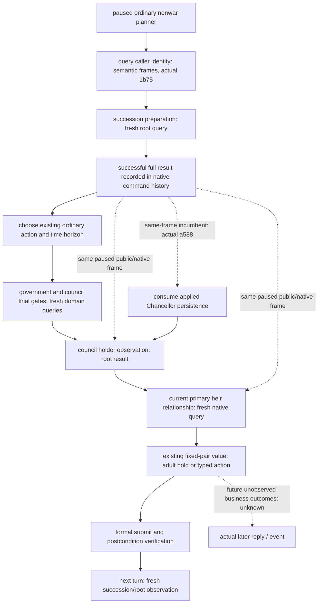

# Robert 普通回合：同帧 root 观测复用

2026-10-02。当前 exact build 为 CK3 Steam 1.20.0.3，EXE SHA-256 `94b55397abb687a3dcd436805a5d885e6be90fa6c693feb44a9e3bbeeade02a6`。本专题只减少普通 nonwar 规划的重复读取，时间策略、战争字段、原生动作与提交后验证保持现有语义。

## 必要性与实证

`artifacts/g2-maintainer-2026-10-02/resume-12003/m7-robert/finite-normal-7day-actual-01` 的三轮正式运行，每轮第 2、6、7 个只读查询均为 `query-campaign-root-context-v1`。每组三份完整 `campaign_root_context` 相等，包含 council、held-title partition、readiness 与 provenance；仅外层请求 token 和递增 query sequence 不同。

| 回合 | public revision | native revision | date_raw | actor | root query_sequence |
| --- | --- | --- | --- | --- | --- |
| 1 | 2 | 16 | 53220096 | 29829 | 12 / 13 / 14 |
| 2 | 5 | 19 | 53220120 | 29829 | 15 / 16 / 17 |
| 3 | 9 | 23 | 53220240 | 29829 | 18 / 19 / 20 |

真实批次 Python 源为 `production-source-c0f53e9b`；当前生产接线分析基线为 `production-source-716acfec`，两者不得混称。完整 raw 请求/回包及逐组相等证明见外置 `m7-robert/nonwar-query-cost-01/wire-repeat-proof.json`，调用链见同目录 `source-chain-readout.md`。实际 planning 合计 80.471090 秒、dispatch/verification 5.099678 秒、外部 JSON 0.075965 秒；没有逐查询计时，不能据此宣称具体节省秒数。

## 已有决策与读取树

第一份真实 root 读取保留：原生查询同时刷新当前 primary-heir 观测。仅将该完整 result 显式传给本轮 council planning 与 current-first-heir relationship 的绑定部分；relationship 和 council final-gate 查询继续真实读取。完整 result 来自规划已有的成功 history，保留首个原始 query_sequence，不使用缺少 query_sequence 的 driver 缓存重建结果。

若 snapshot_id、public/native revision、日期或 actor 变化，消费者走原有 fresh root 调用。可选参数只在 `plan_nonwar_turn` 本次调用内传递，不落盘，不建立全局缓存。实际 council receipt reader、直接公开/私有 relationship 查询、family fresh-frame retry 与已进入新帧的下一回合仍走 fresh 读取。计划的普通 1/7/30-day 策略不变。

## 交付状态

最小接线首先达到 **static-ready**。五个生产 Python 文件仅新增规划范围的可选 `campaign_root_result` 参数与同帧完整 result 选择；`service.plan_nonwar_turn` 从已有成功 history 取出完整结果，议会与继承人消费者显式接收，帧不相符时沿用原调用。

一次 focused 测试文件 `ck3_autonomous_player/tests/unit/test_nonwar_planning_root_reuse.py` **5 passed in 1.06s**：真实 service → council → family consumer → NativeDriver wrapper → relationship transport 函数链将根读取 **3 → 1**；council final gates 与 relationship 仍各查询一次。完整计划相等，仅 relationship 的原始 root provenance sequence 从第三份 `103` 变为首份 `101`。succession retained bundle、议会持任/任务、14/14 的非成人 hold、已观测负 gold cost 材料均保持。另覆盖 revision/date 变化后的 fresh fallback、默认直接查询 fresh，以及实际赋职 receipt 的独立 root 读取。

测试读取使用既有 1.20.0.2 council DTO 与 current-pair negative fixture，并在离线环境构造 frame/endpoint；上述是真实 Python 生产函数接线验证，不是新 1.20.0.3 游戏回包或性能测量。首次调用因独立 harness 未设置 `PYTHONPATH=src` 而在收集阶段 RED，未运行测试体；该 receipt/output 保留为 `FOCUSED-TEST-RECEIPT-attempt01.json` / `focused-test-output-attempt01.txt`，补标准环境后同文件 GREEN，未跑旧 suite 或 L0。

原始重复证明支持三回合 root 读取总数从 9 降至 3、全部规划查询从 24 降至 18；这是待实机确认的计数预期。新 runtime 必须由协调者提交/推送、冻结 Python 源并重启 MCP 后，在下一轮正式普通回合核验实际请求数与 planning timer。native 无改动，无需重编。

该静态工作包本身不增加游戏天数、G2 credit 或可玩能力 readiness。完整 history、真实状态、提交/回退与 goal 路径均未改动。

## 公开 412 的单回合实机验证

`m7-robert/planning-reuse-412-actual-01` 已 **CLOSED GREEN**。运行 Python 为公开 `41291bf2315f11b6748affce318e1e456a6f8918`，执行前 native prepared/binary 的源版本标记仍为 `716acfecc6c487e2b48942c6a6030c8b7012e5d5`（该 raw plan 未提供 DLL 哈希）；运行使用新 state v19。冻结 execution plan 中的 `live_executed=false` 是执行前元数据，真实资格来自本次 CLOSED raw 请求、回包与正式结果，不回写那份执行前 plan。

本批次 target 7 天在 **一个正式回合**就达到，实际 date_raw `53220456 → 53220624`（7 天），执行后 native revision 8，最终 paused，无 modal 或新 Sway start。只观察一个回合，不声称完成了新的三回合样本。罗贝尔累计耐久天数为 3179，本次迭代累计 26 新日；这 7 天属于协调者实际运行，文件分析自身不加天数或 G2 credit。

| 实际 planning 请求 | 旧同类回合 | 公开 412 回合 |
| --- | ---: | ---: |
| campaign root | 3 | 1 |
| Sway target | 1 | 1 |
| government adapter | 1 | 1 |
| council final gates | 1 | 1 |
| council status | 1 | 1 |
| current first-heir relationship | 1 | 1 |
| 合计 | 8 | 6 |

唯一 root 是第 2 个 planning 请求：expected/returned native revision 5、public revision 2、date_raw 53220456、actor 29829、原始 query_sequence **2**。government 的 revision/date/actor、council source frame、family 的 `root_query_sequence=2` / native revision 5 / primary heir 38822，以及 proposal frame 均与首份观测绑定。另五类业务观测仍真实读取，没有减少为缓存数据。

正式 plan 消费的材料保持完整：goal 仍为 `dynasty_continuity`，政府为 feudal，44 个 core-supported features 与 readiness 为 true；Steward 43706、skill 14，14 个 native candidates 中 11 个合法，`NO_CHANGE`、Collect Taxes 持任与 following consumption 保留。38822 ↔ 38718 双向关系已验证，双方成年量度仍为 14、阈值 16，实际选择 held，再按既有 7-day horizon、speed 5 执行 `life-advance`。本回合没有业务动作的新 receipt，因此动作后独立 fresh 分支仍以已通过的 focused 测试为证，不扩大该分支的实机覆盖。

实测本回合 planning **20.101028 秒**，旧三回合 planning 均值 **26.823697 秒**；前者低 25.0624%，仅作不同日期、进程与样本数下的观测对比，不能归因为受控的单项提速。新 dispatch/verification 为 **1.317485 秒**，整批外部 JSON 为 **0.019963 秒**。root 请求 **3 → 1** 和总请求 **8 → 6** 是本次原始包直接证明的生产收益。1/7/30 策略未改，30-day 仍未由本批次观测。

有限 external capture 为 turn 184706 B 加两份 snapshot 49169 B，共 **233875 B**；history 在这些外部 snapshot 继续明确 omitted，而保存的 checkpoint history index 与完整 driver history 都是 **4081**。完整 save/driver bytes 与 SHA 由协调者关闭时计算并写入不可变 result，分析者未读取当前 live state。

本范围升级为 **production-live loop：普通规划中复用首份 root 观测**，对应真实“观察 → 决策 → life-advance → 验证/保存”。G2 整局目标与其他能力边界不变。一次 closed-file readout 位于 `m7-robert/planning-reuse-412-live-readout-01/`：`wire-live-proof.json`、`context-timers-proof.json` 与 `capture-history-proof.json`；后续自然新帧继续正常主线，不为额外样本重复实机。

## v24：Chancellor 持任核对复用与规划耗时

`m7-robert/normal30-after-finalread-recovered-82c-v24-actual-01` 的 16 个正式普通回合已 CLOSED。冻结 Python 为 `production-source-82c03174`。正式 service 合计 **438.775308 秒**，其中提交前 planning **419.075478 秒，占 95.5103%**；dispatch/verification 为 19.675587 秒。外置 JSON 写入合计 0.873864 秒，与阶段计时重叠；16 次外部 Sway 预查询未计入 formal service，因此这些数值不是约九分钟进程全程的完整分解，也不能归因于最小化执行或某个 native wait。

每轮 root 已只读一次。Chancellor 与 Steward 的两份 final-gates 查询针对不同职务，status 分别消耗各自 pending 操作。本次可减少的是既有 Chancellor 赋职的持任核对：**16/16** 同帧 root 的 incumbent、applied 人选与 Chancellor terminal 查询的 incumbent 都为 **43696**，日期与 native revision 匹配；消费函数只使用额外查询的 incumbent。单叶补丁删除这组异职务的 final-gates/status 请求，直接使用既有 root holder；Steward 完整候选与合法性 quote、同职务核对及动作后的独立 receipt 验证保留，既有 root 帧绑定和 fresh fallback 原样使用。

新增既有测试文件的一个 focused case，真实 production consumer → driver wrapper → pending/status transport 的离线 wire 请求 **4 → 2**，Steward 完整计划、quote、决策和 Chancellor 消费结果相等，既有 typed 提交行为保持。第一次因独立测试目录缺少 frozen tools import 路径而在收集阶段 **harness RED**，尚未进入用例；receipt 保留，补路径后同一个用例 **1 passed in 3.56s**。最终测试文件只另同步旧 cold-query 计数断言，已通过的 focused case 字节未变，未重跑旧 suite。这是 **static-ready**，端点回包仍为 fixture 输入。按本批次预计每轮读取请求 **9 → 7**（16 轮 144 → 112；planning 请求 128 → 96），尚无节省秒数或实机提速百分比的 claim；等待新冻结 Python attach 后下一轮自然普通游玩确认。日期 1/7/30 策略、native DLL、窗口行为与完整 history 持久化保持现有实现。

完整计时、16/16 比较、两路径 patch/pins、首次 harness RED 与 focused GREEN 索引见 `artifacts/g2-maintainer-2026-10-02/resume-12003/performance-v24-normal16/ROOT-DELIVERY.json`（SHA-256 `7372273681087f2f659ccec1197a4f6271329df66dae7c2979f4f84956349458`）。本分析与静态补丁不另加 Robert 天数、政府资格或 G2 credit。

## 公开 a588：Chancellor 复用的实机确认

公开 Python `a5882a567c0223884df0770494f60648677eab00` 的 `m7-robert/v25-a588-normal8-with-economic-observation-01` 已 CLOSED GREEN，native/environment 沿用 f9。预算与目标为 8，但实际只有 **4 个 formal turn**，推进日数 **0 / 0 / 3 / 9，合计 12 天**；前两轮是 Guy 的只读冷回读，推进沿既有实现。前三轮提交前 native frame 都为 4、日期 53224008，第四轮为 frame 7、日期 53224080；实际 root 查询为 **1 / 0 / 0 / 1**，因此不能把旧 advancing 样本的“一轮一次”套到连续同帧的零日回读。

真实 wire 共 **38** 个请求：31 个 query/status/probe、6 个时间控制和 1 个 save；逐轮读取数为 **10 / 7 / 6 / 8**。Chancellor 全候选查询为 **0**；四轮均保留完整 Steward final-gates 与独立 status，实际 incumbent **43706**、14 个原生候选、决策 **NO_CHANGE**。四次 Chancellor **43696** 持任消费都与相应 root 的 holder、日期/native frame 及 `task_foreign_affairs` 匹配。该持任复用升级为 **production-live primitive**。本轮另启用 construction 只读观测，实际有 2 个经济 probe，Guy/Family 额外读包为 3；这些不同条件不代表所有回合固定为预测的 7 个请求，也不代表执行了建设支出。

formal service 合计 **99.824338 秒**，其中 planning **89.671990 秒，占 89.8298%**；dispatch/verification **10.146083 秒，占 10.1639%**，提交前 capture 为 0.006265 秒。91 次外部写入合计 0.092299 秒，与其他计时重叠，外部 Sway 预查询仍未单列。不同日期、原生进程、Family 回读、经济 permission 和推进长度使本轮与旧 16 个 advancing 回合不构成受控提速对照，不能把总秒数差归因于一个补丁。

最终 actor 29829、paused、日期 53224296，实际配对 save/driver history 为 **4276**；save 为 86,735,234 B、SHA-256 `90e6579a8772bc51321b855a57afe25abcc47b942023b98b0f0c214250a6ae6d`，完整 driver 为 51,347,352 B、SHA-256 `8cea61400b332ec4b25955c94d4d771dc8f80f11168d147a7e0951bcaa8914ad`。一次有限读出的 12 份输入 pins 与消费匹配见 `performance-v24-normal16/actual-a588-normal8/REPORT-FIELDS.json`（SHA-256 `aa88ae5cc859e60364d92a2a97215e908a3004dacd56d6d85481eb2c8c912779`）。12 天属于 ROOT 的真实运行，文件分析不再次增加进度，仍不表示完整 G2。

## a588：完整 snapshot 成本的实测

ROOT 在外置 finite runner 为现有 Driver 实例临时安装方法计时，未修改游戏协议、公开 snapshot 或持久化实现。`m7-robert/v25-a588-normal4-finite-driver-timers-01` 已 CLOSED GREEN：预算目标 4，实际一个 formal `life-advance` 推进 11 天，最终 actor 29829、paused、日期 **53224560**、save/完整 driver history **4279**。方法测量窗口为 **38.164128 秒**；formal service 为 **29.388833 秒**，其中 planning **28.129359 秒，占 formal 95.7144%**。两个分母覆盖范围不同。

| 实际 Driver 读取方法 | 调用次数 | 累计 inclusive 秒 | 占方法测窗 |
| --- | ---: | ---: | ---: |
| `take_snapshot` | 41 | 25.8024 | 67.609% |
| `take_internal_semantic_snapshot` | 62 | 0.08170 | 0.214% |
| finite 无 history reader | 20 | 0.01142 | 0.0299% |

query 的 inclusive timer 包含其内部 snapshot，不能与表中读取时间相加。实际 root、government、first-heir、Sway、LIFE、council 查询分别为约 **4.156 / 3.912 / 3.809 / 2.630 / 2.538 / 1.519 秒**；外置 capture 总计 0.024297 秒。现有数据直接证明完整 snapshot 路径是高成本读取，但未单独计时其 history 深复制、其他归一化步骤或原生等待，不能把这 25.8024 秒全部归给某个内部步骤或最小化时的原生帧率。

这次实测给出最小施工入口：只在已确认不消费 history 的 root/Council identity caller，以及 LIFE、Family、Sway 只读 transport 中使用现有 internal semantic reader，旧 fake-driver 缺少该接口时仍 fallback 到原 `take_snapshot`。实际游戏字段、public/native revision、expected revision、查询 DTO、公开 snapshot、动作提交及完整 history 持久化保持现有语义；额外 driver 方法不自动批量替换。替换后的调用次数与秒数仍待下一份真实包确认。

一次方法计时与必要源行 readout 见 `performance-v24-normal16/actual-a588-driver-timers/REPORT-FIELDS.json`（SHA-256 `b32bd01e5ec9012f1f2b184aba6b01bf25065afa5289a66b1ec41941598cc2ab`）。真实 save 为 86,893,075 B、SHA-256 `d3832baa019a223781949b4e57f3f9b5bf1bea6bfa9820d8477f8b0915158665`，完整 driver 为 51,376,239 B、SHA-256 `7638a63acef8355acbc7d0e4d85046e1f61da569a89426f122d0056b0081bcc2`。11 天属于 ROOT 的运行，计时分析不重复增加进度；本节的成本观测是实际分项计时，尚非 snapshot 替换后的提速验收。

## 最小 semantic reader 补丁：静态回放已通过

四个生产源路径只替换上述只读 caller 的帧读取，另在既有 Sway transport 测试文件增加一个 focused case。必要源行已确认这些 caller 只消费角色、日期、revision、资源/状态与 provenance，不使用完整 history。真实生产 Sway/LIFE/Family query 函数与未修改的 internal reader 通过同一个离线 transport 回放：完整 snapshot 调用合计 **7 → 0**，返回值与 wire 请求一致，64 条历史记录完整保留；缺少 internal 接口的旧 fake driver 仍走 7 次原读取。冻结前源码对照也一致，唯一用例 **1 passed in 2.95s**。

NativeDriver 的 root/Council 三处读取在该 focused receipt 中以源码字段证明为边界，未扩大成其动态请求数验收。当时补丁为 **static-ready**；公开 snapshot、完整 history 生产/持久化与 expected revision 保持原样。统一源码和测试 pins、focused receipt 见 `performance-v24-normal16/semantic-query-readers/ROOT-DELIVERY.json`。后续真实运行如下。

## 公开 1b75：semantic caller 进入普通游玩实机循环

ROOT 已发布 Python `1b75a2dee8700ec0b0aeb60f0d464290b6385531`，native/environment 仍为 f9、PID 95636。`m7-robert/v25-1b75-semantic-readers-normal4-01` 已 CLOSED GREEN：一个 formal `life-advance` 实际推进 **9 天**、无 modal，actor **29829**，日期 **53225088 → 53225304**，最后暂停。该补丁进入 **production-live loop：普通规划只读帧读取 → 决策 → 推进 → 验证/保存**。

| 同一计时接口 | a588：1 回合、11 天 | 1b75：1 回合、9 天 |
| --- | ---: | ---: |
| 方法测量窗口 | 38.164128 秒 | 24.134514 秒 |
| 完整 `take_snapshot` 次数 | 41 | 28 |
| 完整 snapshot inclusive 耗时 | 25.8024 秒 | 13.563905 秒 |
| internal semantic reader 次数 / 耗时 | 62 / 0.08170 秒 | 60 / 0.081577 秒 |
| formal planning | 28.129359 秒 | 17.127293 秒 |
| formal service | 29.388833 秒 | 18.270936 秒 |

完整 snapshot 观测少 **13 次（31.707%）**，其 inclusive 耗时低 **47.432%**；方法测量窗口低 **36.761%**。两份样本使用同一 native/environment/PID，但 Python、日期、revision、既有 receipt 状态和实际推进长度不同，不是控制试验，不能把全部秒数差或全部 13 次减少单独归因于十处 caller 替换。查询 timer 嵌套包含 snapshot，仍不能相加。当前完整 snapshot 仍占测窗 **56.201%**，并未全部消失。

本回合五个相关 production query 都实际执行一次：root **1.30488 秒**，Council **0.048624 秒**，LIFE **0.017053 秒**，Family **0.032860 秒**，Sway **0.036159 秒**。未修改的 government 查询为 **4.247186 秒**。planning 占 formal **93.7406%**，dispatch/verification 为 **1.141961 秒**；33 次外置写入合计 **0.024120 秒**，同样与其他计时重叠。这些是本次实际总调用计时，未增加各 caller 内部子阶段计时或进一步修改源码。

正式 plan 正常消费既有 `tax_man_perk` receipt：`post_target_perk_owned=true`、`postcondition_verified=true`，仍为 `stewardship_wealth_focus`；该 receipt 原验证日期为 **53224560**，本轮 LIFE 决策为 `no_legal_minimum`，未新选 perk。本证据证明已应用 receipt 的继续消费，不代替本轮独立 fresh Taxman 状态查询。

真实 checkpoint history 与完整 driver history 都为 **4292**，producer 标记 history preserved；外部前/后帧继续省略 transcript，分别保留总数 **4289 / 4291**。保存为 **87,015,203 B**、SHA-256 `e663d7574101c940bf9c440e54ec6a0bbc911354279c781e33fe4b74e8e40e58`；完整 driver 为 **51,488,670 B**、SHA-256 `ad7f98c6055e57a4523410909899d861682be7a409a525102c4746e7d1f3c8c2`。一次有限 readout 及四份 actual 输入 pins 见 `performance-v24-normal16/actual-1b75-semantic-readers/REPORT-FIELDS.json`（SHA-256 `8c4c1471488ea698324715d7f0b87b1d8edd9eab7ddc7f3b48bc1d381eaa2bd5`）。ROOT 当前真实总进度 **3374 天**；本分析不另加这 9 天、不增加政府资格，也不表示完整 G2。
