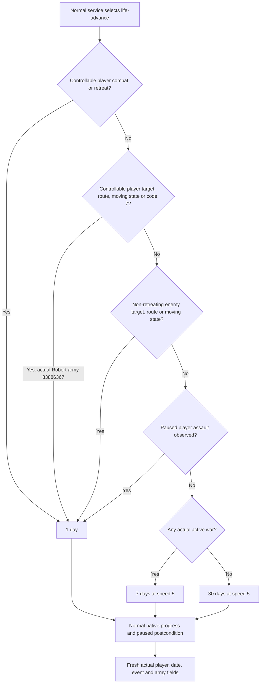

# Robert normal time windows and capture cost

The existing normal driver already chooses one, seven or thirty game days. Robert's moving army first selected **one day at speed one**, then its actual arrival released the existing **seven-day request at speed five**. The independent finite-capture runner has now completed a real normal loop: three turns advanced 15 days and saved a complete checkpoint, while external turn/snapshot records shrank from 881,867,199 to 608,110 bytes. Full persisted history remains at 4075 records.

Status: **normal one/seven-day advancement production-live; finite external capture production-live loop; current Robert thirty-day live use unobserved**. The root's finite run adds 15 durable game days; the iteration's total is 19 new days, Robert **3172/36524**. G2 stays **4/8**. Robert remains the sole current test entry.

## Version and existing native tree

The reused actual campaign is CK3 **1.20.0.3**, Steam build **25652598**, EXE SHA-256 `94B55397ABB687A3DCD436805A5D885E6BE90FA6C693FEB44A9E3BBEEADE02A6`. Its played actor is `29829`, episode `native-29829-2bc2d599f7f9`, ordinary succession with the persisted `dynasty_continuity` goal. The reviewed Python implementation is frozen at `artifacts/g2-maintainer-2026-10-02/resume-12003/production-source-c0f53e9b/`. The running native v16 DLL has separate provenance; this Python package does not rebuild or replace it.

The existing [native/counter-policy research](player-counterpolicy.md) distinguishes observed army routes and public state from inferred assignment and native timer phase. Its one-day sampling is our existing policy; seven days is not an inferred guarantee that enemies cannot change orders earlier. The [timeline blocker tree](current-timeline-blocker-context-v1.md) also establishes why missing active events do not alone prove that a succession modal has released simulation. Those historical exact-build findings retain their documented version boundaries. Here the current implementation and already recorded 1.20.0.3 paused/date observations are used directly; no ABI requalification or new war research was performed.

The [ordinary nonwar service](ck3-1.20.0.2-nonwar-service-mode.md) used in the recorded run preserved actual `active_wars` and army fields while omitting new war planning. Consequently, its ordinary `life-advance` used the shared driver's normal timing policy. The [H3937 scope repair](mainline-h3937-date-hold-scope.md) restored the resumed ordinary timeline; the historical research hold does not explain these successful one-day turns.

> **Authority supersession, 2026-10-03:** The owner now authorizes war research, implementation, policy and live acceptance, revoking the former war pause, nonwar-only scope and authorization requirement to keep WAR_CASH/PREWAR OFF. The recorded service behavior and flags remain historical facts; this authorization does not upgrade native capability readiness. Future live work continues only from Robert `29829`'s original campaign, with exact-build binding, native AI research first, and minimized background execution without taking focus.

## Why the current turns choose one day

Actual files are `m7-robert/actual-cold-following-family-sway-01/turn-001..003/result.json` under the artifact root above. All three use `requested_horizon_days=1`, `timeline_speed=1`, and `timeline_policy=player_tactical`; actual dates advance `53220024 → 53220048 → 53220072 → 53220096`, with paused state and verified postconditions. The same controllable army `83886367` remains `moving`, state code `7`, target `2614`, route `[2614]` in each starting frame. That directly selects the one-day branch.

The final selector is `src/xar_autoplayer/bridge/native_driver.py::_life_advance_horizon_days` at frozen lines 24375–24485; its constants are at 659–663. The speed selector at 24488–24544 uses speed one for player tactical movement and speed five for seven/thirty-day ordinary windows.

Seven days become available automatically when all preceding one-day conditions are absent in a fresh frame and an active war remains. Thirty days become available under the same conditions when the real active-war list becomes empty. A stationary enemy siege alone does not force one day. The subsequent actual finite run below confirms the arrival-to-seven-day transition; future enemy orders and war ending are not predicted by this readout.

The age-14 first-heir couple, Guy's original outbound marriage proposal, the county faction alert and the goal's marriage focus do not participate in the final horizon selector. A top-level incoming `pending_character_interaction` is a player decision that can replace time advancement. An already-read outbound proposal awaiting its recipient does not itself shorten the chosen horizon. Therefore a Guy reply alone will not select seven/thirty days while Robert's army is still moving. The existing progress function at 24079–24116 can end a normal window earlier for native pause, event, terminal or pending changes, war-progress changes or a newly observed stationary threat; its requested horizon is not a promise of uninterrupted time.

## Actual capture cost

The three old turn records total **669,073,928 bytes**. The two run-level snapshots add **212,793,271 bytes**, for **881,867,199 bytes** of external JSON. The recorded send stream contains 24 read-only queries, nine clock operations and one final save: each normal turn performs eight queries, including three campaign-root reads, before its three clock operations.

The same-process native heartbeat intervals spanning each before/after pair are 33.735, 34.203 and 58.594 seconds. Their sum is 126.532 seconds; the first-before to last-after interval is 131.532 seconds. These intervals include planner queries and execution. The old capture has no separate timer for native advance, JSON serialization or save, so the roughly five-minute complete attempt cannot be attributed wholly to CK3 ticking. The byte counts prove an unnecessary external-export cost; they do not by themselves quantify seconds saved.

The full finite readout and source references are in `m7-robert/normal-time-value-01/actual-turns-readout.json`, `actual-turns-readout.md` and `source-branch-readout.md`. Their hashes are carried in that directory's delivery fields.

## Minimal external runner change

The original `formal-python/run_formal_nonwar.py` and existing GREEN/RED artifacts remain intact. Its independent `run_formal_nonwar_finite.py` copy changes only external capture:

- External before/after snapshots use the existing `NativeDriver.take_snapshot_without_native_command_history()`; its published implementation is at 2473–2503. The equivalent service API is `snapshot(include_native_command_history=False)` at `service.py:518–527`.
- The copy's local paused-frame wait retains the factory's existing observations and timing, using that finite reader. The shared session factory is unchanged.
- Reports omit nested snapshot transcripts with explicit `native_command_history_export` mode, total count and included count. The actual returned objects are not mutated. Submitted plans, actual sent/result packets and checkpoint records are retained as supplied.
- The existing `before_submit` callback separates planning from subsequent dispatch/verification timing. A `capture-timings.json` sidecar records projection, JSON serialization and writing; the summary records checkpoint-call duration.

There is no monkeypatch of snapshot, planner or service methods, and no change to normal 1/7/30 selection, rollback, goal, full persisted driver history, feature flags or game state. WAR_CASH/PREWAR were unchanged in the recorded run. Source and factory files are not modified by the external runner.

One offline check invokes the new runner's export function on the unchanged actual first-turn dict. All non-history fields compare equal across 584 dicts, 136 lists and 3,507 scalar values, including the submitted plan; projection is idempotent. The actual histories remain present in the original dict, and the finite record explicitly records before/after totals 4055 and 4058. Receipt: `m7-robert/normal-time-value-01/FINITE-STATIC-REGRESSION.json`. No old finite-public test, L0 matrix, ABI test, SDK call or game run was repeated.

The root recipe is `ROOT-FINITE-NORMAL-7DAY-RECIPE.json` in the same directory. It preserves the previous actual run's Council, government, family and Sway opt-ins and uses a bounded 16-turn budget with a seven-day minimum target. This target is checked after each normal turn; actual accumulation can exceed seven when the existing selector changes to a longer window. The document author performs only file review; the root owns execution and the actual result below.

## Root's completed finite normal loop

`m7-robert/finite-normal-7day-actual-01/result.json` closes GREEN as `normal-time-target-reached`: three executed normal turns advance `53220096 → 53220456`, **15 actual days**, with no natural modal and final paused state. The actual requests are **1, 7, 7**, not inferred from the elapsed days.

| Turn | Requested days | Actual days | Speed/policy | Actual observation |
| --- | --- | --- | --- | --- |
| 1 | 1 | 1 | 1 / `player_tactical` | Army83886367 reaches2614; becomes regular, target null, route empty |
| 2 | 7 | 5 | 5 / `bounded_non_tactical` | War remains; stationary enemy sieges have no active route; score changes -19→-18 |
| 3 | 7 | 9 | 5 / `bounded_non_tactical` | Same war and stationary armies; observed paused date exceeds the seven-day requested horizon |

All three actual receipts say `progress_status=postcondition`. They do not export a separate `stop_reason` or the exact triggering running frame. The second turn's score change is sufficient for the existing war-progress early-stop predicate at 24102–24104. This is a source-supported explanation, not a newly logged stop reason. The third turn's nine days are consistent with the requested horizon being reached before asynchronous pause readback; it is not a thirty-day request. A normal horizon is an observation target, and these receipts do not prove exact-day stopping. Thirty-day use remains unobserved.

The three live turn files are **185,832 / 185,906 / 185,910 bytes**, totaling 557,648 bytes; run snapshots add 50,462 bytes. The comparable output categories therefore shrink **99.931%**, from 881,867,199 to 608,110 bytes. Before/after omission counts are 4065→4068, 4068→4071 and 4071→4074, with zero included transcript records. The final finite snapshot reports 4075 total records.

The real root runner closed the production driver and read its persisted file metadata: **49,277,053 bytes**, SHA-256 `49b547a68df99c2fe8e4c4aecd20d1bf6605a12a68aba908791cd1882f454b72`, complete history4075. The matching saved checkpoint is **h4075**, raw53220456, **83,192,479 bytes**, SHA-256 `dd4d3f772147778e7308a85f0e09336b491f00ad4f6e067e1d11564dfb5d23ec`. This reviewer uses that immutable actual-run metadata and does not reread current live state. Omitting external transcripts did not truncate the persisted history or replace the episode.

The new timers sum to **80.471 seconds planning**, **5.100 seconds dispatch plus verification**, **2.018 seconds checkpoint call**, and **0.076 seconds** for all captured JSON projection, serialization and writes. External before/after finite reads total 0.013 seconds. Planning/enrichment is now the observed main cost, around 27 seconds per turn; it includes production planning work and is not isolated query-only timing. Dispatch/verification likewise is not pure native tick time. The old run lacks matching timers and had different requested windows, so there is no controlled wall-time speedup ratio.

The single file-only follow-up proof is `m7-robert/normal-time-value-01/FINITE-PRODUCTION-LIVE-PROOF.json`, SHA-256 `c06a46460e8dc7224ef7089e09c4756f8ddd25fc513f9201bdddc0fe5995ffcb`. It pins actual results and checks finite export metadata, actual dates, paused state, recorded requests, checkpoint and complete persisted-history metadata. It performs no new query, SDK operation, game action, state access or test run. The helper and production policy are unchanged from the offline qualification.
