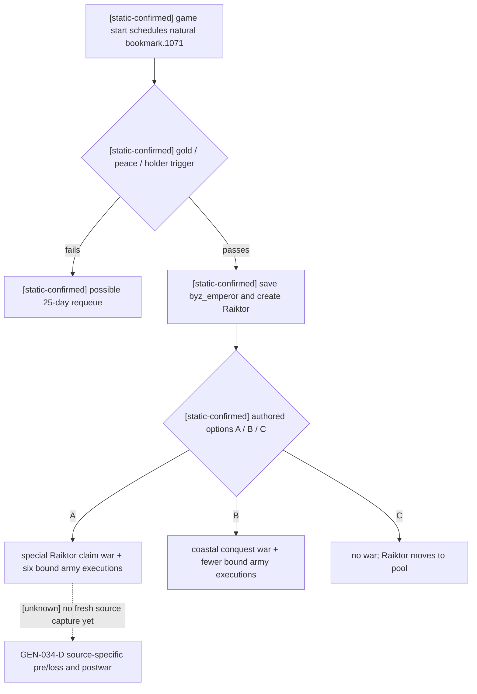

# Robert's Raiktor bookmark event: exact-build decision and source capture

CK3 1.19.0.6, `ck3.exe` SHA-256
`2D00FF3101EF70B566F2FCBAE292F09263199C80E9DC8F139B82D7D96F83DB86`.
The frozen original `game/events/bookmark_events.txt` SHA-256 is
`75CF485E379E522D4AAED9EF889FCC411A0D9DFCC28BCFB250ABDCC93A757EFF`;
`game/common/on_action/game_start.txt` SHA-256 is
`84C0101F3273205433F6484A6184887BA377C57FEF18F735337369E0A2ED136C`.
These are source observations, not a live event outcome.

`game_start.txt:6226` schedules `bookmark.1071` for the living historical
Robert after 1–7 years. The event trigger at `bookmark_events.txt:1437`
requires gold at least 100, no active war, and a different holder of
`e_byzantium`; a failed trigger may requeue after 25 days. The immediate
effect saves the actual Byzantine holder as `byz_emperor` and creates
Raiktor. Option A (`bookmark.1071.a`, native index 0) starts the special
`raiktor_claim_cb` against the current holder and executes six
`spawn_army(war=scope:war)` calls at lines 1515–1627. Option B (index 1)
starts `raiktor_conquest_cb` for three coastal counties with fewer spawned
armies. Option C (index 2) moves Raiktor to the pool and starts no war.
`00_event_war.txt:2235` gives the special claim CB
`valid_to_start={always=no}`; ordinary `declare-war` cannot create a
replacement source-captured claim war. Original AI chance is A 10, B 100,
C 10, modified for a human Byzantine holder. Those weights do not make
the first displayed option an automatic player decision.

The counter-policy's narrow typed consumer must bind the paused event
identity, played-character root, actual `byz_emperor` and `raiktor`
character scopes, and the three exact native option indices before it can
choose. A high-value claim war is allowed only when the same paused frame
also reports an exact native strategic-power margin large enough to cover
the Byzantine holder without relying on the player's ally network, the
current campaign has no conflicting war, and the observed gold budget is
at least 100. Otherwise it chooses the authored no-war C when shown and
enabled. A missing scope, option drift, or no legal C must stop rather than
silently fall through to native-index order.

The existing `query-war-entry-assessments-v1-N` only accepts a character
already present in `declarable_wars` or an active war. The event's special
CB is not normally declarable before its option runs. Thus a fresh Robert
scene may lack a lawful query scope even though `byz_emperor` is observable
in the typed event window. The isolated contract now defines a **read-only**,
same-frame saved-scope authorization for this exact event, with reserved
capability ID
`game.command.query-war-entry-assessments-raiktor-bookmark-saved-scope-v1`.
No frontend route advertises it yet; native driver/service hookup and a
paused-live snapshot remain dependencies before claiming option A is
routinely selectable in production. The
controlled private observer can capture six source executions in a fresh
WarID as local development evidence; UI selection by its harness is not
formal `native_auto_run` event policy evidence. Source-specific soldiers,
loss, postwar disposition and cold restore remain unexecuted until a new
ordinary standard-feudal campaign reaches and validates that full chain.
