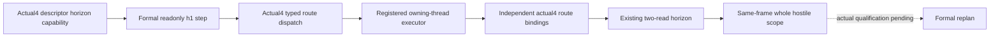

# Existing route horizon on CK3 1.20.0.4

The original Robert campaign's committed2619 ->2618 route cannot advance because the formal plan reports `native_war_active_route_contact_horizon_unsupported` and selects no step. The actual plan is `Z:/ck3_mod_rewrite_process_assets/g2-background-20261007/upstream-build-migration/managed-full-h9613-army08/operator/gameplay-responses/g2-route-b2e8268c324e-03-plan-2.json`, snapshot `native:2`, public revision3. No date advanced during this attempt.

The source baseline is `c8f19a6a067ef8dd56926b8bc11d14b164045974`. The target remains actual CK3 1.20.0.4, Steam25734779, SHA `98702F88A547CDE2EAF29A85F93B85F68EE4CF8148336A4F7AFAEB75319DD518`. This restores the existing `game.command.query-route-contact-horizon-v1-N` capability and its unchanged software reader; it does not change the one-day policy or submit a movement order.

Four reached integration gaps caused the unsupported state: the actual4 descriptor omitted the capability, the actual4 typed dispatch allowlist omitted `route`, its executor used the old exact-SHA route factory, and the actual4 owning-thread environment omitted the existing route executor. The separate arrival/contact subset does not supply horizon timing. `BindRouteImage12004` now lives in the already compiled `ck3_12004_army_support.cpp` and is declared in the independent `ck3_12004_routes.hpp`. The adapter also attaches it as `movement_routes` for the existing committed-timeline enrichment. Root owns the three shared Bridge hooks and compilation; no new TU or CMake registration is required.

The horizon reader requires GameState/Jomini/public CUnit storage; move mode, progress and front/tail; scratch path/context/build/destruction and the two move vtables; the three native movement-speed getters; prefix duration; and the movement-lock threshold. Core4, Army4, Military4 and ArmySupport4 provide all previously closed addresses and ABI types. The existing committed-target branch reuses the stored path. Scratch construction serves the existing uncommitted preview branch and does not enqueue a command.

The sole missing native callback was prefix duration. Its physical address is actual `0x24AAD80`, ABI `int64_t *(void *, int64_t *, const void *, void *)`. The first `.pdata` interval is only73B: the nonempty path falls through its end. The existing named `.3` source extent in `army-march-remaining-timeline-12003.md` closes logical `0x24AADA0..0x24AB060`, so two nonoverlapping comparisons cover73+631=704B. Both fully decode and match normalized instructions, ordered edges and local topology. Receipts are `Z:/ck3_mod_rewrite_process_assets/g2-background-20261007/upstream-build-migration/route-horizon-12004/duration-first01/FAMILY-MAP.json` and `duration-continuation02/FAMILY-MAP.json`. Cost:1408 physical bytes/4 bounded reads total, no repeated prefix, whole EXE read, hash, callee expansion or runtime/test execution. The actual4 binder uses that proven address, preserving the native Q100000 duration and existing rounding rules.

Status is source-ready, qualification NOTRUN. Root must integrate the Bridge hooks, compile the existing TUs, observe the same-game paused flag and execute the existing formal h1 query as migration validation. Work ends with migration acceptance and handoff; no further route strategy or campaign progression is included. Source closure and advertisement do not credit a safe day, an order, a save or any G2 progress.
