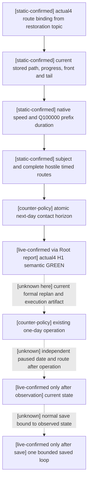
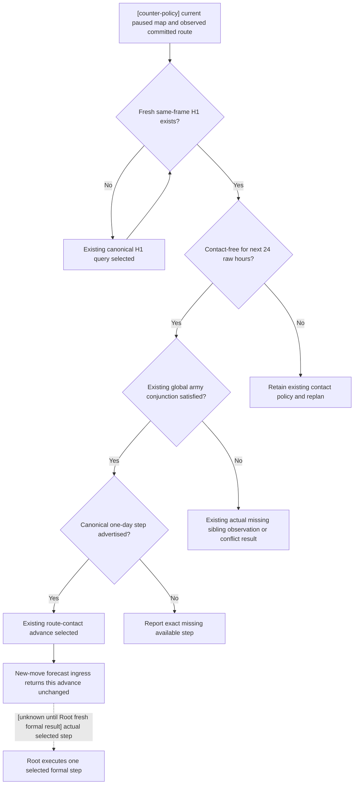

# CK3 1.20.0.4: committed route source chain for G2

Recorded 2026-10-07T12:20:15+08:00. Source reviewed at `23c3c4bc7fdf261f46174d35db12732808523463` in the isolated `C:/codex-ck3-background/g2-12004-route-chain` worktree. This is a source dependency ledger for the continuing G2 campaign. Migration acceptance remains the highest priority; G2 work continues in parallel. This package adds no policy, capability, runtime gate or handover document.

## Evidence and scope

The native source input is the already recorded [actual4 route horizon restoration](route-contact-horizon-12004-restoration.md), with the earlier [R0051 bounded waypoint](war-bounded-waypoint-r0051-12003.md) retained under its own `.3` build. Exact target is CK3 `1.20.0.4`, Steam build `25734779`, EXE SHA-256 `98702F88A547CDE2EAF29A85F93B85F68EE4CF8148336A4F7AFAEB75319DD518`. This package reuses those bindings and their existing evidence; it performed no EXE read, hash or game operation.

Root's facts supplied through the coordinating task identify current runtime `R0061G110-r11runtimeentry12`, Robert `29829`, raw date `53288256`, normal-saved total `5997`, natural successions `0`, and G2 `5/8`. War `100663329` is against `31050`, `claim_cb`, title `2132`. Own public CUnit `218104048` / CArmy `67109093` is at `2619`, moving toward `2618`, route `[2618]`, elapsed `1`; hostile public CUnit `134218098` / CArmy `167772499` is regular at `2606`; objectives are `2606` and `2608`. Root reports H1, actual contact and projected contact semantic GREEN, while a normal V2 error flag repair is being rechecked. These are coordinator-supplied current facts, not an independently read live artifact in this package. Their actual qualification stays with Root's retained responses.

Historical `.3` waypoint ETA `53288328` is not a newly observed `.4` arrival time. Effective route origin `2618` also does not mean the army has left current province `2619` or arrived at `2618`.

## Native source input tree

The restoration topic closes the existing actual4 binder, descriptor and owning-thread route executor. Current route reads preserve stored movement progress/front/tail; the committed-target branch uses the stored path. Existing native speed getters, Q100000 prefix duration and rounding produce the timed route. The separate arrival/contact query alone does not substitute for H1 timing.

Solid native edges reuse the restoration source evidence; the Root-reported live node does not give this package new live credit. Neither a command ACK nor a forecast proves the dashed operation/postcondition/save edges.

## Existing formal consumer and decision tree

The focused source review found an existing chain, rather than a missing policy implementation:

| Source | Existing dependency or result |
| --- | --- |
| `strategy.py:9740` and `9802` | Snapshot advertises route horizon and the current non-retreating hostile CUnit scope has 1–64 IDs. |
| `strategy.py:11178` | An observed committed target enters the passive-route audit before choosing a new movement order. |
| `strategy.py:19340` | `_fresh_route_contact_horizon` joins query history to current date, snapshot ID, public/native revision, connection generation, episode, subject, hostile scope and current province/path. It checks current province, not effective origin. |
| `strategy.py:11308` | A fresh contact-free H1 enters the existing conjunction for other controllable moving or threatened stationary armies. It requests an existing sibling observation only when that current state requires one. |
| `strategy.py:11491` | The available canonical one-day step becomes phase `native_war_route_contact_horizon_progress`. Otherwise the plan exposes the exact missing step. |
| `war_contract.py:1148` | Native horizon normalization requires the expected scope/frame, complete hostile routes, a `date_raw` to `date_raw + 24` window, and consistency between contact-free and conflicts. |
| `war_contract.py:2412`, `2439`, `2603`, `2845` | Canonical H1/advance literals and parsers already exist; the advance composite is recognized as a life advance. |
| `strategy.py:16337` | General battle forecast ingress parses a new `move-army` order. It returns a committed-route advance unchanged. |
| `strategy.py:16835` | Primary-defender siege forecast phase allowlist does not include `native_war_route_contact_horizon_progress`. |

The wrapper still applies the existing episode-specific H3937 hold when that predicate is actually active (`strategy.py:7590`, `7699`). This review has no actual current hold failure and creates no additional requirement from that branch. A fresh formal plan is the evidence for which existing branch is reached.

Normal V2 qualification is useful for future contact decisions and new movement orders. Source does not make normal V2/native forecast parity/full phase implementation a new requirement for this already committed, contact-free one-day advance. No strategy or contract edit is justified by the current facts.

## Root's next executable formal sequence

1. Obtain the current paused formal replan using the existing registered session. Let its selected step determine the next action. If frame/date changed since H1, use its existing fresh H1 query rather than reusing the old packet.
2. For the supplied single-hostile scope, the canonical query is `query-route-contact-horizon-v1-218104048-to-2618-h-1-134218098`. The corresponding candidate advance is `advance-route-contact-horizon-v1-218104048-to-2618-h-1-134218098`. Execute it only when the actual fresh plan selects it. Root's V2 repair can continue as a separate migration qualification.
3. After the one-day operation, independently observe the original Robert campaign paused and map-ready, the same episode and army identities, actual date and current movement/route/combat state. From the supplied baseline, the exact full day is raw `53288280`; an interruption is a separately observed partial attempt. Derive elapsed time from observations.
4. Complete ordinary event/transition handling selected by the formal plan, independently observe its final paused state, then use the existing normal `save-checkpoint` path. Bind the save to that final date/episode/state before crediting a saved loop. No new save format or gate is introduced here.
5. Replan from that observed state. Arrival is credited only when the actual current province and route state show it. If the army still moves, continue the existing bounded cycle. If new contact or a concrete missing native input appears, record the exact selected phase/missing field, then extend its native source/query input before the dependent policy action.

At the reviewed boundary there is no concrete missing native input for selecting the committed-route H1 advance: actual4 H1 has already been reported restored. Actual step advertisement, execution, paused postcondition and normal save remain to be qualified by Root. Other objective routing, arrival, siege, occupation, war settlement, natural succession and complete G2 remain separate unfinished outcomes.

## Readiness and accounting

This package is `research`: existing production source dependencies are documented, with no newly run tests, build, fixture or live action. It leaves Root's already qualified primitives unchanged. New game/SDK/pipe/window/Steam/input operations `0`, new days `0`, saves `0`, G2 credit `0`; saved total `5997`, natural `0`, G2 `5/8` are only the supplied baseline. Its external OCT7/W41 fields are `C:/codex-ck3-background/g2-12004-route-chain-result.json`, for the coordinator to merge into the daily/weekly reports it owns.
