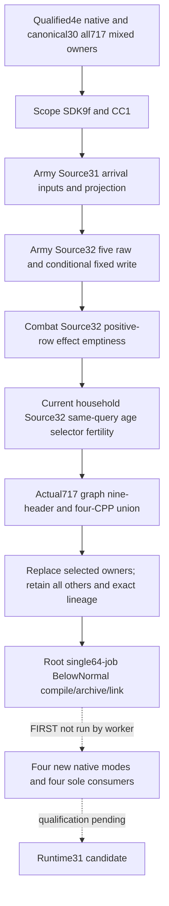

# Runtime31 Source31/32 source composition

October8 / ISO2026-W41. This is a source-only integration of the first Unit arrival assignment, its local pre-store disembark fixed write, and positive commander-event effect emptiness. Root owns compilation, FIRST and any game/SDK use. The source package does not change the running Runtime30 or claim a future frame or action.

## Qualified baseline and scoped composition

The native baseline is the actual production Snapshot source `4e06f9454ef9f0e8173d30d8259625d3396929b9` at `Z:/gbs1-m7-formal4-stack30`, retained by canonical `entry-live-fix30/ROOT-PARENT-RUNTIME-INCREMENTAL-DLL.json`. It records all717 production owners:297 Bridge,419 Runtime and1 Protocol. Its mixed lineage has465 cumulative recompiled owners, with61 new owners in the last archive; it does not claim every CPP was compiled at4e.

The exclusive tree `Z:/gbs-runtime31-source32` shares `Z:/ck3_mod_rewrite/.git/objects`. It starts at exact4e and scope-cherries these committed packages without a merge:

| Original pin | Scope |
| --- | --- |
| `d909a1ee240fb4443d271a4834e3174c66afa621` | Previously qualified direct-Army once-projection Service line |
| `9faffa0c8866b395c71a790ac03b80e139c4e2c6` | Normal Council SDK planning, its fixture and topic |
| `cc1e6a9e249ebeffdba1e6c910615041f090bf34` | SDKCC1 existing construction MCP route, its fixture and topic |
| `877b5d674258bfff49cbbee471c37e6b862bee2c` | Eleven Source31 first-arrival files |
| `e50b2f2c52c35ce53f68f3d8fe7be3aa3feaed3d` | Source32 fixed-write source ledger |
| `8a5f230e129468dea58889ea0f0c899fe7c11718` | Eleven Source32 raw-input/projection/whole-consumer files |
| `f3fd6098fa45fa34c1294facf638ae3208b92118` | Ten commander effect-emptiness files |
| `ccec7768874a4c547789f08048d89bc03857450d` | Ten same-first-heir current household age/selector/fertility files |

SDKCC1's inherited native PlayerClaims delta is not part of this composition. Exact4e Snapshot production CPP remains the qualified basis. Combat's five Source31 shared hooks already exist in4e; they are not reapplied. The sole new shared registration is `include(cmake/phase_effect_emptiness_whole_fixture.cmake)` immediately after the existing phase-role include.

## Actual owner selection and compiler contract

The existing717-owner graph is the selection authority, preserving every owner's original identity, actual compiler reference and qualified mixed-source object path. Select the consumers of all nine changed or added production headers plus the four changed production CPPs; this is not a two-object rebuild:

- `game_contract.hpp`, `ck3_12002_army.hpp`, `army_strength_v1_serializer.hpp`;
- `phase_event_commander_chance_weights_v1.hpp`, `ck3_12004_phase_event_commander_chance_weights.hpp`, `phase_event_commander_chance_weights_v1_serializer.hpp`;
- `ck3_11906.hpp`, `current_first_heir_reproductive_inputs_v1.hpp`, `ck3_12004_first_heir_reproductive_inputs.hpp`;
- `src/ck3_12002_army.cpp`, `src/ck3_12004_army.cpp`, `src/bridge.cpp` and `src/current_first_heir_relationship_v1.cpp`.

The explicit selection ledger lives under `Z:/ck3_mod_rewrite_process_assets/g2-parallel-20261008/runtime31-source-compose/owner-selection/`. Unselected physical objects retain their canonical30 paths and source lineage; selected owners are replaced in the same717-owner final DLL/archive lists. There is no new production TU or owner. The new phase fixture is separate from the production-owner set.

`tools/build_runtime31_source32.py` is a new copy of the qualified Runtime30 incremental builder with a canonical30 default, required explicit ownership input and Runtime31 metadata. It keeps the retained compiler/linker settings, Windows `CommandLineToArgvW` parsing, response-file quoting, original owner identities, environment bootstrap and qualified fallback roots. The exact4e Snapshot command is an archived raw Windows string; its actual GREEN compiler receipt used `C:/codex-ck3-background/migration4-complete-domain-build/strict07/cache-observers`, despite the archive row's attempt07 cwd. The new builder normalizes the raw string and uses the actual receipt cwd for that owner. Archive/link response files retain their fresh output cwd.

Root runs the builder once with `--jobs 64 --execute`, fullvenv `-B -X utf8`, the final immutable source head, canonical30 receipt, explicit selected-owner input and `tools/runtime31_source32_target_recipes.json`. Compiler and linker subprocesses remain BelowNormal. The builder only generates source, compiles the selected owners/three fixture targets, archives and links; it does not run FIRST, consumers or CK3. The worker has not imported or run the script.

## Only new FIRST scenes

| Native target and mode | New scenes / registered passes |
| --- | --- |
| `xar_ck3_12004_unit_army_movement_admission_whole_test --arrival-transition-wire-dir` | Source31 five /ten |
| Same target `--disembark-write-wire-dir` | Source32 seven /fourteen |
| `xar_ck3_12004_phase_effect_emptiness_whole_fixture` | Source32 three /three |
| `xar_ck3_12004_first_heir_descendants_test --reproductive-inputs-wire-dir` | Source32 seven /eight; the eighth is explicit legacy-absence compatibility |

The Army target is compiled once and each new mode runs once with a separate fresh output directory and its sole registered consumer. Effect emptiness reuses the qualified V2 seed include, compiles the new frozen production whole serializer projection and runs its sole registered compound once. Current household uses only the existing descendants target's seven new whole scenes and its new compound, including one explicit legacy-absence compatibility check. Existing edge-selection, admission, commander-chance, role, M7, descendants default mode and other Runtime30 GREEN qualifications are retained without replay. Total new qualification is22 native scenes and35 registered checks.

The new build target recipe keeps only the existing Army and descendants whole targets and the new effect-emptiness whole target. Its generator uses fullvenv `-B -X utf8`; no old generator/FIRST is scheduled. Original native business packets reach actual Driver/Service/registered MCP; synthetic frame/transport and explicit legacy-case boundaries remain separate. The source handoff, exact argv and Oct8/W41 fields are external under `runtime31-source-compose/`.

Status: `SOURCE_PREPARED_FIRST_NOTRUN`. No build, test, project import, SDK/game/process/window contact, EXE read/hash or push occurred in this source-preparation package. Source31/32 conditional arrival/fixed-write values do not claim final callbacks, future province/penalty, executed effects or action credit. Effect-emptiness operands do not predict event fire, RNG, damage or benefit.
