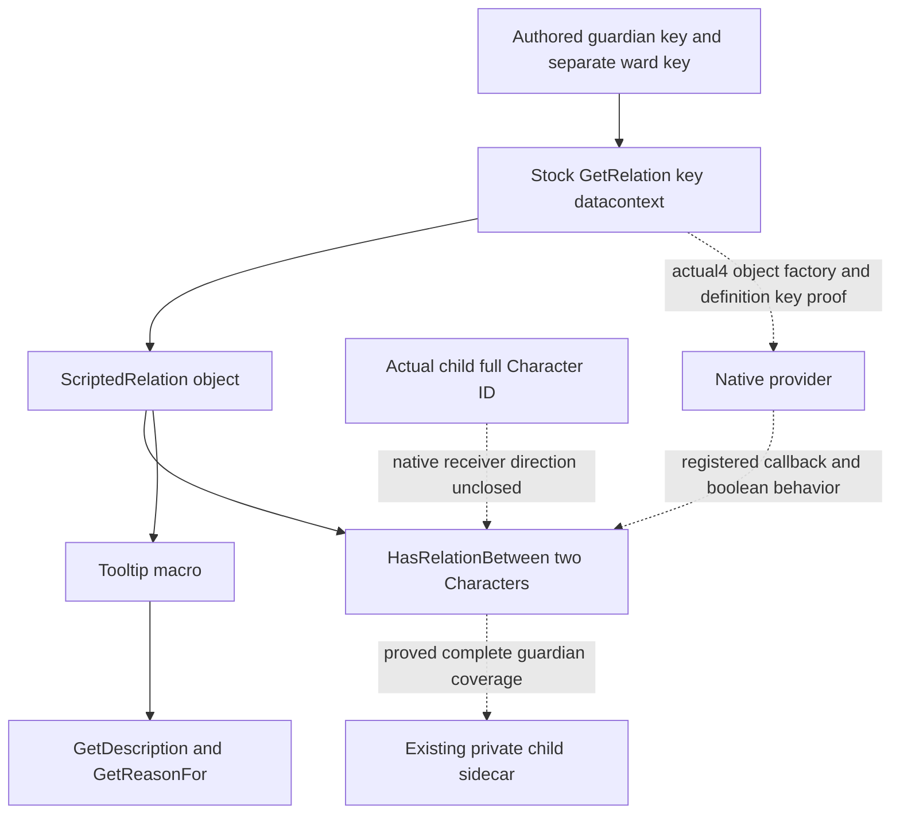

# ScriptedRelation provider and guardian input (1.20.0.4)

2026-10-09 / W41. Research, current integrated source
`97321e7bf2ffa20f646c1db63036eed38de647b1`. The existing exact4 build freeze
is reused; this lane performs no EXE/hash, Game/SDK, build or test operation.
Root separately adopts the preceding guardian source topics212cb/7d7049.
Those topics retain the actual176-byte pair-provider closure and the Root
three-name `.data` locator's zero-reference result. Neither result is
repeated here. The ordinary child guardian decision still needs a real
typed observation, regardless of the current empty child roster.

## Native source tree and the actual producer dependency

Frozen stock `GetRelation(key)` gives the individual relation icons a
`ScriptedRelation` datacontext. `ScriptedRelation.HasRelationBetween`
consumes that kind object and two Characters; the exact guardian key is
also authored in the character-window relation-list expressions. The
native object factory, registered callback and argument direction are
still unclosed, rather than supplied by the generic Character pair rows.

One necessary new stock boundary closes a misleading alternative:
`game/data_binding/scripted_relation_macros.txt:1–5` defines
`GetScriptedRelationTooltip(Relation,Owner,Target)` as a macro. Its body
calls `Relation.GetDescription(Owner.Self,Target.Self)` and
`Relation.GetReasonFor(Owner.Self,Target.Self)`. These are real consumers
of an already supplied relation object. The macro is not a native global
lookup or the producer of a loaded guardian definition.

## Three bounded independent inventories

| Work package | Actual necessary source evidence | Construction result |
|---|---|---|
| Native definition/type software | `ck3_12004_event_window_context.hpp:26–29`, `ck3_12002_event_window_context.cpp:260–289` | Registry getter `0x3795A60` returns expected registry `0x54F2AF0`; type identifier is resolved through `0x3F4F8E0`. The software reads data0/countC/stride50 and type-row identifier0. This is token type-index to type-name lookup, not definition-by-key or GUI registration. |
| Original key producer | The five-line stock macro and retained top-level scripted relation/GUI input trees | Macro consumers and guardian/ward keys are closed; authored text contains no native object address, stable-key offset, DB slot or callable ABI. GetName remains display text. |
| Held exact-build addresses | Five selected parsed index JSONs: core-global-slots CACHED-INPUT-INDEX/SOURCE-MANIFEST-INDEX, event-window LEAF-AND-TYPE-MAP/TYPED-FIELDS-MAP, function-match-core CORE-FUNCTION-MAP | None supplies a named ScriptedRelation provider, HasRelationBetween target or receiver association. No linked body, pdata row lookup or capture range is justified from this bounded set. |

The EventTargetScope software consumes a real16-byte token obtained from
a proven ActiveEvent or pending-interaction owner. `ReadSavedScopeName`
is identifier/name round trip; it does not associate a key with a relation
definition. Pending target output explicitly keeps typed identity
unavailable when its payload is unclosed. A GUI `ScriptedRelation`
datacontext has not been shown to be that token domain. Adding a type-name
inventory query would not resolve the guardian input and is not done.

Parent's separate GUI source inventory closes the current query boundary:
`ck3_12004_generic_gui.hpp` binds fixed widget lookup/tree operations and
their existing fields; it supplies no DataFunction registration lookup or
typed datacontext factory. The inspected window-tree path in
`frontend_gui_route_v1.cpp:103–118` calls the fixed-root subtree reader.
Its scope enum in `frontend_gui_route_v1.hpp:183–208` names topbar,
decisions and existing mod/death windows; it does not expose character
relation icons or a ScriptedRelation object. A widget context pointer or
a declared Python character-window method is not proof of the missing
native relation provider. No GUI field is repurposed as a definition.

## Minimum construction contract and remaining owner

The sole entry remains the **real loaded `GetRelation('guardian')`
object provider → typed ScriptedRelation receiver → registered
HasRelationBetween callback**. It must identify the returned definition
and canonical key, prove this/two-Character argument order and
guardian/ward direction, then establish true, false, invalid input and
full-peer coverage. No callback RVA or byte span is present in the held
inventory. A next finite capture must start from a genuine producer or
registered target, rather than an invented address or another pass over
the old three-name encodings. Root alone owns any new exact-build capture.

After actual native closure, use the existing admitted full-ID child
resolver, query-local private sidecar, serializer and registered MCP
consumer. Presence and guardian IDs must be independent of other child
input availability. Complete empty is a legitimate read; failure is not
empty. Pair truth alone does not promise a complete identity roster.
Do not substitute Robert, heir, candidate teachers or historical memories
for a child's actual relation target. Future unique production-reader
fixtures must retain full-ID generation decoys, asymmetric guardian/ward
direction, multiple actual children, known empty, independent unavailable
and removal afterstate. They remain `SOURCE_NOTRUN`.

`NO_NEW_WORK` applies only to obtaining a provider address/ABI through
these exhausted authored/software/five-index inputs. The source evidence
does not contain that native producer; children0 is not the cause and
guardian research is not declared complete. No empty schema, permanent-null
field, metadata-only build or new action/query is added. The exact missing
native provider is recorded as a required functional dependency.

The source packets are under
`Z:/ck3_mod_rewrite_process_assets/g2-parallel-20261008/post-birth-guardian-provider46/`:
`native-definition-db/`, `held-address-index/`, `authored-key-producer/`
and Parent's `ROOT-DELIVERY.json`. Tests/FIRST are `NOTRUN`; source
readiness is `research`. No guardian, educator, education, birth, natural
succession, production-live or G2 credit is claimed.
