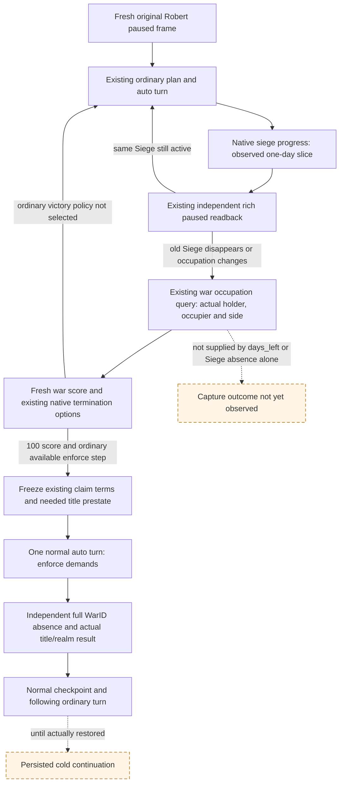

# Ordinary siege completion and claim-war material outcome on CK3 1.20.0.4

Recorded on 2026-10-10, ISO week 41, from complete private SDK source
`754eee48915c227515b03f6ce882fce9cef9202c`. This is a finite source review and
Root execution contract, **NO_NEW_SOURCE** for production. It does not run
queries, tests, native producers, builds, imports, or game/process operations.
NW2 remains **2/4**; this document does not reinterpret its original four items.

The exact build is CK3 **1.20.0.4**, Steam **25734779**, EXE SHA-256
`98702F88A547CDE2EAF29A85F93B85F68EE4CF8148336A4F7AFAEB75319DD518`.
These existing identities and native receipts are reused without executable
reads or hashes. Root's running Native66 recovery remains independent of this
work; the complete SDK reference is source evidence, not a claim about the
currently loaded DLL or current campaign frame.

## One remaining visible outcome

The useful next result is an ordinary siege's independently observed occupation,
followed, when ordinary policy selects a legal victory, by an independently
observed claim-war settlement and normal saved continuation. The current work
does not need a new completion forecast or general settlement simulator.

Root supplied these **retained facts before the 6051 save**: public Army
218104048 / native CArmy67109093 arrived at Province2606 with an empty route;
state7 became sieging3 and player Siege268435564 was active. Its initial strength
was1861, garrison588, fort4, work221800/40000000 and estimated days left180;
occupation and assault breach were absent. A later retained army read showed
1843/2367, supply100 and attrition0.01. These are historical inputs, not a new
paused frame, a proven finish date, attribution of soldier losses, or permission
to reuse an old public revision. War100663329, target Title2132 and objectives
2606/2608 are likewise retained identity anchors to be checked against Root's
next actual ordinary frame.

The [ordinary siege tree](siege-ooda-source-chain-12004.md) already proves rich
current Siege reads and the one-observed-day stationary progression path.
The [foreign-leader contribution tree](siege-foreign-leader-material-cadence-12004.md)
separately keeps arrived own participation distinct from stored leadership.
The [claim-CB result tree](claim-cb-r80-ordinary-terms-observation-12004.md) and
[saved settlement chain](claim-cb-settlement-save-chain-12004.md) distinguish
native legality, current claims, actual title result and saved continuation.
No missing field in those ordinary paths was found in this bounded review.

## Existing production fields and decisions

`bridge/war_occupation_targets_contract.py:70` normalizes the actual collection
under `/war_occupation_targets_v1`. Its `rows` retain `holding_title_id`,
`county_title_id`, `province_id`, `legal_holder_character_id`, `territory_side`,
`occupation_observable`, `is_occupied`, `occupying_character_id`, `occupier_side`
and `counted_occupied_by_opposing_side`. Optional rich Siege material is retained
as `siege_observable` and `active_siege`. Its two `side_counts` preserve native
eligible and occupied denominators. Neither the raw held estimate180 nor a
disappeared Siege establishes occupation, player-side control, or score100.

`strategy.py:11132` already chooses `native_war_siege_progress` / `life-advance`
for the current progressing Siege without a route or stationary threat. Root
keeps the actual plan's selected work: a battle, event, new route or other real
condition can change it. This contract adds no forced daily action or assault.
`strategy.py:8792` already prioritizes `native_war_enforce_demands` at player
relative score at least100 when the available native enforce step is present
and the player-leader rule is satisfied. It runs before further army orders.
The existing step is `enforce-demands-<full WarID>`; no new action is required.

The generic options body's `terms_observable=false` is not a broken claim-reader
binding. Existing `ck3_query_war_termination_terms` provides claimant, ordered
targets and narrow claim disposition while the CWar exists. It does not forecast
all money, prestige, truce or callback effects. The existing policy can continue
the war and enforce its selected native legal victory without that full utility
forecast. Legal surrender alone does not select surrender; this contract does
not force peace or change negotiated-white-peace policy.

## Minimal Root query and action contract

Use a Root-owned original Robert29829 session and its fresh actual public
revision. Reuse already returned ordinary observations rather than issue a
duplicate query. Canonical method arguments at source754 are:

| Boundary | Existing MCP and exact arguments | Required interpretation |
|---|---|---|
| Fresh ordinary frame, only when a new one is needed | `ck3_take_snapshot(include_native_command_history=false)` | Current `revision`, `native_revision`, `date_raw`, `active_wars`, player and relevant Siege/army state; do not use old revisions. |
| Normal progression | `ck3_plan_turn()` and `ck3_auto_turn()` | Use the selected ordinary step, including strength queries or one-day siege progress. Root's existing normal loop need not add a plan call when auto already returns it. |
| First material siege boundary | `ck3_query_war_occupation_targets_v1(war_id=W, expected_revision=R)` | While W remains active, locate the real Province/holding row and record actual occupation and occupier side. A different occupier or replacement Siege remains its actual result. |
| Settlement decision boundary | `ck3_query_war_termination_options(war_id=W, expected_revision=R)` | Fresh player-relative score, player leadership and per-option native legality; reuse the ordinary query if already supplied on this frame. |
| Needed pre-settlement material | `ck3_query_war_termination_terms(war_id=W, expected_revision=R)`; `ck3_query_title_holder_v1(title_id=T, expected_revision=R)` | Freeze actual claimant and ordered target titles before W disappears, plus only their needed ownership/realm prestate. No fixed historical Title2132 argument. |
| Selected victory | `ck3_auto_turn()` | One ordinary `enforce-demands-W` selection/submission. Preserve pending/ACK separately from completion; do not manually repeat it. |
| Independent terminal material | `ck3_take_snapshot(include_native_command_history=false)`; `ck3_query_title_holder_v1(title_id=T, expected_revision=R_after)` | Exact full W absent and actual target holder/lieges/realm result; legal title owner need not be the played character directly. No occupation-query dependency after W ends. |
| Normal saved continuation | `ck3_save_checkpoint(expected_revision=R_after)`; a later `ck3_auto_turn()` | Retain actual materialized checkpoint receipt and the following ordinary result. Root may use its existing normal cold-restore recipe when needed; source preparation does not claim it happened. |

If the chosen material claim specifically requires postwar claim presence or
strength, the existing `ck3_query_player_claims_v1(title_ids=[T...],
expected_revision=R_after)` is independent of CWar. Its actor is the current
played character, so interpret it as the retained claimant only when that actor
actually matches. Do not substitute a title-holder result for claim flags.
This optional observation is not a new prerequisite to finish the selected war.

The exact public facades are in `bridge/mcp_server.py:2369`, `:2431`, `:2436`,
`:2472`, `:4011`, `:4021`, `:4031`, `:4041` and `:4063`; occupation Service
enrichment is at `bridge/service.py:4816`. These line numbers refer to the
source754 reference. Native action/readers remain the adopted actual4 paths.

No current occupation, surrender, victory, title transfer, save increment,
NW2/G2 milestone, or cold persistence is credited here. The next actual
blocker, if any, must come from Root's new ordinary response rather than a
missing full campaign forecast or a historical no-breach sample. Loss attribution
belongs to the actual-loss owner, income/material budgeting to M4, and dynasty
progress to M7; this package changes none of those paths.
