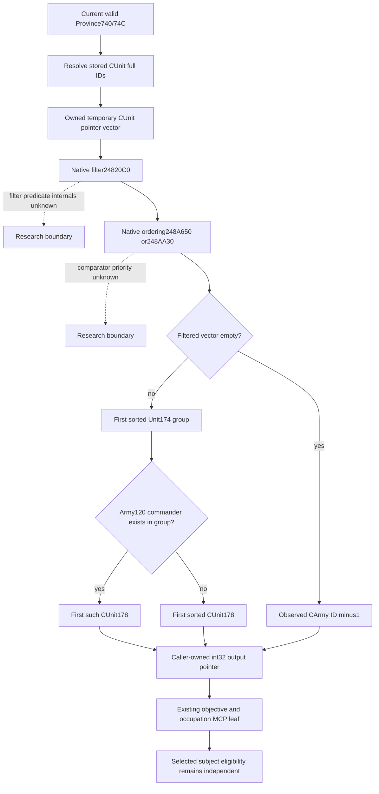

# Current Province siege army selection in 1.20.0.4

This source candidate publishes the fresh native Province selection through the
existing objective snapshot, Province local siege query and occupation target
MCP. It also supplies a whole fixture producer. Source is prepared; Root owns
the single first build, fixture execution and live adoption. No fixture or game
operation has been run by the source owner.

The exact build remains Steam25734779, version1.20.0.4, EXE SHA
`98702F88A547CDE2EAF29A85F93B85F68EE4CF8148336A4F7AFAEB75319DD518`.
The native source base is `4e06f9454ef9f0e8173d30d8259625d3396929b9`; the separate
SDK consumer source base is `cc1e6a9e249ebeffdba1e6c910615041f090bf34`.
See [the prior R76 target tree](war-siege-target-contribution-r76-12004.md),
[current native eligibility](siege-efficiency-inputs-12003.md) and
[the actual Province profile](ck3-1.20.0.4-province-siege-objective.md).

## Closed native input

Root captured only old `247DC20..247DFF5` and actual `247DC00..247DFD5`, 981 bytes
each, after this owner's cache-only lookup reported both exact intervals absent.
The retained map is
`Z:/ck3_mod_rewrite_process_assets/g2-parallel-20261008/battle-pursuit/siege-leader-input-r76/root-map02/FAMILY-MAP.json`.
Its named `province_next_siege_leader-DETAIL.json` has full981-byte decoding,
normalized equality, ordered edge equality and identical local control topology.
No RVA-bearing table was blindly masked. Root's capture cost is1962B /2 reads;
this source owner read decoded actual instructions once, without EXE access,
hashing, new decoding, old GREEN replay or callee expansion.

The initial name “next leader” is corrected by the body: the native method
selects from the **current Province CUnit occurrences**, and returns a pointer
to its caller-owned signed int32 output. The value is a full **native CArmy ID**.
It does not return a public CUnit ID, a commander ID or a predicted future leader.

| Actual site | Typed source meaning |
| --- | --- |
| `247DC37`, `247DC3A`, `247DC63`, `247DCBB` | RDX is the output pointer; RCX is Province; current resident count74C/data740 |
| `247DCE1..247DD10` | Unit registry5D1E380; generation-qualified CUnit fullID10 |
| `247DDFA` | Native filter24820C0 over the owned temporary CUnit pointer vector |
| `247DE23`, `247DEC9` | Native small/large vector ordering248A650/248AA30 |
| `247DEE9` | Empty vector writes native sentinel-1 to caller output |
| `247DF1A`, `247DF33` | First sorted Unit174 group bounds the commander preference |
| `247DF3C..247DF70` | CUnit178 resolves the full native CArmy; commander120!=-1 is preferred within that group |
| `247DF91`, `247DF97`, `247DFAF` | Chosen CUnit178 is written to output; RAX returns that same output pointer |

The direct body writes its owned temporary vector, sort scratch and caller
output. The helper is already reached by the adopted readonly `siege_is_blocked`
getter251CF50 and by the prepare caller251E21F. The new observation directly
calls the same native selector on the owning thread; it does not reproduce the
opaque filter or comparator. Those subrules remain separate research inputs,
and this note does not claim their complete priority formula or any future
occupation beneficiary.



## Wire and consumer seam

The additive Province-level key is `current_besieging_army_selection`:

```json
{"native_carmy_id":352321570,"public_unit_id":335544362,"controllable":false}
```

Native sentinel-1 produces an observed empty object with both IDs null and
`controllable=false`. A failed or unavailable selector observation is null.
If a valid native ID has no unique current public CUnit join, the native ID
remains published while public identity and controllability are null. Old SDK
key absence remains distinct from a failed-read null. The reader does not need
the Army binder to invent permission for this output; it uses the existing
validated Unit178 join against known snapshot armies.

The stored active Siege208 leader and `player_army_besieging` retain their prior
meaning. The existing `active_siege.province_unit_occurrences` supplies exact
native qualification for each resident. The ordinary planner's selected
controllable subject can contribute when its measured row is eligible, even
if a different foreign army is the stored or freshly selected leader. The
consumer reports whether the subject's native CArmy matches the current
selection but does not make equality an admission condition. Assault ownership
and validators retain their separate semantics.

In R76, own public army218104048/native67109093 is still moving2618→2615.
Objective2606 is unoccupied, fort4/garrison588, with no active siege; objective2608
is unoccupied, fort7/garrison1050, with foreign stored public335544362/native352321570.
Current siege work is0; total and remaining work are51353725, with progress0.
The native selector has not yet been queried live by this owner. Current
objective ordering already consumes fort/garrison; this candidate introduces
no new zero-input target score and submits no move. Actual arrival and the
fresh qualification row decide contribution at2608.

## One whole first fixture

The source-prepared target is `xar_ck3_12004_siege_selection_whole_fixture`.
It constructs fixture-owned actual-build profiles and objects, calls the real
whole occupation reader and production serializer, and emits four fresh scenes:
foreign leader with eligible own subject, native exclusion, observed empty
selection and unavailable selection. The fixture fixes current_work0 versus
total51353725 separately and verifies that the reader leaves its owned Province,
Unit, Army and Siege bytes unchanged. Callback outputs and arrived-subject
states are synthetic; they do not claim actual native future selection or
R76 movement. Holding IDs2100/2101 are fixture identities, not title2132 evidence.

Root's sole SDK consumer is
`ck3_autonomous_player/tools/consume_siege_selection_whole_fixture.py` in the
separate SDK candidate. It passes each fresh packet through the existing
registered occupation MCP, normalizes the same Province leaf, and invokes the
ordinary selected-subject consumer. It checks that foreign leadership does
not reject observed eligible contribution, native exclusion remains false,
native empty selection differs from failure, and measured fort/garrison still
rank2606 before2608. The eligible-arrival scene's strength1500 is a constructed
fixture value; R76's measured current strength152 is not extrapolated.

Root builds/runs this target once with `--wire-dir <fresh-dir>`, then invokes
the sole SDK consumer with `--projection-root <SDK candidate> --native-dir
<fresh-dir> --out <fresh-receipt>`. The source owner has FIRST0, no game/SDK
calls, no builds/tests/imports, and no new EXE reads. A successful whole fixture
will validate the code path; production live readiness requires Root's later
same-frame query and ordinary occupation outcome.
