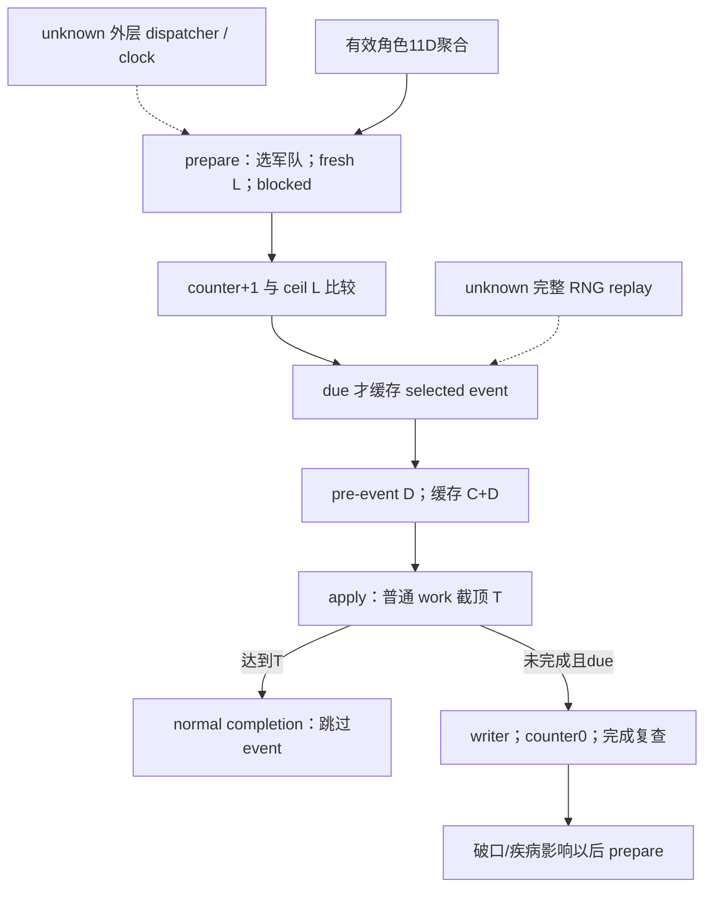
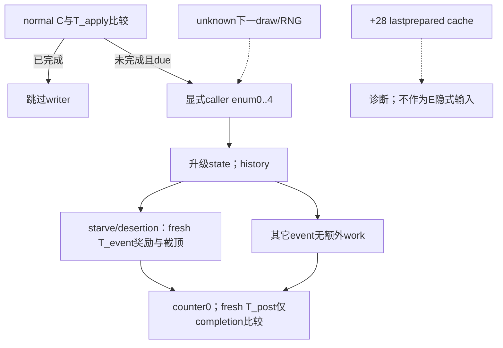

# 当前围城单 tick 与阶段调度（1.20.0.3）

本专题对应 CK3 1.20.0.3 / Steam 25652598，EXE SHA-256
`94b55397abb687a3dcd436805a5d885e6be90fa6c693feb44a9e3bbeeade02a6`。
先复用并封存[普通进度树](episode03-siege-progress-1.20.0.3.md)、
[事件树](episode03-siege-events-1.20.0.3.md)和
[将领有效输入](siege-efficiency-inputs-12003.md)，再实现独立纯模型及同 occupation 查询观测口。
2026-10-04 本包完成离线 **static-ready**；没有 paused 游戏 qualification 或新的 production-live 信用。
Root 缓存 P472 fort4/garrison500/clean/noSiege 与 commander34867 的 −10000 是输入基线，
不能据此创造 active Siege、开始时间、breach、counter 或本场完成日期。

## 阶段与普通进度的关系

canonical 字段是 `siege_phase_time_modifier_raw`。有效角色 getter `0x28C3AE0` 的
aggregate+0x68，经 sparse getter `0x2303700` 取 enum0x11D。−10000/Q100000 是
已聚合的 signed 阶段贡献；不能另加 engineer−0.1 或猜测 XP，不能直接把它乘到普通日速 D。
角色还可能独立拥有日速 enum11E/11F/120，不能由11D推断。

`factor=max(0,100000+breach+actor11D+siege_cached11D+province_side11D)`；
`L=trunc(2000000*factor/100000)`，阈值为非负 L 向上取整。
仅在其他项**显式为0**时，actor−10000 才形成18的阶段算例，不能称为 P472 实机阶段长度。
普通 D 采用原生 getter，或显式完整项的
`max(50000,mul(mul(100000+A+M+E+Xadd,Xmult),F))`；每次 mul 单独 toward-zero 截断。
未知项保持缺失，不从 ETA 反算 D，也不把未知 eligible siege tier 当0。

精确 prepare 指令顺序是：重新选符合条件的围攻军队 → fresh phase getter → blocked predicate
→ counter+1 与当前阈值比较并缓存事件 → 最后缓存 pre-event D 与 C+D。
将领变化在下次 prepare 重求长度时生效，已有 counter 保留。
apply 提交选中军队和 cached modifiers，再在 allowed 分支递增 counter、写普通进度并以当前 T 截顶。
普通进度已达 T 时跳过事件；未完成且 due 才写事件、counter清0，并复查完成。
破口影响以后 phase，疾病影响以后 D，不倒灌本 tick 已准备的 D。
断粮按新等级增加事件当时 T 的5%/15%；逃亡加5工作；僵持无额外工作。
战争贡献和 occupation manager 副作用未纳入此有限工作量模型。

## 同 existing occupation 查询新增的五项观测

沿用 `ck3_query_war_occupation_targets_v1`，只在 rich `ReadObjectiveProvince` 已解析合法
active Siege 后、assault 子域早返前读取。五项 presence 独立；noSiege 仍为 null。
callback/当前内部军队无法读取时保留相关 null，真实 raw0、counter0、boolfalse 保留。

| active_siege 字段 | 来源与含义 |
|---|---|
| ordinary_daily_progress | RVA251F170 fresh getter，{raw,scale:100000} |
| current_phase_length | RVA251E7A0 fresh getter，{raw,scale:100000} |
| prepared_phase_length | Siege+0x20，上次 prepare 缓存；不是 fresh fallback |
| phase_counter | Siege+0x43C，真实非负 int32 |
| can_advance | !RVA251CF70 blocked predicate，nullable bool |

普通 getter ABI：`int64_t*(Siege*,int64_t*out,int32_t commanderFullID,int32_t internalArmyFullID,void*tooltip)`；
阶段 getter ABI：`int64_t*(Siege*,int64_t*out,int32_t commanderFullID,void*tooltip)`。
两者返回 caller out，tooltip=nullptr。复用 Siege+0x208、`ResolveInternalArmy`
（slot RVA5D1DE48）和 Army+0x120 commander，不能传 public CUnit ID 或 played_character_id。
原生无 commander 的 −1 照传。prepared+20 在任命变化后可 stale；current 必须调用 getter。
当前 D/ETA 使用 stored+208；下一 prepare 从 Province247DC20 重选后使用+38，
因此本模型不保证下一天军队身份不变。

最小数据链已实施：province.hpp/cpp → game_contract.hpp 的 WarObjectiveProvinceState
增量字段 → WarOccupationActiveSiegeV1 → production rich copy → serializer
→ `war_contract._normalize_active_siege`。既有 `war_occupation_targets_contract` 已共用该
normalizer，只 pin 不强改。game_contract 只增加本 DTO section，未覆盖并行 BattleCadence DTO。
没有新工具、flag、动作或策略 gate。

## 独立 adapter / runner 与验证

新增 `xar_autoplayer.simulation.siege_current_tick`，同文件 CLI 仅读写本地 JSON：
`python siege_current_tick.py INPUT.json --output OUTPUT.json`。
输入 holding_row 为 existing production normalizer 的 row，可附 frame revision/date。
默认消费同 active_siege 的五项 native 观测；可明确选择独立 caller-supplied tick_operands，
该分支不补真实查询 null。将领阶段观察单独保留，仅解释聚合项。
getter 已内部绑定身份，内部 Army/commander 未另发布不构成额外数值运算 gate。
prepared length 只诊断，ETA 只保留当前动态估计，不承诺完成日期。

`siege_observable=true + active_siege=null` 直接 `not_applicable/no_current_siege`。
blocked 不推进 work/counter。普通进展先完成时跳 event；due 但不知道真实 selected enum，
只返回确定的事件前 work 与 pending。显式 fixture enum 仅计算条件效果，未重放 RNG、
outer scheduler、历史、动态 post-event total、占领或战争终结。

唯一纯模型 fixture：13 methods +22 subtests，JUnit35，全 GREEN，0fail/error/skip。
新桥两例走真实 collector → `ReadObjectiveProvince` → production rich copy → serializer，
18 native assertions，并经现有 shared Python normalizer 两例 GREEN。
合法 holding occurrence 的重复项按原生规则保留；该事实修正了新夹具错误的单次回调断言。
只为这一真实失败重编新 driver，复用五个已编译生产对象；消费脚本的 wrapper/row 格式修正
只复用同两包，未重跑 native。初次投影路径 HARNESS-RED、错误 fixture 断言和 consumer 格式 RED
均保留。生产七路径始终无需修正。

冻结材料根：`Z:/ck3_mod_rewrite_process_assets/g2-resume-20261003/siege-efficiency-inputs/current-tick-offline/`。
`native-tree/NATIVE-ENTRY-SUPPLEMENT.json` SHA `5ae74027e910f6760e18689b2a2f8ee47e26d4437ed75e39b3f60c1519d0fbc0`；
完整源码、单步合同、测试与失败索引在 `combined/ROOT-DELIVERY.json`。
本包 0SDK/pipe/window/query/action/day/live；Root 负责共享合入、合批构建与Git。
下一步是 Root 在真正 active Siege 的 paused frame 验收五项 fresh 值，继续有限 OODA；
完整 RNG/外层时钟保持研究缺口，不作为当前静态单步功能的额外门禁。

## 当前阶段事件：显式选择的有限转移（2026-10-04）

本增量先封 exact .3 的 selection/cache/writer/apply 树，再新增独立
`xar_autoplayer.simulation.siege_current_phase_event`，保留原单tick模块与35例。
新模型是 **static-ready** 的 caller-selected 条件转移；原生观测扩充是 **source-ready**，
待Root合批构建及真正paused activeSiege资格验证。此包没有新增实机帧、游戏日或战争结果。

原生 selector 过滤达到 loaded 规则向量长度的 breach/starvation/disease，再按剩余正权重选择；
stock向量长度为2，不能把它说成不可变硬码或把>2的真实观测改null。
实际Steam安装是1.20.0.3 / build25652598，NSiege 位于 `game/common/defines/00_defines.txt` 969–1018；
stock基线权重为[30,15,15,20,20]，breach实际权重还取 `max(0,30*K-2*fort)`。
仓库忽略游戏镜像实际是1.19.0.6，不作为.3 stock来源。
当前加载覆盖值尚无本包实机证据，模型只采用显式supplied规则或明确标识的stock条件工厂。

| 显式selected enum | native writer先改变的状态 | 后续work或未来项 |
|---|---|---|
| 0 breach | breach_level+1 | 不加work；新等级替换以后phase项（stock−.1/−.3） |
| 1 starvation | starvation_level+1 | fresh T_event × 新等级比例（stock5%/15%），奖励后以同T_event截顶 |
| 2 disease | disease_level+1 | 不改已准备D；新等级替换以后日速项（stock+.1/+.2） |
| 3 desertion | 已知desertion_count+1 | stock加5work，以fresh T_event截顶 |
| 4 stalemate | 已知stalemate_count+1 | 无额外work |

writer `0x251CD00` 先升级、写history，再取奖励所用total。
apply顺序仍是normal work优先；normal已达到 T_apply时跳writer。
未完成且due才调用writer、counter清0；最后重取 T_post **只比较completion，不再次写C截顶**。
因此条件算例 C_normal1.05m、NEW starvation2、T_event6m得到奖励.9m与C_writer1.95m；
若T_post1.5m，条件completion=true而C仍1.95m。这不是实际占领或战争结束证据。
actor11D只改变due时点，不替代event选择；病疫不能反算为把最终D整体乘1.2。

同现有 `ck3_query_war_occupation_targets_v1` 的 rich active_siege新增
`phase_event_state` 五项：breach_level+3D8、starvation_level+3DC、disease_level+3E0、
desertion_count+3E4、stalemate_count+3E8。各自nullable非负int32，真实0与>2保留，
独立于assault原子观测组。可选 `prepared_selected_phase_event_enum` 读取+28的0..5：
5是no-due sentinel；apply不clear cache，所以不能据它证明刚发生事件或预测下一roll。
未加入+18cache、额外armyIDs、modifier数组或cachefresh gate。

新typed adapter只读取当前五项；独立 caller-selected enum缺失仍pending，不用prepared cache补0。
每步 C_normal、T_apply、T_event、T_post、due分别显式提供；最多两个条件步骤，
缺字段保持unknown，不静默复用当前T，不生成中间tick/外层时钟/随机draw或完成日期。
missing T_post不抹去已知writer效果，completion仍unknown；未知counts也不从0开始。
CLI `python siege_current_phase_event.py INPUT.json --output OUTPUT.json` 只读写本地文件。

唯一新focused严格两例GREEN（0fail/error/skip，0.12s，Python -B -O）：
①NEWlevel奖励与较低T_post不再截顶；②实际fileCLI/adapter due缺选择且cacheenum0仍pending。
只覆盖这两个新必要边界，未声称新bridge C++已编译或其余event已逐项fixture覆盖。
原35JUnit没有修改或重跑。

完整source/stock/规则/夹具/补丁索引位于
`Z:/ck3_mod_rewrite_process_assets/g2-resume-20261003/siege-efficiency-inputs/phase-event-offline/combined/ROOT-DELIVERY.json`。
原生合同SHA `e68c25fb451e11b7a962fe340a206ec5a8e8d1499094ec1fc3b0cd3800679583`，
stock补充明确loaded vector cap，当前规则覆盖值与完整RNG/outerclock保持来源账本。
本包0SDK/pipe/window/query/gameinput/day/live/Git；Root继续军务，此增量不制造当前noSiege阻点。

## R30 实机：472 active Siege 与五项当前输入（2026-10-04）

R30 / g62 `d1b7f18d` / CK3 PID120956 / controller69340 在 Robert29829 的原普通战役，
沿用同一 `ck3_query_war_occupation_targets_v1` 观察 War117440524：
rawdate53252568，native31 / published2 / connection generation4 / query sequence2。
EXE仍绑定本专题1.20.0.3 SHA；本段只消费已封存缓存，没有新增SDK、输入或游戏日。

P472（holding1359）仍未占领，Fort4 / garrison500；实际 active Siege251658324，
围攻军301989997，player_army_besieging=true，besieging strength3693。
本帧五项均 present且非null，当前只读观测从 static-ready 达到 **production-live primitive**：

| 当前实测输入 | 值 |
|---|---|
| ordinary_daily_progress | 126595/Q100000 |
| current_phase_length | 1800000/Q100000 |
| prepared_phase_length | 1800000/Q100000 |
| phase_counter | 1 |
| can_advance | true |

fresh与prepared本帧恰好相等，不改变两者独立语义；本次不以ETA反算日速。
实际 current_work126595、total_work40000000、remaining_work39873405均Q100000，
当前动态days_left315；breach_level0、walls_breached=false、assault_in_progress=false、
can_start_assault=false。315不是承诺完成日期，未观察完成、占领、围城事件或战争结算。
P470仍Fort6/garrison550、P3711仍Fort6/garrison565，均未占领且active_siege=null。

独立landfall_model lane用g62 CLI一次消费同一full goal row，结果GREEN/status projected、missing=[]：
126595+D126595形成离线work253190/Q100000，counter1形成离线2，
当前L1800000的阈值18，phase_due=false、event_pending=false、normal_completion=false。
这证明真实五项当前输入与有限纯模型兼容；未观察实机next-day work/counter或围城终态，
不把离线投影记为实际进展。模型receipt为
`Z:/ck3_mod_rewrite_process_assets/g2-resume-20261004/r29-route-actual/r30-landfall-current-model-once/ROOT-DELIVERY.json`
（SHA `7490a713b718e998bcd48b8d29eb5056125346919f91855e1a488d4c873cd710`）。

R30 g62只实际发布/验收上述五项current-tick operands；后续phase_event_state新等级和
prepared_selected_phase_event_enum没有本帧production-live资格，不补0或推断事件。
普通tick、phase-event条件模型与完整RNG/outerclock的边界继续按本专题原生树执行。

冻结缓存：`Z:/ck3_mod_rewrite_process_assets/g2-resume-20261004/r29-route-actual/r30-landfall-active-siege-once/ACTIVE-SIEGE-CACHE-FIELDS.json`。
本段补丁、缓存SHA与Oct4/W40字段在该目录`report/ROOT-DELIVERY.json`。
协调者累计cut4510/恢复1357/Oct4+485（parent day-credit seal pending）；
本consumer新增0日，不再计入上级六日批次。

## 生产阶段事件 observer 新 focused GREEN（static-ready）

Root提供已采用基线 `2e09aa8f`；唯一执行代理在外置freshg38 345文件冻结投影上，
一次6TU `/MP6 /W4 /WX /O2 /DNDEBUG` 构建，native2cases/17checks → registered
MCP2calls/34checks 均exit0，9.0375434秒，0RED/修复/重跑/旧pure2/35重跑。
链路是production reader → rich holding copy → serializer → registered handler →
production service/execute_step → shared normalizer；只替换外部transport/frame，
没有以直接normalizer调用代替registered消费。RESULT SHA
`95b174730b3d74160dfd7ba09a1f4472bcc09cbd0f6241df82403d45f2e31d30`。

可用夹具在assault_observable=false时仍保持独立current五state `3/0/4/0/7` 与prepared
enum5诊断，另一夹具确认
observable无activeSiege为null、不产生嵌套state/cache、不补零。这只证明reader与
consumer允许合法非负域含>stock2，**不证明stock规则会到达3/4级**，也不证明当前
loaded define规则。prepared enum仍是lastpreparecache，不能当实际或下一次抽样。
报文revision11/date53237136是fixture metadata，不能称当前游戏帧。

observer由source-ready提升至static-ready。C++内存fixture与registered消费均非live；
实际gameevent、RNG replay、occupation、finishday、游戏输入与推进天数信用0。
没有全DLL构建，旧model/format不变。新三个canonical测试文件及pins见
`phase-event-production-focused/report/CANONICAL-HARNESS-MANIFEST.json`；
Root统一新files与本页短append及Oct4/W40记录。

## R31 实机：当前 phase-event state 与缓存枚举（2026-10-04）

R31 / CK3 PID73976 / frozen `Z:/g63` HEAD `df6e5039a9dfa167c9f732a241cd60ca463df362`，
同一 Robert29829 普通战役和 War117440524。SDK64082 closed GREEN 的首次
`ck3_query_war_occupation_targets_v1` 在 raw53253264 / native2 / published2 / gen2 / sequence1
独立返回 P472 / Siege251658324 / besieging Army301989997 的当前对象：

| 新当前 state 输入 | 实际值 |
|---|---:|
| breach_level | 0 |
| starvation_level | 0 |
| disease_level | 0 |
| desertion_count | 1 |
| stalemate_count | 0 |

五项均真实 present且非null；合法零保留，阶段 state 只读 observer 从 static-ready 升为
**production-live primitive**。`prepared_selected_phase_event_enum` 也实际读到5；按本专题
原生合同，这是 no-due sentinel / 当前准备缓存，apply不清缓存。它不证明刚执行事件、
不选择下一事件，也不预测下一roll。当前desertion_count1仅是实际累计状态，未授新事件执行信用。

R30已实测的五项current-tick observer继续具备production-live primitive证据：本帧
ordinary_daily_progress126385、current_phase_length1800000、prepared_phase_length0均Q100000，
phase_counter12、can_advance=true。prepared0是本帧合法零，与fresh L独立，不能改成null。
实际work4294490/total40000000/remaining35705510均Q100000，progress10736/Q100000，
动态days_left283；P472仍未占领、Fort4/garrison500、B3657、breach0、assault=false、
can_start_assault=false。P470 Fort6/garrison574、P3711 Fort6/garrison565均未占领且无active siege。
没有围城完成、战争结算或283日固定完成日期信用。

直属model lane只用上述完整缓存row，以g63 CLI调用current-tick纯模型一次：
status projected、missing=[]，work4294490+D126385形成**离线**4420875/Q100000，
counter12形成**离线**13；phase_due、event_pending、normal_completion均false。另一次
phase-event state adapter完整保留0/0/0/1/0，missing=[]，未把缓存enum5转成selection，
未调用apply_current_phase_event。此结果证明实机观测与有限纯输入相容；尚未验证实机次日
work/counter，不证明下一draw、加载权重全闭合或实际事件执行。模型receipt：
[r31-current-model-once/ROOT-DELIVERY.json](Z:/ck3_mod_rewrite_process_assets/g2-resume-20261004/r29-route-actual/r31-current-model-once/ROOT-DELIVERY.json)，
SHA-256 `0989f53560371a8602d27710b6017c167e6ee7000a61eece73fd6f3223d3de0a`。

本sole consumer只缓存新raw014一次，之后只读本缓存；不重读旧raw/TOP、旧source或测试矩阵。
累计cut4539/恢复1386/Oct4+514沿用协调者账，本包新增0日、0SDK/窗口/共享源码/Git写入/测试。
缓存、单topic append补丁和Oct4/W40字段统一封存在
[r31-first-phase-levels-once/ROOT-DELIVERY.json](Z:/ck3_mod_rewrite_process_assets/g2-resume-20261004/r29-route-actual/r31-first-phase-levels-once/ROOT-DELIVERY.json)。
