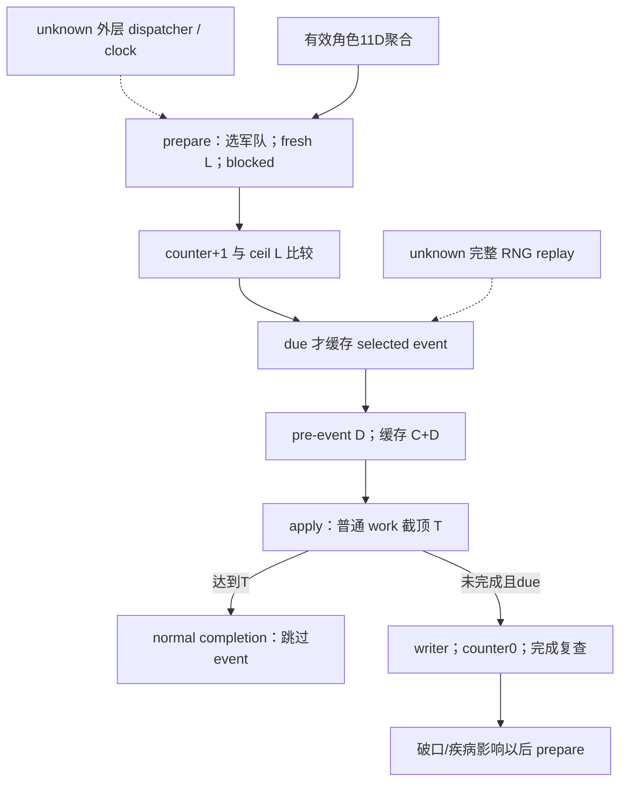

# 当前围城单 tick 与阶段调度（1.20.0.3）

本专题对应 CK3 1.20.0.3 / Steam 25652598，EXE SHA-256
`94b55397abb687a3dcd436805a5d885e6be90fa6c693feb44a9e3bbeeade02a6`。
先复用并封存[普通进度树](episode03-siege-progress-1.20.0.3.md)、
[事件树](episode03-siege-events-1.20.0.3.md)和
[将领有效输入](siege-efficiency-inputs-12003.md)，再实现独立纯模型及同 occupation 查询观测口。
2026-10-04 本包完成离线 **static-ready**；没有 paused 游戏 qualification 或新的 production-live 信用。
Root 缓存 P472 fort4/garrison500/clean/noSiege 与 commander34867 的 −10000 是输入基线，
不能据此创造 active Siege、开始时间、breach、counter 或本场完成日期。

## 阶段与普通进度的关系

canonical 字段是 `siege_phase_time_modifier_raw`。有效角色 getter `0x28C3AE0` 的
aggregate+0x68，经 sparse getter `0x2303700` 取 enum0x11D。−10000/Q100000 是
已聚合的 signed 阶段贡献；不能另加 engineer−0.1 或猜测 XP，不能直接把它乘到普通日速 D。
角色还可能独立拥有日速 enum11E/11F/120，不能由11D推断。

`factor=max(0,100000+breach+actor11D+siege_cached11D+province_side11D)`；
`L=trunc(2000000*factor/100000)`，阈值为非负 L 向上取整。
仅在其他项**显式为0**时，actor−10000 才形成18的阶段算例，不能称为 P472 实机阶段长度。
普通 D 采用原生 getter，或显式完整项的
`max(50000,mul(mul(100000+A+M+E+Xadd,Xmult),F))`；每次 mul 单独 toward-zero 截断。
未知项保持缺失，不从 ETA 反算 D，也不把未知 eligible siege tier 当0。

精确 prepare 指令顺序是：重新选符合条件的围攻军队 → fresh phase getter → blocked predicate
→ counter+1 与当前阈值比较并缓存事件 → 最后缓存 pre-event D 与 C+D。
将领变化在下次 prepare 重求长度时生效，已有 counter 保留。
apply 提交选中军队和 cached modifiers，再在 allowed 分支递增 counter、写普通进度并以当前 T 截顶。
普通进度已达 T 时跳过事件；未完成且 due 才写事件、counter清0，并复查完成。
破口影响以后 phase，疾病影响以后 D，不倒灌本 tick 已准备的 D。
断粮按新等级增加事件当时 T 的5%/15%；逃亡加5工作；僵持无额外工作。
战争贡献和 occupation manager 副作用未纳入此有限工作量模型。

## 同 existing occupation 查询新增的五项观测

沿用 `ck3_query_war_occupation_targets_v1`，只在 rich `ReadObjectiveProvince` 已解析合法
active Siege 后、assault 子域早返前读取。五项 presence 独立；noSiege 仍为 null。
callback/当前内部军队无法读取时保留相关 null，真实 raw0、counter0、boolfalse 保留。

| active_siege 字段 | 来源与含义 |
|---|---|
| ordinary_daily_progress | RVA251F170 fresh getter，{raw,scale:100000} |
| current_phase_length | RVA251E7A0 fresh getter，{raw,scale:100000} |
| prepared_phase_length | Siege+0x20，上次 prepare 缓存；不是 fresh fallback |
| phase_counter | Siege+0x43C，真实非负 int32 |
| can_advance | !RVA251CF70 blocked predicate，nullable bool |

普通 getter ABI：`int64_t*(Siege*,int64_t*out,int32_t commanderFullID,int32_t internalArmyFullID,void*tooltip)`；
阶段 getter ABI：`int64_t*(Siege*,int64_t*out,int32_t commanderFullID,void*tooltip)`。
两者返回 caller out，tooltip=nullptr。复用 Siege+0x208、`ResolveInternalArmy`
（slot RVA5D1DE48）和 Army+0x120 commander，不能传 public CUnit ID 或 played_character_id。
原生无 commander 的 −1 照传。prepared+20 在任命变化后可 stale；current 必须调用 getter。
当前 D/ETA 使用 stored+208；下一 prepare 从 Province247DC20 重选后使用+38，
因此本模型不保证下一天军队身份不变。

最小数据链已实施：province.hpp/cpp → game_contract.hpp 的 WarObjectiveProvinceState
增量字段 → WarOccupationActiveSiegeV1 → production rich copy → serializer
→ `war_contract._normalize_active_siege`。既有 `war_occupation_targets_contract` 已共用该
normalizer，只 pin 不强改。game_contract 只增加本 DTO section，未覆盖并行 BattleCadence DTO。
没有新工具、flag、动作或策略 gate。

## 独立 adapter / runner 与验证

新增 `xar_autoplayer.simulation.siege_current_tick`，同文件 CLI 仅读写本地 JSON：
`python siege_current_tick.py INPUT.json --output OUTPUT.json`。
输入 holding_row 为 existing production normalizer 的 row，可附 frame revision/date。
默认消费同 active_siege 的五项 native 观测；可明确选择独立 caller-supplied tick_operands，
该分支不补真实查询 null。将领阶段观察单独保留，仅解释聚合项。
getter 已内部绑定身份，内部 Army/commander 未另发布不构成额外数值运算 gate。
prepared length 只诊断，ETA 只保留当前动态估计，不承诺完成日期。

`siege_observable=true + active_siege=null` 直接 `not_applicable/no_current_siege`。
blocked 不推进 work/counter。普通进展先完成时跳 event；due 但不知道真实 selected enum，
只返回确定的事件前 work 与 pending。显式 fixture enum 仅计算条件效果，未重放 RNG、
outer scheduler、历史、动态 post-event total、占领或战争终结。

唯一纯模型 fixture：13 methods +22 subtests，JUnit35，全 GREEN，0fail/error/skip。
新桥两例走真实 collector → `ReadObjectiveProvince` → production rich copy → serializer，
18 native assertions，并经现有 shared Python normalizer 两例 GREEN。
合法 holding occurrence 的重复项按原生规则保留；该事实修正了新夹具错误的单次回调断言。
只为这一真实失败重编新 driver，复用五个已编译生产对象；消费脚本的 wrapper/row 格式修正
只复用同两包，未重跑 native。初次投影路径 HARNESS-RED、错误 fixture 断言和 consumer 格式 RED
均保留。生产七路径始终无需修正。

冻结材料根：`Z:/ck3_mod_rewrite_process_assets/g2-resume-20261003/siege-efficiency-inputs/current-tick-offline/`。
`native-tree/NATIVE-ENTRY-SUPPLEMENT.json` SHA `5ae74027e910f6760e18689b2a2f8ee47e26d4437ed75e39b3f60c1519d0fbc0`；
完整源码、单步合同、测试与失败索引在 `combined/ROOT-DELIVERY.json`。
本包 0SDK/pipe/window/query/action/day/live；Root 负责共享合入、合批构建与Git。
下一步是 Root 在真正 active Siege 的 paused frame 验收五项 fresh 值，继续有限 OODA；
完整 RNG/外层时钟保持研究缺口，不作为当前静态单步功能的额外门禁。
