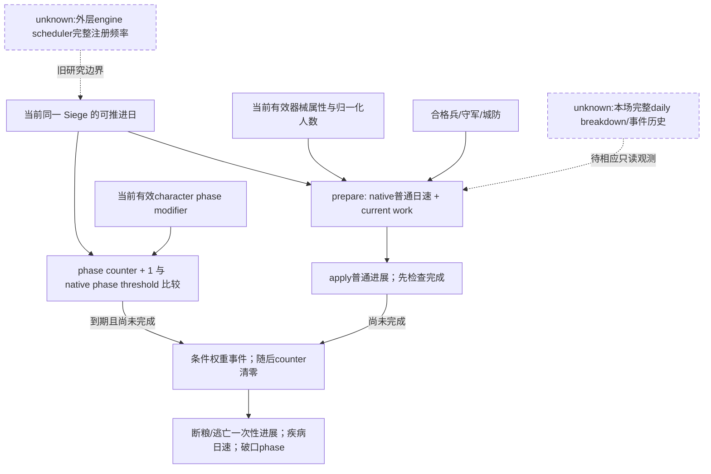
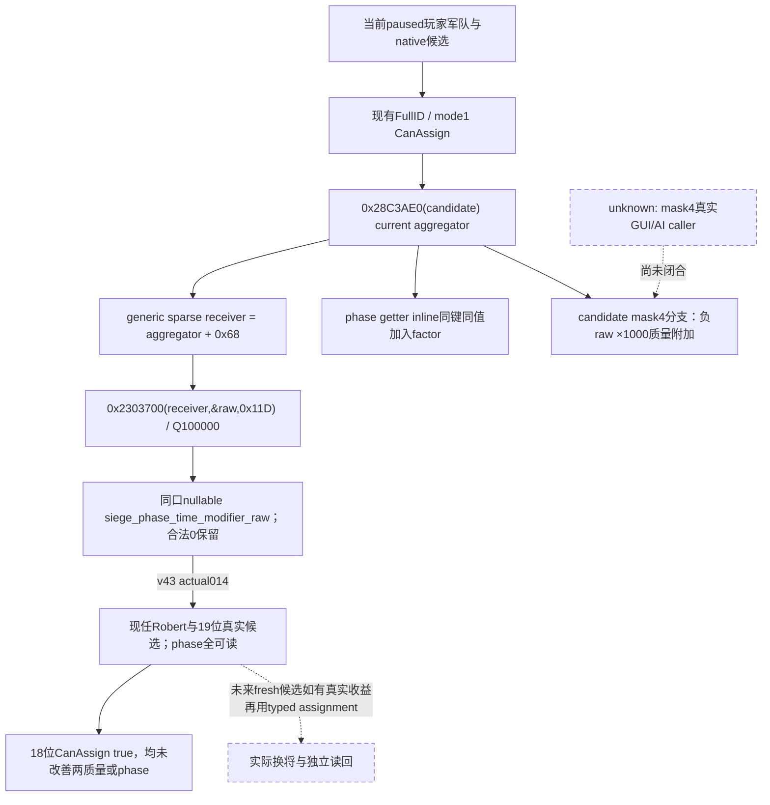
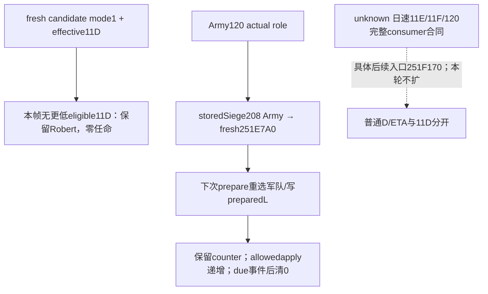
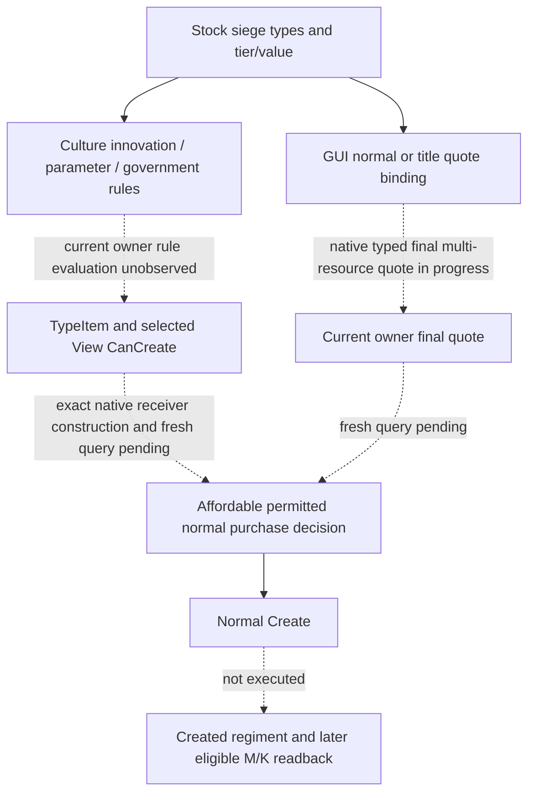
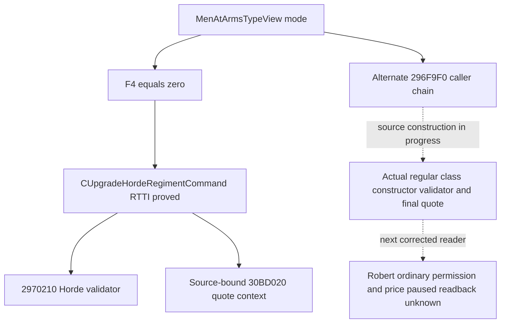

# CK3 1.20.0.3：本次围攻效率输入与候选阶段修正

2026-10-03，当前新增候选 phase 输入为 **production-live primitive**：v43 / frozen `Z:/g45` / source `8e2cfbee4981af7f80398ec09129c1cf0f3dbe54` 已从 Robert29829 暂停真实候选返回19个有效 signed phase 值，唯一文件消费生产 normalizer GREEN。下方保留历史原生研究、v39围城帧及 focused 验证；最新实际字段与本帧将领取舍见末节。未执行由本字段驱动的换将或加速，不把它归为收复或战争胜利。

精确构建为 **1.20.0.3 / Steam25652598**，实际安装目录 `Z:/SteamLibrary/steamapps/common/Crusader Kings III`，EXE SHA-256 `94b55397abb687a3dcd436805a5d885e6be90fa6c693feb44a9e3bbeeade02a6`。源码读取基线 `Z:/g38@5cbc0ee17f3d6cd2065c1a482607ef6975eef447`，本次运行来源 `02e88d57fcef399368f34b23f497d3e8565af95d`。完整字节、输入路径和哈希在本包 `EXACT-INPUTS.json` 与 `CANDIDATE-PHASE-NATIVE-PINS.json`；所有地址为 RVA。

## 历史 v39 raw53238336 围城当帧

读取旧完成叶 `military-ooda-continuation/siege-v39/actual-stationary-siege-batch-2604-02/day-37/006-ck3_query_war_occupation_targets_v1.json`。其目标行是 province2604 / holding2400 / Siege503316492 / public CUnit83886367；legal holder33435、敌方 occupier30097，玩家主围攻为 true。该历史当帧累计进展9781290、所需总进展32500000、剩余22718710，均为 Q100000；进展分数30096即30.096%，原生剩余预测109天。城防3、当前守军400、合格围攻兵2290；破口0、强攻未开始、原生 CanStart/CanStop 都 false。没有收复完成事实。

该行给出的城防3低于原版第一阈值4，按已闭合正常非负 tier 路径，该v39当帧城防缺级日速因子为1。不能把“新增高阶器械”解释成正在消除本场城防惩罚。多余合格兵的已知日速项为 `0.01 * floor((2290-400)/200) = 0.09`；这只是一个输入项，不能因此将普通日速补成1.09。该v39当帧器械有效属性、规模、疾病等级和完整日速修正没有被本包观测，109天也不能反解唯一日速或当成固定完成期限。

## 已有原生日进展与阶段树

复用已发布 [日进展/总量](episode03-siege-progress-1.20.0.3.md) 和 [阶段事件](episode03-siege-events-1.20.0.3.md) 的 exact .3 已闭合结论，不重复它们的 GREEN 检查：

- `prepare 0x251E200` 在未受阻时，将普通日速 getter `0x251F170` 加入 next-work；phase 未到期也做此加法。`apply 0x2521060` 的配套管理链先应用普通进展，完成上限优先于本轮阶段事件。
- 普通日速的有限表达为 `max(0.5, ((1+A+M+E+X_add)*X_mult)*F)`，每步按原生 Q100000 运算。器械项 M 由有效 siege_value 乘 `current_count/type.stack` 的归一化当前规模后求和；不能用名义团数或原始人数直接乘 stock 值。引擎合格 tier 是原生输入，不从历史 enemy mangonel 推断本场我军。
- 总量 `0x251DD20` 的正常路径为 `100+75*fort_level*min(1,current_garrison/effective_max_garrison)`；守军与有效容量变化时 getter 重新求值。普通 ETA 是剩余量/当前日速的固定点除法再向上取整。
- phase getter `0x251E7A0` 的正常因子先相加：`max(0,1+breach_adjustment+character_0x11D+siege_cached_0x11D+province_0x11D)`，再乘基础20天，计数阈值向上取整。阶段与每日进展分离。
- 原版 `military_engineer` 的基础 `siege_phase_time=-0.1`，XP33/66/100另有该字段；实际聚合/XP不能从图标补造。疾病当前等级增加日速10%/20%，断粮升级一次性加当时总量5%/15%，逃亡一次性加5进展，小/大破口缩短后续阶段间隔10%/30%。这些不能都叫作“每日速度奖励”。



## 新增候选字段的 primary evidence chain

已有候选 reader 以当前 owner 的原生集合取得真实 CCharacter，核对 full ID/tag、正式玩家 mode-1 CanAssign。当前将领以 `CArmy+0x120` 和 `GetArmyCommander 0x24E9ED0` 互证，所以旧 episode 文档将这个角色保留为 unknown 的历史边界，本次已经由后来生产路径解除；不改写当时冻结证据。

`0x28C3AE0(CCharacter* RCX)` 返回实际有效 modifier aggregator。220-byte 完整函数 SHA `b46b5c54bf3e40c9475dc216e924ca5cce0b04918e365569a3998e17e2a1e7ae`；当前角色组件路径为 Character+0x1B0 → +0x258，组件+8须回指该角色，然后返回组件+0x10。它还有原生空容器 fallback；本包不把空键当读取失败。

两个独立消费者明确取同一 generic `0x11D` 值：

| 消费者 | 精确路径 | 结论 |
|---|---|---|
| candidate flags getter `0x2C17B20` | 0x2C17B45/test验证 flags mask4；0x2C17B5B取 aggregator；0x2C17B60置enum11D；0x2C17BD1取raw；0x2C17BDA取负 | 正常路径附加 `trunc((-raw*1000)/100000)`。367-byte SHA `47f9122e1cf1f82099a405ff91e49d6c960f7cfcb42214e6802459063483cca7` |
| phase getter `0x251E7A0` | R8D保存实际角色FullID；0x251EAB3置enum11D；0x251EAD3取同角色 aggregator；0x251EB30取raw并0x251EB39加入phase因子 | 负raw缩短阶段因子；2504-byte SHA `24580ef54fdccc823dab0a655dba8f83229ee7f6a5c7cf94f26d7845196bdb47` |

以上 inline sparse read 使用 whole aggregator 的 uint16 keys指针+0x68、signed count+0x74、int64 values指针+0xD0。lower_bound未找到精确11D时为合法raw0，找到时返回同index的Q100000 signed值。

可以复用生产已有 helper `int64_t* 0x2303700(void* RCX,int64_t* out RDX,int32_t index R8D)`，**receiver须为 `aggregator+0x68`**。该helper读取 receiver+0 keys、+0xC count、+0x68 values，恰好平移为上面的+0x68/+0x74/+0xD0；whole aggregator本身是另一张 sparse 子表，不能直接以whole aggregator/11D替代。完整163-byte跨unwind有限区间 `0x2303700..0x23037A3` SHA `0e06c82214ba5366a5c55c59ed193111821af27c7a96390a739aaeba0a4ab822`，显式写 caller-owned out并返回同一out指针，missing key写0。新candidate field只复用这个receiver，不启动旧combat调用的全局改动或审计。

```cpp
auto* aggregator = get_character_modifier_aggregator(candidate);
int64_t raw = 0;
bool observed = false;
if (aggregator != nullptr) {
    auto* generic = static_cast<std::byte*>(aggregator) + 0x68;
    observed = read_character_modifier(generic, &raw, 0x11D) == &raw;
}
// aggregator unavailable: nullable unavailable; native missing key: observed raw 0.
```

原版 `siege_phase_time` 字符串 RVA0x470DFD8 和数据引用0x46EC1D8已保全，但这个字符串注册表到modifier枚举的完整命名映射本包没有另行闭合。本次phase语义来自两个实际消费者的同值链，不以字符串邻近或0x29猜测取代它。

原生 generic军队配将的 sort mode2实际 flags=2，不走mask4。**mask4条件分支的实际GUI/AI调用者尚未闭合**，不声称AI每次围攻会自动选择工程师。新counter-policy可使用更小的已观测有效11D，这是原生phase输入指导下的最小确定策略，和完整AI排序的差距另行保留。

更负的phase修正也不保证任命后 `days_left` 立即下降：当前ETA getter按剩余进展与普通日速求值，不预支将来阶段事件的奖励。phase变化带来的价值是更早达到下一事件阈值；实际事件结果和完成时间仍由后续真实运行给出，不能用第一次ETA未降就否定该字段，也不能用它承诺何日城破。



## 本次可执行改善与验收边界

已实施的第一项增量是在既有 `ck3_query_army_commander_candidates_v1` 的候选行补一个 nullable signed `siege_phase_time_modifier_raw`，scale明确为100000；不新增MCP、flags、许可或war禁令。不改变既有quality或CanAssign。其它未读当帧中，不猜Robert为0，也不凭军事工程师标签直接换将。

一次新字段 focused验证覆盖真实production reader→serializer→registered MCP，使用specific与generic子表不同哨值，证明生产receiver的+0x68正确；保留负值、零值、missing key合法0与真实getter不可用null。ROOT随后读当前候选：只有实际更小raw且正式CanAssign=true时，才有确定的缩短phase输入理由；使用已有正式typed任命并独立确认当前将领。普通推进后仍按同SiegeID进展和occupation读回结果，不把字段ACK或较小raw当成实际缩短天数/城破。

器械另一条可执行路线是当前实际regiments/有效siege_value/归一化人数的观测和正式补员、创建或会师资格；这些由对应composition lane施工。当前CanStart=false意味着本次不能使用既有强攻动作，未来有破口后仍应读取完整原生CanStart，而非仅以breach>0判定。本包不为这些尚未采集字段设计额外门禁，也不等待完整事件模拟器。

原生研究阶段新增信用为0。candidate新字段的实际读取现已由v43闭合；当帧没有质量或phase更优的合法替代，因此没有换将。Root的2604收复由独立occupation运行证明，本字段与文件消费者不领取该结果信用；围攻加速与战争胜利仍须各自真实结果artifact。普通围攻已经推进的49实际保存日属于ROOT既有运行，不能再次累计为本研究收益。


## 历史实现阶段：同口最小增量与唯一 focused 验证

本次四个生产文件已完成外置实现，同一 commander candidate 口增加唯一公开字段 `siege_phase_time_modifier_raw`，单位 signed Q100000；缺少 getter/容器/输出指针为 null，原生 missing key 为真实0。字段观测与既有 CanAssign、generic quality 独立；旧冻结 payload 缺字段只补 null。没有新增端点、动作或运行开关。Root 采用、正式组合 DLL 与新 PID 的实际候选读取仍按各自 receipt 记录。

## 2026-10-03：将领围城 phase 修正的新生产路径 focused 验证

为比较当前围城将领的真实阶段时长输入，平行原生研究先冻结 exact CK3 1.20.0.3 / EXE `94B55397ABB687A3DCD436805A5D885E6BE90FA6C693FEB44A9E3BBEEADE02A6` 的 modifier enum0x11D、effective aggregator getter0x28C3AE0 与 generic sparse reader0x2303700，并证明后者 receiver 必须为 aggregator+0x68。实现只向既有 commander candidates 同口增加 `siege_phase_time_modifier_raw` 一项 nullable signed int64、Q100000；不会把 generic advantage 或 native AI base quality 当作该输入，也不推断原生AI总采用flagsmask4。

独立新fixture完成一次严格 6TU /O2 /DNDEBUG /W4 /WX 编译，原生4新cases、16显式Check GREEN。Fixture用 frozen standalone163B sparse函数机器码 SHA `0e06c82214ba5366a5c55c59ed193111821af27c7a96390a739aaeba0a4ab822` 实际执行；生产 reader callback必须传generic+0x68和enum0x11D，保留raw0/-10000/+10000、exactkey缺失为合法0、可选getter或容器读取失败为null，且原有candidate availability/quality仍可用。生产 mailbox serializer 产生4份真正native JSON，不复制或伪填新字段。

这些真实原生报文经 production native_driver → normalize → service → registered `ck3_query_army_commander_candidates_v1`，Python -B -O 下5cases/47显式Require GREEN；第五case只将同一新报文中的字段删除以验证旧v1遗漏归null，明确为derived legacy shape，不能称作第5个genuine native case。旧rich-siege、旧3case commander矩阵及combat矩阵均未重跑。

首次唯一native attempt原生GREEN后，Python因外置projection漏复制现有tools/build_release.py而未启动，保留其harness RED。补入不改动的 frozen支持文件后，只再次消费已生成的4份native JSON，未再次编译或执行native。生产候选代码没有因此修改。这一验证包当前readiness为 **static-ready**；Root新冻结DLL与当前Robert候选的实际phase modifier值仍待，不能写为已替换将领、phase已缩短或围城加速。

Reusable canonical paths为 `ck3_autonomous_player/native_bridge/src/ck3_12003_commander_siege_phase_test.cpp`、`ck3_autonomous_player/native_bridge/research/fixtures/run_commander_siege_phase_mcp_fixture.py`；两路径外置patch与完整结果在 `Z:/ck3_mod_rewrite_process_assets/g2-resume-20261003/siege-efficiency-inputs/production-validation/new-fixture/ROOT-DELIVERY.json`。Root负责与4生产路径及native专题一起正常采用、commit/push，再做fresh actual候选读取。纯文件lane 0SDK / 0游戏 / 0窗口 / 0Git写 / 0新日 / 0实际围城或战斗收益信用。现口actual008的40regiments/Robert34/roll0..10是另外的production-live primitive包，本新phase源码与之分开归属。

在上述外置实现阶段，新字段为 **static-ready / focused production-path fixture GREEN**；当时尚无新字段的 Robert paused actual，不记 production-live、换将、加速日数、收复、胜利或 G2 信用。现 normal siege 与 v40 composition actual 是独立已有能力，继续推进不等待该静态候选输入。

外置索引：`Z:/ck3_mod_rewrite_process_assets/g2-resume-20261003/siege-efficiency-inputs/combined/ROOT-DELIVERY.json`；原生 pins、四文件 projection、唯一 focused attempt 和当前 actual composition 各自保留在其 lane 的 receipt，不重播任何 SDK 或时间推进。


### 2026-10-03：v43 真实候选将领 effective siege-phase 修正

Root 在 frozen `Z:/g45` / source `8e2cfbee4981af7f80398ec09129c1cf0f3dbe54` 的 Robert29829 原普通战役，以既有 registered `ck3_query_army_commander_candidates_v1` 实际读取 public CUnit83886367 / native CArmy50331794，date_raw53240136、native revision3、public revision2。当前 commander 是 Robert29829；其当前 candidate native_ai_base_quality=34、generic_advantage_points=34，新增 effective `siege_phase_time_modifier_raw`=-10000 / Q100000。当前自身 CanAssign=false 是原生 final observation，不否认他已经任命的事实。

实际候选集合 19 行、phase原生非null 19 行、原生 CanAssign=true 18 行；同帧合法候选中 generic advantage更高 0 行、native base quality更高 0 行、phase raw更低 0 行。具体 current/可任命候选逐行raw及top比较保存在 proof/CSV，不把 native_ai_base_quality 或 generic_advantage_points 改称独立martial属性。负raw只降低当前 character阶段因子组成；整场围城时长还依赖breach、省份及siege cached modifier，不能按raw直接承诺缩短百分比。

这个新phase字段现为独立 **production-live primitive**，公开v1 schema/端点不变，非null来自实际新原生叶，未复用fixture值。唯一文件消费者调用当前对应 frozen production `normalize_army_commander_candidates_v1`，核对实际frame/owner/currentcommander/CanAssign/int64有符号phase；33显式Require GREEN，无removable assert，未重发query/SDK或重跑旧测试。只消费014一次。

证据：`Z:/ck3_mod_rewrite_process_assets/g2-resume-20261003/runtime-preparation/v43/actual-sway-new-fields-and-counter-scope-v43-01/014-ck3_query_army_commander_candidates_v1.json`；pure-file consumer `Z:/ck3_mod_rewrite_process_assets/g2-resume-20261003/siege-efficiency-inputs/production-validation/actual-phase-v43-01/ROOT-DELIVERY.json`、同目录 `ACTUAL-PHASE-PROOF.json` 与 `ACTUAL-CANDIDATE-PHASE-VALUES.csv`。Root独立正常SAVE为h5377/date53240136，消费者增加0日。Province2604收复另归Root实际occupation包；本叶不增加新的任命、阶段加速、围城/玩家战斗/战争胜利或G2信用。canonical专题和日周/commit-push由Root负责，外置消费者不修改共享源/Git/窗口。

### 本帧战斗质量与阶段修正取舍

18位正式可任命替代中，15位与Robert相同为phase raw=-10000，3位为真实0。最佳合法替代34867的native AI base quality与generic advantage均为28；32716为23/23、33435为22/22，三者phase均与Robert相同。Robert为34/34，没有这些已观测维度上的Pareto改善。当前保留已任命Robert，继续由Root评估2640/2635解围；不为已结束的2604围城指标牺牲6点generic advantage而换同phase的34867。两质量都不是独立读取的martial skill或目标专属战斗advantage，不能据此计算胜率。

这是本帧选择，不创建永久换将限制；未来fresh候选或目标上下文出现真实收益时仍可用既有正式任命并独立读回。取舍材料：`Z:/ck3_mod_rewrite_process_assets/g2-resume-20261003/siege-efficiency-inputs/observable-composition/actual-phase-tradeoff-v43-01/TRADEOFF.md`。

文件消费者的首次 preflight 曾误认为此endpoint会发布episode字段，在生产normalizer调用之前报harness RED；该字段实际未发布，现保留null并移除这个不适用假设。之后matching frozen生产normalizer实际调用恰好1次、33显式Require GREEN，未重发SDK或旧测试。原harness RED保留在consumer receipt。Root同批defaultRaise012的actual executor unavailable/busy RED另包保留，不改写为此只读014能力RED。

## 2026-10-05：P470 当前将领取舍与阶段刷新

本节复用上述有效11D、[当前tick prepare/apply树](siege-current-tick-offline-12003.md)和[正式mode1任命树](commander-in-battle-assignment-timing-12003.md)，只读g70/source `d3b6742e7cdad2dad1f396c7f78ac279d9bde728`；exact .3 SHA不变。围城状态本身没有独立赋将禁止分支；目标retreat raw>0会拒绝，特定候选仍以fresh正式CanAssign为准，当前同军将领重复请求是already_assigned零动作。

Root摘要中的 **301是public CUnit301989997简称，不是兵数**。P470/Siege503316504/fort6：合格围攻强度3210>守军550、canAdvance=true，当前普通D85284/Q100000，freshL18/preparedL18/counter6，当前阶段事件状态均0，ETA639；本帧不能称兵不足。军师或工程师图标、历史v43值均不能替代当前effective raw，更低11D只降低阶段因子，不能直接折减D或ETA。

协调者一次消费Root新候选后的摘要：28行complete、25位eligible、11D无null；当前Robert29829为33/33、raw−10000，16位eligible同−10000、9位为0。同phase最优合法替代32716质量23；34867质量28/raw−10000但CanAssign=false。因此**当前保留Robert，不发任命**；该结论只证明本帧没有可任命的更低11D，不代表候选普通日速已全部比较。

赋将的Army+120角色写入和fresh候选11D读取已有合同。若该军仍为Siege stored+208的内部Army，下一paused occupation的current_phase_length会以当前Army+120 FullCharacterID调用251E7A0重求；prepared_phase_length则仍是Siege+20上次prepare缓存。下次251E200先重选军队并重求L，再以**保留counter+1**比较阈值；allowed apply递增counter/提交普通work，未完成且due才写事件并清counter。getter不驱动prepare，换将不承诺counter清零、立即改preparedL或ETA。

实际安装stock logistician声明supply_duration=0.4及文化/rite条件attrition修正，没有直接siege_phase_time或普通siege dailyprogress加成；XP也不能由标签补造有效值。现有ck3_query_army_strengths已读当前supply、capacity、最终attrition和当前省份monthly supply change，足够独立消费当前补给状态；health006仍仅由其owner消费。候选假设supply_duration尚未公开，不能凭名称计算换人后的容量或损耗。

普通日速树只部分闭合：X_mult含疾病、character与Siege缓存11E及条件120，X_add含同条件路径11F；完整名称和条件对象仍未全闭，不能猜角色/省份各项或置零。当前candidate口仅11D，确实未发布日速贡献。若后续真实决策需要比较，具体入口是251F170的这些consumer分支及既有28C3AE0/aggregator+68/2303700候选聚合叶；先闭合同再决定同口可选字段。本轮不新增observer、candidateD推算、catalog或外层scheduler研究。



本节当前帧只引用Root/协调者摘要，不再读取原始actual004或health006，不新增SDK/RPM/窗口/测试/游戏日，不领取换将、围城加速或占领收益。外置最小账本、sourcepins与Oct5/W41字段：`Z:/ck3_mod_rewrite_process_assets/g2-resume-20261005/siege-commander-value/native-tree/ROOT-DELIVERY.json`；实际候选receipt由协调者另包合并。

## 2026-10-05：R38 城防6围城的当前效率与合格兵种输入

Root零日occupation004实读date53259768、War117440524、P470/holding1334/county1333、玩家CUnit301989997、Siege503316504；fort6/garrison550/eligible besiegers3210，work511704/55000000（Q100000）、0.930%、ETA639，CanStartAssault=false，尚未占领或完成。
同一实际围城ordinary_daily_progress=85284/Q100000、fresh/prepared phase均1800000/Q100000、counter6、can_advance=true，breach/starvation/disease/desertion/stalemate状态均真实0，prepared enum5只是上次prepare sentinel；既有occupation口已读到这些输入，generic daily snapshot中null不能当getter未实现。
已完成day03..08五个相邻24h工作差均85284，与实读普通D相符；普通日进展有效，639是当前D条件估计，不是固定城破日。保持输入时还需12个允许tick达到18天phase门槛，不保证事件种类、强攻或终结。
本场尚未发布M/K：M为本省原生合格regiment有效siege_value×归一化当前规模之和；K为合格最高siege tier，不以历史器械、全军人数或未采字段补0。fort6触及原版threshold4/6，条件K0/K1/K>=2的F分别.49/.7/1，最终D仍含其他修正与minimum；当前E=.13只是相加项。
两个此前实际可达getter ABI已闭：0x247ECE0为`int64_t*(void* Province,int64_t* out)`，既有daily0x251F170 caller用真实Province/out；0x247EFC0为`int32_t(void* Province)`，既有event weight0x251E6E0 caller使用其EAX，fort helper同读K。M727B SHA`0dc8648056516b8c413a85b42f1d607ad9db4e1f36c6f3214e419f6b9c3ff7e4`、K528B SHA`a4f0a172a74efaefacddcafeff0aae0328f162461490927f5f99af714e2d1136`绑定exact .3 EXE`94b55397…2a6`。
先封原生树/Mermaid，再外置3path只读reader：alive Siege后独立读取真实Province M/K，既有occupation同口发布nullable`eligible_regiment_siege_work {raw,scale:100000}`与`highest_eligible_siege_tier`；真实0保留，缺getter/失败仍null，不依赖assault或将领字段可用。唯一affected生产路径fixture已GREEN（native16 checks/1serializer包、registeredMCP20 require/2calls，第二为derived legacy shape）；首次Python缓存绑定harness RED保留，回执`Z:/ck3_mod_rewrite_process_assets/g2-resume-20261005/active-siege-eligible-input-v66/fixture/ROOT-DELIVERY.json` SHA`b7d65a0e64191be3d6720637c7c26cf3aabf79d034aa7cec3bd3daef3bc6c4fb`。Root已采用native`38467fc69f28a15627ef725c8d3ad45bba957544`与wire`2ef91947c161c0b22795a57f36c9485affc437b0`，新observer为static-ready，v66加载与fresh actual M/K仍待独立receipt，未授加速、城破或新日信用。
策略入口优先比较当前M/K实际器械或会师收益，其次复用合法commander candidate effective phase输入；phase modifier不直接提高普通D，trait/XP不重复计入。未发现可执行改善时继续当前目标的普通围城及实证补给维护，不等待完整RNG，也不因长ETA自动放弃目标。
冻结树、ABI/源码pins、唯一actual004消费及日周字段见`Z:/ck3_mod_rewrite_process_assets/g2-resume-20261005/siege-efficiency-current-fort6-v65/ROOT-DELIVERY.json`（SHA`126791c2c0528fde6ef6a8b243d7856f7c2062f74eab996ca807c10dec58d5bd`）；原生树SHA`44a1219bd852bb2d20086711b93b3ed3e0641f1571aa6686c2cacea79f6e1b58`。本lane0 SDK/RPM/窗口/tests/shared/Git/新日；实际累计4810日由Root原推进计入一次。

## 2026-10-05：R39 合格围城贡献与等级已实读

Root正常冷恢复G71/source cd0、R39/PID126252后，occupation007在冻结date53259768、native:3/native3/public2/generation2/query sequence1实读War117440524、P470/holding1334/county1333、Siege503316504、玩家CUnit301989997；fort6/garrison550/eligible besiegers3210，M=`61050/Q100000=0.6105`、K=`0`均可用，新观测升级为**production-live primitive（只读）**。
同帧普通D=`85284/Q100000=0.85284`、fresh phase=`1800000/Q100000=18天`、counter6、can_advance=true，五类event state均真实0、prepared enum5；cold prepared phase cache为可用的真实0，必须与fresh18天分开，不沿用旧帧18、不将0当读取失败或立即due。C511704/T55000000、ETA639、nativeCanStartAssault=false，尚未占领或完成。
K0证明本省当前资格集合没有正siege tier；不能扩推全军类型、库存或其它军队无器械，M>0也不是纯器械数量。fort6两档折减说明当前tier不足值得优先改善；下一current roster/type/tier及正式可用器械来源依赖由CommanderObserver contactless raised composition、BattleObservation stock/CanCreate与mercenary composition各owner继续施工，不能凭人数或历史配置宣称补兵/造器械已改善。
本次部署与sole007消费新增0日，累计4810日保持Root唯一计入；不授加速、阶段事件、城破或战争胜利信用，继续当前目标普通围城。冻结实读、策略与日周字段见`Z:/ck3_mod_rewrite_process_assets/g2-resume-20261005/siege-efficiency-current-fort6-v65/production-live-v66-r39/ROOT-DELIVERY.json` SHA`69debae7a18f5956957b23906084ad79f1ae92056dad2d953f569f35f704c334`；原007 SHA`f72459a6abae20f3b36261bc2ebdc5f5d2a30274c3e01f851241f5c5e55f7bc5`，本知识增量不重读该叶。

## 2026-10-05 R39：raised-regiment composition 的 source-first 输入闭合

以上 Root R39 actual M/K已证明当前资格集合 K0；这不能推出完整 owned/unraised MAA 都缺器械。本段在同一 native 输入账本先冻结 composition 树，再推进后续买器械策略。
已封树／两源缓存：`ART05/commander-observer/maa-contactless-sourcefirst/NATIVE-INPUT-TREE.md`、`INPUT-CACHE-MANIFEST.json`。g71 cd0acf19 既有 strengths 原生 reader 已读完整 CArmy roster FullID/current/max，无需 contact、敌人或 CombatID。
对象链：CUnit+178→CArmy；CArmy+38/+40/+44→ArRg FullIDs；ArRg+18→GDbo type，type+18 为 canonical MSVC database key，type+2A0 为 K 原生 signed tier。数值 typeID／localized name 未闭，不伪造；ArRg 与 persistent Regi 不同，Regi+18 是 chunks。
同一已注册 `ck3_query_army_strengths` additive 每团分类先发布 key/status/tier；真实 tier0 保留0，读取失败为 null／unavailable，absent 区分无 MAA 类型；分类失败保留原人数聚合。仅 exact .3 adapter 启用已封 tier layout，.2 原 binder 保持未绑定。
有效 siege getter26344C0(ArRg,out,真实省份)与 normalized-size2634720 已由 M span 闭合；本最小施工暂不扩 getter。低 tier不等于该团零贡献或招募非法，不能用 current/max 猜 M 的归一化分母。
Raised→首条 record→persistent Regi 仅证明当前部队局部关系；完整 owned/unraised collection、recruitable catalog、CanCreate／final quote 仍需 native collector／create 输入闭合后才设计买器械策略。
施工投影与唯一新生产 reader→serializer→registeredMCP case：`ART05/army-regiment-composition-v71/`。fixture/实机 readiness 以最终 receipt 和 Root 独立实际 query 为准，本段不新增 live 或完整战争能力信用。

## 2026-10-05：R39 普通24日后的疾病状态与日速

Root ordinary24 SDK20302 CLOSED GREEN计入24日，累计4834/接续1681/10月5日176；后续SDK38425 closed GREEN的sole occupation004冻结date53260344/native:103/native103/public2/generation4/queryseq2，同P470/holding1334/county1333/Siege503316504/main301989997仍active，fort6/g550/B3178，work2659976/55000000、4.836%、ETA559、can_advance=true、nativeCanStartAssault=false，无占领/城破。
当前M60900/Q100000=.609、K0、普通D93732/Q100000=.93732；disease_level已1，其余breach/starvation/desertion/stalemate状态0、prepared enum5。fresh与prepared phase现均1800000=18天、counter12，和上一冷恢复帧prepared真实0分开记录；输入不变时还需6个允许tick达到phase门槛，不保证下一事件或完成日。
复用原生树：writer0x251CD00 enum2提升疾病等级，daily0x251F170使用其当前10% multiplier项，改变后续日速而非一次性work或强攻资格。已知(1+.609+.13)*1.1*.49固定点截断=93732吻合实读；work/D已实际增加，ETA639→559仅条件估计变化，不能追加80日信用或承诺终结。继续现occupation查询的native CanStart0x29738C0判定入口，当前false故普通推进；current roster/type/tier、stock/CanCreate、mercenary依赖保持并行。
新004 SHA`12d488fbd941d3ba6bbc337549659bf09cec69be8758e42db9c743efc6b8bc6e`；compact、策略与日周字段见`Z:/ck3_mod_rewrite_process_assets/g2-resume-20261005/siege-efficiency-current-fort6-v65/r39-after24/ROOT-DELIVERY.json`。本consumer新增0日，不读旧原叶/snapshot005/health006/source/tests/SDK/window；batch末normalh8344与后续新normal由Root独立保存确认，不授器械改善、强攻、城破或新family信用。


## 2026-10-05?????????????????source-first?

???? 1.20.0.3/Steam25652598/EXE SHA94B55397?2A6 ? installed stock ???????? `type=siege_weapon` ????? stack=10?fights_in_main_phase=no?allowed_in_hired_troops=no??????? max_siege_level ?????????? gold ?????????????? native ??? wire???? Robert ????????

| type id | tier / siege value | stock buy gold | stock low / high maintenance gold | source unlock |
| --- | --- | ---: | --- | --- |
| onager | 1 / 0.2 | 60 | 0.1 / 0.3 | innovation_catapult |
| mangonel | 2 / 0.3 | 66.0 | 0.11 / 0.33 | innovation_mangonel |
| trebuchet | 3 / 0.4 | 78.0 | 0.13 / 0.39 | innovation_trebuchet |
| bombard | 4 / 0.6 | 96.0 | 0.16 / 0.48 | unlock_late_medieval_gunpowder_units |
| torch_bearers | 1 / 0.1 | 30.0 | 0.05 / 0.15 | government_is_nomadic |
| ballista | 1 / 0.2 | 60 | 0.1 / 0.3 | innovation_catapult |
| cloud_ladder | 2 / 0.3 | 66.0 | 0.11 / 0.33 | innovation_mangonel |
| siege_tower | 3 / 0.4 | 78.0 | 0.13 / 0.39 | innovation_trebuchet |
| cannon | 4 / 0.6 | 121.6 | 0.560 / 1.680 | unlock_late_medieval_gunpowder_units |

??????? innovation_catapult?tribal??innovation_mangonel?early medieval??innovation_trebuchet?high medieval??bombard/cannon ???????? unlock_late_medieval_gunpowder_units???? producer ? late-medieval innovation_gunpowder????????? culture_uses_eastern_siege_weapons_trigger=no/yes ?????? NOT government_is_in_steppe?torch_bearers ??? government_is_nomadic??? nomad_holding +.3 / tribal_holding +.1 siege_value?cannon ?? gunpowder ???????? tier/value ? bombard ?????27 ??? buy/low/high costblock ??? gold ????prestige/piety ????? block ????? owner ? native ???????????

??????? GUI binding ???? game/gui/window_menatarms_type_view.gui?MenAtArmsTypeView.GetMenAtArmsTypes?TypeItem.GetMenAtArmsType?row permission ? TypeItem.CanCreate/GetCreateWarning?row quote ? Title valid ???? MenAtArmsType.GetTitleRegimentCostString(GetPlayer)??? GetCostString(GetPlayer)????????? MenAtArmsTypeView.GetCostString(GetPlayer)?CanCreate?Create?formatted quote ???????? typed multi-resource quote ABI?Create ?????????



Z:/g71 / cd0acf19a68cdbc42ce20deed226e53e9e7b8c84 ???? MAA finalquote/CanCreate MCP????????????? GUI ???/receiver ????? exact .3 ?? binding?finalquote ? permission/Create ? lane ?? new span??? locator ???owner/unraised collection ? CommanderObserver?mercenary-company ?????????? owner/current type/size ? final quote ? permission ???????????????????? stock buy cost ???????

?? source/pins/????Mermaid ??? native????? `Z:/ck3_mod_rewrite_process_assets/g2-resume-20261005/siege-engine-catalog-current/` ? SOURCE-INPUT-LEDGER.json?TREE.md?stock-catalog/ROOT-DELIVERY.json?query-construction/????? research/source catalog ready???????????????????????????? SDK/??/??/?????0?Root???????????

## 2026-10-05 correction: Horde command identity is not ordinary MAA permission

The recruitment-domain interpretation in source-catalog commit `5c94c668` is superseded by new exact .3 RTTI evidence. Primary vtable `476A8F8` and secondary `476A8C8` resolve through TypeDescriptor `5A104E0` to `.?AVCUpgradeHordeRegimentCommand@@`. Therefore `1339020 -> 2970210`, its local kind1 input, selector `2B9D6A0` and that command's executor are the Horde-upgrade domain; the View `F4==0` branch cannot be called ordinary MAA creation from its mode value alone.

The stock nine-type catalog, script culture/innovation gates, Type registry/key observations and ten-resource raw-cost ABI remain independently proved. `30BD020` remains its source-bound producer with the observed reuse condition; its quote cannot be relabelled a normal recruitment price without closing the real caller domain. Neither this validator's false result nor its fixture true result proves Robert's regular MAA permission.

The proposed 13-path reader/wire package has two genuinely GREEN static projection cases but represents the wrong command domain for ordinary purchase. Root's only integration attempt failed at the adapter-header BOM patch context and made zero mutations; no observer build, SDK query or Create action was executed. Preserve those static cases and the apply-check RED rather than granting ordinary CanCreate or purchase readiness. The port must be corrected from the regular command source contract before adoption.



A/C source lanes now own the alternate constructor/class and executor/price closure. The concrete next source entry is the alternate `296F9F0` chain, followed by its real command and quote producer; no policy is designed from the wrong-domain values. Source metadata and correction receipts are retained at `Z:/ck3_mod_rewrite_process_assets/g2-resume-20261005/siege-engine-catalog-current/normal-create-action-source/` and `domain-correction/`.

## 2026-10-05：R40 冷帧的守军逃亡与当前阶段输入

Root MAIN21717 CLOSED0 GREEN后的sole新occupation006数据available，R40/PID110616/raw53260776、native:3/native3/public2/generation2/queryseq1，P470/holding1334/county1333/Siege503316504/main301989997仍active；fort6/G550/B3178，C4847152/T55000000=8.813%、ETA536，M60900/Q100000=.609、K0、D93732/Q100000=.93732，can_advance=true、CanStartAssault=false，未占领或完成。完整368rows派生cache保留原生occurrences，其它lane无需重读原叶。
fresh phase为1800000=18天、counter12，cold prepared cache为可用真实0；event state breach0/starvation0/disease1/desertion_count1/stalemate0、prepared enum5。缓存0不代表立即due，K0只指本省当前合格tier，不代表库存或完整军团类型absence。原生desertion enum3写入一次5work并cap至当时T；与已交after24端相比，18日两端work差2187176恰好等于18×93732+500000，吻合当前count1，但不声明读取中间tick或具体事件日期，也不新增日信用。
继续当前目标普通围城，等待已并行current roster/type/tier、stock/CanCreate与mercenary正式可用器械来源；动作后M/K/D独立读回才授改善收益。Root既有累计4852/接续1699/10月5日194保持，部署/消费新增0日，无强攻、城破或战争胜利信用。完整cache、compact和Oct5/W41字段见`Z:/ck3_mod_rewrite_process_assets/g2-resume-20261005/siege-efficiency-current-fort6-v65/r40-fresh-occupation/ROOT-DELIVERY.json`；原006 SHA`610e044a57789144ccb5c91d92497e9a7402f4e0aae3064c1e968ccc219ec5fe`。

## 2026-10-05 R40：24日、守军路线22日与恢复后5日的实际接续

- 本节合并四个独立已完成包24＋22＋1＋4＝51 whole/calendar/bounded日、1224 raw小时（53260776→53262000）；formal4852→4903、resumed1699→1750、Oct5/W41 +194→+245。R39的42日只作历史，重复信用为0。
- Runtime只按已供给信息标R40/v67、Robert29829、episode `native-29829-2bc2d599f7f9`、XAR off/environment `5cc5c5acb289acec478c3be7a2d1140615d10f3968ace598773876dff6bada88`；未提供的source_root/exact source pair不猜补。
- 第一24日全部GREEN/576h，末native100/public97/raw53261352，whole SAVE h8483/98360179 bytes/SHA `8c38025b22a8e75766eba48f752b9b020ea63473d493d05fa715df0b6c78b95c`；该包累计4876/res1723/Oct5+218。
- 第一24日P470实际work4847152→9832460/55000000、progress8.813%→17.877%、besieging_strength3178→3147、ETA536→445；ETA为当帧估计，强度是eligible siege输入，不充作whole-army health。
- guard-route-next24实际只完成22日/528h，raw53261352→53261880，累计4898/res1745/Oct5+240；请求预算24日未完成，第23次失败只记0日/0h。
- 末完整day22绑定native197/public90/raw53261880，whole SAVE h8555/98342648 bytes/SHA `93915c25256706bed0d2949864a71214e2282342d7caec323d0d511ba81fe46c`。
- day22 P470仍同围城503316504：work12565819/55000000、progress22.846%、B3116、remaining42434181、ETA419、未占领/CanStartAssault=false。
- 失败day23实际调用MCP `life-advance-one-day@revision91`，错误原文 `native gameplay step failed: CK3 map state is unavailable`；before/primed/after均native198/public91/raw53261880、paused/mapready=true，实际0h/0d。
- 失败零日正常保存是h8558/98342648 bytes/SHA `8c383c4c81a7edc38c51d8448003cf56b5ec73ddf79b083eb3b11274952f5ee1`，不能替换day22 whole SAVE；native/driver调用RED由harness传播，根因尚未确定。
- Fresh recovery-one实际GREEN＋1日/24h，raw53261880→53261904；h8561/98344731 bytes/SHA `b7d0b07cf193dfd8b4e972172b13dfe9e388a6153abcb187f0c8cbff27d7ca3d`，P470work12667307/progress23.031%，累计4899/res1746/Oct5+241。
- Fresh recovered-four实际GREEN＋4日/96h，raw53261904→53262000；末native221/public18，h8573/98381165 bytes/SHA `b77a87104c7d3fdcb9b2e606cdefd227b73793b9448e6b3f1ff16e331ba33ef3`，与Root末anchor一致。
- 四日末P470 work13073259/55000000、remaining41926741、progress23.769%、B3116、ETA414估计；fort6/garrison550、同围城503316504、仍未占领/CanStartAssault=false。
- 末main301989997@470 sieging3/route[]，guard184549452仍@2619 moving7→3711/route[8651,1038,3711]，未抵达；owncombat0/actoralive/eventnull，War117440524仍active/+25，无warwin。
- 外敌268435597末@5603 retreating6→738/route[5599,5598,738]；恢复后的1＋4个正常日证明实际接续，不等于根因修复，不由敌军撤退推本军战胜。
- Generic兵/供给与围城五项operands/phase-event字段保持未发布/null，不用B回填whole health，不猜围城work或失败的clock/phase因果。
- 本节来自[first24既有事实追加](Z:/ck3_mod_rewrite_process_assets/g2-resume-20261003/runtime-preparation/v67/root-results/ordinary-r40-first24-consumed01/NATIVE-STAGE-APPEND.md)、已缓存guard22/failed23/recovery1及本owner四日解码；仅追加到Root已adopt `f2c308f3bc96ed553e0c03c4ac89c2dc6bedc822` 的缓存投影，不重读共享专题或原日包。

## R41/v68 fresh 围城与 cold 对照（2026-10-05）

R41 新 occupation006 完整 once-consume、368 rows available：raw53262000/native3/public2，P470 actual Siege503316504/publicArmy301989997，fort6/G550/B3116；C13073259/T55000000（23.769%）/ETA414，仍未占领，CanStartAssault=false；P3711 明确 active_siege=null/B0，不推断 guard 到达。
当前 M=.606/K0/D=1.01488，K0 仅为本 Province 的 native eligible tier，不等于全军库存无攻城兵种；fresh phase18日与 cold prepared真实0分开，counter9/can_advance=true，state0/1/2/2/0、prepared enum5仅缓存 sentinel，不据此造事件或固定城破日。
Military 同 raw 部署前 h8573 派生 cache 与本帧21字段相同，work delta=0，C/T/B/ETA/进度/occupation均未变；旧 generic 未采 D/M/K/phase/counter/eventstate，不能判断这些字段 cold 变化或 event reset。Root SAVE h8578/总日数4903，本包0新日、0动作，下一 ordinary 结果由军务独立消费。
完整当前缓存、独立同日比较及 Oct5/W41 字段见 `Z:/ck3_mod_rewrite_process_assets/g2-resume-20261005/siege-efficiency-current-fort6-v65/r41-fresh-occupation/ROOT-DELIVERY.json`（SHA256 `aee58696bdc32bb734ea070e081fb77a24dd639f50f747d469d8625f7a26e1db`）；新原006 SHA256 `4f974455b4cd790ed7150ea775470ed491908287afcb81e6c86fbd70e73c233f`，既有 M/K production-live primitive 证据复用，无重测。

### R41 v68：八个实际单日围城观察与支援军登船后路线

- Root 唯一 SDK25057 正常关闭，8 个实际 `life-advance-one-day` 轮次均独立观察、正常保存；`53262000 → 53262192` 共192 raw小时、8 calendar/bounded/whole日，partial0、failed0。累计 `4911 / resumed1758 / Oct5+253（W41）`，R40既有51日及零日失败不重计，自然继承0。
- 最后正常锚点 `h8602 / 98,341,434B / SHA256 29d07e0ff930bfbc2f81822a623783615814b8117588224c72d2f8decb472cff`；独立末帧 `native36 / public33 / raw53262192`，Robert29829 alive、episode仍为 `native-29829-2bc2d599f7f9`。
- P470仍未占领，主军301989997实际 `sieging3 / route[] / targetnull`；同帧Siege503316504的 `C13885163 / T55000000 / remain41114837 / Q100000 / progress25.245% / B3116 / nativeETA406`。ETA是当前估计，`CanStart=false`，没有围城完成、突击或战争胜利信用。
- 本段起点P470为 `C13073259 / progress23.769% / B3116 / ETA414`；末端work增加811904，B保持3116。此端点差只记录实际推进，不归因于新MAA动作、冷恢复、全军补员或未发布的phase/event字段。
- guard184549452在day04/raw53262096由2619到8651，实际 `embarked4`，route由 `[8651,1038,3711]` 变为 `[1038,3711]`；day08已在1038，目标3711、剩余route `[3711]`。这证明已进入后续路线，尚未到3711或开展当地围城。
- P3711仍未占领，同帧 `active_siege=null / besieging_strength=0`；不能以支援军的目标或行军ACK授予到达、围城或占领信用。
- 当前玩家scope新增CUnit285212713：day04实际在8651 regular1/空route，day08在1038 regular1/空route、可控；不从同省或路线变化推断生成、拆军、载运或merge因果。generic soldiers/supply保持null，不把B3116替换成whole军力。
- 最后War117440524仍active/player-relative +25；三支当前玩家军队均非combat/retreat，active_event及pending_character_interaction为null。M7每轮先实际plan priming再单日推进，未将计划结果当作已执行动作。
- 四互斥physical组各两日共64原JSON once（56 GREEN工具叶＋8 GREEN结果）；TOP及独立末SAVE为Root独占，actual-main004/006/008、专军力查询、旧包和共享专题均未重读。仅限本段实际正常围城观察loop；历史map-unavailable根因未由本段成功证明已修复。
- 原始输出：`Z:/ck3_mod_rewrite_process_assets/g2-resume-20261003/runtime-preparation/v68/root-results/ordinary-r41-first-eight01`。母账/日周字段：同输出 `-consumed01/ROOT-DELIVERY.json`（SHA77a43ee318e91e85fe9704b1c236a83e2865887c25c74b7b049f5dfa2fbe8914）及 `ROOT-DAY-WEEK-FIELDS.json`（SHA10d267ebd8b51c0371a76d1a32887e9232b3e5608374fffa57b5ae1cd3407c08）。

### R41 v68：随后四个实际正常围城日

- Root SDK61256正常关闭，独立新增4个完整保存单日、96 raw小时、partial0/failed0：`53262192 → 53262288`，累计 `4915 / resumed1762 / Oct5+257（W41）`。前一8日仍是独立192小时段，本段只加4日，不重复计数。
- 末帧 `native53 / public17 / raw53262288`，正常锚点 `h8614 / 98,332,739B / SHA256 65e4a9b432d7ad53c992cfeb45ebed54fe709d308406db203213e2ea70065c5b`；Robert29829 alive、原episode不变，War117440524仍active/player-relative+25，active_event及pending_character_interaction为null。
- P470仍未占领，Siege503316504由main301989997持续围城：`C22540939 / T55000000 / remain32459061 / Q100000 / progress40.983% / B3085 / nativeETA321`，`CanStart=false / breach0 / assaultinactive`。ETA仍为当帧估计，不授予收复、突击或胜利信用。
- 本段首次大work增量发生day01：before `raw53262192/native38/public2/C13885163/B3116`，after `raw53262216/native41/public5/C22236651/B3116`，实际Δ8351488；随后三日Δ为101488、101400、101400，末端C22540939。B在day02末由3116到3085。generic ordinary daily progress、phase length/counter/event-state等均null，不能将工作跳变归因于未采阶段事件、MAA动作或兵力变化；B也不冒充whole军力。
- guard184549452仍在1038、`embarked4 / target3711 / route[3711]`，第三玩家CUnit285212713仍在1038 regular1/空route；main301989997在470 sieging3/空route。P3711仍未占领、`active_siege=null / B0`，三支玩家军队均非combat/retreat，没有到达或新围城信用。
- 唯一physical消费者完成32原JSON once（28 GREEN工具叶＋4 GREEN日结果）；Root独占TOP和独立末SAVE，专用actual-main004/006/008、前8日原包及共享专题未重读；本段只形成四个实际正常围城观察loop。
- 原始输出 `Z:/ck3_mod_rewrite_process_assets/g2-resume-20261003/runtime-preparation/v68/root-results/ordinary-r41-next-four02`；`-consumed01/ROOT-DELIVERY.json` SHAc78e8d0c036da3090918b599af76751990dd0404ad541b0256c248c3496e7949；`ROOT-DAY-WEEK-FIELDS.json` SHA8675f866bfec7c3c5b36b937e1b6ce94768b86206609212c69810b104fb1b36a。

### R42 v69：支援军实际登陆目标并形成双围城观察

- Root SDK79783正常关闭，16个独立保存单日实际 `53262288 → 53262672`，384 raw小时、16calendar/bounded/whole、partial0/failed0；累计 `4931 / resumed1778 / Oct5+273（W41）`。R41既有8+4日不重计，MAA创建仍为实际0，不将普通推进归因于器械收益。
- guard184549452首次到达3711是day06：before `raw53262408/native25/public22` 仍1038 embarked4、route `[3711]`；after `raw53262432/native28/public25` 实际3711 sieging3、完整空route/targetnull。它由真实独立后态确认，不以先前first-edge 5.26667日模型或移动ACK代替到达。
- 同day06独立P3711行已出现玩家Siege486539314/public besieger184549452/B3000，fort6/garrison500，C98980/T55000000/Q100000、progress0.179%、ETA555估计、未占领且CanStartfalse。正常 `h8636 / 98,317,274B / SHA624c93f495f800e6b19fa364932a02d8342fe19f252669c9ca2e28003cbd74d1` 冻结此到达与新普通围城primitive；没有占领、产权转移或war-win信用。
- 最后 `raw53262672/native68/public65`，main301989997仍470 sieging3/空route，P470的Siege503316504为 `C24663339/T55000000/rem30336661/progress44.842%/B3085/ETA300估计`，未占领、breach0/CanStartfalse。
- 同末帧guard仍3711 sieging3/空route，新Siege486539314推进为 `C1088780/T55000000/rem53911220/progress1.979%/B3000/ETA545估计`；同样未占领、breach0/CanStartfalse。到达之后已形成实际双围城普通观察loop，ETA不作为未来收复保证。
- 第15日P470实际C由23960539到24561939，Δ601400，随后day16Δ101400；此跨度B3085不变。P3711 owned13–16每日Δ98980/B3000。generic ordinary daily progress、phase/counter/event-state均null，记录工作量变化而不归因于未采阶段事件、MAA或全军补员。
- 当前玩家scope只有184549452和301989997，均非combat/retreat；原CUnit285212713不在末snapshot范围，不推merge、损失、health0或消失原因。Whole soldiers/supply null保持，不把besieging strength替代wholehealth。
- War117440524仍active/player-relative+25；Robert29829 alive、episode `native-29829-2bc2d599f7f9` 未变，event及pending interaction均null。最后正常 `h8666 / 98,434,029B / SHA224128cbb6c405fa130d53075629deb5c409740f34f44e66bd68e66f4c70475a`，环境 `474acd8427e359bf6f99018684abb022a14b6e9fe5898cdaaabc7b049a0cba9e`。
- Root-owned MAA实际失败已定位为registration缺slot、invalidrequest-before-worker，未执行native创建；不把本16日、第二围城或工作跳变归到尚未发生的器械动作。该source修复另包施工，不构成新增普通日执行门禁。
- 四互斥physical组各4日，共128原JSON once（112 GREEN工具叶＋16 GREEN结果）；TOP/独立末SAVE由Root消费，MAA/专军力原件、旧R41包及共享专题未重读。本段实际16日正常观察loop与新3711围城primitive闭合，战争结束与目标占领仍未完成。
- 原输出 `Z:/ck3_mod_rewrite_process_assets/g2-resume-20261003/runtime-preparation/v69/rebind-cold/recovery-attempt-02/root-results/ordinary-r42-sixteen01`；派生 `-consumed01/ROOT-DELIVERY.json` SHA26e847d78276249676a0663110a5d45e97d9d353999e3a408e2d618f799c1a11、`ROOT-DAY-WEEK-FIELDS.json` SHA7e548642e4885b9b812efb6bf46a6ceaaae7271eddacbdc8f60e2ea43a179c71；首次到达cache SHA70936c1afcacd9a5f5b8e33a886e1b11ac5ff4c4be221cca6959f41b52aa850c。

### R42 v69：双围城随后八个实际保存日

- Root SDK78619正常关闭，本段实际 `53262672 → 53262864` 共8calendar/bounded/whole日、192 raw小时、partial0/failed0，累计 `4939 / resumed1786 / Oct5+281（W41）`。前16日已封存，本段不重计到达、旧日或器械动作。
- 末帧 `native101 / public33 / raw53262864`，正常 `h8690 / 98,452,081B / SHA0e23047a3f4e2f3bccdcf329ddc9a8b70d3a7f70413d61f8950e503e4c7920ce`；Robert29829 alive/episode不变，event及pending interaction均null，War117440524仍active/player-relative+25。
- main301989997@470与guard184549452@3711均实际sieging3、完整空route、非combat/retreat；P470 Siege503316504为 `C25474539/T55000000/rem29525461/progress46.317%/B3085/ETA292估计`，P3711 Siege486539314为 `C4630620/T55000000/rem50369380/progress8.419%/B3000/ETA509估计`，两处仍未占、breach0/CanStartfalse。
- P470本8日每日实际Δ101400/B3085不变。P3711前6日各Δ98980，第7日 before `raw53262816/native94/public26/C1682660` 到 after `raw53262840/native97/public29/C4531640`，实际Δ2848980/B3000不变；第8日Δ98980。阶段/ordinaryDaily/counter/event字段在generic日快照仍null，保留工作量变化，不归因于phase或未执行的MAA动作。
- 当前玩家scope只含184549452、301989997，generic soldiers/supply null保持；besieging strength不替代whole军力。此段为八个真实双围城普通观察loop，ETA不保证未来占领，未授siege/war胜利或自然继承信用。
- 四互斥physical组各两日，共64原JSON once（56 GREEN工具叶＋8 GREEN结果）；TOP与独立末SAVE为Root独占，前16日原包、MAA/专军力原件及共享专题均未重读。
- 原输出 `Z:/ck3_mod_rewrite_process_assets/g2-resume-20261003/runtime-preparation/v69/rebind-cold/recovery-attempt-02/root-results/ordinary-r42-next-eight02`；母账 `-consumed01/ROOT-DELIVERY.json` SHAd77e47ff6503c12a5bc3038690c1947faeb4c0959f8b6126f8430d9f04503bc5，`ROOT-DAY-WEEK-FIELDS.json` SHAd3b4ecd9e8dd204ccf2ac18074fab334225131942822c1b12085c49331fbdb62；逐日双目标deltas已同包缓存。

## 2026-10-05 R44 planned22：实际2日后失败零日

- 请求22日实际只完成2 whole/calendar/bounded日、48h（53263080→53263128），累计4950/resumed1797/Oct5+292/W41；剩余预算不信用，failed03实际0h/0日。
- day02 LASTWHOLE为native47/public9/raw53263128、normalh8745/98368344 bytes/SHA `28e1bbead87270d209f7750a699d73bd489b7f23cbd69ce4cc0237c9dd4b6fe5`；失败零日normalh8748/SHA `1740fd6d4183127c7ac7a21acd68b7b6d0e9110fc70f91dc4b101ce746d30166`另列，不能替代whole SAVE。
- 器械军268435481仍2619 moving7→470/route[8651,8652,470]，未到470，不信用器械围城贡献；main301@470与guard184@3711仍sieging。P470 C26589323/T55000000/B3054/ETA281估计，P3711 C5714765/T55000000/B2970/ETA501估计，两处未占/CanStartAssault=false；owncombat0/eventnull/War117440524 active/+25。
- 父sole原件消费者提供失败literal：004 `life-advance-one-day(expected_revision10)` → `native gameplay step failed: CK3 map state is unavailable`；before001/primed003/after005同raw53263128/native48/public10、paused/mapready=true。根因未知，此lane未重发动作；Generic兵供及phase null保留，无共享专题读取或补丁生成。

- 2026-10-05 R44 prearrival 基线 SDK37572 已 closed GREEN：只读 occupation 叶为 `public2/native50/native:50/raw53263128`，Robert29829、War117440524、episode `native-29829-2bc2d599f7f9`；来源为 frozen `g76/cd14f96c446b382ad286f75cb8f546bd68459f68`，本次不增加游戏日。
- P470 `holding1334/county1333/Siege503316504/main301989997` 未占领，`fort6/G550/B3054`；实际 `M60300/K0/D101312`（M/D 为 Q100000，K 为合法零），`C26589323/T55000000/rem28410677/48.344%/ETA281`。
- P3711 `holding1352/county1351/Siege486539314/lead184549452` 为独立未占领围城，`fort6/G500/B2970`；实际 `M88950/K0/D98465`，`C5714765/T55000000/rem49285235/10.390%/ETA501`，不得混作 Engine470 的贡献。
- 两城 fresh/prepared phase 均为18/18，counter 分别2/12、can_advance 均 true；当前五状态依 breach/starvation/disease/desertion/stalemate 顺序为 `0/2/2/3/1` 与 `0/1/0/0/0`；prepared enum5 仅旧 prepare 诊断，两城 CanStartAssault 均 false，未观测下一次随机事件。
- Engine50347099→ArRg184549917→CUnit268435481 的 `6/10、库存 tier2、2619→470 moving` 来自同 raw 的旧 `native48/public10` 移动记录；本次仍无首次抵达/新增攻城贡献证据，库存 tier2 不等于 target470 实测 K0，main301989997 也不是 Engine 公共单位268435481。
- 旧移动帧的 M/K 缺 key、D/phase 等 null 仅属历史 scope，本次两城 M/K/D 已实读，合法0不改 null；leaf 未提供 pause/map/alive/env，Root 独立 SAVE `h8751/SHA417e4ec1cfad822f35e3c66f3cae2e837dcdb621f9945c3cb93c34600a50c072` 提供这些绑定。ETA 仅当前估计，不承诺完工日；新增日/抵达/归因贡献均0。

- **R45 ordinary siege after20 / zero-day rich query**：Root 的 SDK76508 closed0/GREEN；`native87/public2/raw53263608/native:87`、episode `native-29829-2bc2d599f7f9`、Robert29829 / war117440524。20 saved/calendar days 已由 Root 计入4970/res1817/Oct5+312，本消费新增0日，未读取 TOP/checkpoint 或 Commander006。
- **470**：同 `Siege503316504 / player army301989997`，fort6/G550/B3054、occupation=false；M60300/K0/D101312（Q100000）未变。work29115563/55000000、remaining25884437、progress52.937%、动态ETA256；fresh/prepared phase18/18天、counter4、canAdvance=true、事件状态0/2/2/4/1、prepared enum5只作诊断，native CanStartAssault=false。
- **3711**：同 `Siege486539314 / player army184549452`，fort6/G500/B2970、occupation=false；M88950/K0/D98465（Q100000）未变。work8184065/55000000、remaining46815935、progress14.880%、动态ETA476；fresh/prepared phase18/18天、counter14、canAdvance=true、事件状态0/1/0/1/0、prepared enum5只作诊断，native CanStartAssault=false。
- **phase reward 的有限实证**：两处逃亡计数分别3→4、0→1；相对native50/public2/raw53263128前像，ΔC为2526240、2469300，分别等于20×101312+500000、20×98465+500000，与已闭合的desertion5 work奖励一致。这里只观测区间端点，不宣称逐tick日速或具体事件日已完整采集。
- **器械边界**：Engine50347099/ArRg184549917/publicunit268435481仍由Root generic缓存报告在2619、moving7/route3，未到470；不以库存tier2/6of10、主军围城或旧移动ACK授予arrival、实际K2或器械贡献信用。fort6的F(K0/K1/K≥2)=.49/.7/1；D末尾.5是lower floor，非upper cap；下一动作仍用existing occupation查询实读抵达后M/K/D，不承诺完成日。
- **冻结证据**：原004唯一读取后完整保留368行；原FULL 466456B SHA38cdf72bbe9f122a25c232ff1efac578d01d53028fa9a69b5f5a435b8825c0e2，parsed FULL 1184702B SHA0f752fec7528691e315e8d93e5da00ac9badc6cf5662599f49d1e5cb8a8a674e；回执在`Z:/ck3_mod_rewrite_process_assets/g2-resume-20261005/siege-arrival-engine470-g76-readiness/actual-r45-after-firstedge-twenty01/ROOT-DELIVERY.json`。Root-held SAVEh8817/raw53263608/98508483B/SHA135b703174bdb7b9a61adad94a450e30f2e84e05b789b1c9587e88205429c4b7 的paused/map/Robertalive单独标来源；仅既有read-only production-live primitive，本lane0SDK/window/source/test/shared/Git。

- **R45 first tier2 qualification / SDK21083 closed0 GREEN**：Root军域已有首次真实Engine268435481到470（native142/public41/raw53263896、normalh8857、main301989997与engine均sieging）；本rich query独立为native144/public2/native:144/同raw/episode、Robert29829/war117440524，query新增0日。cargo与兵力质量仍归Commander唯一006消费者，不从库存外推。
- **470实际贡献观测**：同Siege503316504/lead301989997/playertrue、fort6/G550，B3054→3031；M60300→94350（.603→.9435）、K0→实际2、D101312→247620（1.01312→2.4762，Q100000，约2.44倍）。sourceclosed fort6 F由.49变1，已由actual K≥2闭合而非inventory tier；M有其他兵力变化，ΔM34050不能全归库存6/10。
- **470当前围城**：occupation=false；C30330515/T55000000/rem24669485/progress55.146%、动态ETA100，fresh/prepared phase18/18天/counter16/canAdvance=true；事件0/2/2/4/1与prearrival同，prepared enum5仅诊断；breach0/walls=false/CanStartAssault=false，继续普通围城，不以ETA256→100计为156个实际日或承诺完成日。
- **同frame 3711对照**：同Siege486539314/lead184549452/playertrue、fort6/G500/B2970→2941、occupation=false；M88950→87900、K仍0、D98465→97951；C9859991/T55000000/rem45140009/progress17.927%/动态ETA461，phase18/18天/counter8/canAdvance=true，事件0/1/0/2/0、CanStartAssault=false。该目标未出现tier2资格或470的大幅日速提升，不混两个围城的输入。
- **能力边界**：现有M/K/D只读production-live primitive已真实观测首次tier2合格集合及加速，结合军域独立arrival可复盘有限配送结果；不宣称已夺取目标、完整攻城完成或每一tick的值已采集。D末尾.5继续是lower floor、非upper cap；sameframe与prearrival端点分scope，无新源码/树研究/测试/SDK/window/shared/Git。
- **证据与计日**：原004仅1read、全部368行FULL保留，3个独立缓存进程470/3711/epoch并行、0Commander006/TOP/checkpoint读取；包在`Z:/ck3_mod_rewrite_process_assets/g2-resume-20261005/siege-arrival-engine470-g76-readiness/actual-r45-engine470-arrival01/ROOT-DELIVERY.json`。Root-held paused/map/alive SAVEh8860/raw53263896/98687773B/SHA2ad68d032720aedf0cca396729f35ad6c6d47f2d0264644e1c4afa45101c4968单独标来源；全局4982/res1829/Oct5+324与军域firstarrival只由Root计一次，本消费者新增0日。

- **R45 preassault actual / SDK57783 closed0 GREEN**：唯一occupation006实读为native244/public2/native:244/raw53264472、同episode/Robert29829/war117440524；完整368行先缓存，再470/3711/epoch三进程并行消费。Root5006/res1853/Oct5+348已计；本次query/consumer0日，事件28的004及军力008分别归其他owner，不读TOP或旧domain。
- **470当前普通围城**：同Siege503316504/lead301989997/playertrue、fort6/G550/B3001、occupation=false；M94200/K2/D247440（Q100000）。C36272855/T55000000/rem18727145/progress65.950%、动态ETA76；fresh/preparedphase1600000/1600000（16/16天）/counter6/canAdvance=true，事件1/2/2/4/2、prepared enum5仅诊断，不用ETA差计日或承诺完成日。
- **首次正式强攻资格前像**：470 breach1、walls_breached=true、can_start_assault=true、assault_in_progress=false、can_stop_assault=false；原生assault_daily_progress={raw:620000,scale:100000}与assault_daily_casualties=75是正式当前预测字段。当前没有start动作或实际伤亡，不把75写成已损失，也不凭这些字段单独确定完成天数。
- **3711同frame对照**：Siege486539314/lead184549452/playertrue、fort6/G500/B2912、occupation=false；M86850/K0/D97436、C12708240/T55000000/rem42291760/progress23.105%、ETA435；phase18/18天/counter14、事件0/1/0/3/0。breach0/walls=false/CanStartAssault=false/assault_in_progress=false，assaultDaily0Q与casualties0为合法零；不把470资格外推至3711。
- **最小下一观测**：war_goal既有source/API已经闭合一次start→1day路线；由Root处理事件并执行，动作ACK之后须另以同Siege当前assault_in_progress/CanStop与1day后的work、garrison和军力实值确认动作及成本，再比较forecast75。此lane仅交前像，不操作、不新审计/测试/源码/门禁；current D lowerfloor .5继续不是uppercap。
- **可回链证据**：原006唯一read、FULL470318B/SHAddb2267d587a8efa25f2e82d209ffa177d82d5001d47c46544d910814f4b20c4，全部368行保留，封包在`Z:/ck3_mod_rewrite_process_assets/g2-resume-20261005/siege-arrival-engine470-g76-readiness/actual-r45-preassault-event28-01/ROOT-DELIVERY.json`。本包只沿Root adopted27becc的精确缓存postimage追加，0共享文件新读/写、0SDK/window/Git/旧fixture/source研究；仍为read-only preassault production-live primitive，start/真实伤亡/夺城待Root独立实机后态。

### 2026-10-05：R46 强攻前像 → 实际一日后态（470，同 Siege503316504）

- 保留 R46 冷启动前像 `raw53264472/native3/public2`：C36272855/55000000、G550/B3001、M94200/K2/D247440（Q100000）、breach1、CanStart=true/assault=false、下一日预测损耗75；prepared phase 的真实0不作缺字段。Root 已执行强攻与一个正常日，新的 rich 查询在 `raw53264496/native13/public2` 独占实读，368 原生 rows 全量缓存，3 独立缓存进程分消费 470/3711/绑定；查询和消费者均0日。
- 当前 470 仍为 Siege503316504、lead301989997/player=true，C37264295/T55000000/rem17735705，67.753%、动态 ETA19；F6/G550/B2926、M92850/K2/D964620。当前 breach1/walls=true、assault=true/CanStart=false/CanStop=true，assaultDaily600000，**73 是下一日损耗预测**。前后 work 实增991440，B 净减75、G未变；预测75与净减75只数值相符，实际强攻成本由 Commander 独占军力叶记录。D964620 是强攻已开启时的当前 getter，不冒充经过这一日的 work 增量或强攻关闭时的基线；K2 对 F6 的源已闭合系数为1，D0.5为下限。phase16/16日、counter6→7，事件 levels1/2/2/4/2未变；prepared enum5保留诊断语义。
- 同帧 3711/Siege486539314/lead184549452：C12805676/T55000000/rem42194324、23.283%/动态 ETA434、F6/G500/B2912、M86850/K0/D97436；work实际+97436、phase18/18日、counter14→15，仍 breach0/assault=false/CanStart=false/CanStop=false。两省 occupation observable=true/is_occupied=false/occupier=null 且 activeSiege非null，尚未夺取；army movement/war score不由该域发布。Root可按实际 CanStop 与独立军力健康决定停止或继续，不把 ETA当完工承诺，也不新增门禁。
- 证据：`Z:/ck3_mod_rewrite_process_assets/g2-resume-20261005/siege-arrival-engine470-g76-readiness/actual-r46-assault470-postday01/ROOT-DELIVERY.json`；原件470304B/SHA256 `05aedd28309343be38b19f2f4faba70d7a432bee482325c2627f87be0e8f715c`。原件只读1次，无重复旧域/source/test，无SDK/窗口/共享改动/Git；Root累计5007日，此消费者0日。状态为一日有限强攻 production-live loop 的围城观测部分，夺取与战争完成均未宣称。

### 2026-10-05：R46 强攻继续十日后态（接6227eaa8的一日实证）

- RootTen45827 CLOSED0：真实正常10日/240h、partial0，h8981/raw53264736/98874327B/SHA256 `eefd8dcfd2e43b6a8dbe08a71025e23d3fbd2b14e12182c4a678d075bce101a1`，event=null；累计5017/res1864/Oct5+359。SDK43501 CLOSED0/GREEN 的 occupation004 唯一实读1次，368 rows完整保留，3独立完整缓存进程分消费470/3711/epoch。查询绑定 raw53264736/native56/public2/Robert29829/sameepisode，消费者0日；原一日前像直接复用已封值，不重读旧原件。
- 470 同 Siege503316504/lead301989997/player=true：C46036055/T55000000/rem8963945、83.701%/动态ETA12、F6/G550/B2311、M81900/K2/D803880（Q100000）。assault=true/CanStart=false/CanStop=true，breach2/walls=true、assaultDaily480000，**23是下一日损耗预测**。较一日cut work实增8771760、B净减615/G未变；净B变化不归因为全部强攻损耗，当前军力成本由Commander独占叶记录。当前D为强攻开启时getter，不冒充该十日增量；phase16→12日/counter7→1，breach1→2，其余levels2/2/4/2不变，preparedenum5保留诊断语义，不编造期间逐tick或事件选择。
- 同帧3711仍 Siege486539314/lead184549452/player=true：C14280036/T55000000/rem40719964、25.963%/动态ETA418、F6/G500/B2912、M86850/K0/D97436，较一日cut work+1474360；phase18/18日/counter15→7、desertion3→4，breach0/assault=false/CanStart=false/CanStop=false。两目标 occupation observable=true/is_occupied=false/occupier=null 且activeSiege非null，尚未夺取。全域真实占领2行：472（holding1359/county1358/F4/G185）与3710（holding1360/county1358/F0/G150）均occupier29829/attacker、B0/siegeobservable=true/activeSiege=null；这是占领域事实，不代替军队姿态或war score。
- 证据：`Z:/ck3_mod_rewrite_process_assets/g2-resume-20261005/siege-arrival-engine470-g76-readiness/actual-r46-assault470-postten01/ROOT-DELIVERY.json`；新原件470276B/SHA256 `bb0f05ce4aca4b5a975a8f79454812846a7e0508c02a3440db5281fc58324993`。Root可按实际CanStop、remaining和独立军力健康继续或停止；ETA12/预测23不作完工或已损耗承诺，无新门禁/source/test/SDK/窗口/shared/Git。当前继续围城为有限production-live loop的观测延续，470夺取和战争完成均未宣称。

### 2026-10-05：R46 470 真实夺取终态 → 3711 当前强化前像

- 接已采用f6cf000f的十日cut，Root正常12日12352/h9020/raw53265024/99018510B/SHA256 `161a70d2196e5bc94e5aa74245454ffa8f1dd03bc6984fde1fcc524f66256fe7`，累计5029。SDK20965 CLOSED0/GREEN 的 occupation004 独占实读一次→368rows完整缓存→3独立缓存进程470/3711/epoch；绑定raw53265024/native107/public2/Robert29829/sameepisode，查询与消费者0日。首次夺取的真实day由军事12日原件owner记录，不从末态反推。
- **470实占领且围城结束**：H1334/C1333/legal32309/F6/G25/B0，occupation observable=true/is_occupied=true/occupier29829/attacker/counted_opposing=true，siege observable=true/activeSiege=null。此前同episode ownedSiege503316504/lead301989997/player=true、强攻true、未占领的实前像，与当前组合闭合该次有限强攻夺取loop；不只凭helperstop。结束后的C/T/M/K/D/ETA/强攻字段随activeSiege缺席，不虚填0/false。全域defender占领2→3：新增470，既有472（F4/G185）与3710（F0/G150）均仍Robert占领、B0/activeSiege=null；war117 score38来自Root独立战争观测，不属于该occupation叶，也不宣称战争完成。
- **3711仍在围城**：H1352/C1351/legal32309，occupationfalse/null；同Siege486539314/guard184549452/player=true，C23699268/T55000000/rem31300732、43.089%/动态ETA322、F6/G500/B2912、M86850/K0/D97436（Q100000）。fresh/preparedphase18日/counter1/canAdvance=true、state0/2/0/4/0/cache5诊断；breach0/walls=false/assault=false/CanStart=false/CanStop=false，assaultDaily0/损耗预测0为真实值。较十日cut work净增9419232、starvation1→2，B/G/M/K/D未变；不编造期间逐tick或具体phaseevent选择。Root下一main301989997+engine268435481的preview/move/实际到场仍独立，现K0不给预先器械强化信用。
- 证据：`Z:/ck3_mod_rewrite_process_assets/g2-resume-20261005/siege-arrival-engine470-g76-readiness/actual-r46-assault470-capture01/ROOT-DELIVERY.json`；新原件466444B/SHA256 `60126977883fe6e03ff754755a349d7f34bcbd970f274f56635bde68558f3add`。旧原件/cache/source/test均不重读；0SDK/窗口/shared/Git/新日，无新策略门禁。夺取闭合限于470；3711和warwin仍未完成。

### 2026-10-05：用户接手游玩前最后冻结帧（3711行军第6日）

- 本段独立接尚待采用的capture短EOF（SHA `e77205bbac31d5cb25c3323d37a0a0be577b23f319f29072a367d97e2531baa1`），不丢470夺取实证。Root正常6日93322/144h/partial0，normal h9048/raw53265168/99036288B/SHA `9354912f261fca203aeda8e0cedaef6c5b579c210444556faefc590233db783d`；最后0日查询锚h9052/同raw同bytes/SHA `e0a7fb224723c62296a60ce6683c7b7f2e7614a6d6536e6a3ab8cbf2a5840cec`。SDK83619 CLOSED0结果绑定native140/public2/sameRobert29829episode，累计5035；独占004原件一次、368rows完整缓存、3个轻量文件进程并行消费，消费者0日。
- 3711仍同Siege486539314/guard184549452/player=true，occupationfalse/null，C24279868/T55000000/rem30720132、44.145%/动态ETA319、F6/G500/B2883、M85800/K0/D96432（Q100000）。phasefresh/prepared18日、counter7/canAdvance=true、state0/2/0/4/0/cache5诊断，breach0/walls=false/assault=false/CanStart=false/CanStop=false，assaultDaily0/损耗预测0为真实零。较capture cut work实际+580600、B净−29、M−1050/D−1004，level未变，不归因未知损耗；Root独立军域报告engine在3717、main在470向3711移动，未到场/未强化。
- 470继续由Robert占领，F6/G47/B0/activeSiege=null；472同Robert占领F4/G205/nullSiege，3710 F0/G150/nullSiege，全占领集保持[470,472,3710]。这些是冻结时刻事实，用户接手后的游戏状态未观测，ETA与旧route/旧K均不作未来承诺。
- 用户开始自己游玩后Root已STOP R46/PID104164与managed47337，均CLOSED0；直到用户再授权只进行文件后台工作，**不实机/SDK/attach/pipe/窗口/prepare-stage-build/profile改动，不按时间自动恢复**。未来恢复入口 `Z:/ck3_mod_rewrite_process_assets/g2-resume-20261005/siege-arrival-engine470-g76-readiness/actual-r46-march3711-day6-frozen01/FUTURE-RESTORE-ENTRY.json`：先Root刷新实际actor/episode/war/army姿态，若同战争仍active再用现有 `ck3_query_war_occupation_targets_v1(war_id=117440524)`，不复用历史expected_revision2；真实到3711后fresh观察K/M/D，不提前授强化信用，无新增schema或策略门禁。
- 证据 `Z:/ck3_mod_rewrite_process_assets/g2-resume-20261005/siege-arrival-engine470-g76-readiness/actual-r46-march3711-day6-frozen01/ROOT-DELIVERY.json`，新原件466446B/SHA `36e5c241b0ea8da878f6c1128183341c0f48fca999c08740da61ee0519e2de2d`。旧域/source/tests/recompile/SDK/Git/window/shared均0；470历史production-live夺取loop保持，3711当前为冻结primitive、夺取未完成，用户实机状态不代造。

### 2026-10-05 后台 round02：独立器械军进入原生 M/K 的资格分支

- exact1.20.0.3/Steam25652598/held EXE SHA94b55397…e02a6；复用已封M0x247ECE0/K0x247EFC0/D0x251F170来源，另从授权冻结copy只捕获0x2C16690完整214B与两条直接return helper106B/567B，共887B，未整EXE读/重新hash/递归外交审计。旧core source树保留，补充树与一次capture范围/pins见 `Z:/ck3_mod_rewrite_process_assets/g2-resume-20261005/background-user-session-round02/siege-engine-arrival/ROOT-DELIVERY.json`；用户游戏完全不接触。
- M/K枚举实际Province+740/+74C的CUnit出现次数。先验currentProvince相同及Unit+18==0/+170<=0/+44==0、Army0x24E8360 AL0、Province+788有效，再调用**0x2C16690(CArmy,actualProvince)→AL**；通过才枚举Army+38/+44 ArRg。完整predicate先P+850>0/Army+1D4,+1EC byte0，经Army+124 primaryCUnit→Unit+174 identity；未占P+73C==-1走0x2C099F0分类0（visible self/sameidentity2、relation-war0、其它hierarchy1/2），已占走0x2C09DA0→0x247D030当前identity→0x2C09640 verdict。M/K loop与此完整predicate均无lead/besieger Army等值要求：独立军满足这些原生条件即可入算，单纯同省不足，源码不要求先合军；裸状态位保持raw语义，不额外命名。
- M每调用初始化0现算eligible有效围城work×normalizedcount；K每调用初始化0取qualified tier max，D直接复用M/K，无证据要求另发cache刷新动作。最小施工入口是同existing rich occupation附加**CUnit occurrence/publicUnit/nativeArmy/native完整资格bool/qualified ArRgIDs**身份账本，复用既有军团identity/type/count与当前K/M/D，保留原生出现次数，不重复库存schema或设计合军策略。arrival resident-list writer和更深外交语义留明确未闭locator；资格可直接读完整原生predicate，单ArRg M归因本次非目标。
- 状态仅research/source已闭分支；member observer尚未实现/编译/fixture/live，不给用户当前状态、未来到场或K信用。0SDK/pipe/attach/游戏进程/窗口/profile/prepare-build-launch/编译测试/旧query存档读取/Git/shared/新日。用户再授权后才以fresh同帧实际成员与K/M/D验证首次参与。

### 2026-10-05 接手续建：省份参围成员只读实现（离线）

- 新用户指令再次保留 CK3 给用户自行游玩。本工作仅改隔离源码 `Z:/gb2`，没有启动、attach、query、pipe、窗口、Steam 或停止游戏；新增游戏日与 live 信用均为 0。exact-build 继续复用本专题的 1.20.0.3 / Steam25652598 / EXE SHA，不重扫 EXE。
- `ReadObjectiveProvince` 在同一 paused rich active-siege 读取中，按实际 `Province+740/+74C` CUnit 出现顺序发布 `active_siege.province_unit_occurrences`。每行包含 `occurrence_index`、`public_unit_id`、已解析的 `native_carmy_id`、nullable `eligible` 与 `qualified_regiment_ids`。保留重复 CUnit 与重复 ArRg，公共/原生 slot 0 是有效身份。列表为 `null` 表示未取得该域，为 `[]` 表示实际空集合；已排除成员的资格是 `false`、消耗军团列表是 `[]`，不可读原生输入保持 `null`。数组中失效 CUnit 身份的资格保持未知，不伪造实际参与。
- 资格严格按 source-closed M/K 外层四项 CUnit 条件、原生 `0x24E8360` 的 AL0 与完整 `0x2C16690(CArmy, actualProvince)` 非零 AL 判定；没有补 leadArmy 等值、合军或 cache 刷新动作。通过资格后沿现有 CArmy 与 ArRg generation storage 取得 Army+38/+44 军团 ID 出现顺序；成员资格已知而该军团数组不可读时，仅军团列表为 `null`。这里的合格 ID 是 M/K 循环消耗的身份，不是每个军团的数字 M 归因，也不增加正兵数门槛。
- 同一身份 DTO/serializer 接入现有 war-occupation rich query 和普通 objective/province-local-siege wire；Python 的共享 active-siege normalizer 保留这些成员字段。库存/type/count 继续由既有 ArmyStrength 提供，K/M/D 继续消费原生 getter；没有新增 MCP endpoint、动作或策略门禁。


- 新增 Python 定向验证仅运行一次：`tests/unit/test_siege_membership_contract.py` 的 **3 tests GREEN**，覆盖 ordinary objective、province-local-siege 与 rich occupation 三条 normalizer 消费路径，以及 legacy key 缺席、null/empty/false、重复成员和 slot 0。外置回执 `Z:/ck3_mod_rewrite_process_assets/g2-resume-20261005/background-user-session-round02/siege-engine-arrival/IMPLEMENTED-PYTHON-TEST-RESULT.json`。
- 新 native target `xar_ck3_12003_siege_membership_test` 已提供生产 Province reader 与 occupation serializer 的 owned-memory fixture，包含独立军、AL 非 1 的 true、原生 false、raw 条件排除、重复 occurrences、qualified 空列表及不可读军团；由 Root 统一编译运行，本 lane 没有编译或执行。**当前为 implemented research，Python 合同已验证；native static-ready/fixture-live/production-live 尚未授予**。未来获准实机后仍须以 fresh 同帧成员和 K/M/D 实读确认器械到场及实际贡献，历史 470/3711 实证资格不改写。

## 后台整合后的成员观测资格（2026-10-05T19:48:26+08:00）

Root集中离线验收已于2026-10-05完成，整合源码 `4733655173e65be99c9ffaafbe2d9275940df4d6`。`xar_ck3_bridge` 与五个新增focused native目标在Release、`/WX`、jobs4、低优先级下编译GREEN；五项CTest一次5/5 GREEN。外置 [构建与测试冻结](Z:/ck3_mod_rewrite_process_assets/g2-background-20261005/OFFLINE-FREEZE.json) 保留原始attempt/测试/producer pins。两次真实RED分别为occurrence缺少快照比较与geography fixture缺少phase-character链接，已最小修复；旧attempt不覆盖。

本次是默认配置的离线bridge/fixture资格，G2 capability flags未从v73运行配置采用，宗教private query仍OFF；不是可直接部署的v74，也未进行runtime prepare/stage/attach。未来实机须采用实际所需flags并另冻候选。用户独占CK3期间game/SDK/attach/query/pipe/UI/Steam/profile操作均0；没有新paused artifact、live资格或游戏日。

`xar_ck3_12003_siege_membership_test` 已真实编译并一次GREEN，生产Province reader与occupation serializer保留独立军、generation/fullref、原生资格与stored duplicates；先前lane的3条Python消费测试不重跑。Root为新增occurrence DTO补default equality，使真实Snapshot向量比较可编译，未改变资格或成员语义。当前成员身份observer升为static-ready；实际器械到场、同帧K/M/D贡献及arrival resident-list writer仍按原边界待验，不能按库存或merge证明参围。
