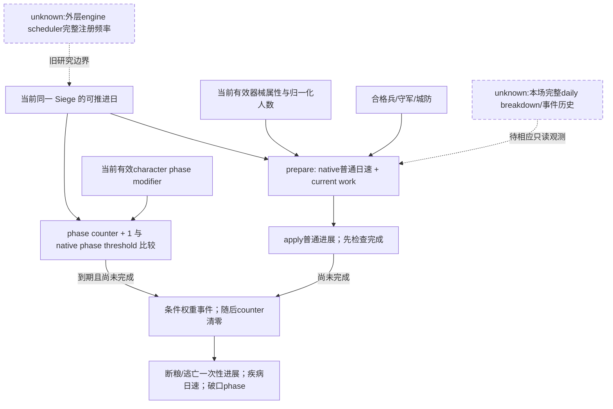
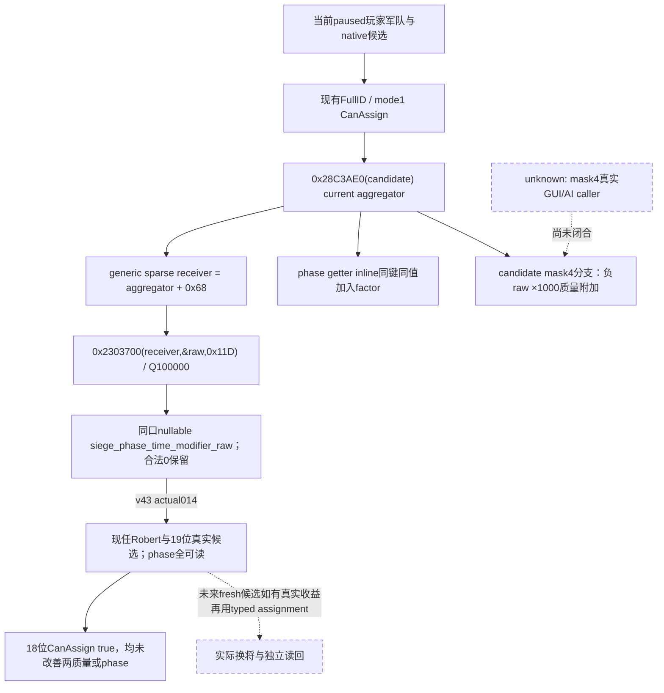
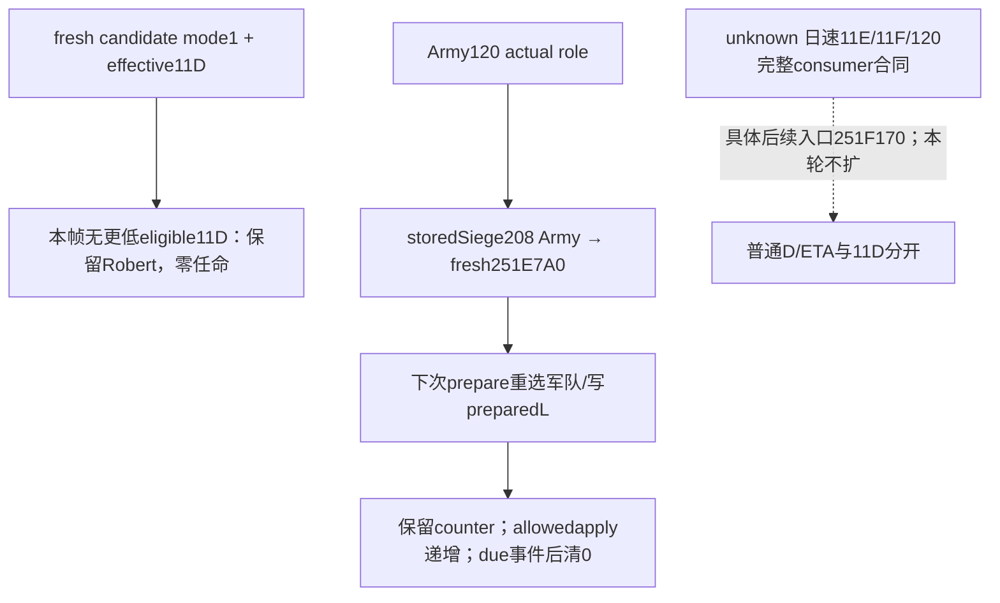

# CK3 1.20.0.3：本次围攻效率输入与候选阶段修正

2026-10-03，当前新增候选 phase 输入为 **production-live primitive**：v43 / frozen `Z:/g45` / source `8e2cfbee4981af7f80398ec09129c1cf0f3dbe54` 已从 Robert29829 暂停真实候选返回19个有效 signed phase 值，唯一文件消费生产 normalizer GREEN。下方保留历史原生研究、v39围城帧及 focused 验证；最新实际字段与本帧将领取舍见末节。未执行由本字段驱动的换将或加速，不把它归为收复或战争胜利。

精确构建为 **1.20.0.3 / Steam25652598**，实际安装目录 `Z:/SteamLibrary/steamapps/common/Crusader Kings III`，EXE SHA-256 `94b55397abb687a3dcd436805a5d885e6be90fa6c693feb44a9e3bbeeade02a6`。源码读取基线 `Z:/g38@5cbc0ee17f3d6cd2065c1a482607ef6975eef447`，本次运行来源 `02e88d57fcef399368f34b23f497d3e8565af95d`。完整字节、输入路径和哈希在本包 `EXACT-INPUTS.json` 与 `CANDIDATE-PHASE-NATIVE-PINS.json`；所有地址为 RVA。

## 历史 v39 raw53238336 围城当帧

读取旧完成叶 `military-ooda-continuation/siege-v39/actual-stationary-siege-batch-2604-02/day-37/006-ck3_query_war_occupation_targets_v1.json`。其目标行是 province2604 / holding2400 / Siege503316492 / public CUnit83886367；legal holder33435、敌方 occupier30097，玩家主围攻为 true。该历史当帧累计进展9781290、所需总进展32500000、剩余22718710，均为 Q100000；进展分数30096即30.096%，原生剩余预测109天。城防3、当前守军400、合格围攻兵2290；破口0、强攻未开始、原生 CanStart/CanStop 都 false。没有收复完成事实。

该行给出的城防3低于原版第一阈值4，按已闭合正常非负 tier 路径，该v39当帧城防缺级日速因子为1。不能把“新增高阶器械”解释成正在消除本场城防惩罚。多余合格兵的已知日速项为 `0.01 * floor((2290-400)/200) = 0.09`；这只是一个输入项，不能因此将普通日速补成1.09。该v39当帧器械有效属性、规模、疾病等级和完整日速修正没有被本包观测，109天也不能反解唯一日速或当成固定完成期限。

## 已有原生日进展与阶段树

复用已发布 [日进展/总量](episode03-siege-progress-1.20.0.3.md) 和 [阶段事件](episode03-siege-events-1.20.0.3.md) 的 exact .3 已闭合结论，不重复它们的 GREEN 检查：

- `prepare 0x251E200` 在未受阻时，将普通日速 getter `0x251F170` 加入 next-work；phase 未到期也做此加法。`apply 0x2521060` 的配套管理链先应用普通进展，完成上限优先于本轮阶段事件。
- 普通日速的有限表达为 `max(0.5, ((1+A+M+E+X_add)*X_mult)*F)`，每步按原生 Q100000 运算。器械项 M 由有效 siege_value 乘 `current_count/type.stack` 的归一化当前规模后求和；不能用名义团数或原始人数直接乘 stock 值。引擎合格 tier 是原生输入，不从历史 enemy mangonel 推断本场我军。
- 总量 `0x251DD20` 的正常路径为 `100+75*fort_level*min(1,current_garrison/effective_max_garrison)`；守军与有效容量变化时 getter 重新求值。普通 ETA 是剩余量/当前日速的固定点除法再向上取整。
- phase getter `0x251E7A0` 的正常因子先相加：`max(0,1+breach_adjustment+character_0x11D+siege_cached_0x11D+province_0x11D)`，再乘基础20天，计数阈值向上取整。阶段与每日进展分离。
- 原版 `military_engineer` 的基础 `siege_phase_time=-0.1`，XP33/66/100另有该字段；实际聚合/XP不能从图标补造。疾病当前等级增加日速10%/20%，断粮升级一次性加当时总量5%/15%，逃亡一次性加5进展，小/大破口缩短后续阶段间隔10%/30%。这些不能都叫作“每日速度奖励”。



## 新增候选字段的 primary evidence chain

已有候选 reader 以当前 owner 的原生集合取得真实 CCharacter，核对 full ID/tag、正式玩家 mode-1 CanAssign。当前将领以 `CArmy+0x120` 和 `GetArmyCommander 0x24E9ED0` 互证，所以旧 episode 文档将这个角色保留为 unknown 的历史边界，本次已经由后来生产路径解除；不改写当时冻结证据。

`0x28C3AE0(CCharacter* RCX)` 返回实际有效 modifier aggregator。220-byte 完整函数 SHA `b46b5c54bf3e40c9475dc216e924ca5cce0b04918e365569a3998e17e2a1e7ae`；当前角色组件路径为 Character+0x1B0 → +0x258，组件+8须回指该角色，然后返回组件+0x10。它还有原生空容器 fallback；本包不把空键当读取失败。

两个独立消费者明确取同一 generic `0x11D` 值：

| 消费者 | 精确路径 | 结论 |
|---|---|---|
| candidate flags getter `0x2C17B20` | 0x2C17B45/test验证 flags mask4；0x2C17B5B取 aggregator；0x2C17B60置enum11D；0x2C17BD1取raw；0x2C17BDA取负 | 正常路径附加 `trunc((-raw*1000)/100000)`。367-byte SHA `47f9122e1cf1f82099a405ff91e49d6c960f7cfcb42214e6802459063483cca7` |
| phase getter `0x251E7A0` | R8D保存实际角色FullID；0x251EAB3置enum11D；0x251EAD3取同角色 aggregator；0x251EB30取raw并0x251EB39加入phase因子 | 负raw缩短阶段因子；2504-byte SHA `24580ef54fdccc823dab0a655dba8f83229ee7f6a5c7cf94f26d7845196bdb47` |

以上 inline sparse read 使用 whole aggregator 的 uint16 keys指针+0x68、signed count+0x74、int64 values指针+0xD0。lower_bound未找到精确11D时为合法raw0，找到时返回同index的Q100000 signed值。

可以复用生产已有 helper `int64_t* 0x2303700(void* RCX,int64_t* out RDX,int32_t index R8D)`，**receiver须为 `aggregator+0x68`**。该helper读取 receiver+0 keys、+0xC count、+0x68 values，恰好平移为上面的+0x68/+0x74/+0xD0；whole aggregator本身是另一张 sparse 子表，不能直接以whole aggregator/11D替代。完整163-byte跨unwind有限区间 `0x2303700..0x23037A3` SHA `0e06c82214ba5366a5c55c59ed193111821af27c7a96390a739aaeba0a4ab822`，显式写 caller-owned out并返回同一out指针，missing key写0。新candidate field只复用这个receiver，不启动旧combat调用的全局改动或审计。

```cpp
auto* aggregator = get_character_modifier_aggregator(candidate);
int64_t raw = 0;
bool observed = false;
if (aggregator != nullptr) {
    auto* generic = static_cast<std::byte*>(aggregator) + 0x68;
    observed = read_character_modifier(generic, &raw, 0x11D) == &raw;
}
// aggregator unavailable: nullable unavailable; native missing key: observed raw 0.
```

原版 `siege_phase_time` 字符串 RVA0x470DFD8 和数据引用0x46EC1D8已保全，但这个字符串注册表到modifier枚举的完整命名映射本包没有另行闭合。本次phase语义来自两个实际消费者的同值链，不以字符串邻近或0x29猜测取代它。

原生 generic军队配将的 sort mode2实际 flags=2，不走mask4。**mask4条件分支的实际GUI/AI调用者尚未闭合**，不声称AI每次围攻会自动选择工程师。新counter-policy可使用更小的已观测有效11D，这是原生phase输入指导下的最小确定策略，和完整AI排序的差距另行保留。

更负的phase修正也不保证任命后 `days_left` 立即下降：当前ETA getter按剩余进展与普通日速求值，不预支将来阶段事件的奖励。phase变化带来的价值是更早达到下一事件阈值；实际事件结果和完成时间仍由后续真实运行给出，不能用第一次ETA未降就否定该字段，也不能用它承诺何日城破。



## 本次可执行改善与验收边界

已实施的第一项增量是在既有 `ck3_query_army_commander_candidates_v1` 的候选行补一个 nullable signed `siege_phase_time_modifier_raw`，scale明确为100000；不新增MCP、flags、许可或war禁令。不改变既有quality或CanAssign。其它未读当帧中，不猜Robert为0，也不凭军事工程师标签直接换将。

一次新字段 focused验证覆盖真实production reader→serializer→registered MCP，使用specific与generic子表不同哨值，证明生产receiver的+0x68正确；保留负值、零值、missing key合法0与真实getter不可用null。ROOT随后读当前候选：只有实际更小raw且正式CanAssign=true时，才有确定的缩短phase输入理由；使用已有正式typed任命并独立确认当前将领。普通推进后仍按同SiegeID进展和occupation读回结果，不把字段ACK或较小raw当成实际缩短天数/城破。

器械另一条可执行路线是当前实际regiments/有效siege_value/归一化人数的观测和正式补员、创建或会师资格；这些由对应composition lane施工。当前CanStart=false意味着本次不能使用既有强攻动作，未来有破口后仍应读取完整原生CanStart，而非仅以breach>0判定。本包不为这些尚未采集字段设计额外门禁，也不等待完整事件模拟器。

原生研究阶段新增信用为0。candidate新字段的实际读取现已由v43闭合；当帧没有质量或phase更优的合法替代，因此没有换将。Root的2604收复由独立occupation运行证明，本字段与文件消费者不领取该结果信用；围攻加速与战争胜利仍须各自真实结果artifact。普通围攻已经推进的49实际保存日属于ROOT既有运行，不能再次累计为本研究收益。


## 历史实现阶段：同口最小增量与唯一 focused 验证

本次四个生产文件已完成外置实现，同一 commander candidate 口增加唯一公开字段 `siege_phase_time_modifier_raw`，单位 signed Q100000；缺少 getter/容器/输出指针为 null，原生 missing key 为真实0。字段观测与既有 CanAssign、generic quality 独立；旧冻结 payload 缺字段只补 null。没有新增端点、动作或运行开关。Root 采用、正式组合 DLL 与新 PID 的实际候选读取仍按各自 receipt 记录。

## 2026-10-03：将领围城 phase 修正的新生产路径 focused 验证

为比较当前围城将领的真实阶段时长输入，平行原生研究先冻结 exact CK3 1.20.0.3 / EXE `94B55397ABB687A3DCD436805A5D885E6BE90FA6C693FEB44A9E3BBEEADE02A6` 的 modifier enum0x11D、effective aggregator getter0x28C3AE0 与 generic sparse reader0x2303700，并证明后者 receiver 必须为 aggregator+0x68。实现只向既有 commander candidates 同口增加 `siege_phase_time_modifier_raw` 一项 nullable signed int64、Q100000；不会把 generic advantage 或 native AI base quality 当作该输入，也不推断原生AI总采用flagsmask4。

独立新fixture完成一次严格 6TU /O2 /DNDEBUG /W4 /WX 编译，原生4新cases、16显式Check GREEN。Fixture用 frozen standalone163B sparse函数机器码 SHA `0e06c82214ba5366a5c55c59ed193111821af27c7a96390a739aaeba0a4ab822` 实际执行；生产 reader callback必须传generic+0x68和enum0x11D，保留raw0/-10000/+10000、exactkey缺失为合法0、可选getter或容器读取失败为null，且原有candidate availability/quality仍可用。生产 mailbox serializer 产生4份真正native JSON，不复制或伪填新字段。

这些真实原生报文经 production native_driver → normalize → service → registered `ck3_query_army_commander_candidates_v1`，Python -B -O 下5cases/47显式Require GREEN；第五case只将同一新报文中的字段删除以验证旧v1遗漏归null，明确为derived legacy shape，不能称作第5个genuine native case。旧rich-siege、旧3case commander矩阵及combat矩阵均未重跑。

首次唯一native attempt原生GREEN后，Python因外置projection漏复制现有tools/build_release.py而未启动，保留其harness RED。补入不改动的 frozen支持文件后，只再次消费已生成的4份native JSON，未再次编译或执行native。生产候选代码没有因此修改。这一验证包当前readiness为 **static-ready**；Root新冻结DLL与当前Robert候选的实际phase modifier值仍待，不能写为已替换将领、phase已缩短或围城加速。

Reusable canonical paths为 `ck3_autonomous_player/native_bridge/src/ck3_12003_commander_siege_phase_test.cpp`、`ck3_autonomous_player/native_bridge/research/fixtures/run_commander_siege_phase_mcp_fixture.py`；两路径外置patch与完整结果在 `Z:/ck3_mod_rewrite_process_assets/g2-resume-20261003/siege-efficiency-inputs/production-validation/new-fixture/ROOT-DELIVERY.json`。Root负责与4生产路径及native专题一起正常采用、commit/push，再做fresh actual候选读取。纯文件lane 0SDK / 0游戏 / 0窗口 / 0Git写 / 0新日 / 0实际围城或战斗收益信用。现口actual008的40regiments/Robert34/roll0..10是另外的production-live primitive包，本新phase源码与之分开归属。

在上述外置实现阶段，新字段为 **static-ready / focused production-path fixture GREEN**；当时尚无新字段的 Robert paused actual，不记 production-live、换将、加速日数、收复、胜利或 G2 信用。现 normal siege 与 v40 composition actual 是独立已有能力，继续推进不等待该静态候选输入。

外置索引：`Z:/ck3_mod_rewrite_process_assets/g2-resume-20261003/siege-efficiency-inputs/combined/ROOT-DELIVERY.json`；原生 pins、四文件 projection、唯一 focused attempt 和当前 actual composition 各自保留在其 lane 的 receipt，不重播任何 SDK 或时间推进。


### 2026-10-03：v43 真实候选将领 effective siege-phase 修正

Root 在 frozen `Z:/g45` / source `8e2cfbee4981af7f80398ec09129c1cf0f3dbe54` 的 Robert29829 原普通战役，以既有 registered `ck3_query_army_commander_candidates_v1` 实际读取 public CUnit83886367 / native CArmy50331794，date_raw53240136、native revision3、public revision2。当前 commander 是 Robert29829；其当前 candidate native_ai_base_quality=34、generic_advantage_points=34，新增 effective `siege_phase_time_modifier_raw`=-10000 / Q100000。当前自身 CanAssign=false 是原生 final observation，不否认他已经任命的事实。

实际候选集合 19 行、phase原生非null 19 行、原生 CanAssign=true 18 行；同帧合法候选中 generic advantage更高 0 行、native base quality更高 0 行、phase raw更低 0 行。具体 current/可任命候选逐行raw及top比较保存在 proof/CSV，不把 native_ai_base_quality 或 generic_advantage_points 改称独立martial属性。负raw只降低当前 character阶段因子组成；整场围城时长还依赖breach、省份及siege cached modifier，不能按raw直接承诺缩短百分比。

这个新phase字段现为独立 **production-live primitive**，公开v1 schema/端点不变，非null来自实际新原生叶，未复用fixture值。唯一文件消费者调用当前对应 frozen production `normalize_army_commander_candidates_v1`，核对实际frame/owner/currentcommander/CanAssign/int64有符号phase；33显式Require GREEN，无removable assert，未重发query/SDK或重跑旧测试。只消费014一次。

证据：`Z:/ck3_mod_rewrite_process_assets/g2-resume-20261003/runtime-preparation/v43/actual-sway-new-fields-and-counter-scope-v43-01/014-ck3_query_army_commander_candidates_v1.json`；pure-file consumer `Z:/ck3_mod_rewrite_process_assets/g2-resume-20261003/siege-efficiency-inputs/production-validation/actual-phase-v43-01/ROOT-DELIVERY.json`、同目录 `ACTUAL-PHASE-PROOF.json` 与 `ACTUAL-CANDIDATE-PHASE-VALUES.csv`。Root独立正常SAVE为h5377/date53240136，消费者增加0日。Province2604收复另归Root实际occupation包；本叶不增加新的任命、阶段加速、围城/玩家战斗/战争胜利或G2信用。canonical专题和日周/commit-push由Root负责，外置消费者不修改共享源/Git/窗口。

### 本帧战斗质量与阶段修正取舍

18位正式可任命替代中，15位与Robert相同为phase raw=-10000，3位为真实0。最佳合法替代34867的native AI base quality与generic advantage均为28；32716为23/23、33435为22/22，三者phase均与Robert相同。Robert为34/34，没有这些已观测维度上的Pareto改善。当前保留已任命Robert，继续由Root评估2640/2635解围；不为已结束的2604围城指标牺牲6点generic advantage而换同phase的34867。两质量都不是独立读取的martial skill或目标专属战斗advantage，不能据此计算胜率。

这是本帧选择，不创建永久换将限制；未来fresh候选或目标上下文出现真实收益时仍可用既有正式任命并独立读回。取舍材料：`Z:/ck3_mod_rewrite_process_assets/g2-resume-20261003/siege-efficiency-inputs/observable-composition/actual-phase-tradeoff-v43-01/TRADEOFF.md`。

文件消费者的首次 preflight 曾误认为此endpoint会发布episode字段，在生产normalizer调用之前报harness RED；该字段实际未发布，现保留null并移除这个不适用假设。之后matching frozen生产normalizer实际调用恰好1次、33显式Require GREEN，未重发SDK或旧测试。原harness RED保留在consumer receipt。Root同批defaultRaise012的actual executor unavailable/busy RED另包保留，不改写为此只读014能力RED。

## 2026-10-05：P470 当前将领取舍与阶段刷新

本节复用上述有效11D、[当前tick prepare/apply树](siege-current-tick-offline-12003.md)和[正式mode1任命树](commander-in-battle-assignment-timing-12003.md)，只读g70/source `d3b6742e7cdad2dad1f396c7f78ac279d9bde728`；exact .3 SHA不变。围城状态本身没有独立赋将禁止分支；目标retreat raw>0会拒绝，特定候选仍以fresh正式CanAssign为准，当前同军将领重复请求是already_assigned零动作。

Root摘要中的 **301是public CUnit301989997简称，不是兵数**。P470/Siege503316504/fort6：合格围攻强度3210>守军550、canAdvance=true，当前普通D85284/Q100000，freshL18/preparedL18/counter6，当前阶段事件状态均0，ETA639；本帧不能称兵不足。军师或工程师图标、历史v43值均不能替代当前effective raw，更低11D只降低阶段因子，不能直接折减D或ETA。

协调者一次消费Root新候选后的摘要：28行complete、25位eligible、11D无null；当前Robert29829为33/33、raw−10000，16位eligible同−10000、9位为0。同phase最优合法替代32716质量23；34867质量28/raw−10000但CanAssign=false。因此**当前保留Robert，不发任命**；该结论只证明本帧没有可任命的更低11D，不代表候选普通日速已全部比较。

赋将的Army+120角色写入和fresh候选11D读取已有合同。若该军仍为Siege stored+208的内部Army，下一paused occupation的current_phase_length会以当前Army+120 FullCharacterID调用251E7A0重求；prepared_phase_length则仍是Siege+20上次prepare缓存。下次251E200先重选军队并重求L，再以**保留counter+1**比较阈值；allowed apply递增counter/提交普通work，未完成且due才写事件并清counter。getter不驱动prepare，换将不承诺counter清零、立即改preparedL或ETA。

实际安装stock logistician声明supply_duration=0.4及文化/rite条件attrition修正，没有直接siege_phase_time或普通siege dailyprogress加成；XP也不能由标签补造有效值。现有ck3_query_army_strengths已读当前supply、capacity、最终attrition和当前省份monthly supply change，足够独立消费当前补给状态；health006仍仅由其owner消费。候选假设supply_duration尚未公开，不能凭名称计算换人后的容量或损耗。

普通日速树只部分闭合：X_mult含疾病、character与Siege缓存11E及条件120，X_add含同条件路径11F；完整名称和条件对象仍未全闭，不能猜角色/省份各项或置零。当前candidate口仅11D，确实未发布日速贡献。若后续真实决策需要比较，具体入口是251F170的这些consumer分支及既有28C3AE0/aggregator+68/2303700候选聚合叶；先闭合同再决定同口可选字段。本轮不新增observer、candidateD推算、catalog或外层scheduler研究。



本节当前帧只引用Root/协调者摘要，不再读取原始actual004或health006，不新增SDK/RPM/窗口/测试/游戏日，不领取换将、围城加速或占领收益。外置最小账本、sourcepins与Oct5/W41字段：`Z:/ck3_mod_rewrite_process_assets/g2-resume-20261005/siege-commander-value/native-tree/ROOT-DELIVERY.json`；实际候选receipt由协调者另包合并。

## 2026-10-05：R38 城防6围城的当前效率与合格兵种输入

Root零日occupation004实读date53259768、War117440524、P470/holding1334/county1333、玩家CUnit301989997、Siege503316504；fort6/garrison550/eligible besiegers3210，work511704/55000000（Q100000）、0.930%、ETA639，CanStartAssault=false，尚未占领或完成。
同一实际围城ordinary_daily_progress=85284/Q100000、fresh/prepared phase均1800000/Q100000、counter6、can_advance=true，breach/starvation/disease/desertion/stalemate状态均真实0，prepared enum5只是上次prepare sentinel；既有occupation口已读到这些输入，generic daily snapshot中null不能当getter未实现。
已完成day03..08五个相邻24h工作差均85284，与实读普通D相符；普通日进展有效，639是当前D条件估计，不是固定城破日。保持输入时还需12个允许tick达到18天phase门槛，不保证事件种类、强攻或终结。
本场尚未发布M/K：M为本省原生合格regiment有效siege_value×归一化当前规模之和；K为合格最高siege tier，不以历史器械、全军人数或未采字段补0。fort6触及原版threshold4/6，条件K0/K1/K>=2的F分别.49/.7/1，最终D仍含其他修正与minimum；当前E=.13只是相加项。
两个此前实际可达getter ABI已闭：0x247ECE0为`int64_t*(void* Province,int64_t* out)`，既有daily0x251F170 caller用真实Province/out；0x247EFC0为`int32_t(void* Province)`，既有event weight0x251E6E0 caller使用其EAX，fort helper同读K。M727B SHA`0dc8648056516b8c413a85b42f1d607ad9db4e1f36c6f3214e419f6b9c3ff7e4`、K528B SHA`a4f0a172a74efaefacddcafeff0aae0328f162461490927f5f99af714e2d1136`绑定exact .3 EXE`94b55397…2a6`。
先封原生树/Mermaid，再外置3path只读reader：alive Siege后独立读取真实Province M/K，既有occupation同口发布nullable`eligible_regiment_siege_work {raw,scale:100000}`与`highest_eligible_siege_tier`；真实0保留，缺getter/失败仍null，不依赖assault或将领字段可用。唯一affected生产路径fixture已GREEN（native16 checks/1serializer包、registeredMCP20 require/2calls，第二为derived legacy shape）；首次Python缓存绑定harness RED保留，回执`Z:/ck3_mod_rewrite_process_assets/g2-resume-20261005/active-siege-eligible-input-v66/fixture/ROOT-DELIVERY.json` SHA`b7d65a0e64191be3d6720637c7c26cf3aabf79d034aa7cec3bd3daef3bc6c4fb`。Root已采用native`38467fc69f28a15627ef725c8d3ad45bba957544`与wire`2ef91947c161c0b22795a57f36c9485affc437b0`，新observer为static-ready，v66加载与fresh actual M/K仍待独立receipt，未授加速、城破或新日信用。
策略入口优先比较当前M/K实际器械或会师收益，其次复用合法commander candidate effective phase输入；phase modifier不直接提高普通D，trait/XP不重复计入。未发现可执行改善时继续当前目标的普通围城及实证补给维护，不等待完整RNG，也不因长ETA自动放弃目标。
冻结树、ABI/源码pins、唯一actual004消费及日周字段见`Z:/ck3_mod_rewrite_process_assets/g2-resume-20261005/siege-efficiency-current-fort6-v65/ROOT-DELIVERY.json`（SHA`126791c2c0528fde6ef6a8b243d7856f7c2062f74eab996ca807c10dec58d5bd`）；原生树SHA`44a1219bd852bb2d20086711b93b3ed3e0641f1571aa6686c2cacea79f6e1b58`。本lane0 SDK/RPM/窗口/tests/shared/Git/新日；实际累计4810日由Root原推进计入一次。

## 2026-10-05：R39 合格围城贡献与等级已实读

Root正常冷恢复G71/source cd0、R39/PID126252后，occupation007在冻结date53259768、native:3/native3/public2/generation2/query sequence1实读War117440524、P470/holding1334/county1333、Siege503316504、玩家CUnit301989997；fort6/garrison550/eligible besiegers3210，M=`61050/Q100000=0.6105`、K=`0`均可用，新观测升级为**production-live primitive（只读）**。
同帧普通D=`85284/Q100000=0.85284`、fresh phase=`1800000/Q100000=18天`、counter6、can_advance=true，五类event state均真实0、prepared enum5；cold prepared phase cache为可用的真实0，必须与fresh18天分开，不沿用旧帧18、不将0当读取失败或立即due。C511704/T55000000、ETA639、nativeCanStartAssault=false，尚未占领或完成。
K0证明本省当前资格集合没有正siege tier；不能扩推全军类型、库存或其它军队无器械，M>0也不是纯器械数量。fort6两档折减说明当前tier不足值得优先改善；下一current roster/type/tier及正式可用器械来源依赖由CommanderObserver contactless raised composition、BattleObservation stock/CanCreate与mercenary composition各owner继续施工，不能凭人数或历史配置宣称补兵/造器械已改善。
本次部署与sole007消费新增0日，累计4810日保持Root唯一计入；不授加速、阶段事件、城破或战争胜利信用，继续当前目标普通围城。冻结实读、策略与日周字段见`Z:/ck3_mod_rewrite_process_assets/g2-resume-20261005/siege-efficiency-current-fort6-v65/production-live-v66-r39/ROOT-DELIVERY.json` SHA`69debae7a18f5956957b23906084ad79f1ae92056dad2d953f569f35f704c334`；原007 SHA`f72459a6abae20f3b36261bc2ebdc5f5d2a30274c3e01f851241f5c5e55f7bc5`，本知识增量不重读该叶。

## 2026-10-05 R39：raised-regiment composition 的 source-first 输入闭合

以上 Root R39 actual M/K已证明当前资格集合 K0；这不能推出完整 owned/unraised MAA 都缺器械。本段在同一 native 输入账本先冻结 composition 树，再推进后续买器械策略。
已封树／两源缓存：`ART05/commander-observer/maa-contactless-sourcefirst/NATIVE-INPUT-TREE.md`、`INPUT-CACHE-MANIFEST.json`。g71 cd0acf19 既有 strengths 原生 reader 已读完整 CArmy roster FullID/current/max，无需 contact、敌人或 CombatID。
对象链：CUnit+178→CArmy；CArmy+38/+40/+44→ArRg FullIDs；ArRg+18→GDbo type，type+18 为 canonical MSVC database key，type+2A0 为 K 原生 signed tier。数值 typeID／localized name 未闭，不伪造；ArRg 与 persistent Regi 不同，Regi+18 是 chunks。
同一已注册 `ck3_query_army_strengths` additive 每团分类先发布 key/status/tier；真实 tier0 保留0，读取失败为 null／unavailable，absent 区分无 MAA 类型；分类失败保留原人数聚合。仅 exact .3 adapter 启用已封 tier layout，.2 原 binder 保持未绑定。
有效 siege getter26344C0(ArRg,out,真实省份)与 normalized-size2634720 已由 M span 闭合；本最小施工暂不扩 getter。低 tier不等于该团零贡献或招募非法，不能用 current/max 猜 M 的归一化分母。
Raised→首条 record→persistent Regi 仅证明当前部队局部关系；完整 owned/unraised collection、recruitable catalog、CanCreate／final quote 仍需 native collector／create 输入闭合后才设计买器械策略。
施工投影与唯一新生产 reader→serializer→registeredMCP case：`ART05/army-regiment-composition-v71/`。fixture/实机 readiness 以最终 receipt 和 Root 独立实际 query 为准，本段不新增 live 或完整战争能力信用。

## 2026-10-05：R39 普通24日后的疾病状态与日速

Root ordinary24 SDK20302 CLOSED GREEN计入24日，累计4834/接续1681/10月5日176；后续SDK38425 closed GREEN的sole occupation004冻结date53260344/native:103/native103/public2/generation4/queryseq2，同P470/holding1334/county1333/Siege503316504/main301989997仍active，fort6/g550/B3178，work2659976/55000000、4.836%、ETA559、can_advance=true、nativeCanStartAssault=false，无占领/城破。
当前M60900/Q100000=.609、K0、普通D93732/Q100000=.93732；disease_level已1，其余breach/starvation/desertion/stalemate状态0、prepared enum5。fresh与prepared phase现均1800000=18天、counter12，和上一冷恢复帧prepared真实0分开记录；输入不变时还需6个允许tick达到phase门槛，不保证下一事件或完成日。
复用原生树：writer0x251CD00 enum2提升疾病等级，daily0x251F170使用其当前10% multiplier项，改变后续日速而非一次性work或强攻资格。已知(1+.609+.13)*1.1*.49固定点截断=93732吻合实读；work/D已实际增加，ETA639→559仅条件估计变化，不能追加80日信用或承诺终结。继续现occupation查询的native CanStart0x29738C0判定入口，当前false故普通推进；current roster/type/tier、stock/CanCreate、mercenary依赖保持并行。
新004 SHA`12d488fbd941d3ba6bbc337549659bf09cec69be8758e42db9c743efc6b8bc6e`；compact、策略与日周字段见`Z:/ck3_mod_rewrite_process_assets/g2-resume-20261005/siege-efficiency-current-fort6-v65/r39-after24/ROOT-DELIVERY.json`。本consumer新增0日，不读旧原叶/snapshot005/health006/source/tests/SDK/window；batch末normalh8344与后续新normal由Root独立保存确认，不授器械改善、强攻、城破或新family信用。
