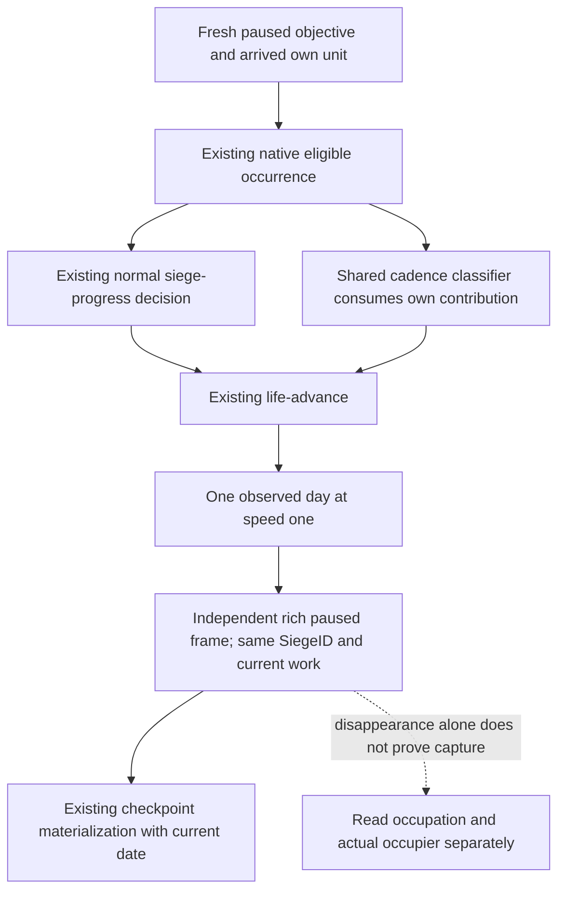

# Foreign-leader own contribution and daily material cadence

This source-only repair starts at the complete SDK freeze
`dd4459fe0d38951ebdbc899a66c6a1c6608b2409`, in the independent complete tree
`Z:/gbs-siege-material-dd445`. Exact game identity remains CK3 **1.20.0.4**,
Steam **25734779**, EXE SHA-256
`98702F88A547CDE2EAF29A85F93B85F68EE4CF8148336A4F7AFAEB75319DD518`.
No new executable read/hash, native build, project import, test, SDK or game
operation is performed here. Root owns the sole FIRST and later actual loop.

## Existing tree and concrete consumer mismatch

The adopted [ordinary contribution tree](army-normal-siege-contribution-consumption-12004.md),
[current CArmy selector](siege-current-army-selection-12004.md) and
[selected-subject consumer](siege-subject-contribution-consumer-12004.md)
already separate stored Siege leadership from current own eligible contribution.
The [existing OODA path](siege-ooda-source-chain-12004.md) documents normal
progression, independent work/occupation readback and checkpoint materialization.

The ordinary strategy correctly returns `native_war_siege_progress` for an
arrived, native-eligible own subject under foreign stored leadership.
NativeDriver's shared `_observed_player_siege` classifier still recognized
only `player_army_besieging=true`. With that same complete paused input and no
routes/combat, the cadence path therefore selected the route-free war's
seven-day horizon and speed-five policy. The stored foreign leader does not
mean our arrived eligible unit is absent. This is a functional consumer
mismatch on a reachable, already qualified input, not a new native input gap.

The input authority is the qualified whole `foreign_leader_own_eligible.json`
under
`Z:/ck3_mod_rewrite_process_assets/g2-background-20261008/runtime33-incremental-preparation/build/functional-runtime33-90074a79-attempt02/wire/siege-selection-12004/`.
Root's reused domain qualification is
`upstream-build-migration/entry-live-fix33/ROOT-TWO-DOMAIN-QUALIFICATION-RESULTS.json`
under `Z:/ck3_mod_rewrite_process_assets/g2-background-20261007/`.
The packet supplies measured eligibility and constructed arrived strength1500;
it does not extrapolate R77's live strength152. The old fast cadence's actual
pacing consequence is recorded separately in
[R0047's cadence evidence](paused-siege-timeline-cadence-12003.md). That retained
failure is not repeated or relabeled as a foreign-leader live failure.

## Minimal existing-input repair

The same cadence classifier now consumes the existing
`observe_siege_subject_contribution` helper, using actual controllable player
units, current Province, empty route and measured native eligibility. Stored
own leadership retains its original branch. Current eligible participation
reaches the already implemented one-day/speed-one stationary siege path and
its exact ending condition. Native selection equality remains diagnostic,
not participation or assault admission. There is no new native observer,
schema, deadline, privilege, gate or strategy score.

The sole new compound is
`test_foreign_leader_siege_material_service_12004.py::test_normal_foreign_leader_contribution_advances_one_day_observes_and_saves`
under `ck3_autonomous_player/tests/unit/`. It reuses the qualified whole input,
then connects real registered normal Service planning/execution, NativeDriver
daily advance, an independently published paused same-Siege/work observation
and real isolated checkpoint materialization. Its clock, changed work and file
bytes are declared synthetic. The test must select the existing slow arm;
its sparse fast clock represents the retained R0047 exposure. This is a new
downstream compound, not a native-producer or old four-case qualification
replay. Source is authored and **FIRST NOTRUN**.

The finite Root inbox template is
`Z:/ck3_mod_rewrite_process_assets/g2-parallel-20261008/siege-foreign-contribution-material38/ROOT-FINITE-INBOX-TEMPLATE.json`.
It uses current paused revisions and the ordinary planner to choose movement
or progression, then independently observes actual arrival/contribution and
saves after a newly observed date. A moving receipt does not prove arrival;
eligibility does not prove work gain; Siege disappearance does not prove
capture. Actual occupation/occupier and later war settlement remain separate.
The current route and native selection do not require another observer before
Root continues normal gameplay.

Readiness remains **research/source-authored** until Root's sole connected
FIRST. Actual one-day/speed-one behavior, day/save increments, siege progress,
capture and G2 milestones can only be credited to Root's later actual artifacts.
No Root reports are edited by this source owner; Oct8/W41 fields, source
delivery and exact FIRST argv are external alongside the finite inbox template.
