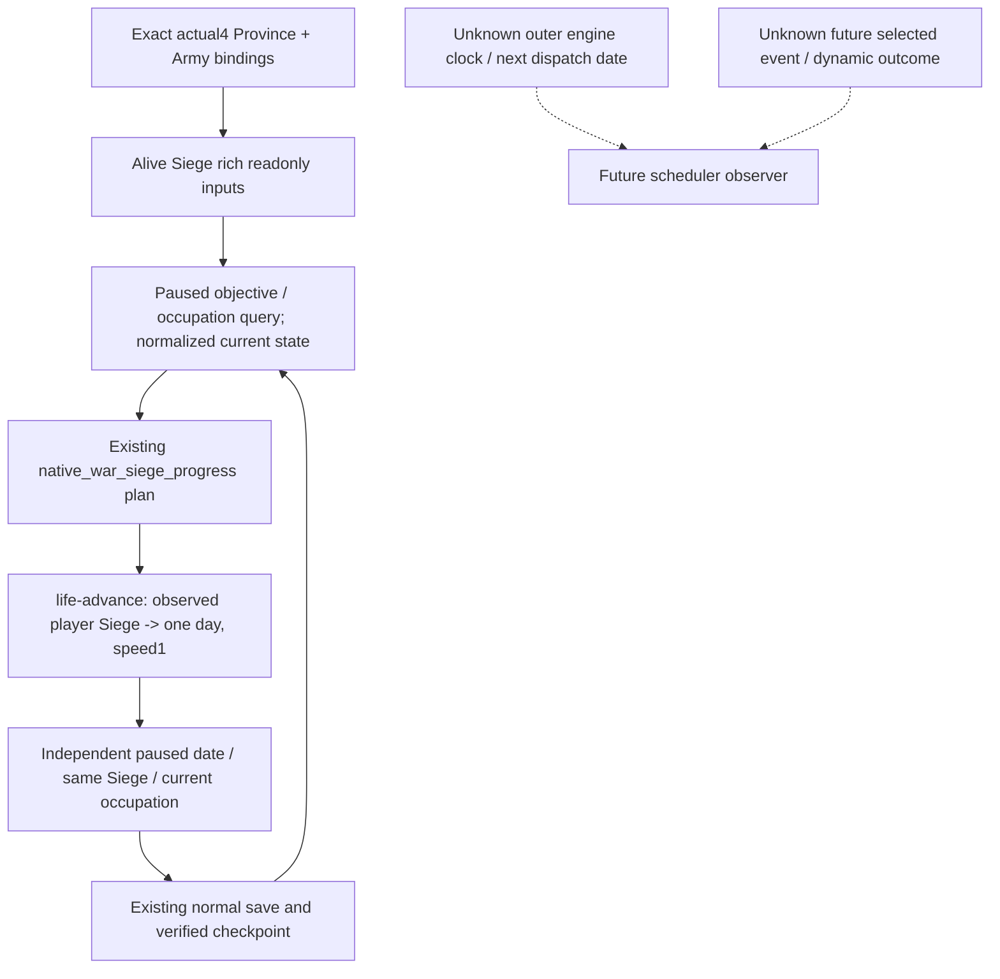

# Existing player-siege OODA on actual CK3 1.20.0.4

This finite source review starts at `23c3c4bc7fdf261f46174d35db12732808523463`.
The target is CK3 1.20.0.4 / Steam build `25734779`, EXE SHA-256
`98702f88a547cde2eaf29a85f93b85f68ee4cf8148336a4f7afaeb75319dd518`.
Root's R0061 / G110-r11 / runtime entry12 dispatch describes the original
Robert29829 campaign at raw date53288256, saved normal days5997, natural0
and G2 5/8: the player army is still moving2619 to2618, while the claim-war
objectives are2606 and2608. This review adds no game observation or day.

The current route has no observed player Siege. The already implemented
ordinary-siege loop can be used when arrival actually produces one; a new
completion-date predictor is not a dependency of that loop. Historical `.3`
siege samples establish their own old-build results, not `.4` live readiness.

## Native input and current consumer chain

[Province4](ck3-1.20.0.4-province-siege-objective.md) and its retained finite
mapping close the current ordinary daily getter `0x251F150`, current phase
length `0x251E780`, and blocked predicate `0x251CF50`. The current prepare
source is `0x251E1E0` and the event writer is `0x251CCE0`; cached mixed
code/data comparisons retain their partial mapping status. This review
reuses those records without reading or hashing either EXE again.

The caller passes the actual4 Army bindings into `BindProvinceImage12004`.
Existing `ReadObjectiveProvince(..., rich=true)` resolves the alive full
SiegeID and reads current work/total, ordinary daily work, current phase
length, last-prepared length, phase counter, can-advance, event levels and
the last-prepared event enum. The fresh getters use the current internal
ArmyID at Siege+0x208 and that Army's commander, including native no-commander
-1; they do not receive the public CUnit ID or substitute Robert's ID.
These reads occur before the assault-domain early return. A missing assault
callback therefore does not suppress the independent ordinary/phase reads.

Both the paused objective projection and `ck3_query_war_occupation_targets_v1`
carry this same rich state through the production copy/serializer and
`war_contract._normalize_active_siege`. A missing per-field read remains null;
an actual zero counter/work or false can-advance remains a value. A row with
`siege_observable=true` and `active_siege=null` observes no current Siege.

## Existing decision and independent result

`strategy.py` already chooses `native_war_siege_progress`/`life-advance` for
a progressing exact player Siege with no current route or stationary threat.
`native_driver.py::_life_advance_horizon_days` classifies an observed player
Siege from the paused rich frame, selects one requested day, and
`_life_advance_timeline_policy` chooses speed1 for the stationary case.
`_execute_life_advance` reuses the exact one-day ending condition. This is the
existing repair for R0047's real seven-requested/thirteen-observed overshoot;
the [retained pacing evidence](paused-siege-timeline-cadence-12003.md) is not
rerun here. The strategy's stale seven-day explanatory sentence is corrected
to describe one observed day and the next siege read. No action, gate, date
deadline, policy admission or source schema changes.

After an actual slice, Root reads an independent paused frame and fresh rich
state. A surviving same SiegeID permits before/after work and phase/event
comparison. If the old Siege disappears, read the holding's current occupation
and replacement Siege independently; disappearance alone does not identify a
capture. Read current war score/CanSend separately before a settlement action.
`days_left` is a current native estimate, not a promised finish date. Command
submission is not an observed day, siege progress, occupation, or normal save.

## Remaining scheduler work and readiness

The phase counter plus fresh phase length supports a conditional
`counter+1 >= ceil(Q100000 phase length)` calculation. The current prepared
enum cache is neither a future selection nor proof of a newly executed event.
`siege_current_tick` and `siege_current_phase_event` retain this distinction.
They cannot supply an engine next-date or full completion forecast.

The next concrete scheduler research entry is the manager caller/vtable of
the [sealed `.3` prepare/apply tree](episode03-siege-events-1.20.0.3.md):
old `0x2520E80` calls prepare and old `0x2521060` is the paired apply entry.
These are old-build locators only. Before adding a next-date observation,
map those actual4 manager entries and their exact outer registration/clock
receiver, then publish the necessary readonly input through the existing MCP
and qualify it in a real paused scene. No actual4 manager address or one-call-
per-day identity is inferred from the nearby mapped getters. This remaining
research does not delay the current one-day observation/action loop.

Readiness: **research/source-consumer review** for the actual4 siege loop;
the ordinary reader and pacing implementation already exist. This package
changes one explanatory source string and records native dependencies. It
runs zero tests, builds, SDK/pipe/game/window operations, new EXE reads/hashes,
or saves. `.4` active-Siege qualification and an actual observe -> decide ->
operate -> independently verify -> save cycle remain Root-owned and NOTRUN
for this work package. External OCT7/W41 fields record the source commit and
these unchanged gameplay counters.
