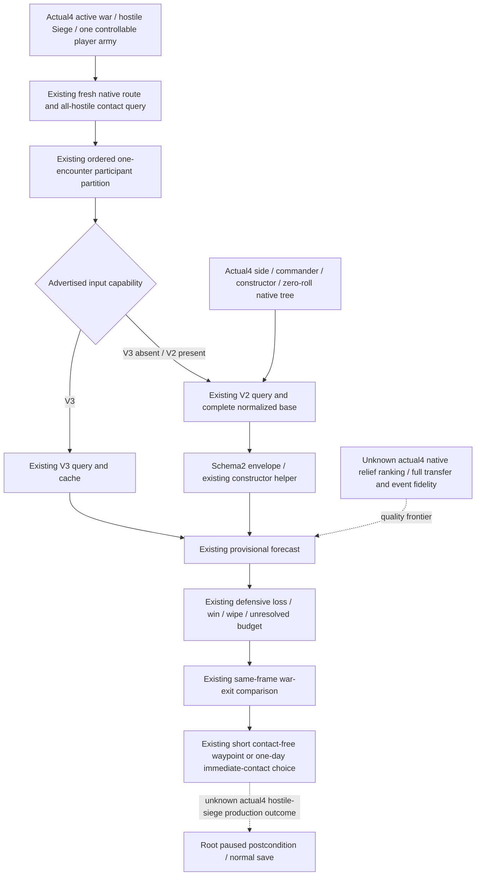

# Siege relief consumes the existing actual4 V2 battle input

2026-10-07 / ISO 2026-W41. Source baseline is
`14f07ade00e9ad359da3aa6af3642592ede3f48d`, reached by fetch and rebase,
without a merge. The exact target is CK3 1.20.0.4 / Steam25734779, EXE SHA256
`98702F88A547CDE2EAF29A85F93B85F68EE4CF8148336A4F7AFAEB75319DD518`.
Root supplied the build identity and R66's real exact-day result
53288424 -> 53288448 / saved6005 / H9638. This package neither repeats that
qualification nor reads the EXE, game or whole snapshot.

## Concrete consumer gap and native inputs

The existing general-battle ingress selects advertised V3 or V2 and consumes
the same-frame V2 base. The separate `_primary_defender_siege_forecast_ingress`
still hardcodes V3 query, parser and cache. Its existing provisional assessor
also accepts only the historical 1.19.0.6 SHA and reads only a V3 envelope.
Thus an actual4 backend advertising V2 cannot supply this existing defensive
relief decision even though its complete base and schema2 constructor are
published. This is a bounded production source gap, not a newly observed
actual4 hostile-siege failure or a claim that Robert currently needs relief.

The native tree precedes this consumer change. Reuse the exact actual4
[constructor tree](general-battle-v2-constructor-advantage-12004.md): native
ordered side construction, selected commander, constructor sources and
zero-roll helper resolve publish the signed Q100000 total. Its software
contract remains `hypothetical_constructor_context`, partial ready and
complete encounter false. Religion constructor coverage and `missing=[]`
refer only to that slice. Current Knight/MAA observations and the four full
transfer/event frontiers are retained in that topic; there is no demonstrated
missing current operand that justifies duplicating an observer.

The [actual4 Siege tree](siege-ooda-source-chain-12004.md) and
[Province profile](ck3-1.20.0.4-province-siege-objective.md) publish real Siege
identity, ordinary work, current phase and event inputs through the existing
occupation/objective query. Historical [.3 native relief scoring](war-relief-siege-native-ai-12003.md)
establishes ordered exclusive current-siege / would-lift / combat / would-start
bonuses and continuation-versus-break inputs for that build only. Its .3 RVAs,
outer candidate ranking and assault utility are not asserted as actual4.
This patch changes no target scorer or native AI emulation: the already
implemented player policy still selects one observed primary-defender hostile
Siege and reads its actual route/contact/roster before forecasting relief.

## Minimal implementation boundary

Select V3 when advertised, otherwise existing V2, using the same builders,
parsers and cache field conventions as general-battle ingress. Keep the
successful query bound to target, final route entry, ordered participants,
snapshot/public/native revisions and history after the latest day/restore.
Wrap complete normalized V2 in its existing schema2 base envelope before the
existing forecast call. The actual4 provisional branch binds the existing
exact hello/profile and chooses the V2 cache when the ingress selected V2;
the old V3 path remains available on its previously supported build.

No new MCP tool, schema, native leaf, native capability, risk limit or full-MC
gate is added. Full EU production fidelity remains a separate quality branch;
failure to produce it still permits the existing explicitly provisional
assessor. The model remains fixed-contact, phase-events-disabled and frozen
future statistics, with native parity false, MC false and death risk null.
Multiple defenders remain research-only. Model rejection cannot be converted
to an admissible result. A distant target result cannot authorize its contact
without a fresh final-entry result; long routes retain their existing first
waypoint reobservation loop. The real next query derives current revision and
entry from Root's fresh frame/route, never the old 2618/2619 diagnostic.

## Qualification and Oct7/W41 fields

Status when authored: **research / source-only / NOTRUN**. Existing forecast
7/7 and R66 exact-day qualification are reused, not repeated. Root owns the
single meaningful new selected-version siege consumer regression, adoption,
runtime and subsequent game action. Synthetic regression data cannot claim
actual4 paused input, relief, battle, Siege progress or calibrated probability.

The new compound case is
`tests/unit/test_siege_relief_v2_constructor_consumer_12004.py`. It retains old
.3 saved model operands, explicitly creates a synthetic schema2 constructor
and primary-defender relief scene, and exercises the real ingress, provisional
assessor, constructor helper, model and risk admission. It first proves that
a V2-only backend selects its canonical query, then runs the existing model
once with MC false and a signed negative constructor total. Either its real
admission result selects the existing one-day contact move, or its real
rejection leaves contact unselected. V3 preference is checked before model
execution. Nothing labels the synthetic input as a native .4 observation.

- Completed: native/consumer source chain reused; remaining V3-only relief
  seam identified; advertised-version query/cache and actual4 V2 envelope
  consumer authored in the isolated source tree.
- Why: use already observed native constructor/base inputs for the separate
  defensive Siege decision; avoid repeating the complete general ingress.
- Readiness: source-only until Root FIRST; no new gameplay or save credit.
- Tests/artifacts: child tests/builds/imports/SDK/game/EXE operations are zero;
  frozen native receipt and phase-required inventory reused.
- RED/limitations: no new live failed attempt; actual4 hostile-Siege frame not
  supplied; full transfer/event/AI-ranking fidelity remains explicitly unknown.
- Next: Root runs the one selected-version production consumer case, then
  uses a fresh real scene if applicable; Root merges report fields and pushes.

## Root FIRST failure and minimum assertion correction

Root adopted `243ba6d3` as `89e2ed5341fdc1a2f80627a2346c1fa3065220a7`.
Two initial collection attempts lacked their Python import paths and ran zero
assertions. The corrected runner reached the production model and failed at
the test's final missing-domain assertion: it incorrectly expected native
input domain `phase_event_rng_and_effects` inside the model's fidelity list.
The original [RED receipt](Z:/ck3_mod_rewrite_process_assets/g2-background-round34-20261007/siege-consumer-first-root.json)
is preserved (exit1, 5.349524021148682 seconds, live credit0).

Finite source semantics close the distinction. `combat_input` freezes the
query's completeness list as `native_missing_required_domains`.
`general_battle_forecast` separately publishes
`CombatMonteCarloSummary.missing_required_domains`; `research_envelope`
supplies `RESEARCH_ENVELOPE_MANIFEST`, and
`combat_core.TransitionFidelityManifest.missing_required_domains` derives
`loaded_phase_event_effect_transition` and
`exact_build_original_trace_fixture` from the current disabled phase-effects
and absent original trace fixture. These names describe the model's quality
boundary, not a renamed native query domain or a failed input collector.

The correction changes only the test: assert the native phase-event gap in
the unchanged base completeness, and the loaded phase-effect gap in the
model list. Production query/cache/consumer, constructor total, model,
admission and readiness are unchanged. One corrected compound run remains
Root-owned; prior collection attempts, the actual assertion RED and old
37-check results are not rerun or erased. This package adds no live credit.
