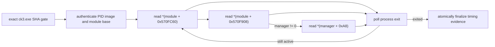

# CK3 startup slot0 read-only timing probe

Status: **exact-build static-ready / offline tested / production live pending**.

This probe answers one narrow startup question: during the next explicitly
instrumented CK3 launch, when is the particle2 manager first observable at
`module + 0x570F908`, when is its first consumer slot first observable at
`manager + 0xA8`, when is the graphics global first observable at
`module + 0x570FC60`, and when does the process exit? It does not repair any
pointer and does not claim frontend, map or gameplay readiness.

## Frozen exact-build boundary

- CK3 version: `1.19.0.6`.
- `ck3.exe` SHA-256:
  `2D00FF3101EF70B566F2FCBAE292F09263199C80E9DC8F139B82D7D96F83DB86`.
- root global RVA: `0x570F908`.
- graphics global RVA: `0x570FC60`.
- slot-zero offset: `0xA8`.
- pointer width: 8 bytes.

The root and slot layout is the already frozen particle2 startup evidence in
[main-thread-query-mailbox.md](main-thread-query-mailbox.md#main-menu-survival-control).
The successful R248 warmup and later R251--R254 startup failures disagree about
when this state becomes usable, so recording the transition in the live
process is more useful than inferring it from a post-exit minidump.

Before any process attachment, `prepare_startup_slot0_probe` hashes the selected
`ck3.exe` and rejects every build except the exact digest above. It also
requires a new evidence path. After attachment, the Win32 reader authenticates
the process image path, obtains the base of that exact main module through a
Toolhelp module snapshot, and opens the process with only:

- `PROCESS_QUERY_LIMITED_INFORMATION`;
- `PROCESS_VM_READ`;
- `SYNCHRONIZE`.

The observation loop calls only `QueryFullProcessImageNameW`, Toolhelp module
enumeration, `ReadProcessMemory`, and `GetExitCodeProcess`. There is no process
memory write, allocation, protection change, thread suspension, DLL injection,
MCP call or CK3 input in this module.

## Evidence contract

The JSON report records:

- probe/timeline origin, attach delay, PID and launch role;
- exact executable identity, module base, root address, RVA and offset;
- total samples and successful root/slot reads;
- successful graphics-global read count;
- last observed graphics-global, manager and slot-zero values;
- first observed nonzero graphics-global, manager and slot-zero value, UTC
  observation time and elapsed seconds;
- first observed process exit time and exit code;
- every read/attachment/evidence error up to a bounded 64-row inventory, plus
  a dropped-error counter.

`capture_ok=true` requires an observed process exit, at least one successful
root read, at least one successful graphics-global read, and zero recorded or
dropped errors. Any pointer that remains zero is valid diagnostic data and is
not converted into a fake nonzero value. An attach failure, read failure, early
exit before either required read, probe timeout, or controller stop before exit
remains `capture_ok=false`. Even a successful capture retains
`claim=read_only_startup_timing_observation_only`,
`gameplay_functionality_claimed=false`, and `map_ready_claimed=false`.

The nonzero timestamps are **first observed** times, not native write-hook
timestamps. The probe starts immediately after the existing `launch()` call
returns, so it cannot observe the suspended/pre-resume interval; the attach
delay and 5 ms polling interval remain explicit in the report.

### Bounded module-discovery retry

[live harness evidence / capability not sampled] R257 attached to the
frontend-warmup PID 12.065801 seconds after the session timeline origin, then
its first `CreateToolhelp32Snapshot(module)` returned `ERROR_PARTIAL_COPY`
(`299`). The retained report correctly stayed RED but collected zero pointer
samples. This is a probe-harness startup race, not evidence about any of the
three observed globals.

Module discovery now retries only `ERROR_BAD_LENGTH` (`24`) and
`ERROR_PARTIAL_COPY` (`299`) for at most 1.0 second at 5 ms intervals. Before
each new attempt it checks the already-open target process for exit. Success,
timeout and process-exit reports retain attempt count, transient-error count,
elapsed time, last WinError and last error text; a process exit also retains
its exit code/time. Every other Toolhelp or exit-query error remains an
immediate fail-closed probe error. Exhausting the short bound or observing
process exit never enters the pointer sampling loop and cannot claim
`capture_ok=true`.

The graphics-global sample adds no predicate or branch claim. A nonzero value
does not prove that the factory used it, that its children were ready, or that
any of the four exact factory outcomes executed during that sample. It only
allows the later live report to correlate global availability with the
particle2 manager/slot timeline.

## Native-session opt-in

The normal lifecycle is byte-for-byte and semantically unchanged because
`native_session(..., startup_slot0_probe_output=None)` is the default. A caller
that already owns the exclusive CK3 launch slot may pass a new `Path` through
`startup_slot0_probe_output`. The prelaunch exact-build gate runs before
entering `_native_session_locked`.

Only the first process is instrumented. For the frontend-first choreography
that process is the warmup and the report uses
`launch_role=frontend_warmup`; the final save-loading process and later managed
restores are not silently added to the observation set. The controller is
finished only after tracked cleanup has stopped that initial process. If the
opt-in report is not a complete capture, native-session raises `AgentError`
instead of returning an otherwise GREEN session result.

The promotion recovery CLI exposes the same path only through the explicit
`--startup-slot0-probe-output` option. Its prelaunch gate requires a new target
strictly below that run's fresh state or artifacts directory, records the
containment/absence proof in `02_startup_contract.json`, and forwards the path
through the Phase-2 supervisor. Omitting the option preserves the prior
recovery call shape. Until a live attempt is preserved, this capability remains
`static-ready`, not `fixture-live` or `production-live`.

## Offline verification

Focused tests cover:

1. exact SHA admission and new-output rejection;
2. zero to manager-nonzero to slot0-nonzero to process-exit timing;
3. graphics-global zero/nonzero timing and successful read counts;
4. durable manager and graphics-global read-error reporting without a success
   claim;
5. process exit before the first read remaining incomplete;
6. default-off native-session plumbing, prelaunch plan construction, and
   opt-in RED propagation;
7. transient `299` followed by module discovery success;
8. persistent `299` ending at the short timeout or observed process exit,
   both with durable RED evidence.

These tests inject a fake read-only reader and do not start CK3.
