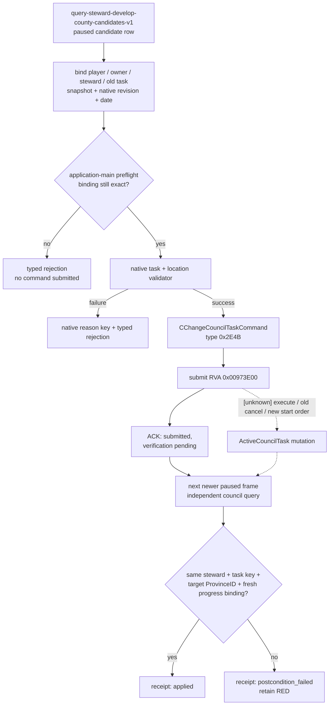

# CK3 1.19.0.6 Steward“提升发展度”动作合同

## 状态与范围

- **[static-confirmed]** 本专题冻结 `task_develop_county` 的原生提交入口、提交前校验、失败语义，以及动作后独立观测必须证明的事实。
- **[static-ready; implementation pending]** 候选输入沿用 `query-steward-develop-county-candidates-v1`。该 query 的生产 reader 尚未实现，因此本文只定义后续 action ABI，不提升 G2-M4 的 live readiness。
- **[unknown]** `CChangeCouncilTaskCommand` 内部执行函数、旧任务 `on_cancel_task_county` 与新任务 `on_start_task_county` 的精确调用顺序、命令完成回调仍未闭合。图中以虚线表示。
- 动作端点只允许固定任务 `task_develop_county`，只消费候选 query 在同一 paused frame 返回的 county identity。它不接受任意 task key、任意 province 或脚本 effect 作为替代输入。
- 本次没有启动 CK3，没有新增 bridge/MCP 代码，也没有 live artifact。

## Exact-build 冻结

| 资产 | 精确值 |
|---|---|
| CK3 build | `1.19.0.6` |
| `binaries/ck3.exe` SHA-256 | `2D00FF3101EF70B566F2FCBAE292F09263199C80E9DC8F139B82D7D96F83DB86` |
| `game/common/council_tasks/00_steward_tasks.txt` SHA-256 | `B3087378E04D0CDF7B1C1BEBF97FD17E36D8684DDD157D4FB0647B1D5681FC4B` |
| `game/common/council_tasks/_council_tasks.info` SHA-256 | `CA9BC5D06ADC414ED8A28B47E4D3BDACDBB30093E94FBD33FE1A80FE518B8A2A` |
| `game/gui/window_council.gui` SHA-256 | `AC142DC4D4F18EEEB241C7B9DBDE1F737DF8D0D7114FF4CA845DC3E9A230BAAE` |
| `game/gui/shared/misc_components.gui` SHA-256 | `6FBD971001D40C23E79033EDDC0E53F32FE814DE056F6F2E67131ECF056196A1` |
| `game/localization/english/council_l_english.yml` SHA-256 | `A20CA21D59E36BFBCB0CC9A94BDFE0532C0DD628DCB727DCDDA2F6EB0E9F02A9` |
| `game/localization/english/gui/council_window_l_english.yml` SHA-256 | `5FAD0338FA3E381107AE253A0472F116B928C0189364E79EF49725B32DBEB221` |

所有 RVA 都以该 EXE 的模块基址为零点。任一 build、EXE 或上述原版定义变化后，本专题先降回未验证，再重新定位命令、校验器与 task 定义。

## 原版动作调用链

### Authored task 门

`00_steward_tasks.txt:133-625` 将 `task_develop_county` 定义为 `councillor_steward` 的 `county/value` 任务：玩家目标范围为 `realm`，目标 location 是 county capital province。

原版在提交和持续运行期间使用以下门：

1. `is_shown` 决定任务是否存在于当前上下文；变为 false 时任务会停止。
2. `is_valid_showing_failures_only` 在 `00_steward_tasks.txt:242-246` 调用 `tgp_natural_disaster_councillor_available_for_task_trigger`。失败时原版界面会禁用任务并显示原因。
3. `potential_county` 位于 `00_steward_tasks.txt:406-451`，负责 county 上限、landless title 与文化等目标过滤；变为 false 时 active task 会停止。
4. `on_start_task_county` 位于 `00_steward_tasks.txt:486-497`，保存目标县当时的发展度；`on_finish_task_county` 位于 `:499-624`。

`_council_tasks.info` 对 `is_shown`、`is_valid_showing_failures_only`、`potential_county`、`valid_county`、`on_start_task_county` 与 `on_cancel_task_county` 的生命周期作了原生 schema 说明。`task_develop_county` 没有另写 `valid_county` block，因此最终合法性仍应交给编译后的通用 task/location validator；action 端不得把一份 Python 复刻条件当作最终裁决。

### GUI 与 AI 汇入同一命令

`window_council.gui` 的任务选择器调用 `GuiPotentialCouncilTask.SelectTaskType`，随后进入 `PotentialTaskLocationWindow` 选择 location。`shared/misc_components.gui:21-24` 提供了更直接的同类入口：

```text
GetPlayer.StartCouncilTaskIn('task_fabricate_claim', County.GetCapital)
GetPlayer.IsCouncilTaskValid(...)
GetPlayer.GetStartCouncilTaskInTooltip(...)
```

EXE 静态反汇编闭合了 `task_develop_county` 应复用的原生提交脊柱：

| 证据 | exact-build 结论 |
|---|---|
| `council_interface_util.cpp` 字符串簇 | 注册 `IsCouncilTaskLocationValid`、`StartCouncilTaskIn` 与 `GetStartCouncilTaskInTooltip` |
| UI 构造点 | RVA `0x0C50889`、`0x0C50F58` 构造 `CChangeCouncilTaskCommand` |
| AI 构造点 | `ai_council.cpp` 区域的 RVA `0x1904C4F`、`0x1904FAB` 构造相同命令 |
| RTTI / primary vtable | type descriptor RVA `0x54D0768`；primary vtable RVA `0x4330790` |
| command object | 大小 `0x50`；task-type internal ID 在 `+0x20`；typed location scope packet 在 `+0x28..+0x48` |
| command type code | RVA `0x26E18F0` 返回 `0x2E4B` |
| command validator | RVA `0x26E1240` 重新解析 task type 与 typed scope，并调用通用 legality path `0x293B860` |
| command submit | UI 与 AI 路径最终调用 RVA `0x00973E00` |

界面路径在替换现有任务时还会构造 `CChangeCouncilTaskInConfirmation`，英文提示键 `START_COUNCIL_TASK_ABORTED` 明确说明当前任务将被中止。动作合同因此必须显式携带“是否允许替换”和预期旧绑定，不能在 stale snapshot 上无条件切换。

`set_council_task` 是脚本 effect，不经过上述玩家命令和失败反馈链。生产 action 应调用经 exact-build 绑定的 `CChangeCouncilTaskCommand` seam；直接施加脚本 effect 无法满足本文的提交与收据合同。



## 原生失败语义

### Input 与通用 council legality

`council_interface_util.cpp` 的 exact-build 字符串簇提供这些输入错误：

- task type 为空或无效；
- location 为空；
- task type 没有 location，却向 location API 提交目标；
- `StartCouncilTaskIn` 收到无效 task type 或 location。

`CChangeCouncilTaskCommand` 的 validator 在 RVA `0x293B860` 中按原生作用域检查并加载下列 localization key。action 返回稳定 typed reason 时应同时保留原生 key，不应自行拼接本地化句子。

| 原生 key / literal | 原版含义 | action typed reason |
|---|---|---|
| `COUNCIL_SAME_CHARACTER` | council owner 与 councillor 是同一角色 | `owner_is_councillor` |
| `COUNCIL_NOT_LIEGE_TASK` | 提交者不是该 councillor 的 liege | `not_councillor_liege` |
| `COUNCIL_CANT_TASK_COUNCILLOR` | 目标角色没有 council position | `steward_has_no_council_position` |
| `COUNCIL_CANT_TAKE_TASK_COUNCIL_TYPE` | 当前 position 与 task 要求的 position 不同 | `wrong_council_position` |
| `COUNCIL_CANT_TAKE_TASK_CHARACTER` | councillor 不满足 task 的角色要求 | `steward_invalid_for_task` |
| `County task target is not a county` | typed target 不是 county location | `target_not_county` |
| `COUNCIL_NOT_VALID_TASK` | task definition / 当前 task legality 无效 | `task_invalid` |

location/task 框架还提供 `COUNCIL_TASK_NOT_IN_DOMAIN`、`COUNCIL_TASK_NOT_IN_REALM`、`COUNCIL_TASK_NOT_BORDERING_REALM`、`COUNCILLOR_NO_CHARACTER_IN_POSITION` 与 `COUNCILLOR_TASK_ALREADY_IN_PROCESS`。其中 `task_develop_county` 的玩家范围是 `realm`，所以超出玩家 realm 的候选必须映射为 `target_not_in_realm`；其它 key 只在 native evaluator 实际返回时透传，不从任务名称猜测。

### Authored gate 与绑定失败

下面的 reason 属于 bridge/action contract。它们必须在 application-main 的最终 preflight 中判定，失败时不提交命令：

| typed reason | 判定 |
|---|---|
| `not_paused` | 动作执行点不是 paused frame |
| `stale_snapshot` | episode、connection generation、snapshot revision、native revision 或 date binding 任一不符 |
| `player_identity_changed` | 当前玩家 full CharacterID 与请求不同 |
| `council_owner_identity_changed` | council owner full CharacterID 与请求不同，或当前 owner 不是玩家 |
| `steward_missing` | `councillor_steward` 当前无人 |
| `steward_identity_changed` | 当前 steward full CharacterID 与请求不同 |
| `active_task_binding_changed` | 当前 task key/type/target 与请求中的旧绑定不同 |
| `replacement_not_authorized` | 当前绑定不同于新目标，且请求未授权中止旧任务 |
| `task_hidden` | native `is_shown` 最终值为 false |
| `task_invalid` | native task validity，包括自然灾害 gate，最终值为 false |
| `candidate_not_from_bound_query` | county title / capital ProvinceID 不能与同帧候选行完整 round-trip |
| `target_invalid` | native final location/potential check 失败；同时返回可用的原生 reason key |
| `already_active_at_target` | 同一 steward 已执行同一 task 且 target ProvinceID 相同；不产生重复提交 |
| `duplicate_request` | 同一 `request_id` 已有确定 ACK 或 receipt |

任何 native reason 都以枚举与原生 key 发布；本地化文本只是 UI 展示，不进入机器判断。无法归类但确由 native validator 返回的失败使用 `native_validation_failed`，并保留 `native_reason_key`、失败阶段和 exact-build 标识，不能改成 generic success。

## 最小 typed action 合同

建议 action 名为 `change-steward-develop-county-task-v1`。它专门表达一次 steward county-task 切换，不扩展为通用 council mutation。

```text
ChangeStewardDevelopCountyRequestV1 {
  schema = "change-steward-develop-county-task-v1"
  request_id

  episode_id
  connection_generation
  snapshot_revision
  native_snapshot_revision
  date_raw

  player_character_id             # full CharacterID
  council_owner_character_id      # full CharacterID; must equal current player
  expected_steward_character_id   # full CharacterID
  expected_active_task {
    task_key
    task_type
    target_kind
    target_id
  }

  candidate_ref {
    source_schema = "query-steward-develop-county-candidates-v1"
    county_title_id               # full title identity
    capital_province_id           # native command location
  }

  allow_replace_active_task       # explicit boolean
}
```

`expected_active_task` 必须完整复述同一 paused frame 的当前 steward 绑定；general task 的 target 为 null。`candidate_ref` 必须与候选 query 返回的单行 identity 精确匹配，不能只传显示名、数组下标或裸 county index。端点内部固定解析 `task_develop_county`，请求没有可变 `task_key` 字段。

DEVACT2 对 MCP 暴露的是上述内部合同的最小投影：

```text
ck3_change_steward_develop_county_task_v1(
  councillor_character_id,
  task_key = "task_develop_county",
  target_county_title_id,
  expected_revision,
  replace_existing_task
)
```

service 必须用 `expected_revision` 对应的 paused snapshot 和同 revision
candidate query 补齐 episode、generation、native revision、date、player、owner、
active-task binding 与 capital ProvinceID；任一项不能精确补齐就拒绝提交。这里保留
`task_key` 只是让调用者显式确认动作类型，唯一合法值仍是
`task_develop_county`，不能借此调用其他 council task。

机器失败同时发布细分 `rejection_reason` 和五类稳定
`failure_class`：`request_contract`、`snapshot_binding`、
`councillor_binding`、`task_or_target_legality`、
`native_command_dispatch`。分类用于下游分流，原版返回的 localization key 仍原样
放在 `native_reason_key`，不会被分类字段替代。

### 提交顺序

1. 进入 application-main 事务，确认 paused、episode/generation、两类 revision、date 与 player 未漂移。
2. 重新读取 council owner、`councillor_steward` incumbent 和当前 active-task binding，逐项匹配请求。
3. 验证 replacement policy。旧绑定与新绑定不同且 `allow_replace_active_task=false` 时停止；若为 true，在 ACK 中记录将被替换的旧绑定。
4. 从绑定候选行重新解析 full county-title ID 与 capital ProvinceID，完成 generation round-trip。
5. 调用 native task/location validator，消费 `is_shown`、task validity、position/character legality 与最终 target legality。失败原因按上节返回。
6. 只构造一次 `CChangeCouncilTaskCommand`，task 固定为 `task_develop_county`，typed location 固定为候选的 capital ProvinceID，然后调用原生命令提交入口。
7. 返回 ACK，并安排下一份更新后的 paused observation 生成 receipt。

## ACK：只证明提交边界

```text
ChangeStewardDevelopCountyAckV1 {
  schema = "change-steward-develop-county-ack-v1"
  request_id
  status = "submitted_verification_pending" | "rejected_before_submit"
  exact_build

  pre_snapshot_revision
  pre_native_snapshot_revision
  submitted_task_key             # fixed task_develop_county, or null on rejection
  submitted_target_province_id   # or null on rejection
  expected_steward_character_id
  replaced_active_task           # bound old task, or null

  rejection_reason               # typed reason or null
  native_reason_key              # exact native key when available
  verification_pending           # true only for submitted status
}
```

`submitted_verification_pending` 只证明请求通过当次 preflight，并已交给原生命令系统。它不能表示：

- active task 已经改变；
- `on_cancel_task_county` / `on_start_task_county` 已经执行；
- 新任务在后续帧仍然合法；
- 目标县已获得 development growth；
- 一次发展度增长已经完成。

因此 ACK 中禁止出现 `applied=true`、`success=true` 或其它可被下游解释为结果已发生的字段。

## Receipt：下一 paused frame 的独立后置验证

receipt 必须来自一次新的只读 council observation，不能复用 request、command object 或 ACK 中的目标值回填。

```text
ChangeStewardDevelopCountyReceiptV1 {
  schema = "change-steward-develop-county-receipt-v1"
  request_id
  status = "applied" | "rejected" | "postcondition_failed"
  reason

  ack
  post_observation {
    episode_id
    connection_generation
    snapshot_revision
    native_snapshot_revision
    date_raw
    paused

    council_owner_character_id
    steward_character_id
    active_task_key
    active_task_type
    target_kind
    target_province_id
    progress_kind
    progress_current_raw
    progress_max_raw
    frozen
  }
  postcondition_verified
}
```

### `applied` 的全部必要条件

1. ACK 是 `submitted_verification_pending`。
2. post observation 仍在同一 episode 与 connection generation，且处于 paused 状态。
3. `snapshot_revision` 与 `native_snapshot_revision` 都严格晚于提交前绑定；`date_raw` 允许不变，因为任务切换不要求时间推进。
4. council owner 仍是同一玩家，`councillor_steward` 仍由同一 full CharacterID 占据。
5. active task key 精确等于 `task_develop_county`，task type 是 `county`。
6. typed target 是 county location，target ProvinceID 精确等于 candidate capital ProvinceID。
7. progress kind 是 `value`；current/max/frozen 均来自 post frame 的 fresh native read，并与该 active task/target 同一次采样绑定。
8. 若 ACK 记录了被替换的旧任务，post frame 中该 steward 的 active binding 已由新 task/target 取代。

只要任一条件失败，receipt 就是 `postcondition_failed`，并保留为 capability RED。常见 reason 包括 `no_new_paused_observation`、`player_or_steward_changed`、`command_not_applied`、`wrong_task_or_target_observed`、`progress_binding_unavailable` 与 `native_task_invalidated_after_submit`。

下一 paused frame 只证明“任务分派已经落入正确 steward、task 和 county”。发展贡献本身需要后续受界定的月度/时间推进 observation；不能用本 receipt 宣称县发展度已经增长。若 target 在提交后、post observation 前失效并触发原版自动停止，即使 ACK 已返回，结果仍是 `postcondition_failed`。

`rejected_before_submit` 可以直接生成 `rejected` receipt，且必须记录没有提交 native command。若以后闭合原生命令完成回调，可把执行期原生拒绝映射为 `rejected`；在此之前，ACK 后未观察到后置条件一律诚实记为 `postcondition_failed`，不能猜测具体执行期失败原因。

## 实现顺序与 readiness

1. 先实现并 live 验收 `query-steward-develop-county-candidates-v1`，保证 candidate row 与当前 council observation 同帧绑定。
2. 按本文冻结 exact-build command factory、validator 和 submit seam；生产实现不得手工写 `ActiveCouncilTask`，也不得使用 `set_council_task` effect 绕过命令。
3. 实现 request preflight、typed ACK 与独立 post observer。
4. 用 paused fixture 先覆盖：无 steward、stale revision、错误 position、realm 外目标、无效 task gate、拒绝替换、合法替换、重复同目标，以及 ACK 后目标失效。
5. 最后用一个真实 paused artifact 验收一次合法切换；只有 receipt 满足全部后置条件，action 才能标为 production-live primitive。

| readiness | 当前值 | 提升条件 |
|---|---|---|
| `develop_county_action_contract_static_ready` | `true` | 本专题冻结请求、失败、ACK 与 receipt |
| `develop_county_native_command_spine_static_ready` | `true` | UI/AI 同命令、validator 与 submit seam 已在 exact build 闭合 |
| `develop_county_command_apply_lifecycle_ready` | `false` | 闭合命令执行回调和 cancel/start 精确顺序，或以独立 postcondition 覆盖所需产品语义 |
| `develop_county_action_implementation_ready` | `true`（static/fixture） | native/Python action、五类失败、ACK 与独立 receipt verifier 已通过聚焦 fixture；此项不代表原生命令 ABI 已认证 |
| `develop_county_action_production_live` | `false` | 新 paused live artifact 获得 `applied` receipt |

DEVACT2 实现了 `change-steward-develop-county-task-v1` 的 native 核心、Python
service/MCP 投影和独立 receipt verifier。exact-build command factory、validator 与
submit ABI 尚未以 observer/capture 证据认证，因此生产 capability 保持不广告；绑定器
也不会仅凭已知 RVA 打开提交路径。下一项施工是用唯一 command observer/capture seam
冻结真实构造参数与提交生命周期，然后再进行一次短 paused live receipt 验收。
