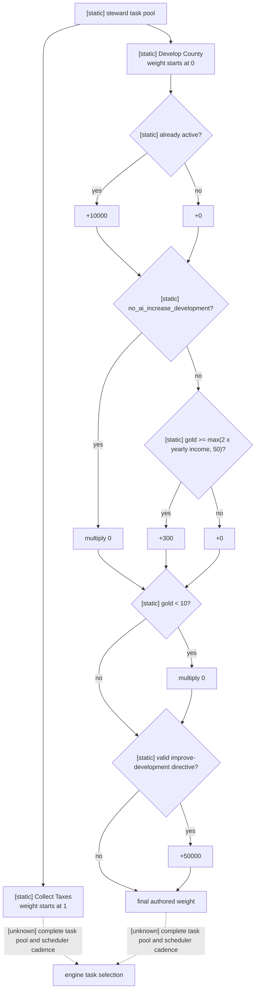
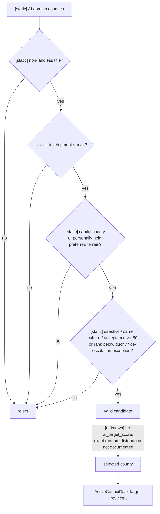

# CK3 1.19.0.6 Steward「发展伯爵领」原生 AI 决策树

## 状态与范围

- **[static-confirmed]** 本专题冻结 `task_develop_county` 与默认
  `task_collect_taxes` 的 authored task 权重、发展目标候选过滤、任务完成后的冷却，以及发展进度的原版数据来源。
- **[unknown]** 引擎何时重新评估 `ai_will_do`、何时在多个正权重任务间抽样、无
  `ai_target_score` 时的精确随机分布和任务切换 command ABI 尚未闭合。图中均以虚线表示。
- **[static-ready; live reader pending]** `query-steward-develop-county-candidates-v1` 的严格 v1 合同、native mailbox/serializer、离线 source fixture、Python service 与 MCP 查询面已经实现；生产 reader 因候选枚举和最终 legality ABI 尚未闭合，只会明确返回 `reader_not_implemented`。本包没有启动 CK3，也没有新增动作。
- 施工范围只覆盖和平治理中最高价值的 steward 发展分支。`task_promote_culture`、
  `task_accept_culture`、`task_convince_dejure` 仍参与完整 steward 任务池，但不在本包内假装已完成比较。
  宫廷司祭及通用 faith/doctrine 系统继续遵守 owner-deferred 边界。

## Exact-build 冻结

| 资产 | 精确值 |
|---|---|
| CK3 build | `1.19.0.6` |
| `binaries/ck3.exe` SHA-256 | `2D00FF3101EF70B566F2FCBAE292F09263199C80E9DC8F139B82D7D96F83DB86` |
| `game/common/council_tasks/00_steward_tasks.txt` SHA-256 | `B3087378E04D0CDF7B1C1BEBF97FD17E36D8684DDD157D4FB0647B1D5681FC4B` |
| `game/common/council_tasks/_council_tasks.info` SHA-256 | `CA9BC5D06ADC414ED8A28B47E4D3BDACDBB30093E94FBD33FE1A80FE518B8A2A` |
| `game/common/script_values/01_dynamic_values.txt` SHA-256 | `049303EFF8ABFDFCADCC31D27E2633A26A2E877E4E2980D4A42C53D6B76D7064` |
| `game/common/script_values/99_steward_values.txt` SHA-256 | `6A4AC7C1E575E54FBA4A3BE06F58146F753629622491FDDAE25D09C439699C3B` |

以下行号均指这组文件的 1.19.0.6 原始字节。任一文件或 EXE 变化后，结论先降回未验证，重新计算 hash 并复核定义后才能继续消费。

## 任务权重：发展与默认收税

### 默认任务 `task_collect_taxes`

`00_steward_tasks.txt:1-130` 将收税定义为 `default_task=yes`、
`general/infinite`。其 `ai_will_do` 从 `1` 开始，按 authored 顺序增加：

1. liege 的正 `ai_greed / 5`；
2. `stewardship_wealth_focus` 加 `15`；
3. `tax_man_perk` 加 `15`；
4. 公爵及以上且 gold `<100` 时加 `500`；否则，较低级别且 gold `<10` 时加 `500`；
5. `conqueror` 变量存在时再加 `500`。

因此收税始终提供正权重 fallback，而且低储备统治者会显著偏向它。这个权重是 CK3 AI 的 authored preference，不是玩家效用或财政最优证明。

### `task_develop_county`

`00_steward_tasks.txt:626-666` 的 authored 权重按顺序执行：

1. 初值 `0`；
2. steward 已在执行该任务时加 `10000`；
3. liege 有 `no_ai_increase_development` 时乘 `0`；否则，gold 达到
   `steward_increase_development_value` 时加 `300`；
4. gold `<10` 时再次乘 `0`；
5. 有效的 `vassal_directive_improve_development` 最后加 `50000`。

`01_dynamic_values.txt:2062-2066` 把发展储备阈值定义为：

```text
steward_increase_development_value = max(2 * yearly_character_income, 50)
```

顺序有实际含义：注释中的“已选就一直做”仍会被后面的冷却或破产门乘为零；有效直属封臣指令在两个乘零门之后加权，因而可以重新产生正权重。没有指令、当前也未在发展时，只有 gold 达到上述阈值才得到 `300`。

这仍不是完整 task-choice 概率。其它 steward 任务也有自己的 `ai_will_do`，而调度器的候选构造、重评 cadence 与最终抽样调用链尚未闭合。



## 发展目标候选树

`task_develop_county` 是 `county/value` task；玩家可见范围是 `realm`，而 AI 专用枚举范围明确收窄为 `ai_county_target=domain`（`00_steward_tasks.txt:133-142`）。

`potential_county` 位于 `00_steward_tasks.txt:406-451`。所有候选必须：

- 不是 landless-type title；
- `development_level < max_development_level`；
- 对有首都的 AI liege，同时满足下列两组条件：
  - 是 liege 的首都伯爵领，或由 liege 亲自持有且 capital province terrain 为
    `oasis`、`farmlands`、`floodplains` 之一；
    - 有效的 improve-development 指令、县与 liege 同文化、两文化接受度至少 `50`、liege 低于公爵级，或 liege 带 de-escalation agenda 且县为异文化，五者至少满足一项。

AI liege 没有首都时，`trigger_if` 不进入这两组附加限制；这不代表一定有可选目标，前面的 domain 枚举、非 landless 和发展上限条件仍然生效。

该 task block **没有** `ai_target_score`。`_council_tasks.info:5-7` 明确：未提供该字段时目标选择完全随机；提供时才对正分目标做 weighted random。因此 exact source 只能证明引擎从合法 domain 候选中随机选择，不能宣称偏爱最低发展、首都、最高回报或某种稳定顺序，也不能从一次 active target 反推排序。



## 进度、完成与冷却

原版把展示进度与实际县发展过程连接起来，而不是单独积累一份 council 计时器：

- `task_current_value` 读取目标县 `development_towards_level_increase`，最大值是 `100`；
- `full_progress` 读取目标县完整 `development_rate`；
- `99_steward_values.txt:164-171` 的基础贡献是
  `0.1 + 0.175 * councillor.stewardship`，随后再叠加关系、perk、dynasty/house、tribal、当前发展惩罚与县发展倍率；
- `00_steward_tasks.txt:453-483` 通过县 modifier 把相应贡献施加到真实
  `development_growth`，所以只读 current/max 不能替代完整 rate；
- AI 每次完成该 county task 都在 `on_finish_task_county` 进入默认任务；
- 月度检测到发展等级实际上升后，通常设置 `no_ai_increase_development` 五年。如果 liege 为国王及以上、realm 内存在与其文化接受度 `<52` 的县，并且未选 `stewardship_domain_focus`，冷却延长为十五年（`00_steward_tasks.txt:520-563`）。

完成回默认、月度 flag 写入和下一次调度器重评的精确先后调用链仍是 **[unknown]**。本文只记录各 authored effect，不把其文本顺序冒充运行时 cadence。

## 当前 observation 能回答什么

现有 [内阁观测专题](council-and-development.md) 已能在支持的标准 landed、非 nomadic 范围同帧回答：

- `councillor_steward` 是否 occupied；
- 当前 stable task key 是否为 `task_develop_county`；
- 当前 target ProvinceID、current/max raw progress 与 frozen；
- 玩家当前 gold、月收入、主头衔 tier 和 capital ProvinceID（来自 campaign-root 其它字段）。

它还不能回答“现在能否合法开始发展”“有哪些合法县”“每县完整发展速度/ETA”“选择后会否改善玩家亲自持有的经济中心”。尤其不能用当前 `player_monthly_gold_income * 12` 代替原版 `yearly_character_income` evaluator，也不能用当前 active target 冒充完整候选集合。

## 下一条最小只读 bridge：优先级

### P0：`query-steward-develop-county-candidates-v1`

先做一个独立、有界、只读 query；不要把全 realm 县明细塞回每回合必读的 campaign-root。最小字段为：

| 字段 | 必要性 |
|---|---|
| player/date/snapshot/native revision 与 steward full CharacterID | 绑定同一 paused frame，复用现有 council owner/incumbent 校验 |
| `task_key=task_develop_county`、`shown`、`valid`、typed failure reason | 消费原生最终 task legality，避免 Python 重写 natural-disaster/ministry 等触发器 |
| 原版最终 `steward_increase_development_value` raw 与当前 gold raw | 精确回答储备门；不得由月收入近似重建 |
| 当前 `no_ai_increase_development`、有效 improve-development directive 的最终布尔结果 | 解释 stock AI authored weight；不暴露任意变量读取 |
| 每个候选的 full county-title ID、capital ProvinceID、holder CharacterID、`is_player_capital`、`directly_held_by_player` | 形成可执行目标 identity，并区分自有长期收益 |
| 每个候选的 final native legality、development level、towards-next-level、完整 monthly rate、max level | 形成最低发展 ROI/ETA 输入；非法行只保留 typed reason，不发布伪值 |
| terrain stable key、`same_culture_as_player`、final cultural-acceptance-threshold result | 解释 exact potential filter；文化只保留稳定 identity/最终阈值结果 |
| `target_selection_mode="engine_random_unscored"` | 明示 stock task 没有 `ai_target_score`，防止下游虚构原版排序 |

查询只枚举当前 task 的 native legal domain candidates，并用 full-generation title/province/character identity round-trip 与双采样拒绝漂移。`faith`、doctrine、tenet 和通用 culture tree 不进入 schema；这里只读取 source 已证明直接参与该 task 过滤的文化相等/接受度最终结果。

#### P0 合同实现边界（G2-M4-DEV1）

公共 capability 为 `game.command.query-steward-develop-county-candidates-v1`，固定 step 为
`query-steward-develop-county-candidates-v1`；MCP 工具
`ck3_query_steward_develop_county_candidates_v1(expected_revision)` 只在 paused snapshot 上执行，并把 public/native revision、日期与 snapshot identity 绑定到同一查询。

v1 payload 固定 `contract_stage=exact_build_contract_fixture_pending_live_reader`。离线 fixture 可以验证完整 available 形状、full-generation identity 往返、重复 ID 拒绝、native-legal-only 候选、双采样与前后 frame 稳定性；这一 fixture 不进入生产模块读取。生产 exact-build 路径在尚无 ABI 时返回 `status=unavailable`、`unavailable_reason=reader_not_implemented`、`readiness=false`、空候选和空观测值，不能把现有 active task 或 Python 重写的 trigger 当成候选结果。

候选顺序原样保留 native 枚举顺序，但 v1 不把顺序解释为分数或偏好；`target_selection_mode=engine_random_unscored` 继续是唯一允许的原版目标选择语义。当前唯一后续逆向入口记录为
`task_develop_county_native_candidate_enumerator_and_final_legality_call`。只有该 exact-build 枚举器、最终 task/county legality、rate evaluator 和 identity round-trip 在真实 paused frame 共同闭合后，才可把 `reader_mode` 从 `contract_fixture_pending_live_reader` 提升并开展有界 live 验收。

### P1：只读 task-pool comparison

在 P0 使“发展哪里”可决策后，再发布同一 steward 的完整 shown/valid task rows 与 final native
`ai_will_do` raw。它用于解释原版行为和离线校准，不应直接当玩家 utility。只有收税与发展两行时不得标记完整，因为 promote/accept/de-jure 任务仍可能参与候选池。

### P2：动作与后置状态

动作包必须复用 P0 返回的同帧 candidate identity，native 端重新执行 task/county legality，再提交一次
`task_develop_county` 切换。ACK 只表示提交；后置查询至少要看到同一 steward 的 active task key、目标 ProvinceID 和新 progress binding，才算 applied。任务切换 command ABI 和冷却/取消成本在这一步施工前继续保持 unknown。

## 对 G2-M4 counter-policy 的直接结论

1. 原版 AI 只在至少 `max(2 * yearly income, 50)` 的储备门后常规启动发展，而低储备时默认收税权重急升；G2 的第一版玩家策略应保留独立应急储备门。
2. 原版目标在 filtered domain 内没有 ROI score。玩家策略没有理由复制随机选择；P0 到位后可先用确定性规则比较“玩家亲持、首都优先、达到下一级所需月数”，并把未纳入的建筑槽、control、税收和风险记为质量差距。
3. 已在发展时的 `+10000` 与完成后的五/十五年冷却说明原版倾向连续完成一次增量、随后轮换；在缺少完整 rate 与任务后置前，planner 不应频繁重派 steward。
4. 当前 bridge 只证明正在发生的任务，不能支撑新动作。M4 的下一施工入口是 P0 候选查询，不是继续用 `life-advance` 等待随机命中，也不是先写猜测性的选县策略。

## 证据边界

- **[static-confirmed]** task 定义、script value、候选过滤、authored weight 与 authored cooldown 来自上表 exact-build 文件。
- **[inference]** “发展一次后轮换”是 completed-task fallback、cooldown 与权重组合的策略解释；scheduler cadence 未闭合，因此不能当 exact 运行时保证。
- **[unknown]** 完整 task pool 最终抽样、无 target score 的具体 RNG 分布、任务切换 command、取消/重派成本与同帧后置 ABI。
- **[live pending]** G2-M4-DEV1 没有 paused snapshot；available 只由隔离 source fixture 证明，生产 reader 明确 typed-unavailable，因此不改变 `council-and-development.md` 已有 production-live 状态，也不把 P0 或 M4 标为 complete。
