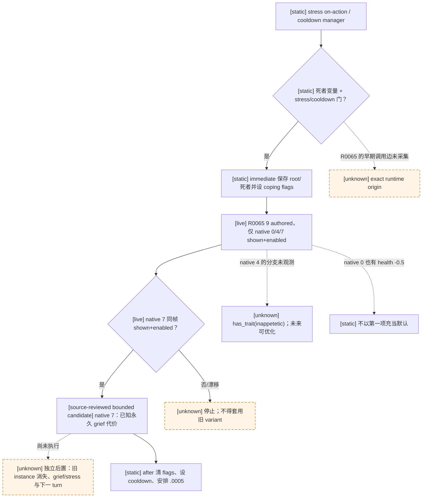

# CK3 1.19.0.6：`stress_threshold_special.1001` 哀伤压力事件

## 冻结证据与状态

- [static-confirmed] 实际运行安装 `Z:\SteamLibrary\steamapps\common\Crusader Kings III`，
  EXE `binaries/ck3.exe` SHA-256
  `2D00FF3101EF70B566F2FCBAE292F09263199C80E9DC8F139B82D7D96F83DB86`；
  PRV-005 R0065 operator receipt 指向该安装，正式报告的 adapter 为
  `ck3-1.19.0.6-msvc-x64`。报告自身 `identity.ck3_executable_sha256=null`，
  因此 EXE 哈希取自 operator manifest 和本轮实际文件复核，而非该空字段。
- [production paused read-only；回复 RED] R0065 冻结报告
  `Z:\ck3_mod_rewrite_process_assets\g2-preview-prv005-r0065-red-20260922\formal-report.raw.txt`
  SHA-256 `FA25A1E46DC1B5657EC195030E7B902C09FB5B37D71EF5D158F64E85DB649F43`。
  普通 `xar_off` 封建 campaign 的 `native_auto_run` 从 checkpoint 冷启动，
  `life-advance` 将日期 `53284608→53284680` 后自然出现事件；不是手动选项或强制触发。
  同一 paused frame `native:19`、public revision 20 / native revision 19，玩家/事件 root
  `31853`，事件 instance `9`。第 17 turn 以
  `registered_contract_requires_extended_consumer` 阻塞，零选项提交；这个 RED 保留。
  冻结 checkpoint `xar_checkpoint.ck3` SHA-256
  `C58725E54501D1925EB4E402F4C3EF08606DE77823DF8703D4936338A4572273`。
- [live read-only] 同一冻结目录的 `driver-state.json` SHA-256
  `1E8EC91F2301BA410A245648A271141C5892E9B9DB8F0BD379C42E3B6F9B3B3F`，
  `command_history[index=1863].result.current_event_window_context` 保存了完整
  同帧 context：root 是 character `31853`，saved scopes 为
  `stress_character=31853`、`deceased_character=36403`，**无** `confidant`。
  它仍未发布玩家 `has_trait(inappetetic)` 的 true/false。
- [static-confirmed] 原版 `game/common/on_action/stress_on_actions.txt` SHA-256
  `35A9B8FC8FE6CDE91EAAD06F9C90AD6FCD41BEEFD317BFF77D3A68430E5DD839`；
  `game/events/stress_events/stress_threshold_events.txt` SHA-256
  `66538A8FE8C894A52D8EC89B2FC4A45B85B8D1B9464802263E45D582CE1CA42B`；
  事件定义 `game/events/stress_events/stress_threshold_special_events.txt:44-498`
  SHA-256 `768CBA7DB6270BB2FE25D9EEE37D2F24483EE309A2496DD9A539673EF094F709`。
  相关 `common/scripted_effects/00_stress_effects.txt` SHA-256
  `3CD9F4F5F800E8C94D31F1841C93EB70F430B00064AFAE61D7C388F50BD7E612`。

## 原版触发、选项与 AI 树

`on_stress_level_1/2/3` 的三日延迟列表可调用自由角色的
`stress_threshold.0001`（on-action 第 15–57 行）；该 manager 在压力级别/冷却门
通过且 `mental_break_deceased_character` 变量存在时，六个分支均直接
`trigger_event = stress_threshold_special.1001`（manager 第 53–178 行）。
`stress_threshold.0005` 也能在冷却后重进 manager。R0065 证明该事件在正式
日期推进后自然呈现，但 compact 报告没有保留是哪一条早期 on-action/manager
调用边；不要把静态候选误记为动态堆栈。

事件 `trigger` 要求 deceased-character 变量存在；`immediate` 把 root 保存为
`stress_character`，把该变量保存为 `deceased_character`，并按压力、关系、特质、
可获得的倾诉者与 `has_two_stress_threshold_options` 设置最多两个 coping flag；
末尾必调用 `stress_threshold_event_post_immediate`。`after` 必调用
`stress_threshold_event_aftereffects`，清 option flags、设压力事件冷却并安排
`stress_threshold.0005`。这些是事件生命周期效果，选择任何一项都不能跳过。

下表编号是原版 authored zero-based **native option index**，不是画面上连续的
rendered index。九项均无 authored `ai_chance` / `ai_will_select`；按已冻结的
[原生事件选择器](events-and-interactions.md#原生-ai-的事件选项树)，各个通过
trigger 的候选使用默认 AI 权重 `1`，再受选择器 mode/exclusive/fallback 规则影响。
事件本身的 `weight_multiplier={base=1}` 是事件权重，不能当作选项效用或玩家推荐。

| native | 出现门（定义内） | 选择效果（不含共同 after） |
|---:|---|---|
| 0 | `stress_threshold_option_depression` | 加 `depressed_1`；authored major stress impact `-65`。该 trait 有健康 `-0.5`、生育 `-0.1` 与四项能力 `-1`。 |
| 1 | `..._drunkard` | 若已有 drunkard，三年 drinking-binge modifier；否则加 drunkard；medium impact `-30`。 |
| 2 | `..._hashishiyah` | 若已有 hashishiyah，三年 stupor modifier；否则加该 trait；medium `-30`。能否出现的原生信仰/区域判定保持 opaque。 |
| 3 | `..._flagellant` | 缺 trait 时加 flagellant，随后 `increase_wounds_effect(REASON=whipping)`；medium `-30`。 |
| 4 | `..._inappetetic` | **已有 trait** 则执行 `inappetetic_advance_starvation_effect`；否则加 inappetetic；medium `-30`。饥饿 effect 可逐级升级，第三级再用会 `death_malnourishment`。首次 trait 本身为外交 `-1`、武勇 `-3`，无直接健康减值。 |
| 5 | `..._journaller` | 缺 trait 时加 journaller，加五年 `stress_managed_grief`；medium `-30`。 |
| 6 | `..._confider` | 缺 trait 时加 confider，加五年 managed-grief 与双方 `trust_opinion +20`；medium `-30`。必须有经原版选择的 `confidant` scope。 |
| 7 | `NOT has_trait=lunatic_1` | 无期限 `stress_frozen_grief` modifier；medium `-30`。modifier 为健康 `-0.5`、外交 `-2`、计谋阶段延长。 |
| 8 | `has_trait=lunatic_1` | 无期限 `stress_stuffed_corpse` modifier；massive impact `-100`。 |

其中 stress impact 基数来自 `common/script_values/00_stress_values.txt:31-35`
（SHA-256 `104A7EF94EE9DA1092F23AEB2FD9DC971B08C695415F3B7EBFB628F381D26395`），
不是保证运行时恰好减少该数值。trait 与 modifier 数值分别来自
`common/traits/00_traits.txt:5026,5157`（SHA-256
`079F0AB5C4224C505AB9F25BCA80D8DF296E5899BFAB26049CE5FE794DC0B042`）
和 `common/modifiers/00_stress_effect_modifiers.txt:3`（SHA-256
`B488F35D8925AEEA9909AA77208EB46EC4428F74D73D7346FD8055400370FD13`）。

## R0065 的选择边界与最小只读缺口

R0065 的实际物化顺序严格是 rendered `0→native 0`（depressed）、
`1→native 4`（inappetetic）、`2→native 7`（frozen grief），三项均
`shown=true, enabled=true`。`effect_indicators` 分别显示 depressed trait+降压、
inappetetic trait+降压、仅降压；但其 `complete_effect_set=false`，
`effect_preview_ready=false`，资源/关系 delta 均 unavailable，不能用图标断言
native 4 一定走 `else add_trait` 而非饥饿分支。报告仅写
`root_scope_ready=true` 与 `saved_scopes_ready=true`；完整冻结 driver 补足了
`deceased_character=36403` 及无 `confidant` 的事实，但仍没有玩家
`has_trait(inappetetic)` 真值。native 7 的物化 trigger 在**这个同帧**证明
`NOT has_trait(lunatic_1)`；它不依赖 deceased/confidant 的选择效果分支，
也不能替代 native 4 所需的 inappetetic 分支判定。

已有 registry 的该 key 仅有 `[1,6,7]`、`[1,4,7]`、`[0,1,7]` 三个 source-bound
variant；本帧 `[0,4,7]` 是新形状。其旧 root `29037`、日期或旧 scope 不能移植到
玩家 `31853`，应由 `$player` 与同帧 `stress_character` 关系承载新 variant，
也不能把组合拼成 Cartesian variant。当前 direct consumer 对
`character_scopes`、`character_scope_differs_from`、
`unique_character_scope_excludes` 和 `option_variants` 全部拒绝，故 RED 是真实
合同阻塞，不可改成 generic first-click。

当前 B0 的最小 bounded 合同可**不等**新的 trait query：只在 exact
build/key/instance/root、`stress_character=player`、deceased full ID 有效且
不同于 root、无额外不匹配 scope、唯一 `[0,4,7]` shown+enabled 投影全部
同帧成立时，选择 authored option 8 / native index 7。该选项自己的唯一
`NOT has_trait(lunatic_1)` 门已由游戏物化 enabled row 证明，效果没有其它
动态分支；完整原版定义已明确其**无期限** `stress_frozen_grief`：健康 `-0.5`、
外交 `-2`、压力获得倍率 `-0.2`、计谋阶段变长。这是主动接受已知的长期
质量代价以解除强制事件 B0，不是“无害”、完整效用最优或 G2 事件质量通过。
不能将 native 7 规则扩成按 option number 猜测的通用 fallback。

未来若要改选可能更好的 native 4，才需要在**同一 paused event frame**
从 root 发布只读 `has_trait(inappetetic)` true/false 和读取状态；unknown/null
不能当 false。有 trait 时可能逐级饥饿至死；没有 trait 时才是首次加 trait。
当前只为 native 7 的 B0 复验，复用既有 saved-scope 身份与 stress-points
observer 即可，不另起通用 trait 框架。执行后需独立 paused frame 确认旧
instance 消失、同角色且 `pre_stress_points>0` 时压力点实际下降，随后由
下一 turn 消费与 checkpoint/cold restore 证明不重复；modifier 若可独立
读取则另行对账，未读到时不能声称已观察到它。如果压力已为零或压力点
没有实降，不能只凭 ACK/旧 ID 消失冒充物质结果；届时才补
`stress_frozen_grief` 的最小只读状态。R0065 尚未提交选项，
本门仍为 RED。此规则只覆盖当前普通封建哀伤事件，不扩展宗教域或所有压力事件。
