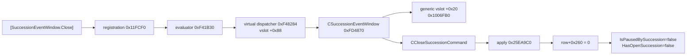

# CK3 1.19.0.6：`SuccessionEventWindow.Close` 原生反射链

## 结论

本页只绑定以下冻结版本，结论来自只读 PE、RTTI、reflection registration 与反汇编；研究过程没有启动 CK3：

- CK3：`1.19.0.6`
- `ck3.exe` SHA-256：`2D00FF3101EF70B566F2FCBAE292F09263199C80E9DC8F139B82D7D96F83DB86`
- PE image base：`0x140000000`
- 原版 `game/gui/window_succession_event.gui` SHA-256：`5925DE3F28CD00FF8D50F345FC4DE389AFF06FA3A7D89955DDDAA613E2DA12E4`

[static-confirmed] GUI 表达式 `[SuccessionEventWindow.Close]` **不等价于**直接调用
`CInGameView` 的 vslot `+0x20` / RVA `0x1006FB0`。它经 reflection evaluator 对 receiver 调用
vslot `+0x88`。对于 `CSuccessionEventWindow`，该 slot 是专用函数 RVA `0xFD4870`。专用函数先做通用
view close，再在普通继承结算分支构造并提交 `CCloseSuccessionCommand`。命令 apply 最终清除
`succession row +0x260`；`IsPausedBySuccession` 和 `HasOpenSuccession` 正读取同一个 byte。

因此，只调 `+0x20` 会隐藏窗口，但不会提交继承关闭命令，也不能保证解除 succession pause。这个差异解释了
R778 中“native ACK 成功、窗口 close 已调用、下一观察仍为 `death_succession_modal`”的真实 RED。

## Reflection registration 与 evaluator

原版 GUI 在直接关闭按钮和 `ruler_transition_reset` 动画结束时都使用
`[SuccessionEventWindow.Close]`。`SuccessionEventWindow` 字符串只有一份，位于 RVA `0x4110EA0`；其直接
LEA xref 是 `0xFD88F0`，属于类型初始化函数 `0xFD88A0`。

`Close` 是编译器合并的共享 literal，位于 RVA `0x40E72FC`。继承窗口自己的 reflection 初始化表在
RVA `0x3FDE900` 保存注册函数 `0x11FCF0`。该函数把 `Close` 注册到 callback `0xF41B30`：

| 层 | RVA | 精确行为 |
| --- | ---: | --- |
| member registration | `0x11FCF0` | 构造名称 `Close`，向 reflection registry 提交 callback `0xF41B30` |
| evaluator | `0xF41B30` | `RCX == null` 返回 false；否则调用 `0xF48284` 并返回 true |
| virtual dispatcher | `0xF48284` | `mov rax,[rcx] ; jmp qword ptr [rax+0x88]` |
| succession specialization | `0xFD4870` | `CSuccessionEventWindow` primary vtable `0x4111E80` 的 slot `+0x88` |

`0xF41B30` 是多个 game-view `Close` registration 共用的 evaluator；决定实际语义的是 receiver 的
`+0x88` virtual slot。不能把共用 evaluator 地址解释为通用 `+0x20` close。

## 专用 close 与命令

`void __fastcall 0xFD4870(CSuccessionEventWindow* this)` 的顺序如下：

1. 通过 `this` 的 vslot `+0x20` 调通用 close。当前 exact build 中目标是 `0x1006FB0`，负责隐藏 root 和
   linked views。
2. 当 `this+0x1EC == 0` 且 `this+0x330 == 0` 时，构造 `CCloseSuccessionCommand`。
3. 把命令交给原生 command queue；这是排队/apply 边界，调用返回不等于游戏状态已更新。
4. 处理该窗口自己的 controller/destiny 相关收尾。

`CCloseSuccessionCommand` 的 exact-build RTTI 和 vtable：

| 项 | RVA / offset |
| --- | ---: |
| type descriptor | `0x54C0128` (`.?AVCCloseSuccessionCommand@@`) |
| primary COL / vtable | `0x4962FB0` / `0x4322358` |
| secondary COL / object offset / vtable | `0x4962FD8` / `+0x18` / `0x4322328` |
| secondary vtable apply slot | `+0x08 -> 0x25EA9C0` |

[static-confirmed] `0x25EA9C0` 的 `RCX` 是 secondary receiver（primary command `+0x18`）。它读取
`secondary+0x08`（primary `+0x20`）的 character identity 和 `secondary+0x0C`（primary `+0x24`）的
row identity，然后：

1. 从 `module+0x570E068` 取 game state，再取 `game_data = *(game_state+0xA0)`；
2. 遍历 `game_data+0x1D548` 的 row pointer array，count 在 `+0x1D554`；
3. 要求 `row+0xB0` 匹配 character identity；
4. 要求 `row+0x260 != 0` 且 `row+0xD8` 匹配 command row identity；
5. 在 RVA `0x25EAA44` 写 `row+0x260 = 0`；如 `row+0x2C8` 有附属状态，再清理并置零。

这与已有只读 observer 完全相接：`IsPausedBySuccession` core `0xA05A90` 扫描任意 row 的
`+0x260`；`HasOpenSuccession(Character*)` core `0xA05B20` 匹配 `row+0xB0` 后读取同一个 `+0x260`。

## 实现和验收边界

- 只能在 application-main/UI owning thread 上，对当次重新获取并验证 vtable 为
  `module+0x4111E80` 的 controller 调 vslot `+0x88`。
- 不应从 bridge 直接调用 evaluator `0xF41B30`、dispatcher `0xF48284` 或 command apply
  `0x25EA9C0`；reflection receiver 和 command queue 生命周期必须保留。
- typed action 每轮最多提交一次。提交后只做 bounded read-only polling，不得因为即时观察未更新而再次 Close。
- material success 必须来自后续独立观察：同一角色/episode binding 下
  `HasOpenSuccession=false`、`IsPausedBySuccession=false`，随后 production path 日期推进。
- 冷恢复先查实际 row 状态，再决定继续确认或在新轮次合法提交；ACK 不能代替 row 后置条件。
- 本次静态闭合不打开 public registry、capability advertisement 或 MCP action。

## 可复现证据

独立证据包：
`C:\ck3_mod_rewrite_process_assets\g2-m3-succession-reflection-close-20260916`。
其中 `succession-reflection-close-v1.json` 固化注册、RTTI、ABI、行字段、函数边界哈希和禁止推断；
两份 disassembly 文件保留关键机器指令。升级 CK3 时必须重新定位并复核整条链，不能沿用本页 RVA。
