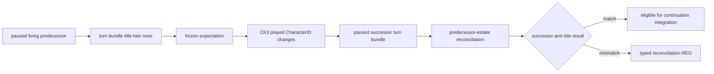

# Succession transition v1

## Status and purpose

- **[static-ready, integration/live pending]** The pure contract freezes the
  current engine-calculated first heir of every title held by the living
  episode ruler, then reconciles that bounded predecessor-title set after CK3
  changes the played character.
- The expectation consumes `xar.ck3.turn-bundle/v1`; it adds no new native
  read. The post-transition comparator consumes the first paused successor
  snapshot and a same-frame successor turn bundle.
- Native AI decision-tree research is N/A for this component. It records and
  checks an engine state transition; it does not copy or counter an AI choice.

## Contract boundary

The frozen expectation binds:

- pre-death snapshot/public/native revision and date;
- episode run and predecessor CharacterID;
- expected primary-title successor;
- every predecessor-held county-or-higher TitleID and its current first heir;
- the existing `single_successor / split_successors / no_primary_heir` risk.

Reconciliation is admitted only when the driver observes a paused
`played_character_changed` terminal, the old episode CharacterID still matches
the predecessor, and the post-transition snapshot and turn bundle have the
same frame identity. It reports:

- whether the actual played successor matches the expected primary heir;
- predecessor titles inherited as expected;
- expected inherited titles that are missing;
- predecessor titles predicted for another/no heir but retained by the played
  successor;
- titles held by the successor that were not part of the predecessor estate.

The last category is informational. A successor may already own titles before
inheritance, so those titles cannot be treated as an inheritance mismatch.
Likewise, an absent predecessor title is not assigned an invented current
holder: the present campaign-root query sees only the played ruler's holdings.

## Deliberate omissions

This v1 does not infer succession law, eligibility reasons, claims,
hypothetical law changes, or the actual holder of a title absent from the new
player's holdings. These require additional native observations only when they
block a concrete survival decision.

The contract does not yet change the one-life terminal policy. The next G2-M3
package must retain the latest valid expectation in driver state, produce this
reconciliation at the real transition, and expose a distinct continuation
path that does not confuse inheritance with immutable-seed replay.

## Focused verification

The unit suite covers exact expectation freezing, split inheritance, a
successor's pre-existing title, missing/retained predecessor titles, unexpected
successor identity, no-primary-heir risk and cross-frame rejection. No CK3
process or desktop input is needed for this static package.
