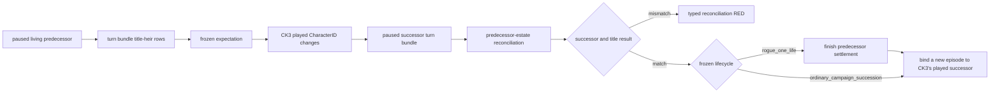
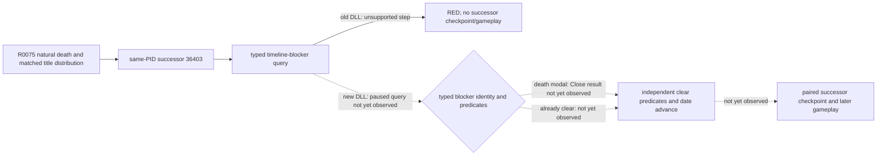

# Succession transition v1

## Status and purpose

- **[static-ready, production live pending]** The contract and planner integration freeze the
  current engine-calculated first heir of every title held by the living
  episode ruler, then reconciles that bounded predecessor-title set after CK3
  changes the played character.
- The expectation consumes `xar.ck3.turn-bundle/v1`; it adds no new native
  read. The post-transition comparator consumes the first paused successor
  snapshot and a same-frame successor turn bundle.
- The same reconciliation now has two explicitly bound lifecycle consumers.
  `rogue_one_life` preserves the mod's scored terminal settlement;
  `ordinary_campaign_succession` is limited to a frozen `xar_off`, fresh
  no-pact production campaign and can continue without that settlement.
- Native AI decision-tree research is N/A for this component. It records and
  checks an engine state transition; it does not copy or counter an AI choice.

## Contract boundary

The frozen expectation binds:

- pre-death snapshot/public/native revision and date;
- episode run and predecessor CharacterID;
- expected primary-title successor;
- every predecessor-held county-or-higher TitleID and its current first heir;
- the existing `single_successor / split_successors / no_primary_heir` risk.

Reconciliation is admitted only when the driver observes a paused
`played_character_changed` terminal, the old episode CharacterID still matches
the predecessor, and the post-transition snapshot and turn bundle have the
same frame identity. It reports:

- whether the actual played successor matches the expected primary heir;
- predecessor titles inherited as expected;
- expected inherited titles that are missing;
- predecessor titles predicted for another/no heir but retained by the played
  successor;
- titles held by the successor that were not part of the predecessor estate.

The last category is informational. A successor may already own titles before
inheritance, so those titles cannot be treated as an inheritance mismatch.
Likewise, an absent predecessor title is not assigned an invented current
holder: the present campaign-root query sees only the played ruler's holdings.

## Frozen lifecycle binding

The lifecycle is part of the driver state, semantic snapshot, checkpoint
metadata, continuation receipt and `native-auto-run` report. Restoring a
driver state under a different binding fails closed. The production binding
is derived from the prepared environment manifest:

| Lifecycle | Required rule/profile | Death behavior |
| --- | --- | --- |
| `rogue_one_life` | `xar_enabled=xar_on`; pact settlement remains required | Run and verify `death-terminal`, then continue only after a matched reconciliation |
| `ordinary_campaign_succession` | `xar_enabled=xar_off` plus an explicit fresh-campaign/no-pact contract | Continue a matched real successor directly; do not register or execute `death-terminal` |
| `unknown` | Missing, malformed or inconsistent binding | Register neither continuation nor settlement; stop on the terminal frame |

The no-pact assertion is not inferred from a missing settlement. This prevents
an old signed-pact save from being relabelled as an ordinary campaign. The
ordinary entry is `native-auto-run --cold-start-checkpoint
--succession-lifecycle ordinary_campaign_succession
--ordinary-campaign-no-pact`; its manifest guard rejects the command unless
the prepared profile selects `xar_off`, and the checkpoint lifecycle must bind
the same environment digest. An unanchored `continue_last_save` is rejected.

This package does not manufacture that first ordinary checkpoint. A separate
fresh 1066 production start under the same prepared `xar_off` profile must
create it and persist the lifecycle binding before this entry becomes runnable.
Until that seed preparation is completed and live-verified, ordinary campaign
succession remains static-ready rather than production-live.
The controlled seed route and its evidence boundary are recorded in
[FEUDAL-1066-START-B0](feudal-1066-private-start-glue.md#ordinary-xar_off-seed-binding).

## Deliberate omissions

This v1 does not infer succession law, eligibility reasons, claims,
hypothetical law changes, or the actual holder of a title absent from the new
player's holdings. These require additional native observations only when they
block a concrete survival decision.

The planner service refreshes the retained expectation on each eligible
paused living frame. On `played_character_changed`, it queries the first
eligible paused successor frame and reconciles the predecessor estate before
planning another action. In `rogue_one_life` it first completes the
predecessor's `death-terminal` settlement. In
`ordinary_campaign_succession` it does not require or advertise that terminal
settlement. Both paths expose `continue-as-reconciled-successor` only for a
fully matched reconciliation. That continuation sends no CK3 command and
performs no process restart. It keeps the current campaign and creates a fresh
episode identity bound to CK3's already-played successor. Before any later
gameplay, the runner immediately saves and verifies a checkpoint whose episode
identity and lifecycle match the successor.

An unavailable or mismatched reconciliation blocks the continuation. The
strategy does not fall back to `start-next-episode` for a
`played_character_changed` terminal, because immutable-seed replay would hide
the real succession result. Immutable-seed replay remains available for the
separate dead/missing-character terminal paths.

## Focused verification

The unit suite covers exact expectation freezing, split inheritance, a
successor's pre-existing title, missing/retained predecessor titles, unexpected
successor identity, no-primary-heir risk and cross-frame rejection. No CK3
process or desktop input is needed for this static package.

## Driver-state integration

The native driver now exposes three private runner methods: retain a same-frame
expectation, reconcile the retained expectation, and read the transition state.
The retained expectation is an additive optional member of the existing
`driver-state.json` v2 envelope. Old v1/v2 files without the lifecycle member
may migrate only to the legacy `rogue_one_life` plus `xar_on` profile; ordinary
campaign restore rejects them. A same-PID hot recovery restores the retained
expectation only after strict schema and episode identity validation.

A cold checkpoint restore, immutable-seed episode start, Phase 2 source staging,
or explicit operator player rebind clears both expectation and in-memory
reconciliation. These operations create a different physical frame or identity;
the runner must query a fresh turn bundle instead of reusing an earlier
projection. A natural `played_character_changed` transition keeps the old
expectation long enough to compare the first paused successor frame.

The focused contract, service, strategy and driver suite covers automatic
capture/reconciliation, same-PID recovery, ordinary matched continuation with
no settlement, the unchanged rogue settlement prerequisite, zero CK3
command/restart, profile mismatch and unknown-lifecycle fail-closed behavior.
The existing immutable-seed replay path is retained for its distinct rogue
dead/missing-character terminal case. The focused succession suite passes
`12/12` in normal and optimized Python; the directly affected bounded-runner
suite passes `75/75` in both modes. The lifecycle/driver suite passes `13/13`,
the native-session propagation suite passes `27/27`, and the explicit
`xar_off` rule/profile prepare-and-verify tests pass in normal and optimized
Python.

The bounded `native-auto-run` owner records the frozen lifecycle before bridge
startup. For the ordinary profile it treats a reconciled
`played_character_changed` frame as continuation-ready without manufacturing
an XAR settlement, executes the next planner turn, and verifies the
continuation before resuming gameplay. Its report contains the lifecycle and a
`natural_succession_transitions` ledger with the predecessor/successor IDs,
old/new episode run IDs, matched reconciliation, unchanged process/frame proof,
and explicit zero CK3 command/restart fields. The strict one-generation owner
still stops at death, and the immutable-seed next-episode owner keeps its own
separate lifecycle. Focused runner boundary tests pass `4/4` under normal and
optimized Python. Production readiness still requires one bounded
natural-death artifact proving the sequence against the exact build.

The ordinary bounded owner now also consumes the exact succession timeline
surface before it saves the new successor checkpoint. It first queries the
private typed blocker context. An already-clear controller is recorded without
an action; an exact death/succession modal is closed once through the reflected
typed action and must independently report both succession predicates false
plus a later date. Any other identity or unknown field is RED. The full
R792/event/succession observation contract is recorded in
[R793 ordinary natural-event and succession long-run contract](r793-natural-event-succession-long-run-contract.md).
If that proof advance opens another typed player decision, the immediate
successor checkpoint is deferred until a formal turn consumes the decision;
the owner never saves through a known modal.

## R781 scope decision

R781 used an `xar_on`, signed-pact checkpoint. Exact-source evidence shows its
death carrier schedules `xar.1001`, and both authored options set
`xa_quit_to_menu`. Leaving the event unanswered hard-pauses the game; selecting
either option intentionally ends player control. This is the main mod's
one-playable-life rule, not a generic event-resolution defect.

R775/R781 therefore remain useful partial evidence for natural death, the real
played-character change, title reconciliation and the first successor frame,
but they cannot be continued as the formal ordinary campaign. Changing their
rule, mod bytes or save flags would invalidate the frozen candidate. The next
formal candidate must start as a fresh ordinary standard-feudal production
save under the `xar_off` profile and collect successor gameplay, checkpoint and
cold-restore evidence in that same campaign.

## R676 celestial council prerequisite RED

R676 exposed a prerequisite scope bug before the first expectation could be
retained: the campaign-root reader attempted its standard five-seat council
layout on CharacterID `32904`'s celestial government and returned
`council_unavailable`. No gameplay command was submitted and cleanup was
GREEN. The native scope repair leaves celestial council typed unavailable but
allows the same-frame succession and held-title data to reach the turn bundle.
R677 confirmed that this scope gate moved the first-query failure past council;
it does not justify a natural-death long run.

## R677 selected-rule prerequisite RED

R677 stopped on `selected_game_rule_tokens_unavailable` after the celestial
council repair admitted the remaining root fields. It submitted no gameplay
command, did not advance the date, and completed cleanup GREEN. Because the old
campaign-root contract collapsed on that optional lookup, the planner still
could not retain its first succession expectation; R677 therefore remains RED.

The revised campaign-root contract treats selected game-rule tokens as an
optional component: on lookup failure the root stays `status=available`, the
tokens are empty with count zero, and both
`selected_game_rule_tokens_ready` and root `ready` are false. The observed
title, held-title partition and ordered heir fields remain available. A turn
bundle can therefore be constructed; for this celestial ruler it is `partial`
because the standard council component is outside scope. Succession expectation
capture accepts an available or partial turn bundle and consumes only its
same-frame ruler/succession fields, so neither optional selected-rule tokens nor
the unsupported celestial ministry is allowed to hide the engine's current
heir projection.

## R782-R783 ordinary lifecycle bootstrap and cold restore

R782 is the first real fresh `ordinary_campaign_succession` seed on the frozen
CK3 build. The prepared environment had exactly `xar_enabled=xar_off`, the
fresh/no-pact contract, environment SHA-256
`C7B09849F0B61E9F6418D10D47506919586D54BCBDAA8A4FED5217E6400B089F`,
and a public paused root for CharacterID 31853 in standard feudal government.
The checkpoint result, persisted driver top level, `last_checkpoint`, and the
matching history anchor carried the same lifecycle binding.

R783 proved a true new-process cold restore of that pair through formal
`native-auto-run`. Readiness reported `driver_state_restored=true`, restore kind
`cold_checkpoint`, the same episode `native-31853-af642d76cb41`, and the same
lifecycle/environment binding. The 20-turn run produced a typed declaration,
independent active-war state, next-turn consumption, further army gameplay,
two paired checkpoints, and complete process reclamation. Its final checkpoint
at `date_raw=53145000` is save `74294B03...EDF1A`, driver
`354D4DE3...FE34B`. Evidence and limits are recorded in
`C:/ck3_mod_rewrite_process_assets/g2-r782-ordinary-xar-off-seed-20260916/r783-verdict.json`
(SHA-256 `8F9F6D1A...D9FA7F`).

No natural death occurred in R782/R783, so these rounds validate lifecycle
binding and ordinary cold recovery but do not complete the natural-successor
gate. G2-M3 and the global G2 authority therefore remain unchanged.

## R0075 ordinary natural succession: native build mismatch RED

CK3 `1.19.0.6`, EXE SHA-256
`2D00FF3101EF70B566F2FCBAE292F09263199C80E9DC8F139B82D7D96F83DB86`;
PRV-007 agent commit `b56c068764ca767d0662d8f8414d9f01fec61d09` used native
DLL SHA-256 `DA06EFC38BD3F32D83FE4C057737794A2AEEB6472BD928E119464B8AC2335F99`
from native source `434f832d79ca79605218c0e8faba1a00f0bc6b6c`.
R0075 naturally changed played CharacterID `31853 -> 36403` at
`date_raw=53302824` in the same ordinary campaign/PID. The predicted successor
and inherited TitleIDs `524, 525, 530` matched. The new episode bound without a
CK3 command or restart. These are production-live succession/reconciliation
observations, not successor gameplay or natural-continuation completion.
The next formal turn attempted the private typed
`query-current-timeline-blocker-context-v1` and native returned
`unsupported native gameplay step` before a blocker result or successor
checkpoint. No option/Close was submitted. The frozen R0075 evidence manifest
is `Z:/ck3_mod_rewrite_process_assets/g2-preview-prv007-r0075-natural-succession-red-20260922/evidence-manifest.json`
(SHA-256 `42E8BDCDD598E82DC63FFB3855425EF6AB29F2F5CA14107C058A9DBA0DB9803D`).

The source already implements both the exact read-only query and reflected
typed Close. `native_bridge/CMakeLists.txt` defaults
`XAR_CK3_ENABLE_G2_DEATH_SUCCESSION_MODAL_PRIVATE_V1=OFF`; that macro guards
the owning-thread executors, native step admission and query/Close dispatch in
`native_bridge/src/bridge.cpp`. The frozen DLL contains neither typed step
literal, matching the observed unsupported-step response. This is a compiled
native feature mismatch against Python's ordinary-successor consumer, not a
missing successor field that can be mapped to false or a reason to skip the
timeline check. A new, separately identified DLL must be built with that
private option `ON`; public adapter registration and MCP advertisement remain
unchanged. The ordinary preview packager now rejects DLLs missing either
private step. Static binary presence is only packaging evidence; a fresh
paused query and independent Close/result proof are still live gates.

The R0075 post-RED driver is a newly bound successor state, not a matching
pair for its pre-death save. The last physically frozen compatible pair is the
R0074 checkpoint/driver (save SHA-256 `B836D93E...92683`, driver SHA-256
`4C7278F0...364D3`). Do not stitch the R0075 files or claim a cold restore
until a real paired checkpoint is produced by the new version.
