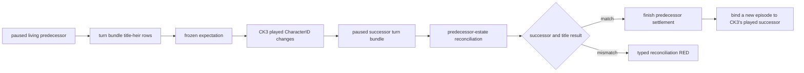

# Succession transition v1

## Status and purpose

- **[static-ready, production live pending]** The contract and planner integration freeze the
  current engine-calculated first heir of every title held by the living
  episode ruler, then reconciles that bounded predecessor-title set after CK3
  changes the played character.
- The expectation consumes `xar.ck3.turn-bundle/v1`; it adds no new native
  read. The post-transition comparator consumes the first paused successor
  snapshot and a same-frame successor turn bundle.
- Native AI decision-tree research is N/A for this component. It records and
  checks an engine state transition; it does not copy or counter an AI choice.

## Contract boundary

The frozen expectation binds:

- pre-death snapshot/public/native revision and date;
- episode run and predecessor CharacterID;
- expected primary-title successor;
- every predecessor-held county-or-higher TitleID and its current first heir;
- the existing `single_successor / split_successors / no_primary_heir` risk.

Reconciliation is admitted only when the driver observes a paused
`played_character_changed` terminal, the old episode CharacterID still matches
the predecessor, and the post-transition snapshot and turn bundle have the
same frame identity. It reports:

- whether the actual played successor matches the expected primary heir;
- predecessor titles inherited as expected;
- expected inherited titles that are missing;
- predecessor titles predicted for another/no heir but retained by the played
  successor;
- titles held by the successor that were not part of the predecessor estate.

The last category is informational. A successor may already own titles before
inheritance, so those titles cannot be treated as an inheritance mismatch.
Likewise, an absent predecessor title is not assigned an invented current
holder: the present campaign-root query sees only the played ruler's holdings.

## Deliberate omissions

This v1 does not infer succession law, eligibility reasons, claims,
hypothetical law changes, or the actual holder of a title absent from the new
player's holdings. These require additional native observations only when they
block a concrete survival decision.

The planner service now refreshes the retained expectation on each eligible
paused living frame. On `played_character_changed`, it queries the first
eligible paused successor frame and reconciles the predecessor estate before
planning another action. It first completes the predecessor's ordinary
`death-terminal` settlement, then exposes
`continue-as-reconciled-successor` only for a fully matched reconciliation.
That continuation sends no CK3 command and performs no process restart. It
keeps the current campaign and creates a fresh one-life episode identity bound
to CK3's already-played successor.

An unavailable or mismatched reconciliation blocks the continuation. The
strategy does not fall back to `start-next-episode` for a
`played_character_changed` terminal, because immutable-seed replay would hide
the real succession result. Immutable-seed replay remains available for the
separate dead/missing-character terminal paths.

## Focused verification

The unit suite covers exact expectation freezing, split inheritance, a
successor's pre-existing title, missing/retained predecessor titles, unexpected
successor identity, no-primary-heir risk and cross-frame rejection. No CK3
process or desktop input is needed for this static package.

## Driver-state integration

The native driver now exposes three private runner methods: retain a same-frame
expectation, reconcile the retained expectation, and read the transition state.
The retained expectation is an additive optional member of the existing
`driver-state.json` v2 envelope. Old v1/v2 files without the member remain
valid. A same-PID hot recovery restores it only after strict schema and episode
identity validation.

A cold checkpoint restore, immutable-seed episode start, Phase 2 source staging,
or explicit operator player rebind clears both expectation and in-memory
reconciliation. These operations create a different physical frame or identity;
the runner must query a fresh turn bundle instead of reusing an earlier
projection. A natural `played_character_changed` transition keeps the old
expectation long enough to compare the first paused successor frame.

The focused contract, service, strategy and driver suite passes `10/10` under
normal and optimized Python. It covers automatic capture/reconciliation,
same-PID recovery, matched successor continuation, zero CK3 command/restart,
and fail-closed mismatch handling. The existing immutable-seed replay path is
also retained for its distinct terminal case. Production readiness still
requires one bounded natural-death artifact proving the same sequence against
the exact build.
