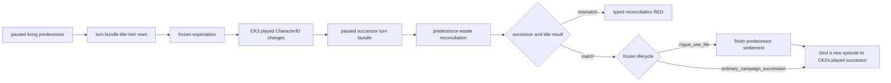
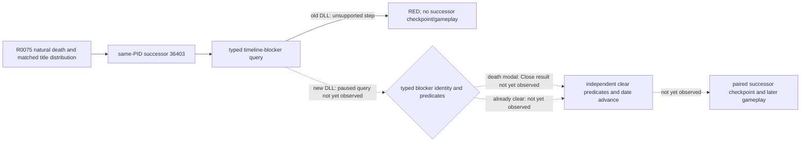
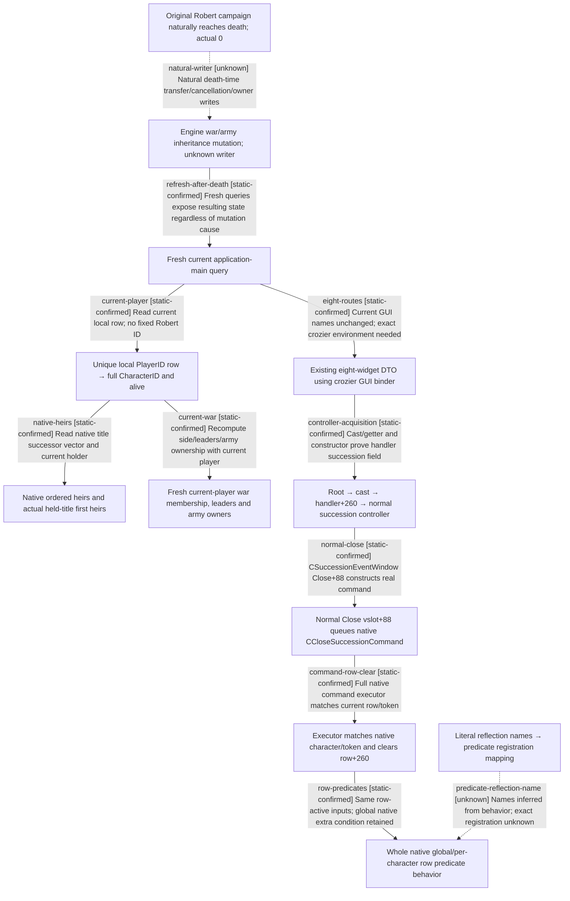
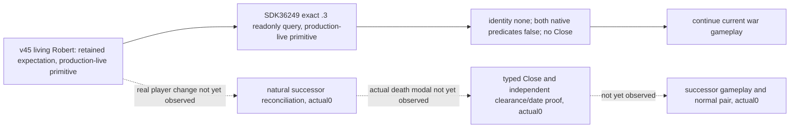

# Succession transition v1

## Status and purpose

- **[production-live primitives; natural-successor loop pending]** The contract and planner integration freeze the
  current engine-calculated first heir of every title held by the living
  episode ruler, then reconciles that bounded predecessor-title set after CK3
  changes the played character.
- The expectation consumes `xar.ck3.turn-bundle/v1`; it adds no new native
  read. The post-transition comparator consumes the first paused successor
  snapshot and a same-frame successor turn bundle.
- The same reconciliation now has two explicitly bound lifecycle consumers.
  `rogue_one_life` preserves the mod's scored terminal settlement;
  `ordinary_campaign_succession` is limited to a frozen `xar_off`, fresh
  no-pact production campaign and can continue without that settlement.
- Native AI decision-tree research is N/A for this component. It records and
  checks an engine state transition; it does not copy or counter an AI choice.

## Contract boundary

The frozen expectation binds:

- pre-death snapshot/public/native revision and date;
- episode run and predecessor CharacterID;
- expected primary-title successor;
- every predecessor-held county-or-higher TitleID and its current first heir;
- the existing `single_successor / split_successors / no_primary_heir` risk.

Reconciliation is admitted only when the driver observes a paused
`played_character_changed` terminal, the old episode CharacterID still matches
the predecessor, and the post-transition snapshot and turn bundle have the
same frame identity. It reports:

- whether the actual played successor matches the expected primary heir;
- predecessor titles inherited as expected;
- expected inherited titles that are missing;
- predecessor titles predicted for another/no heir but retained by the played
  successor;
- titles held by the successor that were not part of the predecessor estate.

The last category is informational. A successor may already own titles before
inheritance, so those titles cannot be treated as an inheritance mismatch.
Likewise, an absent predecessor title is not assigned an invented current
holder: the present campaign-root query sees only the played ruler's holdings.

```mermaid
flowchart LR
  A[paused living predecessor] --> B[turn bundle title-heir rows]
  B --> C[frozen expectation]
  C --> D[CK3 played CharacterID changes]
  D --> E[paused successor turn bundle]
  E --> F[predecessor-estate reconciliation]
  F --> G{successor and title result}
  G -->|mismatch| I[typed reconciliation RED]
  G -->|match| H{frozen lifecycle}
  H -->|rogue_one_life| K[finish predecessor settlement]
  K --> J[bind a new episode to CK3's played successor]
  H -->|ordinary_campaign_succession| J
```

## Frozen lifecycle binding

The lifecycle is part of the driver state, semantic snapshot, checkpoint
metadata, continuation receipt and `native-auto-run` report. Restoring a
driver state under a different binding fails closed. The production binding
is derived from the prepared environment manifest:

| Lifecycle | Required rule/profile | Death behavior |
| --- | --- | --- |
| `rogue_one_life` | `xar_enabled=xar_on`; pact settlement remains required | Run and verify `death-terminal`, then continue only after a matched reconciliation |
| `ordinary_campaign_succession` | `xar_enabled=xar_off` plus an explicit fresh-campaign/no-pact contract | Continue a matched real successor directly; do not register or execute `death-terminal` |
| `unknown` | Missing, malformed or inconsistent binding | Register neither continuation nor settlement; stop on the terminal frame |

The no-pact assertion is not inferred from a missing settlement. This prevents
an old signed-pact save from being relabelled as an ordinary campaign. The
ordinary entry is `native-auto-run --cold-start-checkpoint
--succession-lifecycle ordinary_campaign_succession
--ordinary-campaign-no-pact`; its manifest guard rejects the command unless
the prepared profile selects `xar_off`, and the checkpoint lifecycle must bind
the same environment digest. An unanchored `continue_last_save` is rejected.

This package does not manufacture that first ordinary checkpoint. A separate
fresh 1066 production start under the same prepared `xar_off` profile must
create it and persist the lifecycle binding before this entry becomes runnable.
Until that seed preparation is completed and live-verified, ordinary campaign
succession remains static-ready rather than production-live.
The controlled seed route and its evidence boundary are recorded in
[FEUDAL-1066-START-B0](feudal-1066-private-start-glue.md#ordinary-xar_off-seed-binding).

## Deliberate omissions

This v1 does not infer succession law, eligibility reasons, claims,
hypothetical law changes, or the actual holder of a title absent from the new
player's holdings. These require additional native observations only when they
block a concrete survival decision.

The planner service refreshes the retained expectation on each eligible
paused living frame. On `played_character_changed`, it queries the first
eligible paused successor frame and reconciles the predecessor estate before
planning another action. In `rogue_one_life` it first completes the
predecessor's `death-terminal` settlement. In
`ordinary_campaign_succession` it does not require or advertise that terminal
settlement. Both paths expose `continue-as-reconciled-successor` only for a
fully matched reconciliation. That continuation sends no CK3 command and
performs no process restart. It keeps the current campaign and creates a fresh
episode identity bound to CK3's already-played successor. Before any later
gameplay, the runner immediately saves and verifies a checkpoint whose episode
identity and lifecycle match the successor.

An unavailable or mismatched reconciliation blocks the continuation. The
strategy does not fall back to `start-next-episode` for a
`played_character_changed` terminal, because immutable-seed replay would hide
the real succession result. Immutable-seed replay remains available for the
separate dead/missing-character terminal paths.

## Focused verification

The unit suite covers exact expectation freezing, split inheritance, a
successor's pre-existing title, missing/retained predecessor titles, unexpected
successor identity, no-primary-heir risk and cross-frame rejection. No CK3
process or desktop input is needed for this static package.

## Driver-state integration

The native driver now exposes three private runner methods: retain a same-frame
expectation, reconcile the retained expectation, and read the transition state.
The retained expectation is an additive optional member of the existing
`driver-state.json` v2 envelope. Old v1/v2 files without the lifecycle member
may migrate only to the legacy `rogue_one_life` plus `xar_on` profile; ordinary
campaign restore rejects them. A same-PID hot recovery restores the retained
expectation only after strict schema and episode identity validation.

A cold checkpoint restore, immutable-seed episode start, Phase 2 source staging,
or explicit operator player rebind clears both expectation and in-memory
reconciliation. These operations create a different physical frame or identity;
the runner must query a fresh turn bundle instead of reusing an earlier
projection. A natural `played_character_changed` transition keeps the old
expectation long enough to compare the first paused successor frame.

The focused contract, service, strategy and driver suite covers automatic
capture/reconciliation, same-PID recovery, ordinary matched continuation with
no settlement, the unchanged rogue settlement prerequisite, zero CK3
command/restart, profile mismatch and unknown-lifecycle fail-closed behavior.
The existing immutable-seed replay path is retained for its distinct rogue
dead/missing-character terminal case. The focused succession suite passes
`12/12` in normal and optimized Python; the directly affected bounded-runner
suite passes `75/75` in both modes. The lifecycle/driver suite passes `13/13`,
the native-session propagation suite passes `27/27`, and the explicit
`xar_off` rule/profile prepare-and-verify tests pass in normal and optimized
Python.

The bounded `native-auto-run` owner records the frozen lifecycle before bridge
startup. For the ordinary profile it treats a reconciled
`played_character_changed` frame as continuation-ready without manufacturing
an XAR settlement, executes the next planner turn, and verifies the
continuation before resuming gameplay. Its report contains the lifecycle and a
`natural_succession_transitions` ledger with the predecessor/successor IDs,
old/new episode run IDs, matched reconciliation, unchanged process/frame proof,
and explicit zero CK3 command/restart fields. The strict one-generation owner
still stops at death, and the immutable-seed next-episode owner keeps its own
separate lifecycle. Focused runner boundary tests pass `4/4` under normal and
optimized Python. Production readiness still requires one bounded
natural-death artifact proving the sequence against the exact build.

The ordinary bounded owner now also consumes the exact succession timeline
surface before it saves the new successor checkpoint. It first queries the
private typed blocker context. An already-clear controller is recorded without
an action; an exact death/succession modal is closed once through the reflected
typed action and must independently report both succession predicates false
plus a later date. Any other identity or unknown field is RED. The full
R792/event/succession observation contract is recorded in
[R793 ordinary natural-event and succession long-run contract](r793-natural-event-succession-long-run-contract.md).
If that proof advance opens another typed player decision, the immediate
successor checkpoint is deferred until a formal turn consumes the decision;
the owner never saves through a known modal.

## R781 scope decision

R781 used an `xar_on`, signed-pact checkpoint. Exact-source evidence shows its
death carrier schedules `xar.1001`, and both authored options set
`xa_quit_to_menu`. Leaving the event unanswered hard-pauses the game; selecting
either option intentionally ends player control. This is the main mod's
one-playable-life rule, not a generic event-resolution defect.

R775/R781 therefore remain useful partial evidence for natural death, the real
played-character change, title reconciliation and the first successor frame,
but they cannot be continued as the formal ordinary campaign. Changing their
rule, mod bytes or save flags would invalidate the frozen candidate. The next
formal candidate must start as a fresh ordinary standard-feudal production
save under the `xar_off` profile and collect successor gameplay, checkpoint and
cold-restore evidence in that same campaign.

## R676 celestial council prerequisite RED

R676 exposed a prerequisite scope bug before the first expectation could be
retained: the campaign-root reader attempted its standard five-seat council
layout on CharacterID `32904`'s celestial government and returned
`council_unavailable`. No gameplay command was submitted and cleanup was
GREEN. The native scope repair leaves celestial council typed unavailable but
allows the same-frame succession and held-title data to reach the turn bundle.
R677 confirmed that this scope gate moved the first-query failure past council;
it does not justify a natural-death long run.

## R677 selected-rule prerequisite RED

R677 stopped on `selected_game_rule_tokens_unavailable` after the celestial
council repair admitted the remaining root fields. It submitted no gameplay
command, did not advance the date, and completed cleanup GREEN. Because the old
campaign-root contract collapsed on that optional lookup, the planner still
could not retain its first succession expectation; R677 therefore remains RED.

The revised campaign-root contract treats selected game-rule tokens as an
optional component: on lookup failure the root stays `status=available`, the
tokens are empty with count zero, and both
`selected_game_rule_tokens_ready` and root `ready` are false. The observed
title, held-title partition and ordered heir fields remain available. A turn
bundle can therefore be constructed; for this celestial ruler it is `partial`
because the standard council component is outside scope. Succession expectation
capture accepts an available or partial turn bundle and consumes only its
same-frame ruler/succession fields, so neither optional selected-rule tokens nor
the unsupported celestial ministry is allowed to hide the engine's current
heir projection.

## R782-R783 ordinary lifecycle bootstrap and cold restore

R782 is the first real fresh `ordinary_campaign_succession` seed on the frozen
CK3 build. The prepared environment had exactly `xar_enabled=xar_off`, the
fresh/no-pact contract, environment SHA-256
`C7B09849F0B61E9F6418D10D47506919586D54BCBDAA8A4FED5217E6400B089F`,
and a public paused root for CharacterID 31853 in standard feudal government.
The checkpoint result, persisted driver top level, `last_checkpoint`, and the
matching history anchor carried the same lifecycle binding.

R783 proved a true new-process cold restore of that pair through formal
`native-auto-run`. Readiness reported `driver_state_restored=true`, restore kind
`cold_checkpoint`, the same episode `native-31853-af642d76cb41`, and the same
lifecycle/environment binding. The 20-turn run produced a typed declaration,
independent active-war state, next-turn consumption, further army gameplay,
two paired checkpoints, and complete process reclamation. Its final checkpoint
at `date_raw=53145000` is save `74294B03...EDF1A`, driver
`354D4DE3...FE34B`. Evidence and limits are recorded in
`C:/ck3_mod_rewrite_process_assets/g2-r782-ordinary-xar-off-seed-20260916/r783-verdict.json`
(SHA-256 `8F9F6D1A...D9FA7F`).

No natural death occurred in R782/R783, so these rounds validate lifecycle
binding and ordinary cold recovery but do not complete the natural-successor
gate. G2-M3 and the global G2 authority therefore remain unchanged.

## R0075 ordinary natural succession: native build mismatch RED

CK3 `1.19.0.6`, EXE SHA-256
`2D00FF3101EF70B566F2FCBAE292F09263199C80E9DC8F139B82D7D96F83DB86`;
PRV-007 agent commit `b56c068764ca767d0662d8f8414d9f01fec61d09` used native
DLL SHA-256 `DA06EFC38BD3F32D83FE4C057737794A2AEEB6472BD928E119464B8AC2335F99`
from native source `434f832d79ca79605218c0e8faba1a00f0bc6b6c`.
R0075 naturally changed played CharacterID `31853 -> 36403` at
`date_raw=53302824` in the same ordinary campaign/PID. The predicted successor
and inherited TitleIDs `524, 525, 530` matched. The new episode bound without a
CK3 command or restart. These are production-live succession/reconciliation
observations, not successor gameplay or natural-continuation completion.
The next formal turn attempted the private typed
`query-current-timeline-blocker-context-v1` and native returned
`unsupported native gameplay step` before a blocker result or successor
checkpoint. No option/Close was submitted. The frozen R0075 evidence manifest
is `Z:/ck3_mod_rewrite_process_assets/g2-preview-prv007-r0075-natural-succession-red-20260922/evidence-manifest.json`
(SHA-256 `42E8BDCDD598E82DC63FFB3855425EF6AB29F2F5CA14107C058A9DBA0DB9803D`).

The source already implements both the exact read-only query and reflected
typed Close. `native_bridge/CMakeLists.txt` defaults
`XAR_CK3_ENABLE_G2_DEATH_SUCCESSION_MODAL_PRIVATE_V1=OFF`; that macro guards
the owning-thread executors, native step admission and query/Close dispatch in
`native_bridge/src/bridge.cpp`. The frozen DLL contains neither typed step
literal, matching the observed unsupported-step response. This is a compiled
native feature mismatch against Python's ordinary-successor consumer, not a
missing successor field that can be mapped to false or a reason to skip the
timeline check. A new, separately identified DLL must be built with that
private option `ON`; public adapter registration and MCP advertisement remain
unchanged. The ordinary preview packager now rejects DLLs missing either
private step. Static binary presence is only packaging evidence; a fresh
paused query and independent Close/result proof are still live gates.

```mermaid
flowchart LR
    A["R0075 natural death and matched title distribution"] --> B["same-PID successor 36403"]
    B --> C["typed timeline-blocker query"]
    C -->|"old DLL: unsupported step"| R["RED; no successor checkpoint/gameplay"]
    C -. "new DLL: paused query not yet observed" .-> Q{"typed blocker identity and predicates"}
    Q -. "death modal: Close result not yet observed" .-> D["independent clear predicates and date advance"]
    Q -. "already clear: not yet observed" .-> D
    D -. "not yet observed" .-> E["paired successor checkpoint and later gameplay"]
```

The R0075 post-RED driver is a newly bound successor state, not a matching
pair for its pre-death save. The last physically frozen compatible pair is the
R0074 checkpoint/driver (save SHA-256 `B836D93E...92683`, driver SHA-256
`4C7278F0...364D3`). Do not stitch the R0075 files or claim a cold restore
until a real paired checkpoint is produced by the new version.

## 2026-10-03: war-time natural succession, exact 1.20.0.3 modal ABI migration

The current original Robert ordinary campaign can retain its living-ruler
expectation and re-query the current player, heirs, wars and owners. The current timeline/typed Close provider now selects the exact .3 adapter
while retaining the historical 1.19.0.6 route. This package closes the minimum .3
controller acquisition, predicate bodies and normal Close command path as static
construction inputs. It does not claim a natural succession has occurred.

This is an **engine-transition** tree, not an NPC-choice tree. The actor starts as
Robert 29829 in campaign/episode `native-29829-2bc2d599f7f9`, ordinary,
`xar_off`, pact absent, and becomes the genuinely observed current successor only
after the retained transition matches. The campaign is retained; its current
player reference is refreshed. No `die`, new seed, process, SDK, desktop input,
window activation or runtime sample was used by this file-only research lane.

### Frozen inputs and evidence boundary

- Exact CK3 **1.20.0.3 / Steam build 25652598**, EXE
  `Z:/SteamLibrary/steamapps/common/Crusader Kings III/binaries/ck3.exe`, SHA-256
  `94b55397abb687a3dcd436805a5d885e6be90fa6c693feb44a9e3bbeeade02a6`.
- [Native byte/RTTI/function pins](Z:/ck3_mod_rewrite_process_assets/g2-resume-20261003/war-time-natural-succession/native-tree/modal-pins-12003.json)
  freezes eight complete function bodies, their bounds, disassembly and hashes.
  `HasOpenSuccession` is a leaf without `.pdata`; its complete body ends at the
  final `ret`. The command executor spans two contiguous unwind fragments,
  including its direct branch targets and cleanup through the final `ret`.
- [Source manifest](Z:/ck3_mod_rewrite_process_assets/g2-resume-20261003/war-time-natural-succession/native-tree/source-manifest.json)
  contains read-time copies and SHA-256 for 20 sources. Capture HEAD was
  `8e2cfbee4981af7f80398ec09129c1cf0f3dbe54` before and after capture. These bytes
  are not represented as the initial task HEAD `1e28400d` or the earlier
  coordinator reference `6440948e`.
- Stock `.3` `game/gui/window_succession_event.gui` SHA-256 is
  `eabeebd8fd0d71dfae4e0ba6108001a936db5251a55643522a04f66ce5433b00`.
  The correct source is the installed Steam game tree. All line references below
  refer to the corresponding frozen copy, not a later mutable working tree.
- Full function behavior is recovered, but the reflection registration associating
  the literal names `IsPausedBySuccession` and `HasOpenSuccession` to these .3
  functions was not independently recovered. The name association remains an
  inference from the complete player-row predicate behavior, adjacency and the
  established old contract. The extra condition inside the global pause predicate
  is executed by the native function; its semantic label is unclosed.

### Current player, heir and war reading semantics

`native_bridge/src/ck3_12002_campaign.cpp:21–30,422–495` reads the current local
player, not a fixed Robert ID: game state `+0xA0` to GameData, Jomini `+0x18` to
players and players `+0x1F0` to local PlayerID; GameData `+0x222E8` contains the
player manager with entries `+0x58`, count `+0x64`. The uniquely matching row has
PlayerID `+0xD8` and full generation-bearing CharacterID `+0xB0`. Character storage
resolution round-trips the complete ID at Character `+0x18`; death marker
`+0x1D0 == null` means currently alive. `ReadPrimaryTitle` at `:499–530` calls the
native primary-title resolver and checks the returned title identity. The
implementation filename and nominal header remain `.2`; `.3` reuse is explicit
in `ck3_12003_adapter.cpp:50–56`, guarded by the exact .3 descriptor/EXE, and the
campaign dispatch is at frozen `bridge.cpp:10356–10367`. Merely renaming a `.2`
header would not establish .3 qualification.

`ck3_12002_nonwar_realm.cpp:187–230` preserves the ordered native primary-title
successor vector, validates unique full IDs and never predicts heirs by family
heuristics. `:233–358` validates actual current held-title ownership, reports each
county-or-higher title's first native successor, and preserves a legal empty
successor list as null. The modern offsets in
`include/xar_bridge/ck3_12002_nonwar_realm.hpp:10–15` are Character land state
`+0x1C0`, land-state held titles `+0x1E0`, Title holder `+0x128`, and Title successor
data/capacity/count `+0x150/+0x158/+0x15C`. The heir vector is the current native
prediction; it is not the actual post-death title result. Continue to use the
existing retained expectation/matched contract rather than reconstruct it here.

`ck3_12002_world.cpp:202–271,274–298` computes active wars against the **current**
`played_character_id`: native attackers at War `+0x20`, defenders `+0x80`, primary
leaders `+0x288/+0x28C`; membership must be exactly one side. War IDs carry their
generation and storage index; an ended war `+0x358 != 0` is excluded. Player
armies are selected only when `army.owner_character_id` equals that current
player. Allied/enemy armies are recomputed using each army's current owner and
native membership. Score is also re-oriented to the current player side.

`ck3_12003_war_occupation.cpp:109–153,165–182` likewise binds its actor from the
fresh scope, resolves the current war and side, reads current leader IDs and
participant vectors, and derives current holder/occupier and known-army inputs.
After matched inheritance, fresh paused world/campaign/war-occupation reads are
therefore necessary before reuse of a war target or army action. Predecessor
cached `player_side`, leadership, holders, owners and army IDs are not sufficient.
The engine's death-time war transfer/cancellation/ownership mutation is **unknown**.
Its next reverse entry is the death/player-switch writer of participant and
leader fields `War+0x20/+0x80/+0x288/+0x28C`, plus army-owner writes, if an actual
fresh-frame decision still needs a cause. Fresh existing queries already answer
what the new player currently owns and participates in. A disappeared war is not
proof of victory, surrender or a battle credit.

The coordinator already closed limited living retention with
[actual plan consumption](Z:/ck3_mod_rewrite_process_assets/g2-resume-20261003/runtime-preparation/v41/actual-post-recapture-retain-v41-01/003-ck3_plan_turn.json)
and [normalizer delivery](Z:/ck3_mod_rewrite_process_assets/g2-resume-20261003/war-time-natural-succession/actual-retention-v41-01/ROOT-DELIVERY.json):
normal h5364/raw53240136, available expectation `native:310`, revision 2, original
episode retained, primary heir 38822; titles 2102,2111,2115,2141,2142 predict
38822 and 2173 predicts 38988 (`split_successors`). This is a **production-live
living-retention primitive** supplied by the coordinator, not a new runtime sample
from this lane. Natural inheritance and typed Close actual remain **0**. The later v45 living-player no-open-modal readonly primitive is recorded below.

### Minimum .3 controller and command ABI

| Input/operation | Exact .3 value | Closed meaning |
|---|---|---|
| Root slot | `0x5C6A520` | Root `+0x10` is the idler base subobject |
| Runtime cast | `0x4260E94` | `CIdlerGfxBase` TD `0x5514438` to `CIngameInterfaceIdlerGfx` TD `0x5514460` |
| Ingame handler | idler `+0x88` | Exact getter `0x10EC150..0x10EC1E9` |
| Handler identity | TD `0x5694B50`, primary vtable `0x44BA890` | `CIngameInterfaceHandler`, COL `0x4A59270`, offset 0; secondary `0x44BA908` offset `0x58` is excluded |
| Succession controller | handler `+0x260`, primary vtable `0x4522D90` | Constructor caller `0xB07CD0..0xB07D85` installs it; handler `+0x268` is lineage, excluded |
| Controller identity | TD `0x572F5A8`, COL `0x4AFB330` offset 0 | Secondary vtable `0x4522E60` offset `0x10` is excluded |
| IsOpen | vslot `+0x38`, target `0x10D8BC0..0x10D8C5B` | Normal controller method, current source uses this slot for admission |
| Normal Close | vslot `+0x88`, target `0x10D8900..0x10D8B11` | Calls generic hide then creates and queues the real close command |
| Generic hide | vslot `+0x20`, target `0x110B0E0` | View hide alone does not establish player-row clearing |
| Close command RTTI | TD `0x5A03450`, primary vtable `0x4760510`, secondary `0x47605A8` | Secondary subobject offset `0x18`; executor in its `+0x08` slot |
| Close executor | `0x2894C40..0x2894D26` | Matches current row, character and native opaque token before clearing `row+0x260` |
| Global pause predicate | `0xA7C440..0xA7C4C1` | Executes extra native condition then scans active succession rows |
| Per-character predicate | `0xA7C4D0..0xA7C531` | Null Character is false; otherwise matches Character `+0x18` against row `+0xB0` then tests row `+0x260` |
| Current GUI | root slot `0x5CB87F8`, top-level find `0x3AAB100` | Existing `GuiAbiRevisionV1::crozier12003` binder, no new GUI framework |

The Close method first requires controller int32 `+0x1BC == 0` and byte `+0x300
== 0` before queueing. These are shifted from the old `+0x1EC/+0x330`; their
semantic names need not be guessed because the native Close owns their behavior.
It captures the current CharacterID from global `0x54DBC00` and the native opaque
token from `0x5CC162C`, clones the RTTI-identified command and queues it via
`0x37F06F0` (manager `0x5CC1240`, channel flags 7). The provider calls the normal
Close; it must not synthesize either field or directly write row-active bytes.

The executor reads GameData via state slot `0x5C68C50` / `+0xA0`, scans player-row
data/count at `GameData+0x22340/+0x2234C` (old `+0x1D548/+0x1D554`), requires the
row marker at `+0xDC == 0x506c496e`, character `+0xB0` and token `+0xD8` matches,
and an active `+0x260`. Its secondary-this fields `+0x08/+0x0C` correspond to the
whole command's `+0x20/+0x24`. It then sets row `+0x260=0`; if row `+0x2C8` is
active it calls `0xAFF2B0` with **the embedded address** `row+0x268` and clears
`+0x2C8`. This address is not a loaded cleanup pointer. The global predicate
calls `0x29C5F30(GameData+0x34480, 0)` first; if false it returns false without the
row scan. Preserve that function call rather than replacing it with a field-only
approximation.

Stock .3 GUI retains all eight named query routes:
`succession_event_window:6`, `bottom:875`, visible/enabled `close_button:315/901`,
`menu_button:947`, `succession_select_destiny_window:962`, `continue_button:1195`,
`continue_button_random:1205`, `cancel_button:1049`. Bottom `close_button` is
visible for a valid heir and non-ecclesiastical government and runs animation
`ruler_transition_reset`; state `:19–21` calls normal Close on finish. Lineage
`:315–319` calls normal Close directly. `menu_button` is visible without a valid
heir. Ecclesiastical controls exist at `:917/928`; this .3 migration keeps the
existing eight-route DTO, and does not claim that it handles those additional
government-specific paths.

### Provider and existing SDK entry

The `.3` implementation is `ck3_12003_succession_modal.hpp/.cpp`. Its selected-adapter application-main callback captures the current game snapshot and uses the existing `crozier12003` GUI binder with the exact functions above. Timeline query and typed Close reuse the current DTO, wire steps, serializers and Python transports. The old 1.19.0.6 branch keeps its own binder. The `.3` branch does not call `ck3_11906::BindCurrentProcess` or synthesize a close command/token.

The existing typed facades are registered as `ck3_query_current_timeline_blocker_context_v1(expected_revision)` and `ck3_continue_death_succession_modal_v1(expected_revision, expected_played_character_id, expected_episode_run_id)`. The existing native build option `XAR_CK3_ENABLE_G2_DEATH_SUCCESSION_MODAL_PRIVATE_V1=ON` pairs with stdio option `--private-death-succession-modal-continue`, which carries the existing runtime allow field through parser, main and driver loading. These options select the implementation. The ordinary current-player query and matched episode continuation are already separate executable entries.

The new focused check is **static-ready**: MSVC `/O2 /MD /W4 /WX` invokes the new production image binder, current character/GUI reads and controller resolver/executor against a fixture-owned mapped image and callbacks, then the production serializers. Python `-B -O` consumes those packets through the registered facades and existing transports/normalizer. A subsequent narrow check covers the final parser/main loader expression/driver allow argument/actual server registry; the native success was reused. The fixture does not execute CK3 predicate/Open/Close instructions, a real native driver constructor, stdio transport loop, SDK or game. A corrected invalid synthetic pipe spelling is retained as harness RED.

Receipts: [production package](Z:/ck3_mod_rewrite_process_assets/g2-resume-20261003/war-time-natural-succession/registered-recipe/modal-provider-12003/ROOT-DELIVERY.json), [native and packet consumer](Z:/ck3_mod_rewrite_process_assets/g2-resume-20261003/war-time-natural-succession/modal-fixture-12003/attempt01/result.json), [final CLI and loader](Z:/ck3_mod_rewrite_process_assets/g2-resume-20261003/war-time-natural-succession/modal-fixture-12003/cli-loader-supplement/result.json). Root's v45 actual living-query receipt below closes the limited `.3` paused readonly primitive. Actual death-modal admission and typed Close remain pending in the same ordinary campaign.

### Natural transition and readiness

Living expectation retention is the separately observed primitive recorded above. On a genuine natural `played_character_changed`, existing planning first reconciles the retained estate, then `continue-as-reconciled-successor` binds the already-played successor with zero CK3 command/restart. Preserve the predecessor expectation/reconciliation externally. Query the new current player, wars and controllable armies before further war actions; old Robert army/war IDs are joins only. Re-read the current chaplain/task, and retain old Sway owner mismatch without restarting the old instance. The [successor frontier recipe](Z:/ck3_mod_rewrite_process_assets/g2-resume-20261003/war-time-natural-succession/frontier-recipe/RECIPE.json) enumerates current registered arguments.

The `.3` living-player no-open-modal readonly query is now a **production-live primitive** in v45. Typed Close and natural successor counts remain **0**; a living no-modal result does not qualify Close. The natural modal branch needs one observed typed Close, a later independent cleared root and both predicates false, actual successor gameplay/date movement and a physical normal successor pair. A distinct-process successor restore is separate evidence. No artificial death or new seed substitutes for that chain. The later cold restore clears a living-frame expectation, so refresh it in the new current paused frame.

Complete war inheritance mutation and literal predicate-name registration remain explicit unknowns. Existing fresh current-player queries answer the current side, leadership and ownership without waiting for those causal writers. These unknowns do not stop current war gameplay. The historical [R0075 build mismatch](succession-transition-v1.md#r0075-ordinary-natural-succession-native-build-mismatch-red) remains failure evidence; it is not an acceptance result for the new exact build.

The [frozen research plan](Z:/ck3_mod_rewrite_process_assets/g2-resume-20261003/war-time-natural-succession/native-tree/plan.json) and generated graph bind file evidence and declarations. The checker proves record consistency, not CK3 semantics or live readiness. The static engine-transition graph is:

```mermaid
flowchart TD
    n0["Fresh current application-main query"]
    n1["Unique local PlayerID row → full CharacterID and alive"]
    n2["Native ordered heirs and actual held-title first heirs"]
    n3["Fresh current-player war membership, leaders and army owners"]
    n4["Original Robert campaign naturally reaches death; actual 0"]
    n5["Engine war/army inheritance mutation; unknown writer"]
    n6["Existing eight-widget DTO using crozier GUI binder"]
    n7["Root → cast → handler+260 → normal succession controller"]
    n8["Normal Close vslot+88 queues native CCloseSuccessionCommand"]
    n9["Executor matches native character/token and clears row+260"]
    n10["Whole native global/per-character row predicate behavior"]
    n11["Literal reflection names → predicate registration mapping"]
    n0 -->|"current-player [static-confirmed] Read current local row; no fixed Robert ID"| n1
    n1 -->|"native-heirs [static-confirmed] Read native title successor vector and current holder"| n2
    n1 -->|"current-war [static-confirmed] Recompute side/leaders/army ownership with current player"| n3
    n4 -. "natural-writer [unknown] Natural death-time transfer/cancellation/owner writes" .-> n5
    n5 -->|"refresh-after-death [static-confirmed] Fresh queries expose resulting state regardless of mutation cause"| n0
    n0 -->|"eight-routes [static-confirmed] Current GUI names unchanged; exact crozier environment needed"| n6
    n6 -->|"controller-acquisition [static-confirmed] Cast/getter and constructor prove handler succession field"| n7
    n7 -->|"normal-close [static-confirmed] CSuccessionEventWindow Close+88 constructs real command"| n8
    n8 -->|"command-row-clear [static-confirmed] Full native command executor matches current row/token"| n9
    n9 -->|"row-predicates [static-confirmed] Same row-active inputs; global native extra condition retained"| n10
    n11 -. "predicate-reflection-name [unknown] Names inferred from behavior; exact registration unknown" .-> n10
```

### Actual v45 living retention and no-open-modal readonly primitive

Root's actual v45/R22 game PID28944 retained the living Robert expectation in SDK16649 `011-ck3_plan_turn.json`. Its bound frame is `native:3`, public revision2/native3/date53240904, Robert29829 alive, episode `native-29829-2bc2d599f7f9`, ordinary `xar_off`/no pact. The available expectation predicts primary successor38822; titles2102,2111,2115,2141(primary),2142→38822 and2173→38988, risk `split_successors`. The goal still has reconciled_successions0. Plan phase `native_war_termination_query` returned `query-war-termination-options-16777231` as a proposal; plan_turn did not execute it. Normal SAVE17 is h5494/date53240904, SHA `29ec388a745bf6827e9f79624b37dd3c9cd5d66b9914d2fd92ec7015b87ef7b2`.

That same SDK16649 normalclosed with exit1 because `015-ck3_query_current_timeline_blocker_context_v1.json` returned `private timeline-blocker query is disabled`; original Sway4, retention11, reserve13 and SAVE17 were GREEN. The native request was never sent: the existing transport checks `allow_private_current_timeline_blocker_query` first. The MCP loader had passed `allow_private_death_succession_modal_continue` to registration/Close but omitted the independent timeline-query constructor bool. The focused static CLI-loader fixture replaced the real constructor and did not cover this actual default-disabled query gate. The [original failed packet](Z:/ck3_mod_rewrite_process_assets/g2-resume-20261003/runtime-preparation/v45/actual-sway-retention-reserve-modal-01/015-ck3_query_current_timeline_blocker_context_v1.json) remains capability RED with its successful preceding primitive results preserved.

Root published the necessary one-path Python fix `451dde9915b6bac042f1cfc28364b2a4548f12e6`: the native-headless loader now passes the existing modal bool into the existing `allow_private_current_timeline_blocker_query` constructor parameter. The actual MCP entry is the separate Python freeze `Z:/g48/ck3_autonomous_player/mcp_server.py`; the running native DLL remains v45/g47 source `7a0bef46588292d26c74716a39fe02b348d3ee65` with the existing native manifest. No game restart, native rebuild, new CLI or Sway/retention/reserve replay was needed.

SDK36249 then normalclosed GREEN after only the modal readonly query and normal SAVE. Query004 uses public expected_revision2 and binds `native:10`, native revision10/date53240904, query_sequence1/observation_revision90761. The available `current_timeline_blocker_context` reports `identity=none`, native `blocks_simulation=false` and `has_open_succession=false`. `can_continue` is legally unavailable/null with `no_supported_timeline_surface_visible`, because no supported modal is visible; this is a successful current no-open-modal observation, not a failed read or Close entrance. Evidence source is the exact stock GUI plus native widget state. Normal SAVE006 is h5499/date53240904, size91526523 bytes, SHA `fd7cad467288a372cae5da01de137d5da874d27e22fb0af79d96385cf0089eab`, with the same Robert episode/lifecycle.

These two current results qualify **production-live primitives** for living expectation retention and the exact .3 living-player no-open-modal readonly query. They do not qualify a naturally switched successor, real modal admission, typed Close, clearance/date proof, successor gameplay loop or successor cold restore. Those current-campaign actual counts remain0, and the retention/query package adds0 calendar days. Root resumes the current war work; unfinished SDK52833 is not included in this receipt. Evidence: [actual query004](Z:/ck3_mod_rewrite_process_assets/g2-resume-20261003/runtime-preparation/v45/actual-modal-readonly-after-python-fix-01/004-ck3_query_current_timeline_blocker_context_v1.json), [normal SAVE006](Z:/ck3_mod_rewrite_process_assets/g2-resume-20261003/runtime-preparation/v45/actual-modal-readonly-after-python-fix-01/006-ck3_save_checkpoint.json), [combined file-consumption receipt](Z:/ck3_mod_rewrite_process_assets/g2-resume-20261003/war-time-natural-succession/actual-v45-consumption/ACTUAL-V45-LIVING-QUERY-RECEIPT.json).

```mermaid
flowchart LR
    L["v45 living Robert: retained expectation, production-live primitive"] --> Q["SDK36249 exact .3 readonly query, production-live primitive"]
    Q --> N["identity none; both native predicates false; no Close"]
    N --> W["continue current war gameplay"]
    L -. "real player change not yet observed" .-> S["natural successor reconciliation, actual0"]
    S -. "actual death modal not yet observed" .-> C["typed Close and independent clearance/date proof, actual0"]
    C -. "not yet observed" .-> P["successor gameplay and normal pair, actual0"]
```

## Minimum balance inputs qualified and post-ransom h9444 retained：R0047自然继承准备增量（2026-10-06T05:27:55+08:00）

仅消费frozen g78 HEADd22e9a1c source/reference和既有R0047/v73配置，不改代码、不重测/构建/游戏。当前heldstdio argv已选ordinary_campaign_succession/no-pact/private-death-succession-modal，loader已有readonly query＋Close注册，nativev73 private modal构建ON。观察到 `continue_as_heir_after_death:false` 是capabilities/_with_one_life_episode的固定metadata，并非actuallaunchdisable；不能修改字段制造readiness，也无需因该字段重启或换MCP。

真正自然paused换人时，先保留旧estateexpectation与同帧actualsuccessor，按已有matched reconciliation绑定；已有continue-as-reconciled-successor只把episode重绑到已played alive successor，零CK3command／零restart、PID/gen/frame/campaignorigin保持。随后fresh publicrevision query exacttimeline，alreadyclear走普通successor日期推进；真正deathmodal且published predicates满足时才用当前successor/新episode一次normalClose。该已注册Close本身包含独立predicate-clear核对和真实life-advance/date proof，**不是只读关窗，也不承诺exact1日**；ACK/submitted_unconfirmed/unknown不能授material credit或盲重放。

Runbook包仅 **research/runbook-ready**；living expectation/query已有历史primitive，ordinarynatural successor matchedrebind/actualdeathmodal/Close及normal successor save/driver pair在当前战役 **actual0**，coldrestore另项。此report固定h9444/raw53276520/5508/原Robertalive；health3.05962旧帧不作死亡日期预测，G2 5/8/NW2 2/4/natural0，610以后未来自然事件不预填。具体既有入口、顺序、casebounds与引用见 [natural succession RUNBOOK](Z:/ck3_mod_rewrite_process_assets/g2-resume-20261006/natural-succession-preparation/RUNBOOK.md); [natural report fields](Z:/ck3_mod_rewrite_process_assets/g2-resume-20261006/natural-succession-preparation/REPORT-FIELDS.json); [frozen source/reference manifest](Z:/ck3_mod_rewrite_process_assets/g2-resume-20261006/natural-succession-preparation/SOURCE-REFERENCE-MANIFEST.json)。
