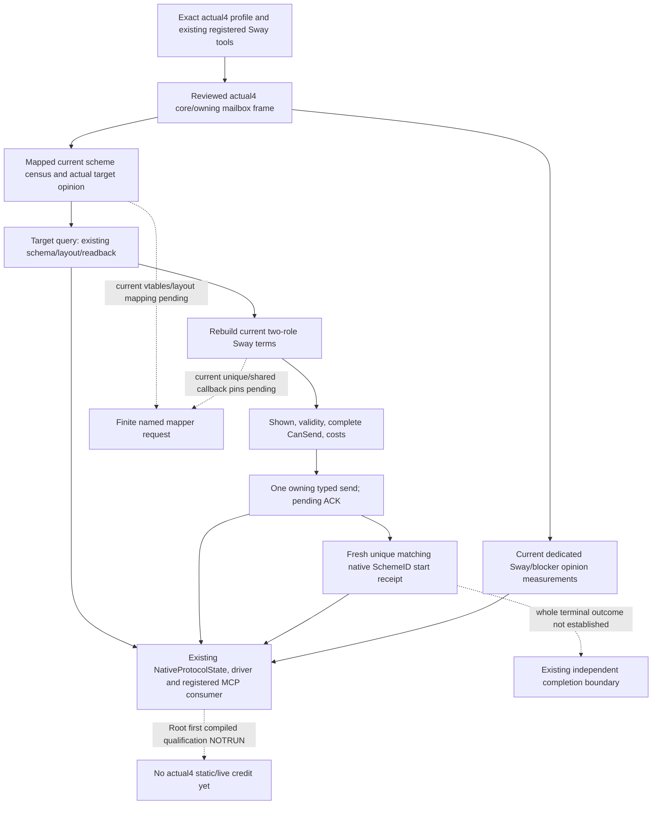

# Adopted Sway MCP migration to CK3 1.20.0.4

2026-10-07 / ISO2026-W41. This package migrates the existing adopted Sway routes to actual **CK31.20.0.4 Crozier / Steam25734779**, frozen EXE SHA `98702F88A547CDE2EAF29A85F93B85F68EE4CF8148336A4F7AFAEB75319DD518`. Root's `BUILD-FREEZE.json`, `global-pe-diff/NEW-PE-METADATA.json`, `core-global-slots/CORE-GLOBAL-MAP.json` and `function-match-core/CORE-FUNCTION-MAP.json` are reused. This lane does not read/hash the EXE, run a build/test or access CK3/SDK/pipe/process/UI/Steam. All newly authored qualification remains **AUTHORED_NOTRUN / research**.

## Existing source and reached route scope

The [Sway active state and start](ck3-1.20.0.2-sway-state.md), [native command](ck3-1.20.0.2-sway-command.md), and [outcome opinion](ck3-1.20.0.2-sway-outcome-opinion-python.md) provide the source-first behavior and existing contracts. Migration preserves the native source order, once-only command/pending/fresh-instance receipt semantics, exact IDs and all registered tool names. It does not add a new Sway feature or requalify old live evidence against the new executable.

The adopted inventory at source `caa4adc3d1278e324cf4ec19774028e9b9138e28` has exactly three Sway ON flags: `ACTIVE_SCHEME_PRIVATE_CANDIDATE_V1`, `ACTIVE_SCHEME_SWAY_FORMAL_PRIVATE_ACTION_V1`, and `ACTIVE_SCHEME_SWAY_OUTCOME_OPINION_PRIVATE_QUERY_V1` (each with the existing `XAR_CK3_ENABLE_G2_` prefix). These reach target query, formal start, start receipt, and independent outcome opinion. The existing completion/execution/termination/invalidation MCP registrations and their driver conditions are retained, while their current OFF native features are not enabled by this migration.

| Reached production operation | Required native input / mapping dependency |
| --- | --- |
| Owning paused actor/date frame | Actual4 core and shared owning-thread mailbox, not old-SHA admission |
| Player-owned scheme census | GameData+A5C0 manager/storage/block/slot/full-generation source; current manager/storage/instance/type vtables and getter/serializer/layout operand pins |
| Target opinion | Actual target-to-actor28BC490 source; reused Faction mapping, no direction reversal |
| Loaded `sway_interaction` definition | Current definition vtables, database and key/magic layout |
| Full start terms | Two-role constructor, refresh/finalize, shown, validity, complete CanSend, cost and context layout |
| Start command | Current send constructor/vtables, owning command-copy/queue and copied context layout |
| Fresh start receipt | Same complete scheme source with a new unique matching full ID; ACK alone remains pending |
| Named Sway/blocker opinion | Current stable hash, loaded modifier DB/definition, lookup/group/sum source and actual target/actor operands; present0 differs from absent/null |

Only actual reached functions are mapped. Marriage redirect/all-role/answer/trigger helpers that happen to be populated by an old shared binder, event/window/saved-scope families, and OFF completion callbacks are excluded. Shared interaction proof is reused from `prisoner/current4-context-release/{FAMILY-MAP.json,complete-cached/FAMILY-MAP.json}`. Validity307AB70 is owned by FamilyAlliance's mapper; the four opinion/modifier helpers and definitions/database are owned by Faction. The sole central mapper `/root/ally_diagnostics` handles the finite unique Sway request; this lane performs0 EXE I/O.

## Implementation plan before native code

Use a separate actual4 binder/header with actual4 `BindCoreImage`, mapped Sway state/command fields and reused actual4 opinion bindings. Caller-owned legacy software DTOs may be reused; their old RVAs or SHA admission must not substitute for actual4 proof. If shared source readers need profile values, append those values to their existing bindings and retain the legacy defaults for the old producer. Local Sway handlers/mailbox semantic admission and body build labels must select the actual4 binder/provenance. Shared adapter/bridge/main CMake changes belong to `/root/entry_next_stage_research`; no such file is edited by this lane.

Python's shared version identity already defines the exact4 tuple. Only the enabled target and outcome-opinion local transport tuples require additive exact4 admission; formal transport already binds the query readback to the exact hello identity. Existing selectors and schemas remain intact. No whole-provider old-SHA compatibility alias or completion flag change is introduced.

One new native whole-producer fixture will emit `manifest.json` with full command-result packets `target_query.json`, `submit_ack.json`, `instance_receipt.json`, and `outcome_opinion.json`. It must execute the genuine state/terms/owning mailbox/action/receipt and opinion serializers with explicitly synthetic memory/callbacks. The sole new registered-MCP consumer takes these whole packets through `NativeProtocolState → NativeHeadlessGameplayDriver → create_native_headless_mcp_server`, changes only the replay request nonce, and checks the existing tools. Environment is `XAR_SWAY_12004_WIRE_MANIFEST` plus optional `XAR_SWAY_12004_CONSUMER_OUTPUT`. No body relabeling, leaf transplant or old GREEN rerun qualifies the new producer.

External packet: `C:/codex-ck3-background/packets/sway-12004-migration-20261007/`. `SWAY-COVERAGE.json` freezes the scoped adopted inventory; `native-source/MAPPER-REQUEST.json` freezes finite named source/field requests; `python/SOURCE-PLAN.json` and `GUARD-DELIVERY.json` retain the two exact tuple updates (`2ef0443533117b9aa3161ae6fb0278ca2208e05d`) and NOTRUN fields. Mapping/implementation/qualification increments will be appended without changing the source-first boundary. Root owns actual4 compilation/SDK/game, shared reports/adoption/publication. Child push, new game days, new starts and new actual4 live credit are0.
