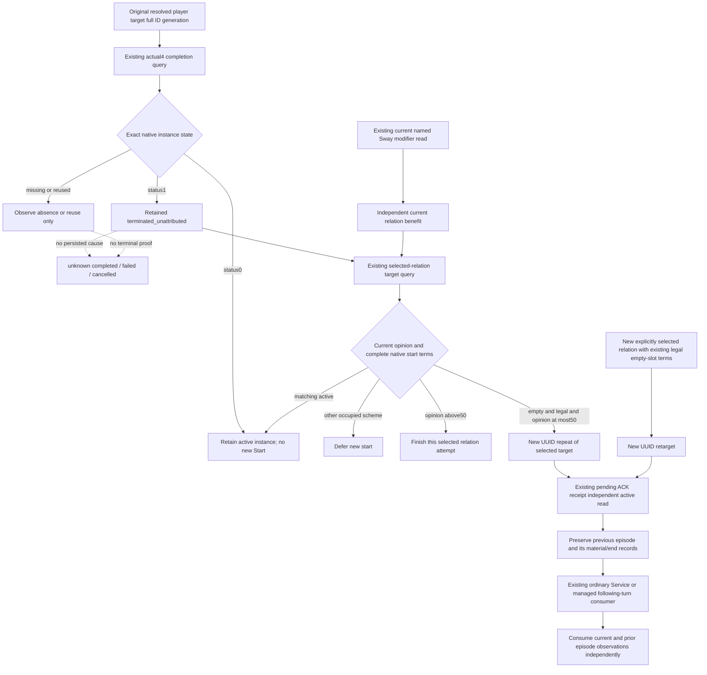

# Sway beneficial retained end to an ordinary follow-up

2026-10-08 / ISO 2026-W41. Source-only work on
`a59b2df4a2b3ab6a951bfdc4f12845faf27439d7`; FIRST is `SOURCE_NOTRUN`.
The held actual CK3 1.20.0.4 SHA is
`98702F88A547CDE2EAF29A85F93B85F68EE4CF8148336A4F7AFAEB75319DD518`.
No native address, query, Start contract or schema is replaced.

The native input tree was recorded before this policy change. The
[actual4 retained reader](sway-terminal-retained-row-12004.md) observes the
original full SchemeID/generation, target and owner. Status0 is continuing;
status1 is `terminated_unattributed`. Missing/reused storage has no terminal
meaning, and status1 supplies no completed/failed/cancelled cause. The
[stock outcome tree](ck3-1.20.0.2-sway-outcome.md) shows that a phase benefit
can reset progress and continue the same instance. The
[stock start tree](ck3-1.20.0.2-sway-state.md#low-positive-opinion-native-start-value-before-counter-policy)
already supports the selected-relation opinion ceiling50. Fifty governs a new
start, not continuation or native completion. The current exact4 query supplies
actual owner count, matching Sway rows, target opinion and complete native
CanSend/legal. Those inputs and the existing current modifier reader are held
and qualified; this lane reads no EXE and replays no qualification.

The concrete production blocker is the unconditional same-player/same-target
`already_applied` branch in `consume_sway_private_once`. A resolved once-start
permanently suppresses another episode even after independent retained-end and
current positive material observations. Different selected targets can already
start, but resolution replaces the old episode. The minimal consumer change
admits a fresh repeat only for the beneficial retained-end branch above, keeps
the ordinary selected-target legality/context policy, and preserves prior
episodes inside `resolved.previous_interventions`. The original top-level
ledger shape and pending recovery remain unchanged. Pending actions never get
resent. A retarget continues to require a separately selected target; this
package adds no global ranking or hidden faction inference.

Current named material must be observed for the queried raw date. A persistent
positive modifier is relationship value, not proof of a new gain or terminal
success. The historical34333/gen8 benefit at53249664 is outside Root's R77
two-year material window; a fresh25 is persistence only. This loop neither
credits that history as a new M4 intervention nor derives an end cause.

The ordinary following-turn hook consumes archived episode records too, so
starting a new legal episode does not discard an unconsumed prior end/material.
The sole new compound is
`ck3_autonomous_player/tests/unit/test_sway_beneficial_followup_12004.py`.
Root alone will execute it once. Its source inputs/backend are synthetic and
its consumer, registered query callbacks and Service turn are production code.
It covers repeat, prior record retention through normal turn/cold reopen,
continuation, finish, retarget and pending recovery in one compound. No new
live, game day, terminal cause, faction departure or G2 credit is claimed.
