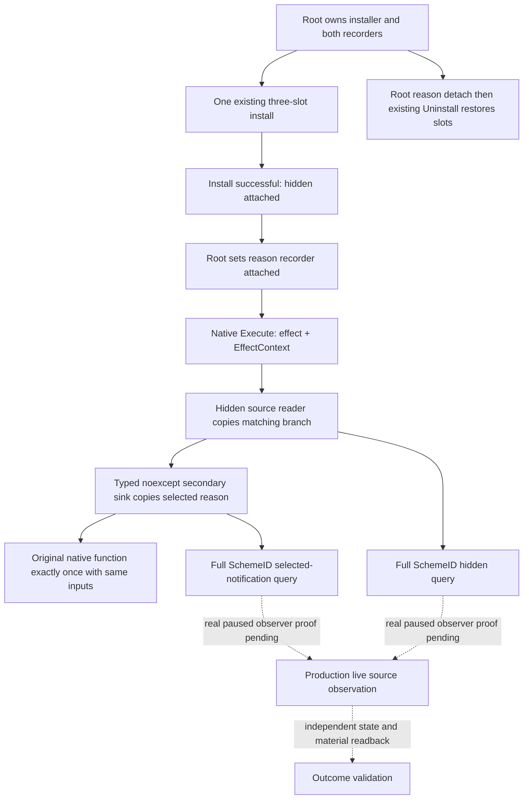

# Shared Sway notification source sink — CK3 1.20.0.2

The hidden phase source and the selected invalidation notification execute
through the same three native virtual slots. This package adds one optional
typed sink to the existing installer so both readers see the actual effect
and EffectContext before the original Execute discards that context.

Read the already frozen [installer ABI](ck3-1.20.0.2-sway-completion-execution-install.md)
and [invalidation source contract](ck3-1.20.0.2-sway-invalidation-reason.md).
The native call is `void (*)(const void*, const void*)`, slot 22 at RVAs
`0x4837330`, `0x48374D8` and `0x4837410`, bound to CK3 1.20.0.2 EXE SHA
`AE1BA6FF060BA603842F6F4A2DED0AF4B7D3666B3DD271F75FB01B0DA8E81B2D`.
These inputs and source proofs are reused; this package performs no new
native ABI research and installs no second observer on those slots.

`SwayCompletionSecondarySink12002` is
`void (*)(void* owner_context, const void* effect, const void* effect_context) noexcept`.
`InstallSwayCompletionExecutionWithSecondarySink12002(base, sha, hidden_recorder,
installer, sink, owner_context)` uses the same verified three slots and typed
originals as the original helper. Both previous production and fixture Install
signatures remain unchanged and delegate with a null sink. The fixture has a
separate `InstallSwayCompletionExecutionFixtureWithSecondarySink12002` entry.

The root owns a persistent context containing reason bindings and recorder.
Its sink calls `CaptureAndRecordSwayInvalidationReason12002` synchronously.
Only after Install returns true does the root set the reason recorder attached.
The wrapper calls hidden capture, optional sink, and original exactly once in
that order, including when either reader ignores or cannot decode the input.
Stop first detaches the root reason recorder, then uses the existing Uninstall.
A successful restore clears the installer sink and context pointers. The
existing pinned DLL and owner-thread lifecycle apply to both readers.

The new fixture owns three readonly pointer slots and actual source-input
memory. One shared install is invoked with a hidden success message and a
selected dead-target toast. The typed originals query the actual copied
recorders to verify capture happened before forwarding. The fixture verifies
the same full generation SchemeID, arguments and one original call per input,
then detaches and restores the three original pointers. Earlier 26/196/23/16
case native matrices are not executed.

Status: **static-ready / external candidate fixture GREEN**. MSVC `/W4 /WX`
with `/Od` and `/O2` each passed 13 checks. The root's native installer sources
remain frozen; the tested candidate has not been applied to them. The proposal is
`artifacts/g2-offline-2026-10-01/sway/secondary-sink/proposed-installer-secondary-sink.patch`.
Its proposed header SHA is
`177882bc4ed9205d547d954fffcae60ee0d7e1bf3376ec1e70759ce446667109`
and proposed implementation SHA is
`cba0c5e7292165276fc263ca7e3d445a656ce3b6c96d5e56f25cbfae3fc3b303`.
The focused runner's `--installer-candidate-dir` explicitly compiled those
external files, the current frozen reason reader, and the new fixture. Actual
source hashes, compiler/run logs and two copied-query wires per mode are in
`artifacts/g2-offline-2026-10-01/sway/secondary-sink/candidate-attempt-001/`.
The receipt marks `source_apply_required=true` and
`production_source_files_written=false`. Earlier native matrices were not run.

Root steering is still required to apply this delta after its current build
scope. Applying these exact tested bytes can reuse this focused proof. Root
startup/stop wiring and a real paused query remain separate work. This package
has not touched CK3, processes, UI, Steam, shared bridge, CMake, Git, progress
indices or reports.

Selected notification source execution is distinct from enqueue, rendered
notification, material effect, native end cause and terminal-state readback.
No production-live readiness or complete Sway loop is claimed here.
