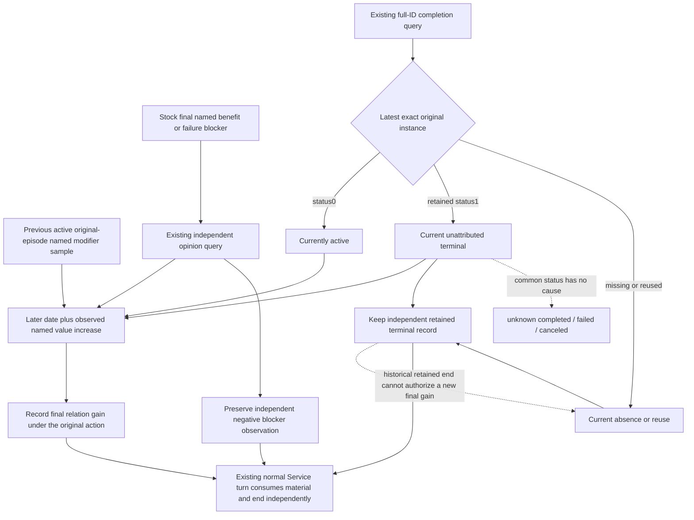

# Final Sway relation material through the existing normal consumer

2026-10-08 / ISO 2026-W41. Source base
`9d69a02546edf45331720f7b7632d9387d4dc8ba`; frozen game 1.20.0.4,
EXE SHA `98702F88A547CDE2EAF29A85F93B85F68EE4CF8148336A4F7AFAEB75319DD518`.
This work is source-only. Runtime34 Stop and Runtime35 sticky release are
already qualified; their prior checks are reused without replay. The historic
target34333/full134217986/gen8 is not a current observation or new M4 material.

## Existing native inputs, before changing consumption

The [stock outcome tree](ck3-1.20.0.2-sway-outcome.md) and the current stock
source-equality note in [Service lifecycle](sway-service-lifecycle-12004.md)
already close the authored script inputs. Success can add named
`scheme_sway_opinion` and continue; reaching the named100 threshold can add the
last benefit and end the same instance. Failure can add named
`sway_blocker_opinion` and end. Phase success, a useful relation improvement
and whole-instance termination are separate facts.

The qualified [actual4 retained-row reader](sway-terminal-retained-row-12004.md)
supplies exact full ID/generation, player/target, raw status and owner identity.
Status1 is an independently observed unattributed end. The qualified opinion
reader supplies target-to-player total opinion and each named modifier's
observed/present/value. Legal absence is zero for arithmetic while its stored
value stays null; present zero remains present zero. Total-opinion movement
does not establish a named modifier increase. No new native input is required.

## One concrete consumer gap

At the source base, `_record_sway_material` requires the current sample to be
`tracked_active` when calculating `incremental_named_gain_observed`. The
existing completion projection correctly sets that flag false on retained
status1. Thus a previous active75 and final exact terminal100 are stored as
positive material but lose the observed final named increase. This is a
consumer branch defect; it does not call for another observer or cause hook.

The minimal change lets a **current** exact retained terminal participate in
the same gain calculation. The lifecycle caller passes that fact from the
latest same-pair/date completion observation. The separately preserved
historical terminal is still retained after purge, but it does not supply the
current-instance fact for a newly sampled gain. The existing previous-active,
later-date and observed named-value-increase conditions remain unchanged.

Blocker measurements, current useful benefit and normal following-turn/cold
consumption already work. They are reused. The opinion response stays purely
observational, existing MCP names and native DTOs are unchanged, and no Start,
Stop, retarget or counter-policy is added. End cause stays unknown.

The sole new compound uses synthetic normalized input episodes with different
IDs from the historic instance. It exercises the registered completion/opinion
callbacks and ordinary Service turn: active baseline, final75→100 retained
gain, normal following consumption, cold duplicate read, negative-blocker end,
and terminal-read-then-purge before the opinion join. It runs no prior native
fixture and carries no game, material or milestone credit.

The [G2 material index](g2-material-index-r77-12004.md) remains authoritative
for the selected two-year window and actual campaign evidence. A measured
named increase is a consumer input; this source change does not date an
authored outcome, select a current target, or award M4/M6. Root owns any later
single offline compound execution and future permitted actual observations.
Source package and Oct8/W41 fields are external under
`Z:/ck3_mod_rewrite_process_assets/g2-background-20261008/r78-sway-material-terminal-value/`.

## Root offline qualification before midnight

Root's sole new compound was **GREEN**, exit0, **6.946936400025152s**,
2026-10-08T15:59:22.935140Z to15:59:29.882073Z (23:59 CST).
It ran source `44c94ecef043f2a3deb0fc4eb7abfb6c13da4b79` in the pinned
`Z:/gbs-sway-material-terminal-value` tree. The
[actual receipt](Z:/ck3_mod_rewrite_process_assets/g2-background-20261008/r78-sway-material-terminal-value/root-first01/ROOT-ACTUAL-RESULT.json)
and [six-case output](Z:/ck3_mod_rewrite_process_assets/g2-background-20261008/r78-sway-material-terminal-value/root-first01/CONSUMER-RESULT.json)
retain the exact interpreter, argv and complete synthetic envelopes.

The fixture supplies an ordinary life-advance selection; registered MCP,
production query wrappers, protocol ingestion, material join and Service's
following-turn consumer execute their real code. This qualifies the final
named-gain consumer and its independent controls offline. It does not qualify
the full planner, native memory reads, terminal cause or real scheme success.
No C++ build, prior GREEN replay, game/SDK connection, Start/Stop, actual day,
SAVE or milestone credit was added. The live boundary remains saved6010,
G2 5/8, NW2 2/4, M4false/M6partial/natural0, with local CK3 use forbidden.
