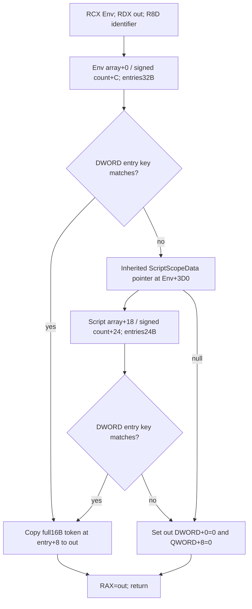

# Sway hidden phase executing input: actual 1.20.0.4 native source closure

On 2026-10-10 the existing hidden `.0001` success / `.0002` failure
executing-input observer's required native atoms were closed for CK3
1.20.0.4, Steam build `25734779`, retained executable SHA-256
`98702F88A547CDE2EAF29A85F93B85F68EE4CF8148336A4F7AFAEB75319DD518`.
This is **research with native source closure**, ready for implementation.
It does not qualify a current fixture, running observer, terminal outcome,
complete Sway loop or additional durable gameplay days.

The implementation owner is the existing
[Sway service lifecycle](sway-service-lifecycle-12004.md) work package.
Reuse its input recorder and ledger; this source result does not introduce a
new archive or infer a terminal cause from notification adjacency.

## Version boundary and actual read cost

The original 1.20.0.2 source contract is `AE1BA6FF...8E81B2D`, whereas the
retained 1.20.0.3 executable is `94B55397...E02A6`. They are distinct builds.
The source owner compared the ten complete named original02 bodies against
Root's actual03 capture: all **14,750 bytes and instruction boundaries were
exactly equal**. The actual03/current04 complete spans then matched in
normalized instructions, ordered edge shape and local control topology.
Normalization masks relative control and RIP displacements; member offsets,
widths and nonrelative constants remain concrete. Current identities below
come from actual current RIP producers and pointer values, not a global delta.

Root alone captured the named03/04 bodies, 14,750 B per build. The final
bounded capture ran at **2026-10-10T03:49:45.325152Z through
03:49:46.167900Z** and read **1,016 B**: two 176 B lookup windows, eight 8 B
pointers, five 24 B COL records and five 96 B bounded type names. It used the
existing shared-span mapper/cache. The source workers read no executable,
Game, SDK, process or UI state and ran no hashes, builds or tests.

## Actual primary identities and Execute slots

All five actual COL records have signature1, object offset0, constructor
displacement0 and a self RVA matching their location; all type names have an
actual NUL in the bounded capture. Class hierarchy RVAs were recorded from
the COL, without reading or scanning that hierarchy.

| Actual type name | Constructor / primary source | Primary vptr RVA | COL RVA | Type descriptor RVA | Slot22 address -> actual original |
| --- | --- | --- | --- | --- | --- |
| `.?AV?$CSendInterfaceMessageEffect@$00@@` | `2CC6B80`, LEA+32 / this write+39 | `4837290` | `4EB8100` | `5A712C0` | `4837340 -> 2CC9420` |
| `.?AV?$CSendInterfaceMessageEffect@$01@@` | `2CC6D10`, LEA+32 / this write+39 | `4837438` | `4EB80D8` | `5A712F8` | `48374E8 -> 2CC8470` |
| `.?AV?$CSendInterfaceMessageEffect@$02@@` | `2CC6EA0`, LEA+32 / this write+39 | `4837370` | `4EB8128` | `5A71330` | `4837420 -> 2CC7180` |
| `.?AVCDynamicDescription@@` | notification scope4 members+60/+80/+A0 | `48BD0C0` | `4F7D550` | `5B1DFB0` | not requested |
| `.?AVCSingleDesc@@` | `3723C60`, primary LEA+2A / this write+31 | `4929F18` | `50155D8` | `5BAB5C8` | not requested |

The actual three slot22 targets match the independently captured complete
Execute bodies. Their Windows x64 ABI remains
`void (*)(const void* effect, const void* EffectContext)`, RCX/RDX.
The bodies write R8/R9 before consuming those registers. The original02
dispatcher's discarded return contract and full body semantic comparison are
reused; a new current dispatcher read was not requested or claimed.

The existing consumed field contract is retained: effect command ID+08,
domain+0C, type pointer+50 or unresolved ID+58 and state+5C; title wrapper+60,
scope discriminator4 and scalar pointer+70. EffectContext supplies its root
pointer+0 and effective environment pointer+18. The current parser's actual
numeric key/member relationships are recorded in the producer role artifact.
The current scalar key renderer is `37240F0`: a nonnull delegate at+28 takes
precedence; otherwise it consumes the authored MSVC string at+30. The
scalar-construction body `37254B0` calls `3723C60` and stores the result at
owner+10; it does not write an independent primary vptr.

## Native inherited lookup, including receiver and return

`373B520` is the actual current native lookup. Its **162 B complete code** is
byte-for-byte equal to both the held original02 lookup at `373B540` and the
actual03 capture. The actual current returns are `373B597`, `373B5B6` and
`373B5C1`; code ends at `373B5C2`, followed by 14 captured INT3 padding bytes.

Before this capture the candidate came only from two independent local
`.pdata` gap boundaries: old gap `373B53D..373B5F0`, current gap
`373B51D..373B5D0`. Both have 179 B; old locator+3 from the preceding end
and -176 from the following begin independently give current `373B520`.
That metadata was a candidate, not ABI admission. Actual complete code and
returns subsequently closed the semantics. A previously inspected cached
130 B wrapper at `3736040` had no direct lookup edge; that bounded MISS remains
in the artifact rather than being presented as a successful caller proof.

The native ABI is `Token16*(const Env*, Token16* out, int32 identifier)`:
RCX=Env, RDX=out, R8D=identifier. RDX is saved to R9 and each return places
that out pointer in RAX. The leaf has no calls or additional stack arguments.

Both found paths use MOVUPS to copy all 16 token bytes, preserving the full
ID payload. The missing path writes the type DWORD and payload QWORD only;
it leaves padding DWORD+4 unchanged. It must not be described as clearing all
16 B. Production must call this native Env32-first / inherited24 lookup;
the old hand-bound Env32-only fixture is not a production substitute.

The already qualified actual4 EventWindow factory supplies the script
identifier table getter, ID lookup and name resolver. Resolve `scheme`,
`owner` and `target` through those callbacks using the existing
`NativeStringView32(data,size,0)` input. The independent current command-key
getter remains `3F4F8E0`. No three legacy identifier globals or initializer
scan is needed.

## Evidence and implementation handoff

All external current mapping artifacts are under
`D:/codex-ck3-background-spill/sway-hidden-phase-current04-mapping/`:

- `CURRENT04-FINAL-NATIVE-MAPPING.json`: complete final source mapping.
- `root-capture01/FAMILY-MAP.json`: ten complete actual03/current04 pairs.
- `ACTUAL04-EXECUTE-ABI-AND-INPUT-WITNESSES.json`: concrete Execute operands.
- `producer-title-role/CURRENT04-PRODUCER-TITLE-ROLE.json`: actual producers,
  parser, scalar construction and key renderer.
- `root-tiny-capture02/ROOT-TINY-CAPTURE-ACTUAL.json` and
  `ROOT-ACTUAL-TINY-EXECUTION02.json`: the sole actual final native capture.
- `ACTUAL04-CACHED-OVERLAY-CALLER-130B.json`: retained finite wrapper MISS.
- `OCT10-W41-REPORT-FIELDS.json`: coordinator daily/weekly integration fields.

The independent02/03 equality evidence is
`D:/codex-ck3-background-spill/sway-hidden-phase-source-delivery/HELD02-ACTUAL03-SEMANTIC-BOUNDARY.json`.
The original lookup instructions remain in
`Z:/ck3_mod_rewrite/artifacts/g2-offline-2026-10-01/sway/completion-invalidation-context/lookup-precedence.json`.

Next, the source owner can implement the exact4 binder, profile, installer
slot/original selection, actual4 startup/dispatch/serializer and existing
Service phase-intervention staging. Root owns qualification and the meaningful
registered current whole-query FIRST. No more native reads are requested by
this closure. The input observer continues to describe the executing input;
it is not itself a material outcome, terminal-cause proof or pre-attachment
historical archive.
