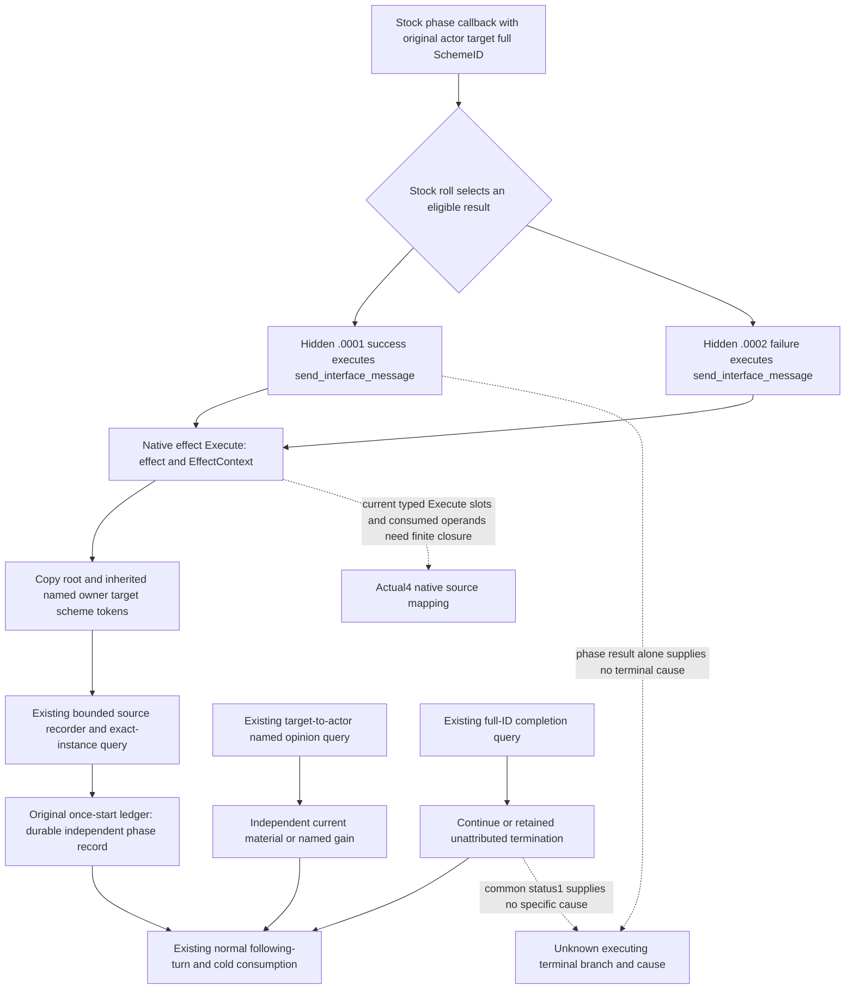

# Current-build hidden Sway phase source input

2026-10-10 / ISO2026-W41. Independent source tree starts at
`91bf64589d78df866fdf6908841fc9b64e875ec7`, in
`D:/cg-sway-lifecycle-input-12004`. Frozen game: CK3 1.20.0.4,
Steam25734779, held EXE SHA
`98702F88A547CDE2EAF29A85F93B85F68EE4CF8148336A4F7AFAEB75319DD518`.
Root owns all executable reads, builds, tests and Game/SDK operations. The
public source, active SDK624 and frozen future91 source are untouched.

## Existing independent observations and the next missing input

The [stock phase tree](ck3-1.20.0.2-sway-completion-phase.md),
[outcome source](ck3-1.20.0.2-sway-outcome.md) and
[current stock equality note](sway-service-lifecycle-12004.md#2026-10-08-source-specific-endcause-research-not-a-new-qualification)
already establish that ordinary hidden success `.0001` and failure `.0002`
can reset progress and continue the same player-owned instance. Some special
authored outcomes and the named100 threshold can end it. A positive named
Sway modifier is useful relation material; it is not whole-instance success.

Current-build [named opinion](sway-material-formal-consumer-12004.md),
[retained terminal](sway-terminal-retained-row-12004.md),
[normal/cold lifecycle](sway-service-lifecycle-12004.md) and
[final named gain](sway-final-relation-material-12004.md) already provide
independent material and instance-state observations with real production
consumers. Their existing qualifications and history-performance fix are
reused without replay. The missing input selected here is **the executing
ordinary hidden result for the original exact SchemeID**. Existing native
status1 remains `terminated_unattributed`; no cause is inferred from phase
success, named gain, total opinion, row disappearance or nearby notifications.

## Production read set and held source reuse

The existing [execution reader](ck3-1.20.0.2-sway-completion-execution.md)
recognizes complete command/type/title tuples for hidden good and bad
messages, then copies original actor, target, full SchemeID and native date.
The [existing installer ABI](ck3-1.20.0.2-sway-completion-execution-install.md)
forwards each two-argument original exactly once; its recorder and readonly
query already exist. This slice reuses those interfaces and session record
semantics.

The [inherited scope source](ck3-1.20.0.2-sway-completion-scope-overlay.md)
is essential. During hidden Event immediate execution, Env32 can be empty;
the effective `owner`, `target` and `scheme` tokens are inherited through
ScriptScopeData24. Production must retain the native overlay lookup. The old
hand-bound Env32-only fixture compatibility path does not replace it.

Already held actual4 Core, scheme identity/state and EventWindow script
identifier registry/getter/resolver are reused. The EventWindow declared
mapping also closes old global command-key getter `3F4F900` to current
`3F4F8E0` over its complete292B source. Its global command-key domain stays
distinct from the named script-identifier domain. These helpers are not
recaptured.

The actual4 notification Execute profiles, three typed slots, title-wrapper
and scalar identities, their consumed member operands and real inherited
lookup remain unclosed. Old12002 coordinates are locators used by existing
12003 code, not current-build evidence. Missing current roles must be derived
from exact source rather than a uniform RVA delta. Root authorized a finite
cache-first source request, without additional game probes:

`D:/codex-ck3-background-spill/sway-hidden-phase-source-delivery/ROOT-FINITE-NATIVE-MANIFEST.json`.

Its maximum missing complete Execute body scope is the three existing4004B
functions, plus only necessary typed slot and member-source atoms. Any field
already closed by those bodies or a held map is not read again. Current named
identifier lookup can reuse the existing registry callbacks instead of
recapturing three identifier globals, provided the actual native overlay
lookup is retained. No unrelated callee, history archive or symbol scan is
requested.

## Implementation after source closure

The smallest production increment is an actual4 execution-source binding
profile and current selection of the existing installer/query/serializer.
Only after those native inputs close does Python admit the exact4 execution
tuple. Normalized exact-instance phase records can then be staged under the
original once-start ledger and consumed independently of material and
retained-terminal records, preserving existing normal/cold behavior. No
Start/Stop, target policy or new history framework is introduced.

The sole meaningful new qualification should connect a real current-profile
native whole query to the registered query and original-ledger consumer, with
an empty Env32/inherited token input, independent opinion and completion
readbacks, normal following turn and cold duplicate consumption. Root owns
that FIRST. An available empty recorder is transport qualification only.

Status: **research; finite source request authored**. No production code,
schema admission, test, import, build, native/SDK/Game query, new game day,
SAVE, hidden live result, specific terminal cause or G2 credit is added by
this document. Actual4 source closure precedes the executable increment;
full Sway lifecycle remains unfinished.

## First actual finite source increment

Root's sole ten-span capture completed GREEN in1.053s. Its actual result is
`D:/codex-ck3-background-spill/sway-hidden-phase-current04-mapping/ROOT-ACTUAL-FINITE-CAPTURE01.json`,
with source detail under `root-capture01/`. The capture itself is executable
source acquisition, not a game query or runtime qualification.

The old02-to-actual03 semantic boundary was then compared once using only
the held02 instruction receipts and Root's captured03 instruction metadata.
All ten complete functions, totaling14750B, have identical instruction
boundaries and **identical raw source bytes**, with zero mismatches. No EXE
was opened and no hash was computed by this comparison. Its small evidence is
`D:/codex-ck3-background-spill/sway-hidden-phase-source-delivery/HELD02-ACTUAL03-SEMANTIC-BOUNDARY.json`.
This closes reuse of the old semantic read set for those ten bodies only;
it does not close unrequested inherited lookup, current typed slots/RTTI or
identifier globals. Current03-to04 body-role analysis and the derived tiny
slot/lookup request remain separately owned by the mapping lane. No current
binder or Python build admission has been changed at this stage.
