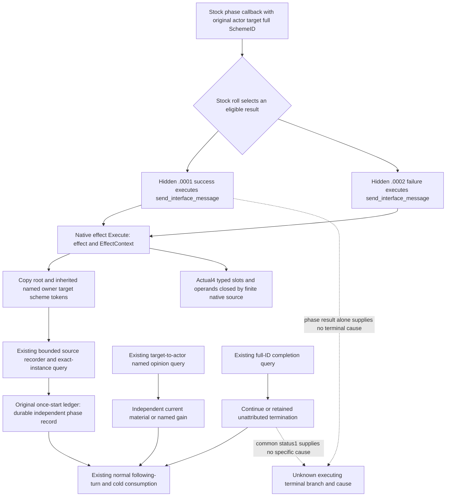

# Current-build hidden Sway phase source input

2026-10-10 / ISO2026-W41. Independent source tree starts at
`91bf64589d78df866fdf6908841fc9b64e875ec7`, in
`D:/cg-sway-lifecycle-input-12004`. Frozen game: CK3 1.20.0.4,
Steam25734779, held EXE SHA
`98702F88A547CDE2EAF29A85F93B85F68EE4CF8148336A4F7AFAEB75319DD518`.
Root owns all executable reads, builds, tests and Game/SDK operations. The
public source, active SDK624 and frozen future91 source are untouched.

## Existing independent observations and the next missing input

The [stock phase tree](ck3-1.20.0.2-sway-completion-phase.md),
[outcome source](ck3-1.20.0.2-sway-outcome.md) and
[current stock equality note](sway-service-lifecycle-12004.md#2026-10-08-source-specific-endcause-research-not-a-new-qualification)
already establish that ordinary hidden success `.0001` and failure `.0002`
can reset progress and continue the same player-owned instance. Some special
authored outcomes and the named100 threshold can end it. A positive named
Sway modifier is useful relation material; it is not whole-instance success.

Current-build [named opinion](sway-material-formal-consumer-12004.md),
[retained terminal](sway-terminal-retained-row-12004.md),
[normal/cold lifecycle](sway-service-lifecycle-12004.md) and
[final named gain](sway-final-relation-material-12004.md) already provide
independent material and instance-state observations with real production
consumers. Their existing qualifications and history-performance fix are
reused without replay. The missing input selected here is **the executing
ordinary hidden result for the original exact SchemeID**. Existing native
status1 remains `terminated_unattributed`; no cause is inferred from phase
success, named gain, total opinion, row disappearance or nearby notifications.

## Production read set and held source reuse

The existing [execution reader](ck3-1.20.0.2-sway-completion-execution.md)
recognizes complete command/type/title tuples for hidden good and bad
messages, then copies original actor, target, full SchemeID and native date.
The [existing installer ABI](ck3-1.20.0.2-sway-completion-execution-install.md)
forwards each two-argument original exactly once; its recorder and readonly
query already exist. This slice reuses those interfaces and session record
semantics.

The [inherited scope source](ck3-1.20.0.2-sway-completion-scope-overlay.md)
is essential. During hidden Event immediate execution, Env32 can be empty;
the effective `owner`, `target` and `scheme` tokens are inherited through
ScriptScopeData24. Production must retain the native overlay lookup. The old
hand-bound Env32-only fixture compatibility path does not replace it.

Already held actual4 Core, scheme identity/state and EventWindow script
identifier registry/getter/resolver are reused. The EventWindow declared
mapping also closes old global command-key getter `3F4F900` to current
`3F4F8E0` over its complete292B source. Its global command-key domain stays
distinct from the named script-identifier domain. These helpers are not
recaptured.

The initial missing source set was the actual4 notification Execute profiles,
three typed slots, title-wrapper and scalar identities, consumed member
operands and real inherited lookup. It is now closed by the finite source
and tiny receipts below. Old12002 coordinates were locators used by existing
12003 code; current roles were derived from exact source rather than a uniform
RVA delta. Root authorized this finite cache-first request without game probes:

`D:/codex-ck3-background-spill/sway-hidden-phase-source-delivery/ROOT-FINITE-NATIVE-MANIFEST.json`.

Its maximum missing complete Execute body scope is the three existing4004B
functions, plus only necessary typed slot and member-source atoms. Any field
already closed by those bodies or a held map is not read again. Current named
identifier lookup can reuse the existing registry callbacks instead of
recapturing three identifier globals, provided the actual native overlay
lookup is retained. No unrelated callee, history archive or symbol scan is
requested.

## Implementation after source closure

The smallest production increment is an actual4 execution-source binding
profile and current selection of the existing installer/query/serializer.
Only after those native inputs close does Python admit the exact4 execution
tuple. Normalized exact-instance phase records can then be staged under the
original once-start ledger and consumed independently of material and
retained-terminal records, preserving existing normal/cold behavior. No
Start/Stop, target policy or new history framework is introduced.

The sole meaningful new qualification should connect a real current-profile
native whole query to the registered query and original-ledger consumer, with
an empty Env32/inherited token input, independent opinion and completion
readbacks, normal following turn and cold duplicate consumption. Root owns
that FIRST. An available empty recorder is transport qualification only.

Status: **research; native source closed and production delta authored;
connected FIRST NOTRUN**. No test, import, build, native/SDK/Game query, new
game day, SAVE, hidden live result, specific terminal cause or G2 credit is
added by this worker. Actual4 source closure preceded the executable increment;
full Sway lifecycle remains unfinished.

## First actual finite source increment

Root's sole ten-span capture completed GREEN in1.053s. Its actual result is
`D:/codex-ck3-background-spill/sway-hidden-phase-current04-mapping/ROOT-ACTUAL-FINITE-CAPTURE01.json`,
with source detail under `root-capture01/`. The capture itself is executable
source acquisition, not a game query or runtime qualification.

The old02-to-actual03 semantic boundary was then compared once using only
the held02 instruction receipts and Root's captured03 instruction metadata.
All ten complete functions, totaling14750B, have identical instruction
boundaries and **identical raw source bytes**, with zero mismatches. No EXE
was opened and no hash was computed by this comparison. Its small evidence is
`D:/codex-ck3-background-spill/sway-hidden-phase-source-delivery/HELD02-ACTUAL03-SEMANTIC-BOUNDARY.json`.
This closes reuse of the old semantic read set for those ten bodies only;
it does not close unrequested inherited lookup, current typed slots/RTTI or
identifier globals. Current03-to04 body-role analysis and the derived tiny
slot/lookup request remain separately owned by the mapping lane. No current
binder or Python build admission has been changed at this stage.

The mapping lane has now closed all ten actual03-to04 complete bodies:
normalized instruction spans, ordered control/RIP edge shapes and local
control topology match. Nonrelative constants, field offsets and widths
remain concrete; this is not an inference from the shared ordinal or an
address delta. The small source handoff is
`D:/codex-ck3-background-spill/sway-hidden-phase-current04-mapping/CURRENT04-NATIVE-ROLE-HANDOFF.json`.
Actual constructor RIP operands identify the three effect vptrs and two
title/scalar vptrs. Their typed COL identities and the three slot22 original
pointers still await Root's single tiny batch. The inherited lookup candidate
is independently bounded by both neighboring metadata functions and remains
unadmitted until its actual body is decoded. Existing actual4 EventWindow
registry callbacks use `NativeStringView32(data,size,0)` for identifier lookup;
their reuse avoids another read of identifier globals. No current production
profile or phase-observation capability is claimed before the remaining
native atoms close.

## Closed native atoms and authored production increment

Root's tiny capture completed at2026-10-10T03:49:46.167900Z. The
[current native mapping](sway-hidden-phase-execution-input-native-map-12004.md)
records five actual COL/type identities, all three slot22 originals and the
complete162B inherited lookup. Its final thin evidence is
`D:/codex-ck3-background-spill/sway-hidden-phase-current04-mapping/CURRENT04-FINAL-NATIVE-MAPPING.json`.
The lookup body is byte-equal across02/03/04. It searches Env32 before the
Env+3D0 inherited ScriptScopeData24 rows and copies each found16B token.
This closes the required original actor/target/full SchemeID read set.

The new actual4 binding supplies the current typed vptrs, original slot
targets, inherited getter and qualified Core reader. It resolves the three
scope identifiers with the existing actual4 script registry callbacks.
The existing three-slot installer, capturer, copied recorder, mailbox and
full command-result formatter are retained. Actual4 startup installs this
observer under the existing active-scheme feature; the unchanged query gains
exact4 identity admission and correctly stamped outer build provenance.
Legacy default binding and serialization inputs remain available.

The registered execution query now passes through Service. For the original
verified once-start receipt, it retains the latest observed hidden phase and
the complete returned source records as `phase_intervention` in the existing
ledger. An empty later read cannot erase it. Repeating the same source does
not rearm normal/cold following-turn consumption. Independent opinion,
material and retained-terminal records remain independent; phase success
does not supply a useful modifier or terminal cause. No second history store
or ring is introduced. This readonly query uses the already-qualified finite
snapshot helper because its input consumers need no command history; public
snapshot defaults and complete driver persistence remain unchanged.

The one new connected FIRST is authored at
`ck3_autonomous_player/native_bridge/research/run_sway_execution12004_connected_first.py`.
It compiles one current-profile owned-memory case, installs the existing
three owned pointer slots, captures hidden failure and success through empty
Env32/inherited ScriptScopeData24, and emits a new full command-result packet.
One registered MCP compound consumes that packet through the real NativeDriver
transport, original Service ledger and normal/cold turns. Completion/opinion
are explicit synthetic normalized sources whose prior native qualification
is reused. The native owner mailbox and actual Game installation are not
exercised by this FIRST. Only Root may execute it; no old suite is replayed.

Root's first connected attempt at2026-10-10T04:10:25.034832Z completed
compilation of all six C++ units with exit0, then the native fixture exited1;
the registered Python consumer was never executed. Original receipts and
logs remain under
`D:/codex-ck3-background-spill/sway-hidden-phase-source-delivery/ROOT-FIRST01/`.
This is **harness RED**: the fixture wrote public speed5 into native
GameState+70. The already-qualified current Core decoder accepts native0..4
and adds1 for public speed, so raw5 made Core unavailable before inherited
lookup. Production behavior supplied no contrary evidence and is unchanged.
The child corrects only the native fixture to raw4 and checks its actual Core
projection before source capture. Root's necessary retry compiles that one
fixture unit and links the five retained production objects, then retries
the same native case and runs the never-executed registered compound once.

## Actual connected qualification, 2026-10-10

Root's necessary fixture retry passed at
2026-10-10T04:19:49.476097Z–04:20:03.845790Z. The inner FIRST ran from
04:19:51.627251Z to04:20:03.835776Z (12.2085215 seconds). Fixture rebuild,
native necessary retry and the first registered MCP consumer each exited0.
Exactly one fixture translation unit was rebuilt; the five original
production objects were reused. Production source remained
`a694c9a393488b377030b5ff6acc6fc0e4bbf9ad`; the fixture correction was
`e6d6307db3aec6c1d319f37a20d956be1461f181`.

Actual receipts are
`D:/codex-ck3-background-spill/sway-hidden-phase-source-delivery/ROOT-FIRST02-EXECUTION.json`
and `ROOT-FIRST02/ROOT-FIRST-RESULT.json` in that same delivery directory.
The one-read projection is `ACTUAL-FIRST02-QUALIFICATION-THIN.json` there.
The original FIRST01 harness RED, logs and objects remain retained.

This qualifies the current-build binder, inherited-scope capture and the
registered query-to-lifecycle consumer as **static-ready / offline connected**.
The native owner mailbox was not exercised; independent completion and
opinion inputs were explicit synthetic normalized frames, reusing their
prior native qualification. A whole production native rebuild and actual
paused Game adoption remain pending. This fixture supplies no actual hidden
phase, material outcome, terminal cause, Game-day, SAVE or G2 completion
credit. No Game operation or original evidence rewrite occurred.
