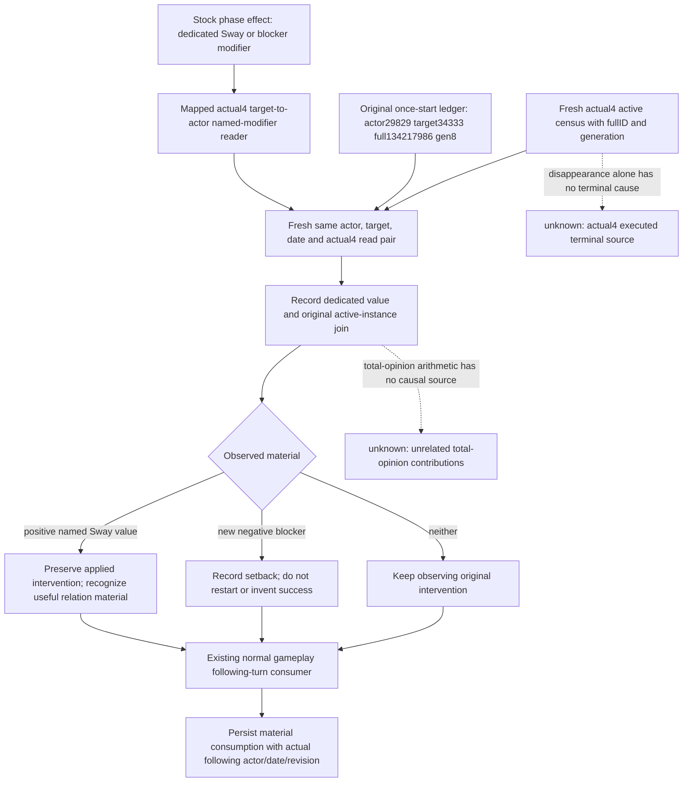

# Sway material in the existing formal consumer — CK3 1.20.0.4

2026-10-07 / ISO2026-W41. Source base `23c3c4bc7fdf261f46174d35db12732808523463`; actual build `1.20.0.4`, Steam25734779, EXE SHA `98702F88A547CDE2EAF29A85F93B85F68EE4CF8148336A4F7AFAEB75319DD518`. Root owns actual execution. This package does not read/hash the executable, save or large Driver; it does not build, test, import the project, query SDK/game, or change shared Bridge/CMake/native_driver.

The input tree is the [stock outcome tree](ck3-1.20.0.2-sway-outcome.md), [independent modifier source](ck3-1.20.0.2-sway-outcome-opinion-python.md) and [actual4 binder](sway-adopted-mcp-migration-12004.md). Stock hidden success adds `scheme_sway_opinion`; stock failure can add `sway_blocker_opinion`. The independent native producer measures **target→actor** total opinion and each named modifier's observed/present/value triple. Those fields supply relation material without requiring a current event window. They supply no phase or terminal source.

Root's small actual4 metadata at `Z:/ck3_mod_rewrite_process_assets/g2-background-20261007/upstream-build-migration/managed-full-h9613-entry02/actual-live-review/sway.json` records actor29829/native2/public3/raw53288256: one original instance134217986/generation8→34333, progress20/355. The actual request in that packet is **34730**, with opinion48, legaltrue and matchingfalse. It is not a34333 outcome measurement or permission to replace the original instance. The1060B original action ledger is independently available under `g2-robert-mainline-12004-full-h9613-finaltools10/state/active-scheme-sway-formal-private-v1.json`: action `sway-31d5dda86cf74716bf3c8cb546e7ba70`, native receipt134217986/generation8, existing `next_turn_consumed=true`. Its old-build receipt remains historical identity evidence, not an actual4 receipt.

This tree is recorded before the consumer changes. The additive material path records the existing applied action and its independently measured named modifiers. It never sends a new command. A first positive sample proves current positive material; a later increase from an observed previous named value additionally proves an incremental named-modifier gain. Present0 and legally absent/null remain distinct in the stored measurements. Total-opinion changes are recorded as absolute observations only.

`record_sway_material_intervention` accepts the already normalized outputs of the existing target and outcome-opinion MCP tools and stores the result under the original resolved ledger's `material_intervention`. The real34730/34333 mismatch above is why the pair join must be explicit. Its decision distinguishes a continuing tracked instance, current useful material and a missing tracked instance; a missing instance leaves terminal unobserved. No new global gate, native feature or publication schema is added.

The existing `consume_sway_following_turn`, which the normal runner already calls after a real gameplay turn with evidence, consumes this material independently of the old start receipt's already-true consumption flag. This makes the observed relation material available in the original managed normal turn result without reclassifying the old start or resending it. The registered `ck3_auto_turn` Service path does not call this runner hook: its short MCP recipe explicitly invokes the helper after the successful gameplay turn and captures its actual after snapshot. That is Root orchestration, not automatic Service integration or a new strategy choice. Root records its current SDK response files, then calls the file-only material recorder with decoded tool results and runs the existing normal turn. The Root recipe and Oct7/W41 fields are external under `C:/codex-ck3-background/packets/sway-material-12004-20261007/`.

The original M4 contract asks for a useful vassal or faction intervention, not whole-Sway termination. Historical +25 material→normal following turn→cold retention already closes that narrow intervention at its recorded build/date. This source package neither reopens that contract nor awards new actual4 material/terminal/G2 credit. Its implementation and focused qualification are **AUTHORED_NOTRUN** until Root performs the necessary check and actual reads. Activity contracts are untouched.

Whole terminal remains a separate concrete implementation entry: completion TUs are compiled with the existing active-scheme candidate feature, but their handler SHA, reader vtables/callbacks and Python exact-build admission remain old. Enabling a preference alone is insufficient. A finite first request can reuse current4 manager/full-ID/type/owner/target source and map status load, enum table, terminal-status store and owner-clear atoms (68B total across old/new images). Reusing the complete existing reader also requires its chance/CanContinue sources; retaining purged ends later requires the three specific termination callbacks and their named roles. No new EXE request or sampling was executed here.
