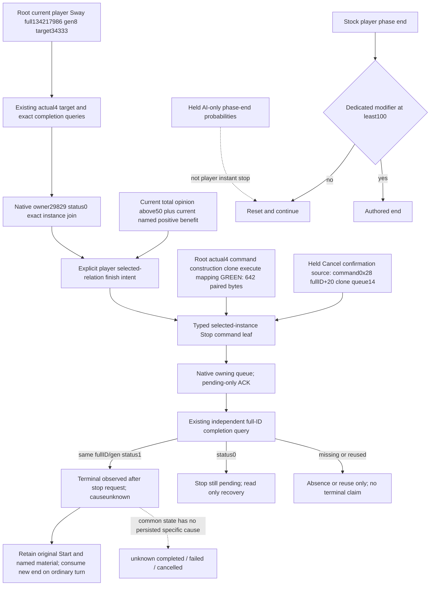

# Stop one selected player Sway after useful relation benefit

2026-10-08 / ISO 2026-W41. Source-only continuation after
`f469313f0ac9229832c714b3926455be4f9c196c`. Actual4 EXE SHA remains
`98702F88A547CDE2EAF29A85F93B85F68EE4CF8148336A4F7AFAEB75319DD518`.
Root's R77004/005/006 observations are actor29829, target34333,
full134217986/gen8, progress32/goal355, not frozen, total opinion61,
exact joined native status0/owner29829, terminalfalse/causeunknown. They show
continuation, not completion. R77006 separately observes the current named
`scheme_sway_opinion` modifier45 and total61 at raw date53288544. This is a
fresh relation baseline, not a new modifier gain or date-advance credit.
Historical named benefit is not new M4 gain.

## Native input tree recorded before the policy

The [held stock outcome tree](ck3-1.20.0.2-sway-outcome.md) distinguishes
phase outcome from instance ending. `sway_end_effect` ends at the dedicated
modifier100 threshold, otherwise a player instance resets and continues.
The held .3 stock excerpt's AI-only phase-end branch excludes faction-member
vassals below opinion100, then ends probabilistically: realm-priest opinion
at most50 or opinion below−25 gives10%; [−25,0) gives30%; [0,35) gives50%;
at least35 ends directly. These are AI phase-end branches, not a player
instant-stop threshold. This task found no held actual4 copy of that stock
excerpt; its current source equality remains unverified. Neither total61 nor
the start ceiling50 proves a native completion condition.

The [cancel ABI/cache](ck3-1.20.0.2-sway-completion-cancel.md) closes the native
player UI path: confirmation constructs `CEndSchemeCommand`, uses the native
clone and owning queue, and the command executes manager end with callback
booleantrue. Its source object is0x28 bytes, secondary base+0x18, complete
SchemeID+0x20, zero command metadata and queue channel14. The native clone
copies that full ID and allocates0x28 bytes. End writes the already-qualified
common status1 and clears owner. ACK is not this state transition.

## Actual4 command source closure and authored entry

The previous registered MCPs and production providers contained no player Sway
Stop operation. Existing completion/opinion queries remain pure observation;
neither query005 nor query006 queues a Stop. The new exclusive native leaf builds the proven command and
submits only after a fresh actual4 fullID/generation/type/target/owner/status0
join. It reuses actual4 terminal and owning-command bindings. Root's single
finite mapping at2026-10-08T06:23:42Z closed the actual4 source profile:

| Source operand/slot | Actual4 RVA |
| --- | --- |
| Primary command vtable | `0x476ED40` /74902848 |
| Secondary command vtable | `0x476EB80` /74902400 |
| Native clone | `0x299C9A0` /43633056 |
| Native execute | `0x299C320` /43631392 |

The paired capture was642 bytes and took0.90s. The old2→actual3 member/immediate
operand shapes and actual3→actual4 construction/clone/slot joins agree; the
current profile is bound to the actual4 SHA above. This closes the command
source and does not claim a native wholeproducer FIRST or a game action.
Evidence is
`Z:/ck3_mod_rewrite_process_assets/g2-background-20261008/r77-sway-m4-intervention/stop-current/sway-stop-root-first-20261008T062342059834Z-9a2bbe2f/ROOT-RESULT.json`
and its sibling `ACTUAL4-STOP-PROFILE.json`. Reuse these frozen results; do not
repeat the mapper for the source integration.

The exclusive Python consumer returns `native_stop_entry_required` when a
Driver lacks the typed action entry. The registered explicit operation is
`ck3_finish_active_scheme_sway_private_v1(expected_revision,
target_character_id, scheme_instance_id, scheme_instance_generation)` under
the existing private Sway action permission. It stores
an original-episode Stop intent with a new UUID before the one native call,
then reads the existing completion tool independently. It preserves original
Start receipt, positive material and terminal records. A retained exact status1
is `terminal_observed_after_stop_request`; it does not publish cancelled cause.
Pending recovery only reads; absent/reused storage remains pending.

The minimal explicit finish policy requires the currently selected original
instance to be active, a current positive named modifier and total opinion>50.
The stock AI tree explains why a relation with opinion61 can be useful enough
for an AI to stop at its phase-end branch. Our action uses the user's explicit
selected-target objective and does not wait for the player phase's100 modifier
threshold. The50 threshold belongs to that objective; it does not govern native
player continuation and the held stock tree is not adopted as an instant-stop
algorithm. The unused AI phase timing, randomness, realm-priest and vassal
branches remain documented quality differences; their future entry is the
held native outcome topic and a qualified actual4 stock snapshot, not a new
restriction on this authorized selected action. Other schemes are not
selected. A future legal new target must use a new episode; this package never
resends the original Start.

## Sole producer/registered-MCP compound

The authored six-stage compound is
`ck3_autonomous_player/tests/unit/test_sway_selected_stop_compound_12004.py`.
It feeds the native wholeproducer packet bytes through the real native Driver
request/response seam, the registered Finish tool, existing read-only queries,
and the ordinary `ck3_auto_turn` dispatcher. It consumes five new native packet
roles from one producer run; the producer's additional `pending.json` remains
its independent ACK-after-read evidence. The hello/world, target/opinion61/45
baseline and ordinary time advance are explicitly synthetic fixture context,
not new native relation gain. Its ordered cases cover current
read-only observation, one pending-only Stop, exact active status0, purged
storage, reused storage, and cold exact retained terminal recovery followed by
ordinary-turn material/end consumption. An unrelated scheme remains outside
the selected operation. The original Start action/receipt and named material
remain attached to the same episode, and the native terminal cause stays
`unknown`.

The central finite plan and source result are external under
`r77-sway-m4-intervention/stop-current/`. Root owns native compile/link, the new
wholeproducer and sole consumer FIRST, and any game invocation. At authoring
time the source integration and compound are `SOURCE_NOTRUN`; they carry no
new live/readiness or M4 credit. No game/SDK/EXE/import/test/build was performed
by this source author.
