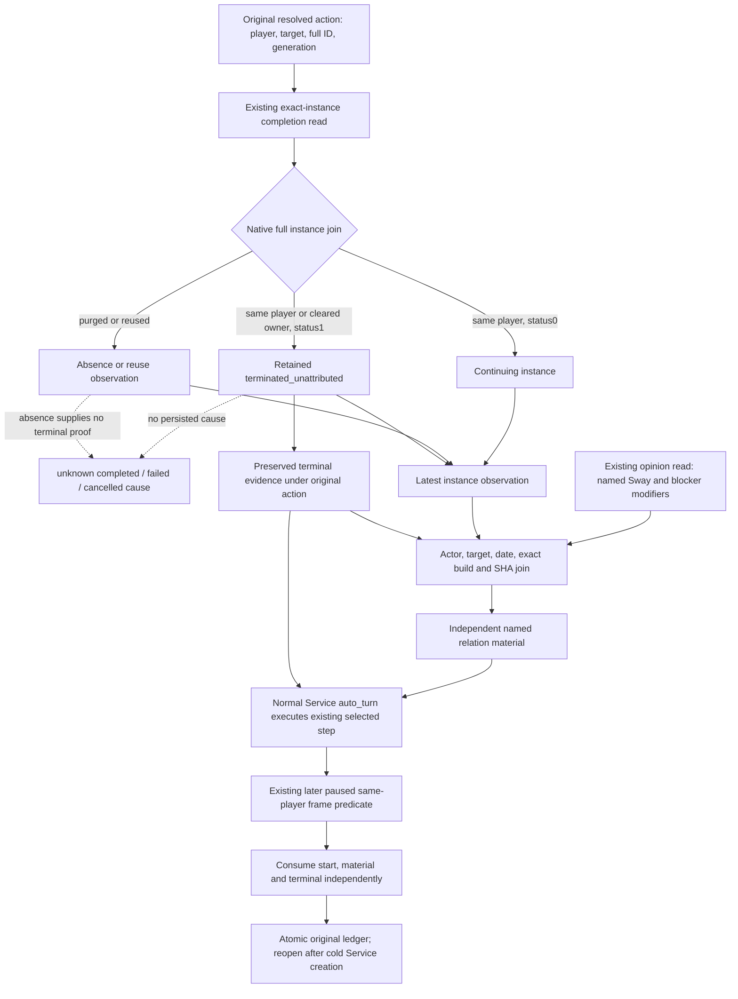

# Sway retained state and relation material on normal Service turns

2026-10-08, ISO 2026-W41. `static-ready`: Root ran the single new offline
compound once, GREEN/exit0 in 5.2946096 seconds, on source
`d6172d996c96df46f07e67c09bf3d1ad3c478695`. Its inputs and planner/backend frames
were explicitly synthetic; registered callbacks, Service execution and cold
ledger consumption were production code. Existing 1.20.0.4 tool migration
remains accepted. NW2 remains 2/4; this result grants no live or G2 credit.

The selected blocker is concrete: the existing exact-instance completion tool
returns retained termination, while the material consumer previously always
recorded `instance_terminal_outcome_observed=false`. The normal registered
`ck3_auto_turn` path had no Sway following-turn hook. The managed runner had a
separate call after gameplay, so staging a material record alone did not wire
the ordinary Service or a new cold Service instance.

The native input tree comes from the existing [Sway material research](sway-material-formal-consumer-12004.md),
[retained-row reader](sway-terminal-retained-row-12004.md) and
[actual4 binding](sway-adopted-mcp-migration-12004.md). Those exact-build branches
were reviewed before this consumer change. No native address or native query
was added, and no Start/Cancel decision was introduced.

The two existing registered completion/opinion callbacks now delegate through
Service wrappers. Each wrapper makes its original Driver call once, returns
the original normalized body unchanged, and stages matching facts only when
the managed directory has the original resolved once-start receipt. Tool
names, arguments, permissions, annotations and native schemas are unchanged.

`resolved.latest_instance_observation` retains the latest completion body.
`resolved.terminal_intervention` carries its independent consumption state;
once a positive retained terminal is observed, a later purge/reuse preserves
that original evidence. A purge alone remains nonterminal. Full scheme ID and
generation must belong to the original action. These records never recover a
missing terminal cause by subtracting total opinions or reading row absence.

The existing named-material builder is shared by the active census recorder
and the completion/opinion join. Actor, target, raw date, exact build and SHA
must agree, using the existing material pair semantics. Each independent
query keeps its native revision; the two reads are not advertised as one native
transaction. Observed legal absence remains zero, present zero remains zero,
and an unobserved modifier remains unobserved. Positive named Sway material
and unattributed termination can coexist. The opinion body itself still says
it has no terminal observation.

`Service.auto_turn` and `auto_nonwar_turn` now call the existing following-turn
consumer after an executed outcome. The post-turn snapshot excludes native
command history and is read only when the original ledger has an unconsumed
start, material or instance observation. Blocked/intercepted turns do not
consume it. A duplicate semantic completion/opinion read does not rearm a
consumed record. A fresh Service uses the same atomic ledger, so previously
consumed Start and newly staged terminal/material records remain independent.

The existing consumer requires a later native revision or raw date and the
same living player on a paused ready map. Service's `executed` result can also
represent a query step. Its Sway attachment alone proves bookkeeping through
the selected turn; it does not certify world progression, native completion
cause, an additional NW2 loop, or any new gameplay outcome.

The new compound at
`ck3_autonomous_player/tests/unit/test_sway_service_lifecycle_12004.py` exercises
the real registered MCP callbacks and Service dispatcher using explicitly
synthetic normalized inputs/planner selection/backend frames. It covers named
benefit, retained terminal, independent already-consumed Start, new cold
Service, repeated-read consumption, later purge, and blocked return.
Root executed it once at 2026-10-07 17:46:19–17:46:24 UTC. The actual result is
[sway-lifecycle-first01/RESULT.json](Z:/ck3_mod_rewrite_process_assets/g2-background-20261008/sway-lifecycle-first01/RESULT.json).
Native tests, old GREEN replays and game operations were zero. The existing
actual4 native current/terminated/reused/purged whole-packet qualification is
reused from the retained-row topic.

No compiler, tests, imports, local game, SDK, process control or EXE extraction
was performed by this source lane. Remaining acceptance is a future allowed
normal gameplay turn with real staged reads.
Exact end cause remains an explicit native research gap, independently of
using current named relation material and retained termination.

Root owns the next Robert H9658/saved6006 session after Runtime29 qualification.
The shortest recipe is the existing registered completion read for the full
instance in the restored original ledger, the opinion read for that same target,
then `ck3_auto_turn` and a cold file-only reopening. Service stages and consumes
the records; no manual material-record helper is required. The exact request
JSON, Root argv bindings and expected literal fields are prepared in
[ROOT-PAUSED-LIVE-RECIPE.json](C:/codex-ck3-background/packets/sway-service-lifecycle-12004-20261008/ROOT-PAUSED-LIVE-RECIPE.json).
The historical identity is actor29829/target34333/full134217986/generation8;
the restored ledger and current native reads determine the actual instance
state. It is not presumed terminated.

The existing [stock outcome tree](ck3-1.20.0.2-sway-outcome.md) records that phase
success can add named Sway benefit and then reset progress for the same player
instance; dedicated modifier100 and several authored options can end it.
Consequently positive material alone is useful relation value and does not mean
the whole scheme ended. That stock source is labeled its original build; the
current exact4 retained reader independently supplies the instance-status fact.

The minimal subsequent action value is to preserve the useful named relation
material, consume a genuinely observed retained end, and inspect a new relation
opportunity when an existing fresh target query reports an empty scheme slot.
The existing `should_submit_sway` policy requires native legal/CanSend, no active
Sway and target opinion≤50 with an empty context. Fifty is a start ceiling,
not a continuation or terminal threshold. This package does not automate a new
target choice or resend the original Start. It adds no counter-policy beyond
consuming the already closed inputs.
