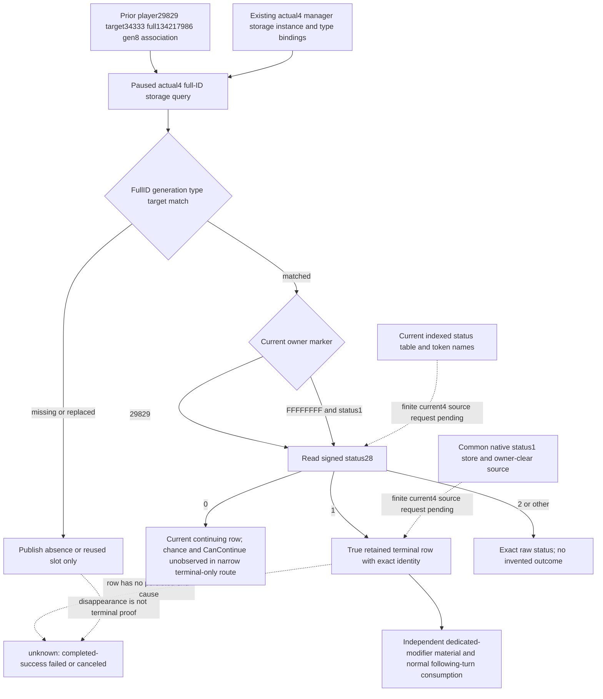

# Sway retained terminal row — actual CK3 1.20.0.4

2026-10-07 / ISO2026-W41. Root-directed source work follows the material consumer's first actual static qualification (`ae11b0ea` → Root`0e274`,10 GREEN checks); it does not rerun that qualification. Current execution belongs to Root source14f/runtime19, original Robert29829 campaign H9638/raw53288448/saved6005. SideR68 adds no G2 credit. Actual4 EXE SHA is `98702F88A547CDE2EAF29A85F93B85F68EE4CF8148336A4F7AFAEB75319DD518`.

## Source and current gap

The [historical native terminal tree](ck3-1.20.0.2-sway-completion-provider.md), [phase/end tree](ck3-1.20.0.2-sway-outcome.md) and [actual4 state binding](sway-adopted-mcp-migration-12004.md) are the implementation input. The existing private completion reader resolves the complete SchemeID directly through manager storage. It verifies full ID/generation, Sway type and character target. It accepts the player as current owner, or the cleared-owner marker only on a status1 row. Unlike the owner-filtered active list, it can therefore observe the short retained-terminal interval before purge.

Native status1 is the common termination field, historically named `invalidated`. It is written by manual/native cancel, authored success/failure `end_scheme` and actual invalidation. The row persists full ID and target while owner becomes `FFFFFFFF`; it contains no completed-versus-failed-versus-canceled cause. `status=1` proves the terminated state of the exact row. It cannot publish a specific success/failure/cancel cause. Missing or reused storage remains absence or slot reuse.

This tree is frozen before any new policy or native implementation. The actual4 core, manager/storage, instance/type roles and fullID/owner/target offsets are already closed and will be reused. The exact current status load, enum use/table and terminal write/owner clear are missing. A four-row central manifest requests26 code bytes per image and one operand-derived8B enum table per image: at most68B old+actual4 before held-cache reuse. Embedded `.2` instruction hex is locator metadata, not an exact `.3` raw cache. Named current token metadata is reused if held; table equality alone is not promoted into a new name proof.

Manifest: `C:/codex-ck3-background/packets/sway-material-12004-20261007/terminal-next/CENTRAL-FINITE-MANIFEST.json`. This author executes0 EXE reads/hashes/scans and0 mapper runs; Root owns all central reads. A mapper mismatch remains a source question with a concrete next atom, not a new game safety gate.

## Minimal source implementation after the finite atoms close

Reuse the existing `SwayCompletionRequestV1`, `SwayCompletionStateV1`, owning mailbox, complete envelope serializer and registered `ck3_query_active_scheme_sway_completion_private_v1` name. Give the private completion reader an explicit state profile rather than old hardcoded vtables, and bind it from the existing actual4 state binder. Publish actual4 version/SHA/adapter provenance without aliasing to the old ABI. The narrow route reads the retained status, full ID, target and owner marker; it does not call Chance/CanContinue. Their existing nullable observed/value fields accurately stay false/null. This unlocks independent terminal-state value without adding the unrelated511B current-input function migration.

Only completion-private leaf files and a separate actual4 terminal binder belong to this lane. Root owns the shared actual4 named callback admission, main CMake adoption and any Driver preference/config hook. The existing complete mailbox request uses the public revision at the registered MCP interface and converts it to native revision; Root must use a fresh snapshot, not an earlier public revision from a different query frame.

The exact retained status can be attached to the original material intervention record independently of the positive Sway modifier and consumed by the existing normal managed-turn hook. A generic native terminal row remains `terminal_cause_observed=false`; a phase failure or positive modifier cannot rewrite it to a specific cause. No Start is resent. A Root short registered-turn recipe explicitly consumes the staged material after actual normal gameplay because the Service-only `ck3_auto_turn` has no automatic Sway hook.

If the manager has already purged the row, the next useful source is the existing three transparent termination wrappers, which copy exact pre0/post1 before purge. That later finite migration is useful only for an actual missed terminal observation. Hidden phase and invalidation rings are not prerequisites for the current retained-row slice or the already closed narrow M4 intervention contract.

Current status: source plan and boundary are **research**; current4 terminal atoms and native implementation remain pending. No current4 terminal, completed/failed/canceled, new material loop, game day or G2 milestone credit is claimed.
