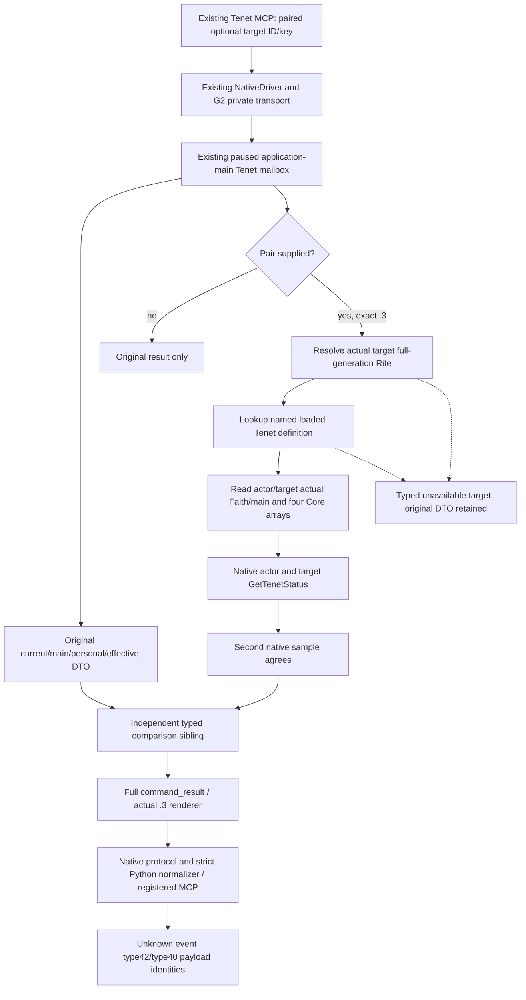

# Actual target Rite and named Tenet comparison

As of 2026-10-06 this implementation is **research / source prepared / FIRST_NOTRUN**. It extends the existing `ck3_query_player_religion_tenets_v1`; no build, fixture consumer or new paused Robert observation has run. Exact CK3 build is `1.20.0.3`, executable SHA-256 `94B55397ABB687A3DCD436805A5D885E6BE90FA6C693FEB44A9E3BBEEADE02A6`. Integration starts at source `be06a134b9a5472275e08ea452a8e3542b192fb8`; prior API/source preparation was frozen at `df87fd8562120b901413793ded4680b7b4dabd8e`.

The existing current query already publishes actual current Rite Core, actual Faith main Rite Core, personal Tenets and a union of effective states. Historical Robert evidence is the whole paused packet at `artifacts/g2-maintainer-2026-10-02/resume-12003/actual-v32-confession-permission-runtime-01/002-ck3_query_player_religion_tenets_v1.json`: Robert 29829, raw53236344, capture81105, current/main Rite152 and Faith23, actual Core `tenet_armed_pilgrimages` and `tenet_communion` status4. It does not provide a complete loaded-definition catalogue or arbitrary target Rite status. Personal/current/main provenance must remain separate; a missing effective-union row is not an observed false status.

The new optional `target_rite_id` and `tenet_key` must be provided together. The target is the full uint32 generation reference, including legal zero. The existing reviewed `BindCurrentDraftTenetSources12002` supplies only already verified Rite-storage and Tenet-database globals; no draft/window/source reader or native command is invoked. The resolver uses storage index `id & 0xFFFFFF`, then validates the object's entire ID and Rite tag. The loaded Tenet database array at `+0xEF0` supplies the definition pointer through exact stable-key equality using the existing `CopyTenetDefinitionKey12002`. The existing native getter at reviewed RVA `0x24F88A0` receives each actual actor/target Rite separately. No new executable bytes or RVA are introduced.

The optional `target_rite_tenet_comparison` sibling has independent availability. It reports the actual actor and target Rite IDs, their Faith IDs and actual Faith main Rite IDs; four complete Core arrays; literal named-definition pointer membership for each Core source; two native named statuses; and actual same-Rite/same-Faith booleans. Arrays preserve order and duplicates. Native states are unknown0, known1, prohibited2, permitted3, core4; **0 is an available native state**. Membership and status remain independent observations. Core pointer membership is not asserted equivalent to the stock `rite_has_tenet` trigger.

Two native samples must agree before `named_comparison_ready=true`. A missing definition or unresolved target produces a typed unavailable sibling with dependent scope/same values null and readiness false while retaining the owning paused metadata. It does not erase the independently successful original current Tenet rows. A request without the pair publishes the original DTO without a sibling; the new fixture checks native serialized DTO bytes remain unchanged in this path.

The frozen stock `rite_growth_resolve_differences_effect` tries new Rite prohibited, then known, then any unique Tenet. The uniqueness trigger uses `source_rite NOT rite_has_tenet(candidate_tenet)`, before falling back to a founder doctrine. Frozen source excerpts and event29 receipts are recorded in the external [native tree and gap](Z:/ck3_mod_rewrite_process_assets/g2-parallel-20261006/faith-tenet/NATIVE-TREE-AND-GAP.md). This new query gives usable explicit target/named observations; event `rite_growth.0010` generic type42 Rite/type40 Tenet payload identities remain an accessor dependency before event-selection policy. The already consumed event29 cannot receive retroactive live credit.

The new focused native target/CTest is `xar_ck3_12003_target_rite_tenet_comparison_mailbox_test`. It emits seven complete actual native `command_result` wires through the existing queue, reader, serializer and actual `.3` renderer, using synthetic memory: distinct/same-Faith target, valid status0/target2, same-Rite Core, missing definition, valid high-generation target, wrong-generation target and old no-pair query. Core duplicates are intentional. It reuses existing memory helpers without invoking older fixture mains or rerunning older cases. A standalone CMake entry is `ck3_autonomous_player/native_bridge/cmake/target_rite_tenet_first_fixture`.

The sole Python compound is `ck3_autonomous_player/tests/unit/test_target_rite_tenet_comparison_12003.py`, with `XAR_TARGET_RITE_TENET_WIRE_DIR` pointing to those native packets. Its real chain is `create_server(driver).call_tool` → existing production Driver → actual G2 transport → `NativeProtocolState.ingest/wait` → strict normalizer. Tenet MCP has no Service forwarder in the baseline, so none is added. Whole business packets are unchanged except request correlation. Installed MCP 2 source confirms async `call_tool`, `CallToolResult.is_error` and `.structured_content`; only source was read, no SDK executed.

Root owns the first joint build, new focused CTest, sole consumer and actual paused Robert 29829 observation. Source, schema, ACK and synthetic wires do not confer production-live primitive or complete OODA credit. Failed attempts must remain distinct from capability failures; no old passing test is scheduled for repetition by this package.
