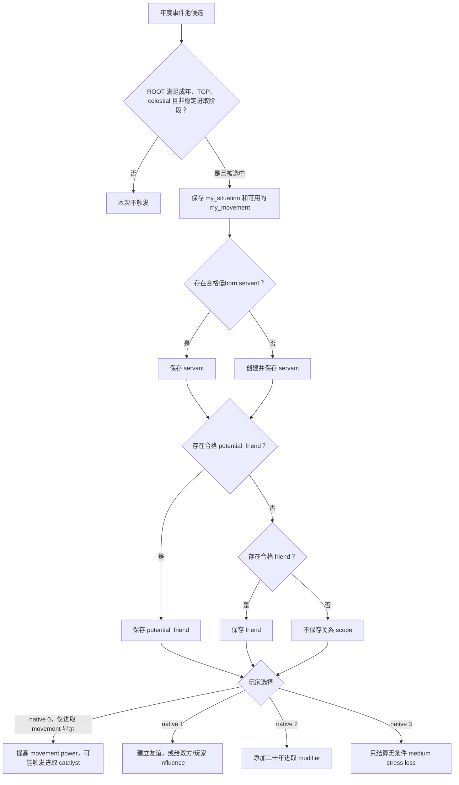

# CK3 1.19.0.6 `tgp_dynastic_cycle_events.0001` 进取思潮事件决策树

## 状态与证据边界

- [static-confirmed] 本专题只绑定 CK3 `1.19.0.6` 与 `ck3.exe` SHA-256
  `2D00FF3101EF70B566F2FCBAE292F09263199C80E9DC8F139B82D7D96F83DB86`。
- [production-live primitive] R372 已在 `potential_friend` 形态选择 authored `4` / native `3`，并验证旧事件
  instance 消失或前进。
- [paused live RED] R414 attempt 5 在 PID `202268` / connection generation `1` 命中 instance `1074`。
  本帧只有 `my_situation`、`my_movement` 和 `servant`，没有合格的 `potential_friend` 或 `friend`；native
  `1/2/3` 均 shown/enabled，动作尚未提交。该 RED 是既有合同漏掉原版明确允许的关系查找落空形态，不是天朝二期产品失败。

## 原版入口与 scope 分支

事件要求 ROOT 是可用成年人、拥有 TGP、采用 celestial government，且天朝局势不处在稳定进取阶段。TGP 专用年度池和旧的通用年度池都把它列为候选；事件本身有十年 cooldown，因此在足够长的产品观察窗口中可以再次出现。

`immediate` 总会保存 dynastic-cycle situation，并通过 null-safe top participant lookup 保存当前 movement；随后选择一个符合条件的低born servant，找不到时创建一个。关系分支按顺序只取一种形态：先尝试合格的 `potential_friend`，否则尝试合格的既有 `friend`，两者都没有时不保存关系 scope。R372 实见第一种形态，R414 实见第三种形态。

`my_movement` 来自 null-safe lookup，理论上可缺失；当前合同只登记已有 source 审阅并直接服务实机恢复的三种关系分支，不把尚未实见的 movement 缺失形态提前记作 live。

## 原生 AI 与产品恢复策略

四个 authored option 的原生基础权重均为 `100`：进取 movement 选项会受 ambitious/content 调整；关系选项会受 gregarious/callous 调整；二十年 modifier 选项会受 deceitful/honest 调整；最后的当下专注选项没有人格倍率。原生人格权重解释事件自身行为，不直接充当产品效用函数。

产品继续选择 native `3`。它不依赖任何关系 scope，不修改关系或 influence，也不添加二十年 modifier；相较其余可见按钮，它只执行声明的 medium stress loss。关系 scope 的三种严格形态均可采用同一路线。提交前仍须绑定同一事件 instance、日期窗口、玩家 ROOT、精确 saved-scope name/type 集合、shown/enabled 的 native `1/2/3` 和最新 revision；ACK 不算完成，必须观察旧 instance 消失或前进。

## 证据

- 原版事件：`Crusader Kings III/game/events/dlc/tgp/tgp_dynastic_cycle_flavor_events.txt:21-216`，SHA-256
  `2260A2AC3F568B3135588E12E4C817846A03AA4BDB16A71C4828490D45F696F3`。
- TGP 年度池：`Crusader Kings III/game/common/on_action/dlc/tgp/tgp_china_yearly_on_actions.txt`，SHA-256
  `4D6F5379E40304B56C5C1A914E8A0EE3998E8023174DC52F7E5072F7CFA40454`。
- 通用年度池：`Crusader Kings III/game/common/on_action/yearly_on_actions.txt`，SHA-256
  `0FC85A284224A68D1CA0A4EF071D4F4A4F49896753AEC463975A12EE4E1116FA`。
- R372 `potential_friend` 选择前 RED：
  `_runtime/p2r372-post-bound-continuation-live/tgp-dynastic-cycle-0001-red-report.json`，SHA-256
  `4F1A0EA8E43255B7C3399CC3B7F90623F56D8CB0688769D906AB6045EFED838D`。
- R414 无关系 scope 选择前 RED：
  `_runtime/p1-post-chaos-terminal-r414-20260911/live-artifacts/terminal-stages-red-attempt-05.json`，SHA-256
  `4B43409F75BE2C1DA59FA37D79A793124E5161D24C092F5BFF556CAA433EE288`。
- 可移植合同、analysis 与 observations：
  `ck3_autonomous_player/src/xar_autoplayer/vanilla_events/records_tgp_dynastic_cycle.py`。
