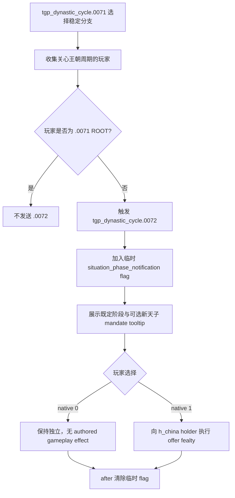

# CK3 1.19.0.6 `tgp_dynastic_cycle.0072` 稳定阶段通知决策树

## 状态与证据边界

- [static-confirmed] 本专题只绑定 CK3 `1.19.0.6` 与 `ck3.exe` SHA-256
  `2D00FF3101EF70B566F2FCBAE292F09263199C80E9DC8F139B82D7D96F83DB86`。
- [paused live RED] R418 attempt 04 在 PID `204536`、connection generation `1` 的真实暂停帧命中
  `tgp_dynastic_cycle.0072` instance `1101`，日期为 `54044544`。ROOT 是玩家 `32904`；saved scopes
  为 `situation`、`situation_sub_region` 和非玩家 `new_son_of_heaven=110448`；native `0/1` 均
  shown/enabled。发现时没有提交选择。
- [production-live primitive] continuation 严格匹配上述窗口并选择 authored `1` / native `0`，保持玩家独立。
  R418 attempt 05 已在同一 PID/generation 热恢复中提交该路线：instance `1101 -> null`、snapshot
  `native:1731 -> native:1732`、revision `1732 -> 1733`，`postcondition_verified=true`。

这条记录只解决真实 terminal promotion 时间线上的事件中断。日期、instance 和人物 ID 只进入 observation，
不会固化到通用合同。

## 原版调用链与作用

`tgp_dynastic_cycle.0071` 是现任王朝进入稳定阶段的主事件。主事件完成统治者对进取或扩张阶段的选择后，
`after` 先收集所有关心王朝周期的玩家，再排除主事件 ROOT，并向其余玩家触发 `.0072`。所以 `.0072`
是给相关人类玩家的阶段通知，并非年度随机事件。

`.0071` 只有在 ROOT 带有 `new_son_of_heaven` variable 时才保存同名 character scope；`.0072` 又显式以
`exists = scope:new_son_of_heaven` 保护对应 tooltip。因此合同接受两种源码合法形态：

- `situation, situation_sub_region, new_son_of_heaven`；
- `situation, situation_sub_region`。

有 `new_son_of_heaven` 时，它必须是不同于当前通知接收者的第三方人物。R418 实见第一种形态。

窗口出现前，`.0072` 的 `immediate` 已加入临时通知 flag，并在存在新天子时展示
`tgp_claim_mandate_of_heaven_effect`；它还把选定的稳定阶段同步到 situation top sub-region。这些动作不受
窗口选择控制。`after` 总会清除临时 flag，使未来合法的阶段通知仍可出现。

## 有界续跑策略

两个选项的差异清楚：

1. authored `1` / native `0` 只显示“保持独立”的 tooltip 和点击音效，没有 authored gameplay effect；
2. authored `2` / native `1` 把玩家保存为 actor、把 `h_china` holder 保存为 recipient，并执行
   `offer_fealty_interaction_effect`。

continuation 选择 native `0`，因为它不会主动改变玩家的臣属关系。提交前必须重新绑定同一事件 instance、
日期、玩家 ROOT、精确 saved-scope 形态、两个 shown/enabled native option 和最新 revision；命令 ACK 不算
完成，只有旧 instance 消失或前进才算 GREEN。阶段通知可在后续再次合法出现，因此合同在产品观察窗口内可重复。

## 证据

- 原版定义与直接 caller：
  `Crusader Kings III/game/events/dlc/tgp/tgp_dynastic_cycle_events.txt:1025-1150`，SHA-256
  `C9904AAA01ABC8583E67D07866FAE8EF89274708BDA3929498DDDB2F24FC2153`。
- 英文 localization SHA-256：
  `9279BE92A40DE23178C020F13B9397B5B3909006526BCCA81EB56133EB86644C`。
- 简体中文 localization SHA-256：
  `6C48AFC2D30213A878B03F5D3FF0AD11A32188E241B3293D947ADB2120BB5836`。
- R418 attempt 04 选择前 RED：
  `_runtime/p1-terminal-resume-r418-20260911/live-artifacts/terminal-stages-red-attempt-04.json`，SHA-256
  `5F1710E928F214C28FF4DF19478117F333E22473BF9E9713F0039AE766138146`。
- R418 attempt 05 同进程 GREEN 动作由随后保留的 RED artifact 携带：
  `_runtime/p1-terminal-resume-r418-20260911/live-artifacts/terminal-stages-red-attempt-05.json`，SHA-256
  `B5048E4E5384BB50B6DA0DC57A928AF7B0F56A999B27E6FD2C462180A1DCDE70`。
- 可移植合同、analysis 与 observation：
  `ck3_autonomous_player/src/xar_autoplayer/vanilla_events/records_tgp_dynastic_cycle.py`。
