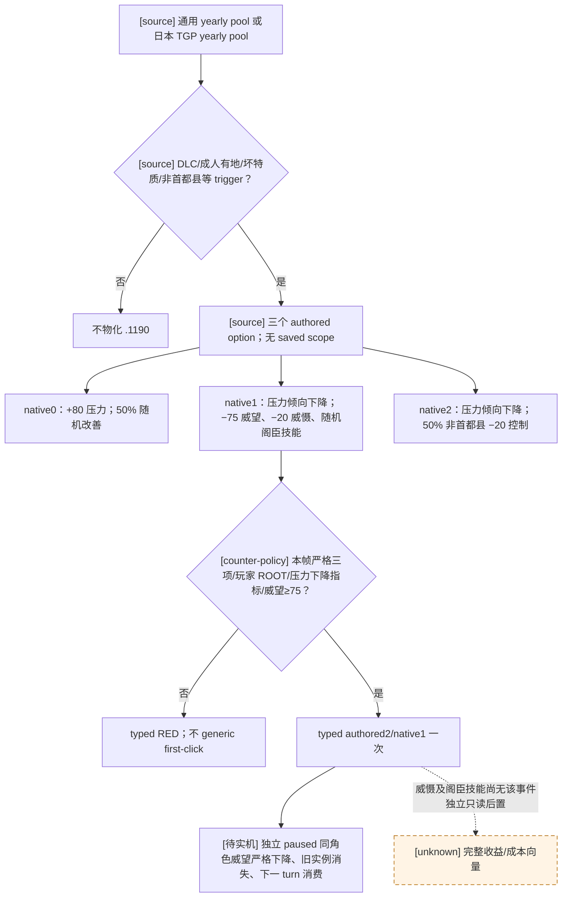

# `tgp_japan_yearly_events.1190`：夜间失德抉择（R0100 自然 RED）

## 冻结原版树

CK3 `1.19.0.6`，EXE SHA-256 `2D00FF3101EF70B566F2FCBAE292F09263199C80E9DC8F139B82D7D96F83DB86`。事件定义 `game/events/dlc/tgp/tgp_japan_yearly_events_ariana.txt:4701-4883` SHA-256 `B9F5799465E9B83B16C97086BC74F43ECD3949680AE1A78C081ED44ECD9B5FD6`。有两条原版抽取入口：日本专属 `common/on_action/dlc/tgp/tgp_japan_yearly_on_actions.txt:1-49` SHA-256 `40D68D6306D3E180E40EFBC80D5879DA825AB111F7EC0870682AB414F2AD5FE4`，以及通用 `common/on_action/yearly_on_actions.txt:2933-2936,3797` SHA-256 `0FC85A284224A68D1CA0A4EF071D4F4A4F49896753AEC463975A12EE4E1116FA`。后者没有日本文化/政府要求；R0100 标准封建角色自然遇到此事件并非调用链异常。

事件本身需 TGP DLC、在世可用成年有地统治者、暴躁/急躁/酗酒或低学识之一、没有节制/勤奋/高学识，且持有一块非首都伯爵领。十五年冷却；压力等级提高事件权重，但不决定所选选项。事件没有 saved scope，三个选项均可物化：

- authored1/native0：`major_stress_impact_gain` 基数 +80；50% 随机获得少量威望并按优先级移除坏特质或加 5 学识。原版 AI 基数 100，受 rationality 修正。
- authored2/native1：`medium_stress_impact_loss` 基数 −30，但 arrogant 可以转成小幅增压；随机一名存在的五类阁臣获得对应技能 +2；玩家保证损失 `minor_prestige_loss`（−75 威望）和 `medium_dread_loss`（−20 威慑）。原版 AI 基数 100，受 boldness 修正。
- authored3/native2：`major_stress_impact_loss` 基数 −80；50% 随机非首都伯爵领降低 `medium_county_control_loss`（−20 控制）。原版 AI 基数 100，受 honor 修正。

数值来源：`game/common/script_values/00_stress_values.txt:25-34` SHA-256 `104A7EF94EE9DA1092F23AEB2FD9DC971B08C695415F3B7EBFB628F381D26395`、`00_basic_values.txt:727,1001,1012-1015` SHA-256 `9268A54F0E425D409D9D0F20D884E0A3D0A89DF85A0B6644D56133C0C4CB0096`、`00_county_control_values.txt:7` SHA-256 `A1D06C795CBBE22E06889AD90012DDF0EC476BFFDE63BD5D163E9C3451255E65`。原生 AI 精确运行期权重和所有随机结果未在 R0100 读取；不能据此宣称我方策略等价于原版 AI。

## R0100 证据与最小消费者边界

R0100 冻结的 turn7 `native:22` / `date_raw=53314008` 查询与随后的事件动作回执均未保存 `played_character_prestige`；正式报告、操作回执和 driver history 也没有该字段。因此**尚未证明**同一起点在事件当帧有至少 75 威望，不能仅凭静态补丁宣布新候选可越过此门。B114 已有原生只读 paused snapshot 字段，无需新 native ABI；唯一 CK3 负责人需从干净的 R0078 物理配对输入冷恢复，在事件动作前保留同一帧的玩家 ID、revision、威望 `raw/scale`。预算达标才能对 native1 路径作有界实机复验；不足或 null 时仍为 RED，不猜测亦不自动换到无物质观测的 native2。

PRV-009 冻结 formal report SHA-256 `45A8BBC1B78692C101C6380499BAECC83551F027B291085C1A00C4E55EF0BA38`。turn7/history108 的自然 paused 帧为玩家 `36403`、`date_raw=53314008`、instance `15`、零 saved scope、三个 shown+enabled native `[0,1,2]`；native0 指标为 `impatient` 移除及压力增加，native1、native2 指标均为压力减少，完整效果预览不可用。旧正式策略在 `semantic_decision_ready=false` 下按最低 native 选了 native0。history109 只提交一次，独立 paused event instance `15→null`，同角色压力 `0→80`；turn8 消费了新状态。故这是实际物质损害 RED，而不是仅缺语义标签；20/20 技术窗口和 ACK 均不能将其转绿。

新消费者只接纳 exact key/构建/源码、player ROOT、零 saved scope、三个严格 shown+enabled native `[0,1,2]`，且同帧 native1 `stress/decrease` 指标。source-reviewed native1 有保证的 −75 威望代价；当前 native snapshot 已有 `played_character_prestige` Q100000 原生只读字段，但旧事件 action receipt 没有保存它。策略只在同帧威望可读且不少于 75 时提交一次 native1；新的 Python event receipt 要保留提交前与独立 paused 后的同角色威望，严格下降才是最小物质后置。压力在本次起点为零，即使新选项安全地使压力不变，也不能把零变化写作物质结果。威慑和阁臣技能在当前事件路径没有独立读取，不宣称这些效果已证。字段 null、指标变向、选项/角色漂移或威望未下降皆保留 RED；不按通用第一项补点。新候选仅可从未污染的 R0078 物理配对存档/driver（`raw53312544`）另版冷恢复；PRV-009 ZIP 与 R0100 证据不改写。
