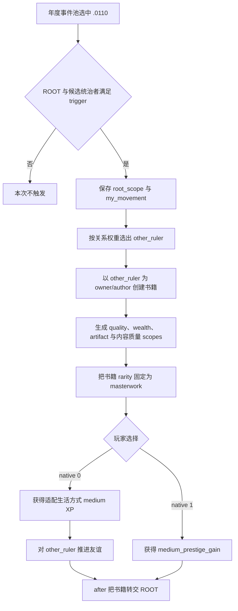

# CK3 1.19.0.6 `tgp_movement_events.0110` 赠书事件决策树

## 状态与证据边界

- [static-confirmed] 本专题绑定 CK3 `1.19.0.6` 与 `ck3.exe` SHA-256
  `2D00FF3101EF70B566F2FCBAE292F09263199C80E9DC8F139B82D7D96F83DB86`。
- [paused live RED] R416 attempt 3 在 PID `174656` / generation `1` 的真实暂停帧命中 instance `1079`。
  ROOT 是玩家；11 个 saved scopes 与原版建书 helper 一致；native `0/1` 均 shown/enabled；没有提交选择。
- [production-live primitive] 可移植合同选择 authored `2` / native `1`。R416 retry 04 已在相同 PID / generation
  提交该选项，instance `1079 -> null`、snapshot `native:397 -> native:398`、revision `398 -> 399`，
  `postcondition_verified=true`。选择前 RED 继续保留。

## 原版入口与 scope 树

该事件同时存在于 TGP China 年度池和通用 `on_yearly_events` 池。前者的 `chance_to_happen` 是 `50`，事件权重
`100`；后者的 `chance_to_happen` 是 `25`，事件权重 `200`。两者都还要与当时有效的其它事件竞争，不能直接换算成
固定年概率。事件有五年 cooldown，不是 daily poll。

ROOT 必须是可用成年人、拥有 TGP、采用天朝政府且处于一个 dynastic-cycle participant group。候选赠书者必须是另一个
健康成年天朝统治者，learning 至少为 `decent_skill_rating`，对 ROOT 好感非负，并处于兼容且已经决定立场的运动。

`create_artifact_book_effect` 把 `other_ruler` 另存为 `owner` 与 `author`，并发布 `random_quality_bonus`、`quality`、
`wealth`、`newly_created_artifact`；书籍内容 helper 又把作者保存为 `skill_base` 并发布 `book_content_quality`。
连同事件自己的 `root_scope`、`my_movement`、`other_ruler`，R416 实见共 11 个 scope。书在 `immediate` 已经创建，
事件 `after` 对两个选项都会把它转交给 ROOT；选项无法拒绝这件 masterwork artifact。

## 原生 AI 与恢复策略

- native `0`：基础权重 `100`；gregarious 或 diligent 时乘 `2`。获得当前适配生活方式的 medium XP，并调用
  `progress_towards_friend_effect`。该 effect 会建立 potential_friend，或把已有 potential_friend 升级为 friend。
- native `1`：基础权重 `100`；arrogant 或 lazy 时乘 `2`。只在公共后果之外增加 `medium_prestige_gain`，不推进关系。

产品选择 native `1`。书籍是两条路线共同且不可避免的后果；在此基础上，native `1` 只增加 prestige，避免引入新的
潜在朋友或朋友关系。提交前仍要绑定 event key、instance、日期窗口、玩家 ROOT、11-scope 精确名称/类型与人物别名、
两个 shown/enabled option 和最新 revision；ACK 之后必须观察 instance advance。

## 证据

- 原版事件：`Crusader Kings III/game/events/dlc/tgp/tgp_movement_events.txt:2407-2530`，SHA-256
  `D9B172FC6C9F81216BE580C1B65DA7720CAA6EF21F049AB316361E17D3710BC6`。
- TGP 年度池：`Crusader Kings III/game/common/on_action/dlc/tgp/tgp_china_yearly_on_actions.txt:1-45`，SHA-256
  `4D6F5379E40304B56C5C1A914E8A0EE3998E8023174DC52F7E5072F7CFA40454`。
- 通用年度池：`Crusader Kings III/game/common/on_action/yearly_on_actions.txt:2933-3842`，SHA-256
  `0FC85A284224A68D1CA0A4EF071D4F4A4F49896753AEC463975A12EE4E1116FA`。
- 建书 helper：`common/scripted_effects/01_ep1_court_artifact_creation_effects.txt:3700-6418`，SHA-256
  `DBABE31B564910AED332829B85EDAC8E7770B0F7FA73342A54EDB3335604933E`。
- 质量与财富 helper：`common/scripted_effects/00_ep1_artifact_creation_effects.txt:8-643`，SHA-256
  `712B4D4BE351A7C2DCEC0292E9BB4DF8462080E87A0BB42A3F7D7DC0CB73CE4B`。
- 友谊推进 helper：`common/scripted_effects/00_relation_effects.txt:31-167`，SHA-256
  `745099651760EB450DEC4D5439C73D44F4DEA19BF246A522297C42AE889A47F5`。
- R416 选择前 RED：
  `_runtime/p1-terminal-resume-r416-20260911/live-artifacts/terminal-stages-red-attempt-03.json`，SHA-256
  `7F2523869BEAFBC279D9ACDE65CB48661CCD1773D6CE40EB366E5EC5C9CB109A`。
- R416 retry 04 动作与 advance 证据位于随后保留的 RED：
  `_runtime/p1-terminal-resume-r416-20260911/live-artifacts/terminal-stages-red-attempt-04.json`，SHA-256
  `CFD57E5C381D35EE6E1DE166D9FF656A1E6D6F4FC7D3194BCC74393EB3B4EE6A`。
