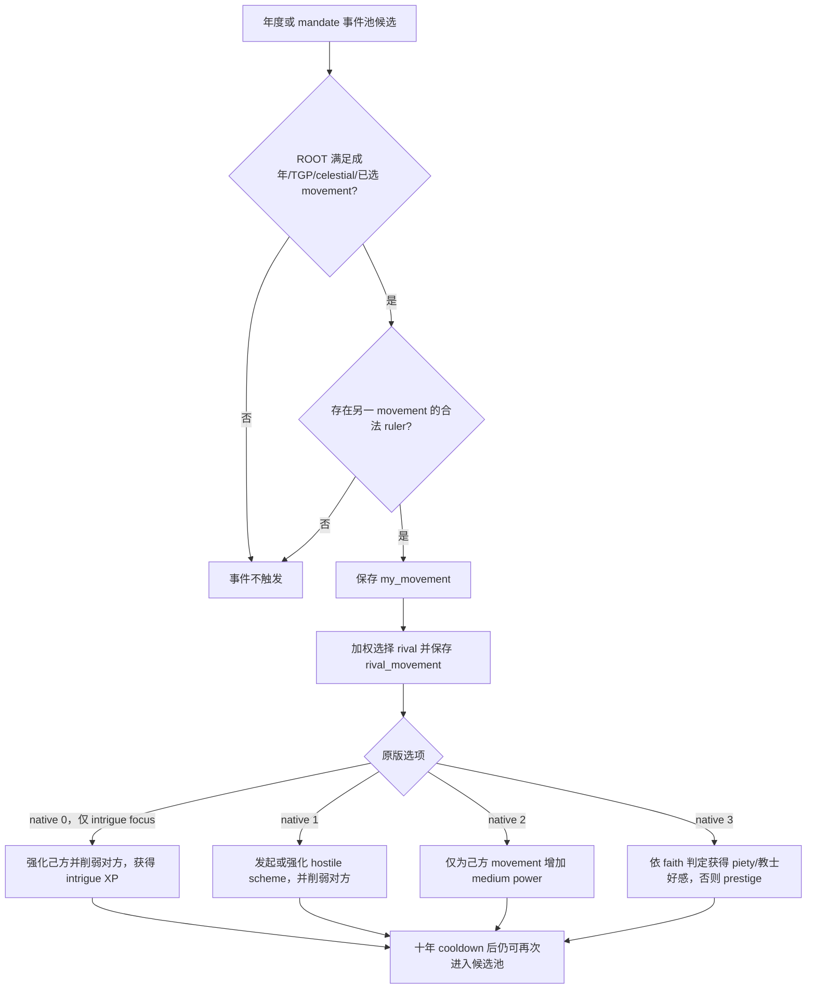

# CK3 1.19.0.6 `tgp_movement_events.0060` 思潮对手事件决策树

## 状态与边界

- [static-confirmed] 绑定 CK3 `1.19.0.6` 与 `ck3.exe` SHA-256
  `2D00FF3101EF70B566F2FCBAE292F09263199C80E9DC8F139B82D7D96F83DB86`。
- [production-live] R422 attempt 2 在 PID `22264` / connection generation `1` 中先后观察到 instance
  `1115`（date raw `54293544`）和 `1122`（date raw `54481488`）。前者已选择 authored `3` / native `2`
  并验证 advance；后者因旧 `max_occurrences=1` 在选择前保留为 RED。
- [counter-policy static-ready] 原版定义和三个 caller 都允许本事件在十年 cooldown 后再次出现。产品合同改为
  `repeatable-within-product-observation-window`，仍逐次执行完整身份、scope、选项映射与选择后置检查。

## 原版入口与人物选择

exact-build source 有三个 caller candidate：TGP 专用年度池给本事件 weight `100`，通用年度池给 weight
`200`，`diarchy_mandate_placate_movements_random` 给 weight `100`。三处都没有一次性门禁，事件自身只有十年
cooldown。词法候选不能证明某次实机实例具体来自哪一个 caller；但无论入口为何，十年后再次出现都是合法语义。

事件要求 ROOT 是可用成年人、拥有 TGP、采用 celestial government、属于非 undecided 的 dynastic-cycle
movement，并存在另一 movement 中的合法 ruler。`immediate` 保存玩家的 `my_movement`，再选择并保存
`rival_movement` 和 `rival`；potential/actual rival 与 movement leader 获得更高抽取权重。

## 原生 AI 与产品策略

四个选项的基础 `ai_chance` 都是 `100`，再按 focus 和人格特质调整。native `0` 只对 intrigue skulduggery
focus 显示；native `1` 偏好 deceitful/vengeful 并排斥 honest/compassionate/forgiving；native `2` 偏好
ambitious 并排斥 deceitful；native `3` 偏好 forgiving，同时源文件也给 callous/vengeful/deceitful 加权。

产品选择 native `2`。它不创建 hostile scheme、不削弱另一个 movement，也不需要展开当前暂缓的通用宗教域；
直接效果只有玩家已有 movement 的 medium power 增益和人格相关压力。每次重复仍必须重新绑定同一 instance、日期、
revision、玩家 ROOT、严格三个 saved scopes 和当前实际 rendered option 投影。ACK 不算完成，旧 instance 必须消失或前进。

## 证据

- 原版事件：`Crusader Kings III/game/events/dlc/tgp/tgp_movement_events.txt:1165-1412`，SHA-256
  `D9B172FC6C9F81216BE580C1B65DA7720CAA6EF21F049AB316361E17D3710BC6`。
- TGP 年度池：`Crusader Kings III/game/common/on_action/dlc/tgp/tgp_china_yearly_on_actions.txt:1-49`，SHA-256
  `4D6F5379E40304B56C5C1A914E8A0EE3998E8023174DC52F7E5072F7CFA40454`。
- 通用年度池：`Crusader Kings III/game/common/on_action/yearly_on_actions.txt:3740-3757`，SHA-256
  `0FC85A284224A68D1CA0A4EF071D4F4A4F49896753AEC463975A12EE4E1116FA`。
- mandate 池：`Crusader Kings III/game/common/on_action/mandate_on_actions.txt:31-38`，SHA-256
  `C129A3C09A32BE3F2D55686099AB3FC97DBC286E18D75968B8C2553349AD731D`。
- R422 retained RED：
  `_runtime/p1-b1-recovery-r422-20260911/live-artifacts/terminal-stages-red-attempt-02.json`，SHA-256
  `AD3F9517ADBEFACA1E59ADF6F01D73A1B950DFD631401D23241D2B0BA1BB754E`。
