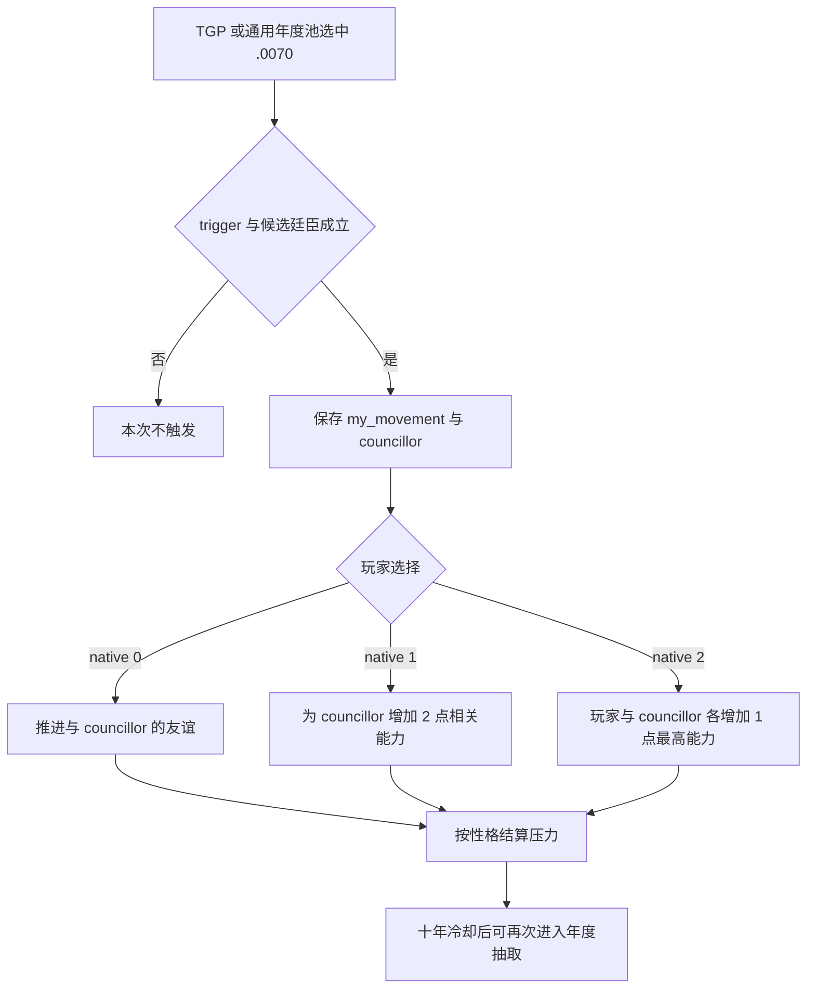

# CK3 1.19.0.6 `tgp_movement_events.0070` 共读卷册决策树

## 状态与证据边界

- [static-confirmed] 本专题只绑定 CK3 `1.19.0.6` 与 `ck3.exe` SHA-256
  `2D00FF3101EF70B566F2FCBAE292F09263199C80E9DC8F139B82D7D96F83DB86`。
- [production-live primitive] R418 attempt 04 在 PID `204536`、connection generation `1` 选择
  authored `1` / native `0`，instance `1099 -> null`、snapshot `native:1376 -> native:1377`、
  revision `1377 -> 1378`，`postcondition_verified=true`。
- [paused live RED retained] 同一产品窗口约十一游戏年后，R418 attempt 05 在同一 PID/generation 实见第二个合法
  instance `1108`。旧合同的 `max_occurrences=1` 在选择前阻断，未提交动作；该 RED 证明次数上限错误，不是原版事件漂移。
- [counter-policy static-ready] 通用合同现按产品观察窗口允许重复。第二次实例仍待同进程热恢复验证动作与 advance。

日期、instance、人物 ID 和 PID 只属于 observation。通用合同只冻结可复用的 scope/option 形态、选择路线与重复语义。

## 原版入口、触发与冷却

该事件同时进入两个年度随机池：TGP China 年度池给它权重 `100`，通用 `on_yearly_events` 池给它权重 `200`。
两处 caller 都会与池内其他事件竞争，权重不能直接换算为固定年概率。事件自身设置十年 cooldown；源码没有 one-shot 标志，
因此冷却期结束后可以再次被年度池选中。

ROOT 必须是可用成年天朝政体统治者，TGP 可用，并能找到一名健康成年 AI 廷臣。候选廷臣必须与 ROOT 的最高能力相同，
是 ROOT 的议会成员，对 ROOT 至少有 `10` 好感。`immediate` 保存 ROOT 所在 movement participant group 为
`my_movement`，再按关系和能力权重选出 `councillor`；已有 potential friend 的候选优先。

## 有界续跑策略

三个选项均可能按性格增加压力，故不存在无代价路线：

1. authored `1` / native `0` 推进双方友谊；
2. authored `2` / native `1` 给配偶的最高能力或议员对应议会能力增加 `2`；
3. authored `3` / native `2` 给玩家与议员各增加 `1` 点最高能力。

terminal continuation 选择 native `0`。它避免直接改写玩家和议员的能力值；友谊推进与性格压力是已知、有界代价。
提交前仍须绑定当前 event key、instance、日期窗口、玩家 ROOT、`my_movement` 与非玩家 `councillor`、三个
shown/enabled native option 和最新 revision。命令 ACK 不算完成，只有旧 instance 消失或前进才算 GREEN。

R418 两次实见日期分别为 `54017928` 和 `54114528`，相差 `96600` raw hours，即 `4025` 天，约十一年；
这与源码十年 cooldown 一致。旧 `max_occurrences=1` 因而被替换为
`repeatable-within-product-observation-window`。该修复只解除已经实证的 terminal blocker，不扩大其它事件的次数策略。

## 证据

- 原版事件：`Crusader Kings III/game/events/dlc/tgp/tgp_movement_events.txt:1426-1598`，SHA-256
  `D9B172FC6C9F81216BE580C1B65DA7720CAA6EF21F049AB316361E17D3710BC6`。
- TGP 年度池：`Crusader Kings III/game/common/on_action/dlc/tgp/tgp_china_yearly_on_actions.txt`，SHA-256
  `4D6F5379E40304B56C5C1A914E8A0EE3998E8023174DC52F7E5072F7CFA40454`。
- 通用年度池：`Crusader Kings III/game/common/on_action/yearly_on_actions.txt`，SHA-256
  `0FC85A284224A68D1CA0A4EF071D4F4A4F49896753AEC463975A12EE4E1116FA`。
- R418 attempt 05 汇总 artifact（含第一次 GREEN drain 与第二次选择前 RED）：
  `_runtime/p1-terminal-resume-r418-20260911/live-artifacts/terminal-stages-red-attempt-05.json`，SHA-256
  `B5048E4E5384BB50B6DA0DC57A928AF7B0F56A999B27E6FD2C462180A1DCDE70`。
- 可移植合同、analysis 与 observations：
  `ck3_autonomous_player/src/xar_autoplayer/vanilla_events/records_embedded_a.py` 与
  `records_analysis_embedded_a.py`。
